# 哈希（大数据类算法）

## 性质

- 无穷输入域，又穷输出域
- same in same out
- 可能有不容的输入对应相同的输出，但概率极低（哈希碰撞）
- 哈希映射值分布均匀


哈希函数（Hash Function）在计算机科学和密码学中扮演着至关重要的角色。根据应用场景的不同（如**密码学哈希**或**通用数据结构哈希**），其性质要求会有所侧重，但通常包含以下几个核心性质：

### 1. 基础通用性质（适用于所有哈希函数）

- **定长输出（Fixed-length Output）**：无论输入数据的长度是多少（哪怕是一个字节或一部高清电影），哈希函数都会输出一个固定长度的字符串（称为哈希值、摘要或指纹）。
- **计算高效（Efficient Computation）**：对于任意给定的输入，计算其哈希值的过程必须非常快，能够在多项式时间内完成。
- **确定性（Deterministic）**：相同的输入在任何时候、任何设备上计算，都必须得到完全相同的哈希值。

------

### 2. 密码学哈希函数的安全性质（如 SHA-256, MD5）

在信息安全领域，哈希函数必须满足以下“三大安全支柱”：

- **抗原像（Pre-image Resistance）**：
  - *定义*：给定一个哈希值 $h$，很难找到任何输入 $x$，使得 $Hash(x) = h$。
  - *意义*：保证哈希是**单向**的，无法通过密文反推明文。
- **抗第二原像（Second Pre-image Resistance）**：
  - *定义*：给定一个输入 $x_1$，很难找到另一个不同的输入 $x_2$ ($x_1 \neq x_2$)，使得 $Hash(x_1) = Hash(x_2)$。
  - *意义*：防止攻击者篡改数据后保持哈希值不变（例如：修改合同金额但保持签名有效）。
- **抗碰撞（Collision Resistance）**：
  - *定义*：很难找到**任意**两个不同的输入 $x$ 和 $y$，使得 $Hash(x) = Hash(y)$。
  - *意义*：这是最强的安全要求。由于输入空间远大于输出空间（鸽巢原理），碰撞必然存在，但计算上必须极难找到。

------

### 3. 数据结构/通用哈希的性质（如 HashMap, 布隆过滤器）

在算法和数据结构中，哈希函数更关注性能分布：

- **均匀分布（Uniform Distribution）**：
  - 哈希值应尽可能均匀地分布在输出空间中，避免聚集。这能最大程度减少**哈希冲突（Collisions）**，保证查找/插入操作接近 $O(1)$ 的时间复杂度。
- **雪崩效应（Avalanche Effect）**：
  - 输入数据哪怕只改变 **1个比特**，输出的哈希值也应该发生剧烈变化（通常要求约 50% 的比特位翻转）。这有助于数据的均匀散列，也是密码学安全的重要指标。

------

### 总结对比

| 性质         | 密码学哈希 (SHA-256)       | 通用哈希 (MurmurHash, CRC) |
| ------------ | -------------------------- | -------------------------- |
| **单向性**   | **必须** (核心)            | 不需要                     |
| **抗碰撞**   | **必须** (极难找到)        | 尽量好，但不强求           |
| **计算速度** | 相对较慢 (设计复杂)        | **极快** (追求性能)        |
| **主要用途** | 数字签名、密码存储、区块链 | 哈希表、负载均衡、数据校验 |


## 扩容

哈希表的扩容（Resize / Rehash）是解决哈希冲突、防止性能退化（从 O(1)*O*(1) 退化为 O(n)*O*(*n*) ）的核心机制。当哈希表中的元素过多，导致负载因子（Load Factor）超过预设阈值时，就会触发扩容。

完整的扩容过程通常包含以下四个关键步骤：

### **1. 触发条件与分配新空间**

- **触发阈值**：当 `元素数量 / 当前数组容量 >= 负载因子` 时触发扩容。例如，Java 的 `HashMap` 默认负载因子是 0.75，当 100 个槽位存了 75 个元素时就会扩容。
- **分配新数组**：创建一个全新的、容量更大的底层数组。为了保证哈希计算的效率，新容量通常是原容量的 **2倍**（即按 2 的幂次方增长）。

### **2. 数据迁移（Rehash）**

这是扩容中最核心、也最耗时的步骤。因为底层数组的长度变了，所有元素原本的计算公式 `Hash(key) % 数组长度` 的结果也会改变。

- 必须遍历旧数组中的所有非空节点。
- 使用新的数组长度，重新计算每个节点的哈希索引。
- 将节点插入到新数组对应的位置中。

### **3. 优化：巧妙的索引重定位（以 2 倍扩容为例）**

在重新计算索引时，优秀的哈希表实现（如 Java `HashMap`）会利用“容量为 2 的幂次方”这一特性进行位运算优化，避免昂贵的取模运算：

- 旧索引计算：`hash & (oldCap - 1)`
- 新索引计算：`hash & (newCap - 1)`
- **规律**：因为 `newCap = 2 * oldCap`，所以新索引只有两种可能：
  1. **原位置**：如果 `hash` 在新增的那个高位比特位上是 `0`，节点留在旧索引位置。
  2. **原位置 + oldCap**：如果 `hash` 在新增的高位比特位上是 `1`，节点直接移动到 `旧索引 + 旧容量` 的位置。
- *这种优化使得扩容时的数据迁移效率大幅提升，且天然地将原本挤在一个槽位里的元素均匀拆分到了两个槽位中。*

### **4. 替换引用与清理**

- 将哈希表的内部指针指向新数组。
- 释放旧数组占用的内存（交由垃圾回收器处理）。
- 更新哈希表的最大容量阈值（Threshold = 新容量 × 负载因子）。


### **⚠️ 扩容带来的性能隐患与解决方案**

扩容是一个极其消耗 CPU 和内存的操作（时间复杂度为 O(n)*O*(*n*) ），如果一次性迁移大量数据，会导致系统出现明显的卡顿（Stop-The-World 现象）。为此，现代系统通常采用以下优化策略：

1. **渐进式扩容（Incremental Rehash）**：
   - *代表：Redis*
   - Redis 不会在扩容时一次性迁移所有数据，而是保留新旧两个哈希表。在后续每次执行增、删、改、查操作时，顺带把旧表里的 1 个槽位（dictEntry）迁移到新表。将 O(n)*O*(*n*) 的耗时平摊到了 n*n* 次操作中。
2. **并发扩容**：
   - *代表：Java `ConcurrentHashMap`*
   - 在多线程环境下，将旧数组分段，启动多个线程同时进行数据迁移，充分利用多核 CPU 加速扩容过程。
3. **预估初始容量**：
   - 如果在业务初期就能大概知道数据量（例如从数据库加载 10 万条数据到内存），应在初始化时直接指定合适的容量（如 `new HashMap(150000)`），从根本上避免运行时的频繁扩容。


## 布隆过滤器

**布隆过滤器（Bloom Filter）** 是一种空间效率极高的**概率型数据结构**。它主要用于判断一个元素是否属于某个集合。

与传统的哈希表或集合不同，布隆过滤器不存储元素本身，而是通过多个哈希函数将元素映射到一个位数组（Bit Array）中。

### **核心特性（面试必考点）**

布隆过滤器最显著的特点是它的**判断结果具有不对称性**：

1. **可能存在（False Positive）**：当布隆过滤器判断某个元素“存在”时，它**不一定真的存在**，只是有极大概率存在。
2. **一定不存在（True Negative）**：当布隆过滤器判断某个元素“不存在”时，那么它**绝对不存在**。

*一句话总结：布隆过滤器可以告诉你“绝对没有”或者“可能有”，但永远无法告诉你“绝对有”。*

### **工作原理**

1. **初始化**：创建一个长度为 m 的全 0 位数组（Bit Array），并选定 k个不同的哈希函数。
2. **添加元素**：当插入一个元素时，将其传入这 k个哈希函数，得到 k 个索引位置，并将位数组中对应的位置全部置为 1。
3. **查询元素**：当查询某个元素是否存在时，同样用 k个哈希函数计算其位置。
   - 如果这 k个位置**全都是 1**，说明该元素“可能存在”。
   - 如果这 k个位置中**有任何一个是 0**，说明该元素“一定不存在”（因为如果它曾经被插入过，这些位置必定都会被置为 1）。

关键：需要确定k和m的大小

- k过小，**信息冗余度不足**：每个元素只被映射到很少的几个位置，这意味着判断其存在的“证据”太少。只要这几个位置碰巧被其他元素占满，就会引发误判。因此， k过小会导致**误判率偏高**。
- k过大，**查询性能下降**，**加速位数组饱和**
- m过小，可能导致大量空间被秒黑，误判率上升
- m过大，浪费内存。

---


### 核心结论

####  **第一步：确定两个核心输入参数**

1. **预计插入的元素总数 (`n`)**：这是你计划放入过滤器的数据总量，需要尽可能准确地预估。
2. **可接受的误判率 (`p`)**：这是你能容忍的“假阳性”概率上限。例如，`0.01` 代表 1%，`0.001` 代表 0.1%。

####  **第二步：根据公式计算最优的 `m` 和 `k`**

**1.  计算最优位数组长度 (`m`)**
这是过滤器需要占用的总位数（bit）。公式为：$m = - (n * ln(p)) / (ln(2))^2$

**2. 计算最优哈希函数个数 (`k`)**
这是为了达到最低误判率所需的最佳哈希函数数量。公式为：$k = (m / n) * ln(2)$

> 从这两个公式可以看出，`k` 的值实际上只与误判率 `p` 有关。将 `m` 的表达式代入 `k` 的公式，可以得到 `k = -ln(p) / ln(2)`。这意味着，**最优的哈希函数个数 `k` 完全由你设定的误判率 `p` 决定**。

####  **第三步：在实践中进行微调**

计算出的 `m` 和 `k` 是理论最优值，在实际应用中需要注意两点：

- **`k` 值取整**：计算出的 `k` 很可能不是整数（如 6.64），你需要向上或向下取整。取整后，实际的误判率会与最初设定的 `p` 有细微差异。
- **`m` 值取整**：`m` 计算出后，通常也需要向上取整到合适的单位（如字节的整数倍）。

#### 实际失误率

$$p \approx \left(1 - e^{-\frac{kn}{m}}\right)^k$$

实际误判率几乎总是会高于理论值，主要有以下几个原因：

- **哈希函数的“不完美”**：理论假定哈希函数是完美的，能将数据完全随机地映射到位数组。但实际使用的哈希函数（如 MurmurHash）只是近似随机，对于特定的数据集，其分布可能不均匀，导致碰撞概率增加。
- **数据分布不均匀**：理论假设所有输入数据都是随机的。但在工程中，数据往往有其内在规律（如用户ID连续、特定格式的URL），这可能导致哈希结果聚集，增加误判。
- **工程实现的“变形”**：
  - **分块布隆过滤器 (Blocked Bloom Filter)**：为了利用CPU缓存，一些实现会将位数组分块。这种优化会因“桶内”元素分布不均，导致实际误判率高于标准布隆过滤器。
  - **参数取整**：计算出的 `m` 和 `k` 需要取整为字节或整数，这种微调也会导致实际值与理论值产生偏差。
- **元素总数 `n` 预估不准**：公式中的 `n` 是**实际插入的元素总数**。如果实际插入量超过了设计时的预估值，误判率会显著上升。


------

### **优缺点分析**

**优点：**

- **极致的空间效率**：不需要存储元素本身，只存 0 和 1，内存占用极小。
- **极快的查询速度**：时间复杂度为 O(k)*O*(*k*) ，与集合中元素的数量无关，非常适合海量数据。
- **隐私安全**：由于不存储原始数据，不会泄露敏感信息。

**缺点：**

- **存在误判率**：随着插入元素的增多，位数组被置 1 的比例上升，误判率（False Positive Rate）会随之增加。
- **标准布隆过滤器不支持删除**：因为多个元素可能共享同一个比特位，如果直接将某位置 0，可能会误删其他元素。（*注：虽然可以通过“计数布隆过滤器 Counting Bloom Filter”来解决，但会增加额外的空间开销*）。

------

### **典型应用场景**

1. **缓存穿透防护**：
   在查询数据库前，先用布隆过滤器判断数据是否存在。如果过滤器说不存在，直接返回空，避免恶意请求或无效请求直接打垮数据库。
2. **海量数据去重**：
   例如爬虫系统中，判断一个 URL 是否已经被抓取过。
3. **垃圾邮件过滤 / 恶意网址拦截**：
   将已知的黑名单 URL 放入布隆过滤器，快速拦截大部分恶意请求。
4. **分布式系统中的路由**：
   例如 Apache Cassandra 或 HBase 中，利用布隆过滤器快速判断某个 SSTable 文件中是否包含目标行键，避免不必要的磁盘 I/O。


| 特性     | 哈希表 (Hash Table)  | 布隆过滤器 (Bloom Filter)      |
| -------- | -------------------- | ------------------------------ |
| 存储内容 | 元素本身 + 哈希值    | 仅存储比特位 (0/1)             |
| 查询结果 | 绝对准确             | 可能存在误判（False Positive） |
| 删除操作 | 支持                 | 标准版不支持                   |
| 空间占用 | 较大                 | 极小                           |
| 主要用途 | 精确查找、键值对映射 | 海量数据的存在性快速判断       |


## 一致性哈希

一致性哈希（Consistent Hashing）是分布式系统中非常经典的核心算法。它主要解决了一个关键问题：**在动态变化的分布式集群中，如何以最小的代价进行数据迁移和重新映射**。

### 为什么需要一致性哈希？—— 传统哈希的痛点

想象一个分布式缓存集群，有 `N` 台服务器。最直接的数据路由方法是使用公式 `hash(key) % N` 来决定数据存到哪台机器。

这个方法在集群稳定时很简单有效，但一旦集群发生**扩缩容**（比如增加或减少服务器），问题就来了。因为公式中的 `N` 变了，**几乎所有数据的映射关系都会被改变**，导致大量缓存失效，请求直接冲击数据库，可能引发“缓存雪崩”。

一致性哈希算法正是为了应对这种动态变化而设计的。

### 核心原理：哈希环（Hash Ring）

一致性哈希的核心思想是将服务器和数据映射到一个抽象的**哈希环（Hash Ring）** 上。

1. **构建哈希环**：想象一个从 `0` 到 `2^32-1` 的数值空间，将其首尾相连，形成一个虚拟的圆环。
2. **映射服务器**：对每台服务器（用其IP或主机名）进行哈希计算，结果值在环上对应一个位置，这就是服务器节点。
3. **映射数据**：对数据的键（Key）进行同样的哈希计算，也得到一个环上的位置。
4. **数据定位**：**数据键在环上沿顺时针方向行走，遇到的第一个服务器节点，就是它所属的节点**。

这种方式下，当集群增减节点时，影响范围被降到了最低。比如新增一台服务器，它只会“分担”从它到逆时针方向上一台服务器之间的那部分数据，而环上绝大部分数据的映射关系都保持不变。这正是其“一致性”的体现。

### 问题

1. **负载不均衡**，如果服务器数量很少，它们在环上的分布可能不均匀，导致部分服务器负载过高
2. 即使当前服务器已经均分，增加或者减少服务器后，剩下的服务器负载不均衡

### 🛠️ 算法优化：虚拟节点（Virtual Nodes）

为了解决这个问题，算法引入了**虚拟节点（Virtual Nodes）**。

- **原理**：为每个物理服务器在环上创建多个副本（即虚拟节点）。例如，服务器A可以有 `A#1`、`A#2`... 等多个虚拟节点。
- **效果**：这些虚拟节点均匀分布在环上，使得数据能更均匀地分配给各个物理服务器。

在实践中，虚拟节点的数量需要权衡，通常在**每个物理节点对应50到200个虚拟节点**之间。


### 总结：优点与典型应用

一致性哈希算法具备以下优点：

- **出色的扩展性和容错性**：节点增减时，只需迁移**极小部分（约 1/N）** 的数据，实现了平滑扩容或缩容。
- **良好的负载均衡**：结合虚拟节点技术，能将数据和请求相对均匀地分散到所有服务器上。
- **高可用性**：当某个节点故障时，其负载会被自动、平滑地转移到环上的下一个节点，保证了服务的持续可用。

因此，它在许多分布式系统中都是实现负载均衡和数据分片的首选算法，典型的应用场景包括：

- **分布式缓存**：如 **Memcached**、**Redis Cluster** 等，用于确定数据存储在哪个节点。
- **分布式数据库**：用于数据分片，比如 **Amazon Dynamo**、**Cassandra** 等。
- **负载均衡**：在 **RPC 框架**（如 Dubbo）中，可根据请求参数将请求分发到特定服务器。
- **CDN 网络**：用于将用户请求引导至最近或最合适的边缘节点。

---


# 并查集、窗口、单调栈

## 并查集

本质上是一种**树形结构**，用于高效处理**不相交集合（Disjoint Sets）**的合并与查询问题。

### 1. 基本概念

并查集主要支持两种核心操作：

- **查找（Find）**：确定某个元素属于哪个集合（即返回该集合的“代表元”或“根节点”）。
- **合并（Union）**：将两个不同的集合合并为一个集合。

并查集的核心就是使查找和合并都很快。

**存储结构**：通常使用一个一维数组 `parent` 来表示。`parent[i]` 表示元素 `i` 的父节点。如果一个元素的父节点是它自己（`parent[i] == i`），那么它就是该集合的根节点。

**核心优化（几乎必须使用）**：
为了保持树的高度尽可能低，并查集有两个极其重要的优化策略，二者缺一不可：

1. **路径压缩（Path Compression）**：在执行 `Find` 操作时，将查找路径上的所有节点直接挂接到根节点上，把树“压扁”。这样下次查找就极快了。
2. **按秩合并（Union by Rank/Size）**：在 `Union` 操作时，**总是将“矮”的树（或元素少的树）挂到“高”的树（或元素多的树）的根上**，防止树退化成链表。

**时间复杂度**：单独使用路径压缩或按秩合并，时间复杂度是 O(log⁡n)*O*(log*n*)；**同时使用**这两种优化后，单次操作的平均时间复杂度**极其接近于常数** O(α(n))*O*(*α*(*n*))，其中 α(n)*α*(*n*) 是**反阿克曼函数**。这个函数增长极慢，当 n*n* 小于宇宙原子总数时，其值不超过 4，因此可以视为 O(1)*O*(1)。

------

### 2. 核心性质

并查集具有以下几个关键性质，决定了它的应用场景：

- **动态维护连通性**：它能够动态地（在线地）将新产生的连接加入图中，并实时回答两个节点是否连通。注意，它**不支持删除**已合并的连接（除非使用高级的可删除并查集）。
- **处理等价关系**：集合的合并基于传递性（A与B连通，B与C连通，则A与C连通），因此非常适合划分**等价类**。
- **不记录路径细节**：它只关心“是否连通”和“属于哪个团伙”，而**不关心**两个节点之间的具体路径是什么（这一点与图的最短路径或DFS路径记录不同）。
- **空间效率高**：只需要维护一个长度为 n*n* 的 `parent` 数组（以及可选的 `rank` 或 `size` 数组），空间复杂度为 O(n)*O*(*n*)。

------

### 3. 典型应用场景

并查集在算法竞赛和工业界都有广泛应用，下面结合你刚遇到的“岛问题”来分类说明：

**① 图论中的连通分量（核心领域）**

- **Kruskal 最小生成树算法**：这是并查集最经典的工业级应用。将边按权值排序，依次用并查集判断边的两个端点是否已经在同一棵树中（避免成环），若不在则合并。
- **动态连通性问题**：比如判断社交网络中两个人是否处于同一个朋友圈，或判断网络中两台计算机是否连通。

**② 网格与图像处理（如你的“岛屿问题”）**

- **统计连通块个数**：遍历所有格子，遇到 `1` 就检查左边和上边（或四邻域），如果也是 `1` 就 `Union`。最后统计 `parent[i] == i` 的根节点个数即为岛屿数。
- **并行计算中的“缝合”**：这恰好回答了你上一个问题的核心！在分块并行计算时，每个块内部算一遍并查集，最后只需将**跨块的边界节点**拉入一个全局并查集进行合并，就能准确修正总数。并查集在此充当了“胶水”角色。

**③ 维护集合的额外信息（带权并查集 / 扩展域）**

并查集不仅能合并，还能通过维护节点到根节点的**距离（权值）**，来解决更复杂的关系问题：

- **食物链（经典算法题）**：维护动物之间的捕食关系（同类、吃、被吃）。
- **区间染色/覆盖问题**：维护一个“下一个空闲位置”的数组，利用并查集可以 O(α(n))*O*(*α*(*n*)) 地跳过已经被覆盖的连续区间，优化线段树的重复赋值。

**④ 数据库与操作系统**

- **Linux 内核的 cgroup 管理**：用于管理进程组之间的层级关系和资源隔离。
- **数据库查询优化器**：在处理表之间的等价连接（Equi-Join）时，有时用于合并具有传递依赖的列集合。


### 代码实现

```java
    public static class Element<T>{
        public T value;
        public Element(T value){
            this.value = value;
        }
    }

    public static class UnionFindSet<T>{

        public HashMap<T, Element<T>> elementMap;  // 元素 -> 元素对象
        public HashMap<Element<T>, Element<T>> fatherMap; //  元素对象 -> 父元素对象
        public HashMap<Element<T>, Integer> sizeMap;  // 集合头结点对象 -> 集合大小

        public UnionFindSet(List<T> arr){
            elementMap = new HashMap<>();
            fatherMap = new HashMap<>();
            sizeMap = new HashMap<>();
            for(T cur: arr){
                Element<T> element = new Element<>(cur);
                elementMap.put(cur, element);
                fatherMap.put(element, element);
                sizeMap.put(element, 1);
            }
        }

        private Element<T> findHead(Element<T> element){
            Stack<Element<T> > stack = new Stack<>();
            while(element != fatherMap.get(element)) {
                stack.push(element);
                element = fatherMap.get(element);
            }
            // 优化，扁平化
            while(!stack.isEmpty()){
                fatherMap.put(stack.pop(), element);
            }
            return element;
        }

        public boolean isSameSet(T a, T b){
            if(elementMap.containsKey(a) && elementMap.containsKey(b)){
                Element<T> aHead = findHead(elementMap.get(a));
                Element<T> bHead = findHead(elementMap.get(b));
                return aHead == bHead;
            }
            return false;
        }

        public void union(T a, T b){
            if(elementMap.containsKey(a) && elementMap.containsKey(b)){
                Element<T> aHead = findHead(elementMap.get(a));
                Element<T> bHead = findHead(elementMap.get(b));
                if(aHead != bHead){
                    int aSetSize = sizeMap.get(aHead);
                    int bSetSize = sizeMap.get(bHead);
                    Element<T> big = aSetSize >= bSetSize ? aHead : bHead;
                    Element<T> small = big == aHead ? bHead : aHead;
                    fatherMap.put(small, big);
                    sizeMap.put(big, aSetSize + bSetSize);
                    sizeMap.remove(small);
                }
            }

        }
```


### 岛问题

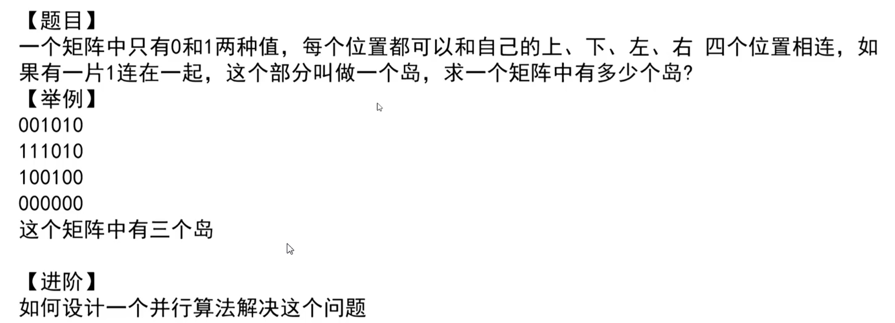

#### 串行

##### 1. 深度优先搜索（DFS）或广度优先搜索（BFS）

- 遍历整个矩阵，每遇到一个 `1` 且未访问过，就将其视为一个新岛，然后从该点开始 DFS/BFS，将与之相邻的所有 `1` 标记为已访问（或置为 `0`）。
- **时间复杂度**：`O(R*C)`，每个格子只访问一次。
- **空间复杂度**：DFS 递归栈最坏 `O(R*C)`，BFS 队列最坏 `O(min(R,C))`。

##### 2. 并查集（Union-Find）

- 将每个 `1` 视为一个节点，与上下左右相邻的 `1` 合并。
- 统计最终连通分量的个数。
- 时间接近 `O(R*C * α)`，其中 α 为反阿克曼函数，近乎常数。

DFS代码如下所示

```java
    public static int countIslands(int[][] matrix) {
        if(matrix == null || matrix[0] == null){
            return 0;
        }
        int N = matrix.length;
        int M = matrix[0].length;
        int res = 0;
        for(int i = 0; i < N; i++)
            for(int j = 0; j < M; j++) {
                if(matrix[i][j] == 1) {
                    res += 1;
                    infect(matrix, i, j);
                }
            }
        return res;
    }

    public static void infect(int[][] matrix, int i, int j){
        if(i<0 || i >= matrix.length || j < 0 || j >= matrix[0].length || matrix[i][j] != 1){
            return;
        }
        matrix[i][j] = 2;
        infect(matrix, i-1, j);
        infect(matrix, i+1, j);
        infect(matrix, i, j-1);
        infect(matrix, i, j+1);
    }
    public static void main(String[] args) {
        int[][] m1 = {  { 0, 0, 0, 0, 0, 0, 0, 0, 0 },
                { 0, 1, 1, 1, 0, 1, 1, 1, 0 },
                { 0, 1, 1, 1, 0, 0, 0, 1, 0 },
                { 0, 1, 1, 0, 0, 0, 0, 0, 0 },
                { 0, 0, 0, 0, 0, 1, 1, 0, 0 },
                { 0, 0, 0, 0, 1, 1, 1, 0, 0 },
                { 0, 0, 0, 0, 0, 0, 0, 0, 0 }, };
        System.out.println(countIslands(m1));

        int[][] m2 = {  { 0, 0, 0, 0, 0, 0, 0, 0, 0 },
                { 0, 1, 1, 1, 1, 1, 1, 1, 0 },
                { 0, 1, 1, 1, 0, 0, 0, 1, 0 },
                { 0, 1, 1, 0, 0, 0, 1, 1, 0 },
                { 0, 0, 0, 0, 0, 1, 1, 0, 0 },
                { 0, 0, 0, 0, 1, 1, 1, 0, 0 },
                { 0, 0, 0, 0, 0, 0, 0, 0, 0 }, };
        System.out.println(countIslands(m2));

    }
```

复杂度分析

- 时间复杂度O(N*M)
- 空间复杂度


#### 并行算法

ACM并不会考察并行问题，只考虑单CPU即可，但是面试可能会问并行问题，**不需要代码实现**，**但需要描述清楚解决方法**


当矩阵极大（如海量遥感图像）时，我们需要多机或多线程并行加速。核心挑战在于：**如何正确统计跨分块边界的连通分量**。

##### 总体思路：分治 + 并查集合并

1. **将矩阵按行或按块切分**，分配给多个处理单元（线程/进程/机器）。
2. 每个处理单元独立计算自己分块内的岛屿数量，并记录**边界上的连通关系**。
3. 最后汇总所有块的结果，处理块与块之间边界上的连通性，合并重复计数的岛屿。

------

##### 具体步骤（以二维分块为例）

假设将矩阵划分成 `P` 个子块（可按行均匀切分，也可按矩形网格切分）。

###### Step 1：每个子块独立计算

- 对每个子块，使用 DFS/BFS 或并查集统计内部岛屿个数（**仅考虑块内的连通**）。
- 同时，为每个子块构建一个**边界映射表**，记录：
  - 哪些 `1` 位于子块的**上边界、下边界、左边界、右边界**（即与相邻块接壤的行/列）。
  - 每个边界点属于块内哪个连通分量（可用一个临时编号标识，如 `component_id`）。

##### Step 2：全局合并（处理跨块连通）

由于只有相邻子块的边界格子可能连通，我们只需检查**所有相邻块交界处的邻接关系**。

- **方案一：集中式合并**
  - 将所有子块的边界信息汇集到主节点。
  - 构建一个**全局并查集**，节点是每个子块内的每个连通分量（而不是每个格子）。
  - 对于每一对相邻块，遍历它们边界上的相邻格子（例如块A的下边界和块B的上边界），如果两个格子都是 `1`，则将它们所属的块内分量在全局并查集中合并。
  - 最终，统计全局并查集中根节点的数量，即为总岛屿数。
- **方案二：两阶段合并（MapReduce 风格）**
  - Map 阶段：每个子块输出其内部岛屿数 + 边界连通信息。
  - Reduce 阶段：根据边界相邻关系，合并连通分量，修正总数。
  - 初始总数为所有子块岛屿数之和，每当发现两个原本属于不同块的分量在边界相连，则总数减 1。

##### Step 3：处理多个分块（链式或网格）

- 按行切分：只需处理上下相邻块之间的边界（左右边界无相邻，除非矩阵本身跨左右环状，但题目不涉及）。
- 按网格切分：需处理上下、左右、以及对角线？不，对角线不算连通，所以只需处理上下左右相邻的块。


## KMP


### 基本概念

**KMP算法**（Knuth-Morris-Pratt算法）是一种改进的字符串匹配算法，由D.E.Knuth、J.H.Morris和V.R.Pratt三位学者共同提出。它的核心任务是：**给定一个主串和一个模式串，判断模式串是否在主串中出现，如果出现则返回出现的位置**。

#### 1.1 为什么需要KMP算法？

朴素的暴力匹配算法从主串的每个位置开始与模式串逐一比对，匹配失败后主串指针需要回退，重新从下一个位置开始匹配。这种方式在最坏情况下的时间复杂度为 **O(n×m)**（n为主串长度，m为模式串长度）。

KMP算法的核心思想是：**利用匹配失败时已经获得的部分匹配信息，尽量减少模式串与主串的匹配次数**。具体来说，当某个字符匹配失败时，KMP算法**不回溯主串的指针**，而是根据预先计算的信息将模式串向右移动尽可能远的距离，然后继续比较。这使得KMP算法的时间复杂度降为 **O(n+m)**。

#### 1.2 核心数据结构：next数组

为了实现上述思想，KMP算法需要预处理模式串，构建一个 **next数组（也称部分匹配表）**。

next数组记录了模式串中**每个位置之前的子串的最长相等前后缀的长度**（不包括子串本身）。例如，对于模式串"ABABC"，其部分匹配表为[0, 0, 1, 2, 0]。

当匹配失败时，算法根据next数组的值调整模式串的指针j，而主串的指针i保持不变。具体来说，若在模式串的第j个位置匹配失败，则将j回退到 `next[j-1]`（取决于具体实现）。这样，模式串就实现了“概念上的前移”。

next数组的构建本身也是一个递推过程，本质上是用模式串自己与自己进行匹配。

KMP算法作为一种高效的字符串匹配算法，应用场景非常广泛。

### 典型应用

#### 2.1 文本编辑器与IDE

在文本编辑器、代码编辑器（如VS Code、Sublime等）中，**查找与替换功能**是KMP算法最直接的应用。当用户在一篇长文档中搜索关键词时，KMP算法能够快速定位所有匹配位置，提升响应速度。

#### 2.2 搜索引擎

搜索引擎在构建**倒排索引**时，需要高效地匹配文档中的关键词。KMP算法可用于在大量文档中快速识别和定位特定词汇，为后续的索引建立和检索提供支持。

#### 2.3 生物信息学

在生物信息学领域，KMP算法被用于**DNA/RNA序列比对**。生物序列（如基因序列）本质上是由字符（A、T、C、G）组成的字符串，KMP算法可以在海量的基因数据中快速查找特定的序列片段。

#### 2.4 数据压缩

在数据压缩与解压缩算法中，经常需要在已处理的数据中查找重复出现的模式。KMP算法的高效匹配能力可以帮助压缩算法快速识别重复子串，从而提高压缩率。

#### 2.5 代码版本管理

在Git等版本控制系统中，**代码变动的记录和比对**也涉及字符串匹配技术。KMP算法可用于快速定位代码中特定模式的出现位置。

#### 2.6 论文查重

学术论文的**查重系统**需要在海量的文献库中快速匹配相似的文本段落。KMP算法作为高效的字符串匹配工具，可以在这方面发挥作用。

#### 2.7 病毒检测

在网络安全领域，**病毒特征码匹配**需要在文件或网络数据包中快速查找已知的病毒特征序列。KMP算法能够高效地完成这类模式匹配任务。

---


### 实现

```java
    public static int getIndexOf(String s, String m){
        if(s == null || m == null || m.length() < 1 || s.length() < m.length())
            return -1;
        char[] c1 = s.toCharArray();
        char[] c2 = m.toCharArray();
        int[] next = getNextArray(c2);
        int i1 = 0;
        int i2 = 0;
        while(i1 < c1.length && i2 < c2.length){
            if(c1[i1] == c2[i2]){
                i1++;
                i2++;
            }else if(next[i2] == -1) // 或者 i2 == 0；无法进行加速时的分支
                i1++;
            else i2 = next[i2];  // 可进行加速的分支
        }
        return i2 == c2.length ? i1 - i2 : -1;
    }

    // 获取next数组
    public static int[] getNextArray(char[] chars){
        if(chars == null || chars.length <= 1)
            return new int[]{-1};
        int[] next = new int[chars.length];
        // 固定0和1位置的next值
        next[0] = -1;
        next[1] = 0;
        int i = 2; // next数组索引
        int cn = 0; // cn表示前缀的长度，也表示前缀的下一个字符的索引
        while(i < next.length){
            if(chars[i-1] == chars[cn])
                next[i++] = ++cn;
            else if(cn == 0)
                next[i++] = 0;
            else
                cn = next[cn];

        }
        return next;
    }

    static void main() {
        String str = "abcabcababaccc";
        String match = "ababa";
        System.out.println(getIndexOf(str,  match));
        System.out.println(str.indexOf(match));
    }
```

- 时间复杂度 **O(n+m)**


## Manacher

### 一、基本概念

**Manacher算法（马拉车算法）** 由计算机科学家Glenn K. Manacher于1975年提出，是一种用于在**线性时间复杂度 O(n)** 内查找字符串中最长回文子串的高效算法。

#### 1.1 为什么需要Manacher算法？

在讨论回文子串问题时，最常见的暴力解法是以每个字符（或每两个字符间隙）为中心向两侧扩展，时间复杂度为 **O(n²)**。而Manacher算法的卓越之处在于：**利用回文串的对称性质，避免了大量重复的中心扩展计算**，将时间复杂度降至 **O(n)**，空间复杂度为 **O(n)**。

#### 1.2 核心思想与关键概念

**（1）统一奇偶性（预处理）**

自然语言中的回文分为两种：

- **奇回文**：如 "aba"，对称中心是字符 `'b'`
- **偶回文**：如 "abba"，对称中心是两个 `'b'` 之间的间隙

为了统一处理，Manacher算法在**每个字符之间以及字符串两端**插入一个原字符串中不会出现的特殊分隔符（通常用 `'#'` 表示）。例如，`"abba"` 变为 `"#a#b#b#a#"`，长度为 2n+1，**恒为奇数**。这样，所有回文子串都可以统一用“奇回文”的方式处理，对称中心永远是一个实际存在的字符（可能是 `'#'` 或原字符）。

**（2）核心辅助数组 `p[i]`（回文半径）**

`p[i]` 表示预处理后新字符串中，**以第 i 个字符为中心的最长回文半径的长度（包含中心字符本身）**。

- 例如，新串 `#a#b#a#` 中，中心为 `'b'`（索引3），其回文半径为4（`#a#b#a#`），即 `p[3]=4`。
- **极其重要的性质**：在原字符串中，以该中心对应的回文子串的**实际长度** = `p[i] - 1`。

**（3）核心优化：对称镜像（避免重复扩展）**

算法维护两个关键变量：

- **`mx`（右边界）**：当前已探测到的最右侧位置（最右回文右端点）。
- **`id`（中心）**：当前达到最右边界 `mx` 时所对应的回文中心。

当遍历到位置 `i`（且 `i < mx`）时，根据回文的对称性，可以找到 `i` 关于中心 `id` 的镜像位置 `j = 2 * id - i`。由于回文串内部具有对称性，`p[i]` 至少可以初始化为 `min(p[j], mx - i)`，从而**省去了从半径1开始逐步扩展的过程**，这是Manacher算法实现线性时间复杂度的关键。

### 二、典型应用

Manacher算法作为最高效的回文串处理工具，在许多领域都有广泛应用。

#### 2.1 求最长回文子串（最经典）

这是Manacher算法最直接、最广为人知的应用。在LeetCode等在线判题系统中，**第5题“最长回文子串”** 的标准解法之一就是Manacher算法。它比中心扩展法（O(n²)）和动态规划法（O(n²)）在性能上具有明显优势，尤其适合处理超长字符串。

#### 2.2 统计字符串中回文子串的总数

给定一个字符串，要求统计其中有多少个不同的回文子串（位置不同即不同）。在LeetCode **第647题“回文子串个数”** 中，利用Manacher算法可以轻松解决：

- 计算预处理串中每个中心的回文半径 `p[i]`。
- 以该中心为中心，共有 `p[i] // 2` 个回文子串（向下取整）。
- 将所有中心的 `p[i] // 2` 累加，即可得到答案。时间复杂度 O(n)。

#### 2.3 在字符串末尾添加最少字符使其成为回文串

这类问题常见于字符串处理题，例如：给定字符串 `s`，求在末尾添加最少字符使其变为回文串。
解法思路是：在原串中寻找**以最后一个字符为右端点的最长回文子串**（注意这里必须是后缀回文）。Manacher算法可以快速定位以末尾为中心的最长回文半径，然后将剩余未匹配的前缀逆序追加到末尾即可。

#### 2.4 生物信息学中的DNA序列分析

在基因序列（如 `A`, `T`, `C`, `G`）中，**回文结构**（如限制性内切酶的识别位点）在生物学上具有重要意义。某些回文序列在DNA复制、转录调控中扮演关键角色。Manacher算法可用于在海量基因组数据中高效检测和统计这类回文基序的出现位置与长度。

#### 2.5 数据压缩与字符串处理

在数据压缩算法（如LZ77系列）中，常需要查找历史缓冲区中最长的匹配子串。虽然KMP、后缀数组等更常用，但在特定限制（如要求匹配子串具有回文特性）的场景下，Manacher算法可以作为辅助工具进行模式识别。

#### 2.6 密码学与验证码生成

某些密码学协议或图形验证码设计中，会利用回文字符串进行校验或作为视觉干扰元素。Manacher算法可以帮助自动生成或检测这类带有回文特性的字符串。

#### 2.7 文本编辑器中的智能高亮

现代文本编辑器和IDE在做代码或自然语言的智能分析时，有时需要高亮显示选中词汇的回文扩展部分。利用Manacher算法可以快速找出当前光标所在位置覆盖的最长回文子串，实现即时高亮反馈。


### 实现

```
    // 将字符串转换成manacher字符串 比如a#b#c#d#c#b#a
    public static char[] manacherString(String str){
        char[] chars = str.toCharArray();
        char[] manacher = new char[str.length() * 2 + 1];
        for(int i = 0; i != manacher.length; i++){
            manacher[i] = (i & 1) == 0 ? '#' : chars[i / 2];
        }
        return manacher;
    }

    public static int maxLcpsLength(String str){
        if(str == null || str.length() == 0)
            return 0;
        char[] manacherStr = manacherString(str);
        int[] pArr = new int[manacherStr.length]; // pArr[i] ： i位置的回文半径
        int C = -1; // C ： 回文串的圆心
        int R = -1; // R ： C为圆心的回文串的右边界
        int max = Integer.MIN_VALUE;  // max ： 最长回文串的长度
        for(int i = 0; i != manacherStr.length; i++){
            // 计算i位置的回文半径，加速过程，减少不必要的计算
            pArr[i] = i<R? Math.min(pArr[2*C-i], R-i) : 1;
            while(i + pArr[i] < manacherStr.length && i - pArr[i] > -1){
                if(manacherStr[i + pArr[i]] == manacherStr[i - pArr[i]]){
                    pArr[i]++;
                }else{
                    break;
                }
            }
            // 更新R,C和 max，如果i位置的回文半径越过了R，则更新R,C和 max
            if(i + pArr[i] > R){
                R = i + pArr[i];
                C = i;
                max = Math.max(max, pArr[i]);
            }
        }
        return max - 1;
    }
public static void main(String[] args) {
    String str1 = "abc1234321ab";
    System.out.println(maxLcpsLength(str1)); // 7
}
```

- 时间复杂度 **O(n)**
- 空间复杂度 **O(n)**。

#### 时间复杂度分析

外层for循环执行n次，而内层while循环执行次数是有限的。

只有往外扩展成功时while循环才执行成功，否则break，进入下一个for循环。而总的扩展成功次数是有限的。

每次扩展成功总是会更新R，而R是只增不减的，最大等于n。

每次for循环只会有一次while break，总的break次数也是n级别的

内层while总成功和失败次数都是n级别的，所以总体算法的复杂度就是N级别的


## 滑动窗口

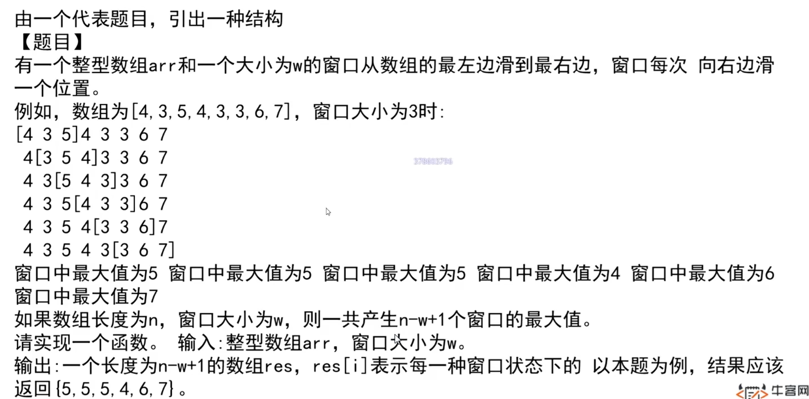

#### 解题思路

这道题要求计算数组 `arr` 中每个大小为 `w` 的连续子数组（窗口）的最大值。最直接的方法是每移动一次窗口就遍历窗口内所有元素求最大值，这样时间复杂度为 **O(n×w)**，当 `w` 较大时效率低下。

**高效解法**利用**双端队列（deque，即双向队列）**，在 **O(n)** 时间内完成，其核心思想是：

> **维护一个队列，其中存储数组元素的**索引**，且这些索引对应的元素值在队列中**严格单调递减**（从队头到队尾）。这样，**队头索引对应的元素永远是当前窗口的最大值**。

#### 算法详细步骤

1. **准备一个双端队列 `dq`**（可用数组模拟），用于存储数组索引。
2. **遍历数组 `arr` 的每个位置 `i`（从 0 到 n-1）**：
   - **移除过期索引**：如果队列非空，且队头索引 `dq.front()` 已经**不在当前窗口范围内**（即 `dq.front() <= i - w`），则将该队头弹出（因为窗口已经滑过该元素）。
   - **维护单调递减性**：在将当前索引 `i` 加入队列之前，需要从**队尾**弹出所有对应的元素值**小于或等于** `arr[i]` 的索引。这样做的目的是保证队列中的元素值从队头到队尾严格递减（如果有相等的元素，弹出旧元素，保留新元素，因为新元素索引更大，存活时间更长）。
   - **将当前索引 `i` 加入队尾**。
   - **记录窗口最大值**：当 `i >= w - 1` 时，说明第一个窗口已经形成，此时**队头索引对应的元素值**就是当前窗口的最大值，将其存入结果数组 `res`。

#### 为什么这样是正确的？

- 队列中始终保存着**当前窗口中可能成为最大值的候选元素**，并且按值从大到小排列。
- 当窗口右移时，过期的最大值（位于队头）会被及时剔除，新的元素会通过弹出较小的旧元素来维持队列的递减性，确保队头始终是当前窗口的最大值。


#### 代码实现

```java
    public static int[] getWindowMax(int[] arr, int w){
        if(arr == null || arr.length < w || w < 1)
            return null;
        int[] res = new int[arr.length -w +1];
        //双端队列
        Deque<Integer> windowdq = new ArrayDeque<>();
        int L = 0;
        int R = 0;
        windowdq.addLast(R);
        for(int i = 1; i!= w; i++) {
            while(!windowdq.isEmpty() && arr[windowdq.getLast()] < arr[i])
                windowdq.removeLast();
            windowdq.addLast(i);
        }
        res[L] = arr[windowdq.getFirst()];
        R = w;
        while(R!= arr.length){
            while(!windowdq.isEmpty() && arr[windowdq.getLast()] <= arr[R])
                windowdq.removeLast();
            windowdq.addLast(R++);
            L++;
            if(windowdq.getFirst() < L)
                windowdq.removeFirst();
            res[L] = arr[windowdq.getFirst()];
        }
        return res;
    }
```


## 单调栈

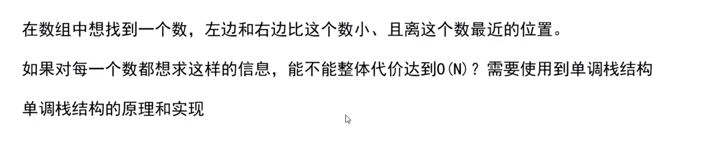

#### 解题思路

题目要求：对于数组 `arr` 中的**每个元素**，分别找出**左边**离它最近且比它小的元素位置，以及**右边**离它最近且比它小的元素位置。

如果对每个元素都单独向左右扫描，时间复杂度为 O(n²)。但利用**单调栈（Monotonic Stack）**，我们可以在 **O(n)** 的整体代价内完成，因为每个元素最多入栈一次、出栈一次。

#### 单调栈的核心原理

我们维护一个**单调递增栈**（从栈底到栈顶，元素值严格递增），栈中存储的是数组的**索引**。

- **入栈规则**：遍历数组时，对于当前元素 `arr[i]`，如果栈顶元素对应的值 **大于等于** `arr[i]`，则不断弹出栈顶元素。因为此时对于被弹出的栈顶元素来说，**当前元素 `i` 就是它右边第一个比它小的元素**（严格小于，所以遇到等于也算作破坏单调性，保证“小于”的严格性）。
- **左边最近小于**：当一个元素被弹出时，它左边的最近小于它的元素，就是**弹出后新的栈顶**（若栈为空，则左边没有更小的元素）。
- **剩余元素**：遍历结束后，栈中剩余的元素右侧没有比它小的元素，右边位置记为 `-1`；它们左边的最近小于元素仍然是它们出栈时的新栈顶（或 -1）。

**结论**：**通过一趟遍历，我们可以同时确定每个元素的左右最近小于（大于）位置**，整体时间复杂度 **O(n)**，空间复杂度 O(n)（存储结果数组和栈）。

实现

这是一个假设数组元素各不相同时的结果，如果数组中有相同元素可能会得出错误的结果

```java
    public static Info[] solution(int[] arr){
        if(arr == null || arr.length < 1)
            return null;
        Info[] res = new Info[arr.length];
        for (int i = 0; i < res.length; i++) {
            res[i] = new Info();
        }
        Stack<Integer> stack = new Stack<>();
        for (int i = 0; i < arr.length; i++) {
            while(!stack.isEmpty() && arr[stack.peek()] > arr[i]){
                int popIndex = stack.pop();
                res[popIndex].left = stack.isEmpty() ? -1 : stack.peek();
                res[popIndex].right = i;
            }
            stack.push(i);
        }
        // 清算
        while(!stack.isEmpty()){
            int popIndex = stack.pop();
            res[popIndex].left = stack.isEmpty() ? -1 : stack.peek();
            res[popIndex].right = -1;
        }
        return res;
    }
```

修正版

栈中每个元素替换为链表，当遇到相同的值时直接添加到链表中。

改变单调栈弹出逻辑即可决定单调递增或单调递减

```java
    public static class Info {
        int left;
        int right;

        public Info(int left, int right) {
            this.left = left;
            this.right = right;
        }

        public Info() {
            this.left = -1;
            this.right = -1;
        }
    }

    public static Info[] solution(int[] arr) {
        if (arr == null || arr.length < 1)
            return null;
        Info[] res = new Info[arr.length];
        for (int i = 0; i < res.length; i++) {
            res[i] = new Info();
        }
        Stack<LinkedList<Integer>> stack = new Stack<>();
        for (int i = 0; i < arr.length; i++) {
                        // 单调递增栈 弹出逻辑
            while (!stack.isEmpty() && stack.peek() != null && arr[stack.peek().getFirst()] > arr[i]) {
                LinkedList<Integer> popList = stack.pop();
                while (!popList.isEmpty()) {
                    int popIndex = popList.pop();
                    res[popIndex].left = stack.isEmpty() ? -1 : stack.peek().getLast();
                    res[popIndex].right = i;
                }
            }
                      // 入栈逻辑
            if (!stack.isEmpty() && stack.peek() != null && arr[stack.peek().getFirst()] == arr[i]) {
                stack.peek().add(i);
            }else {
                LinkedList<Integer> newList = new LinkedList<>();
                newList.add(i);
                stack.push(newList);
            }
        }
        // 清算
        while (!stack.isEmpty()) {
            LinkedList<Integer> popList = stack.pop();
            while(!popList.isEmpty()) {
                int popIndex = popList.pop();
                res[popIndex].left = stack.isEmpty() ? -1 : stack.peek().getLast();
                res[popIndex].right = -1;
            }
        }
        return res;
    }


    static void main() {
        int[] arr = {3, 4, 1, 5, 6, 2, 2, 2, 1, 7};
        Info[] res = solution(arr);
        for (int i = 0; i < res.length; i++) {
            System.out.println("index" + i + ": " + res[i].left + " " + res[i].right);
        }
    }
```


#### 题目二

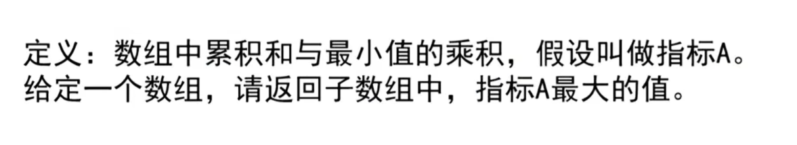

先找出以 i 元素为最小值的子数组，其中和最大的子数组就是上述单调栈的结果。

接着对每一个元素求指标A

```java

	public static int maxIndexA(int[] arr) {
        Info[] childrenIndex = solution(arr);
        int[] indexA = new int[arr.length];
        for (int i = 0; i < childrenIndex.length; i++) {
            int L = childrenIndex[i].left == -1 ? i : childrenIndex[i].left + 1;
            int R = childrenIndex[i].right == -1 ? i : childrenIndex[i].right - 1;
            indexA[i] = sum(arr, L, R) * arr[i];
        }
        return max(indexA);
    }

    public static int sum(int[] arr, int L, int R) {
        int sum = 0;
        for (int i = L; i <= R; i++) {
            sum += arr[i];
        }
        return sum;
    }

    public static int max(int[] arr) {
        int max = arr[0];
        for (int i = 1; i < arr.length; i++) {
            max = Math.max(max, arr[i]);
        }
        return max;
    }
```


# 树

## 树形DP

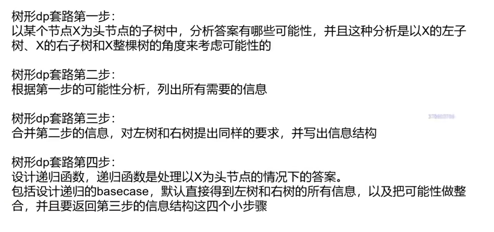


## 节点间最大距离

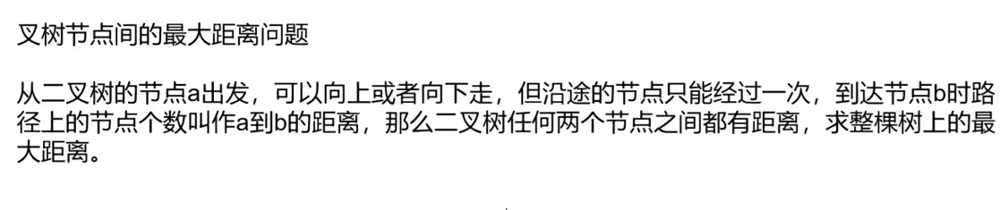

```python
    public static class Node{
        public int value;
        public Node left;
        public Node right;
        public Node(int value) {
            this.value = value;
        }
    }

    public static int getMaxDistance(Node  head) {
        int[] height = new int[1];
//        return postOrder(head, height);
        return process(head).maxDistance;
    }


    // 方法一
    public static int postOrder(Node head, int[] height){
        if(head == null){
            height[0] = 0;
            return 0;
        }
        int leftMaxDistance = postOrder(head.left, height);
        int leftHeight = height[0];
        int rightMaxDistance = postOrder(head.right, height);
        int rightHeight = height[0];
        int curMaxDistance = leftHeight + rightHeight + 1;
        height[0] = Math.max(leftHeight, rightHeight) + 1;
        return Math.max(curMaxDistance, Math.max(leftMaxDistance, rightMaxDistance));
    }


    public static class Info{
        public int maxDistance;
        public int height;
        public Info(int maxDistance, int height) {
            this.maxDistance = maxDistance;
            this.height = height;
        }
    }
    // 方法二
    public static Info process(Node head){
        if(head == null){
            return new Info(0, 0);
        }
        Info leftInfo = process(head.left);
        Info rightInfo = process(head.right);
        int curMaxDistance = Math.max(leftInfo.maxDistance, Math.max(rightInfo.maxDistance, leftInfo.height + rightInfo.height + 1));
        int curHeight = Math.max(leftInfo.height, rightInfo.height) + 1;
        return new Info(curMaxDistance, curHeight);
    }

    public static void main(String[] args) {
        Node head1 = new Node(1);
        head1.left = new Node(2);
        head1.right = new Node(3);
        head1.left.left = new Node(4);
        head1.left.right = new Node(5);
        head1.right.left = new Node(6);
        head1.right.right = new Node(7);
        head1.left.left.left = new Node(8);
        head1.right.left.right = new Node(9);
        System.out.println(getMaxDistance(head1));

        Node head2 = new Node(1);
        head2.left = new Node(2);
        head2.right = new Node(3);
        head2.right.left = new Node(4);
        head2.right.right = new Node(5);
        head2.right.left.left = new Node(6);
        head2.right.right.right = new Node(7);
        head2.right.left.left.left = new Node(8);
        head2.right.right.right.right = new Node(9);
        System.out.println(getMaxDistance(head2));

    }
```


## 派对最大快乐值

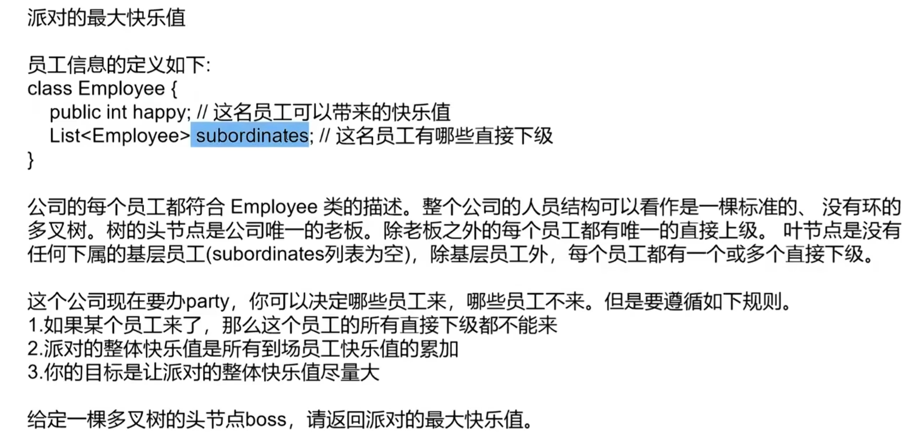

```java
    public static class Employee{
        public int happy;
        public LinkedList<Employee> subEmployees;
        public Employee(int happy){
            this.happy = happy;
            subEmployees = new LinkedList<>();
        }
    }

    public static class Info{
        public int yesHappy;
        public int noHappy;
        public Info(int yesHappy, int noHappy){
            this.yesHappy = yesHappy;
            this.noHappy = noHappy;
        }
    }

    public static int maxHappy(Employee head){
        if(head == null){
            return 0;
        }
        Info info = process(head);
        return Math.max(info.noHappy, info.yesHappy);
    }

    public static Info process(Employee root){
        if(root.subEmployees.isEmpty())
            return new Info(root.happy, 0);
        int lai = root.happy;
        int bu = 0;
        while(!root.subEmployees.isEmpty()){
            Employee sub = root.subEmployees.poll();
            Info subInfo = process(sub);
            lai += subInfo.noHappy;
            bu += Math.max(subInfo.noHappy, subInfo.yesHappy);
        }
        return new Info(lai, bu);
    }
```


## Morris遍历（线索二叉树）

### 1. 基本概念

普通的递归或迭代遍历，其空间复杂度都与树的高度 `h` 相关，为 `O(h)`。对于退化成链表的树，这个空间开销会变为 `O(n)`。而 Morris 遍历则打破了这一限制。

其核心机制被称为**线索化（Threading）**。它不依赖额外的数据结构，而是**动态地**为某些节点建立临时的“线索”指针。具体来说，它会找到一个节点在中序遍历下的**前驱节点**（即其左子树中最右边的节点），并利用该前驱节点空闲的右指针，临时指向当前节点。

这样一来，当遍历完当前节点的左子树后，就能通过这个临时线索“返回到”当前节点，继续处理其右子树。在遍历结束后，算法会将这些临时线索恢复为`null`，确保树的结构不被破坏。

### 2. 来历

Morris 遍历有着深厚的历史渊源：

- **问题起源**：1968年，著名计算机科学家高德纳（Donald Knuth）在其巨著《计算机程序设计艺术》中提出了一个挑战：**设计一个无需堆栈和额外标志域的非递归中序遍历算法，且遍历结束时树结构保持不变**。
- **算法诞生**：直到1979年，**Joseph M. Morris** 在《Information Processing Letters》上发表了题为 **"Traversing Binary Trees Simply and Cheaply"** 的论文，才给出了这个问题的优雅解决方案。
- **命名由来**：该算法因发明者而得名，被称为 **Morris 遍历**。

值得一提的是，这位 Joseph M. Morris 正是大名鼎鼎的 **KMP 字符串匹配算法**的共同作者之一。

### 3、Morris 中序遍历（最核心、最常用）

**核心思想**：在处理完当前节点的左子树后，能够通过临时线索“返回”当前节点。

#### 1. 算法步骤（详细拆解）

设当前指针为 `cur`，从根节点开始循环：

- **步骤 1**：如果 `cur` 没有左子节点（`cur.left == null`）：
  - 直接**访问（输出/处理）** `cur` 节点。
  - 将 `cur` 移动到其右子节点（`cur = cur.right`）。
- **步骤 2**：如果 `cur` 有左子节点（`cur.left != null`）：
  - 在 `cur` 的左子树中，找到**中序前驱节点** `pre`（即从 `cur.left` 出发，一直往右走，直到右指针为空或指向 `cur` 的节点）。
  - **情况 2.1（建立线索）**：如果 `pre.right == null`：
    - 将 `pre.right` 指向 `cur`（建立临时线索，用于返回）。
    - 将 `cur` 移动到其左子节点（`cur = cur.left`），准备处理左子树。
  - **情况 2.2（删除线索）**：如果 `pre.right == cur`（说明左子树已经处理完了）：
    - 将 `pre.right` 置回 `null`（恢复树的结构）。
    - **访问** `cur` 节点（此时左子树已全部访问完，轮到根了）。
    - 将 `cur` 移动到其右子节点（`cur = cur.right`），准备处理右子树。

**伪代码**

```tex
MorrisInorder(root):
    cur = root
    while cur != null:
        if cur.left == null:
            // 1. 无左子树，直接访问当前节点，然后转向右
            visit(cur)
            cur = cur.right
        else:
            // 2. 有左子树，找前驱节点 pre
            pre = cur.left
            while pre.right != null and pre.right != cur:
                pre = pre.right
            
            if pre.right == null:
                // 2.1 第一次访问：建立线索，深入左子树
                pre.right = cur
                cur = cur.left
            else: // pre.right == cur
                // 2.2 第二次访问：左子树已完成，删除线索，访问根，转右子树
                pre.right = null
                visit(cur)
                cur = cur.right
```

```java
    public static void morrisInOrder(Node root) {
        if (root == null) {
            return;
        }
        while (root != null) {
            Node pre = root.left;
            if (pre != null) {
                while (pre.right != null && pre.right != root)
                    pre = pre.right;
                if (pre.right == null) {
                    pre.right = root;
                    root = root.left;
                    continue;
                } else
                    pre.right = null;
            }
            System.out.print(root.value + " ");
            root = root.right;
        }
    }
```


### 4 Morris 前序遍历

前序遍历与中序遍历几乎一模一样，唯一的区别在于**访问节点的时机**：

- 中序是**当删除线索时（即左子树遍历完返回时）**访问根节点。
- 前序是**当建立线索时（即第一次到达根节点时）**就要访问根节点。

#### 1. 算法步骤（强调差异点）

- **步骤 1**：如果 `cur` 没有左子节点：**访问** `cur`，然后 `cur = cur.right`。
- **步骤 2**：如果 `cur` 有左子节点：
  - 找到前驱 `pre`。
  - **情况 2.1（建立线索）**：如果 `pre.right == null`：
    - **立即访问 `cur`**（因为前序遍历先输出根）。
    - 建立线索 `pre.right = cur`，然后 `cur = cur.left`。
  - **情况 2.2（删除线索）**：如果 `pre.right == cur`：
    - 删除线索 `pre.right = null`（注意：**不再访问 `cur`**，因为第一次到达时已经访问过了）。
    - `cur = cur.right`。

**伪代码**

```tex
MorrisPreorder(root):
    cur = root
    while cur != null:
        if cur.left == null:
            // 无左子树，访问并转向右
            visit(cur)
            cur = cur.right
        else:
            pre = cur.left
            while pre.right != null and pre.right != cur:
                pre = pre.right
            
            if pre.right == null:
                // 第一次到达：访问当前节点（根），再建立线索进入左子树
                visit(cur)        // 前序遍历在此处输出
                pre.right = cur
                cur = cur.left
            else: // pre.right == cur
                // 第二次到达（左子树已完），删线索，去右子树
                pre.right = null
                cur = cur.right
```

### 总结

**Morris 遍历是用“时间常数因子变慢”换取“空间复杂度降至 O(1)”的经典算法。**
在日常开发（内存充足）中，出于可读性和速度考虑，我们优先用递归或栈；只有在题目明确要求 **O(1) 空间**，或者处理超大规模退化树时，才会祭出 Morris。


# 大数据类

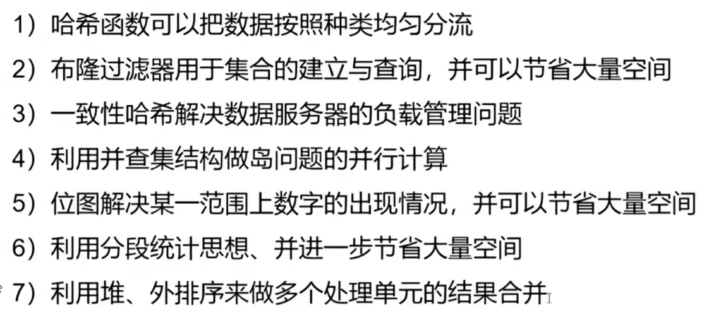


## 位运算

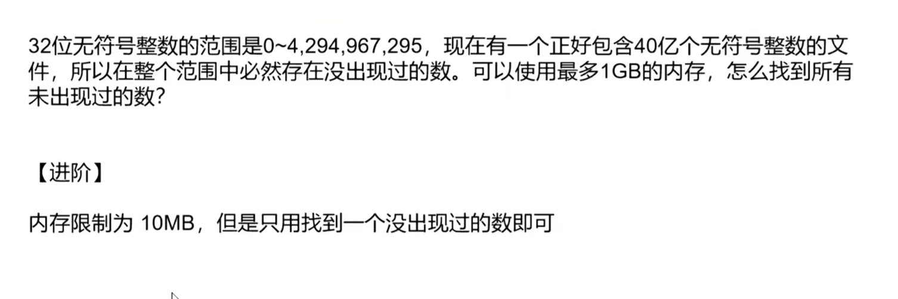

### 解题思路

#### 基础版（1GB 内存，找所有未出现数）

- **核心工具：位图（BitMap）**。
- 32位无符号整数总共有 `2^32 = 4,294,967,296` 个（约42.9亿）。
- 如果使用一个 bit 位来标记一个数字是否出现，只需要 `2^32 bit = 512 MB` 内存。
- **512 MB < 1 GB**，完全符合要求。
- **做法**：遍历40亿个数字，将对应位置的 bit 置为1。遍历完后，扫描整个位图，bit为0的位置对应的数字就是没出现过的。

#### 进阶版（10MB 内存，只找一个未出现数）

- **10MB = 10 \* 1024 \* 1024 \* 8 ≈ 8388万 bit**。无法一次性标记42.9亿个数。
- **策略：区间划分（分桶） + 两次遍历**。
- **第一次遍历（统计区间）**：我们不可能标记每一个数，但可以**数每个小区间有多少个数**。
  - 设每个区间大小为 `2^16 = 65536`。
  - 那么总区间数为 `2^32 / 2^16 = 2^16 = 65536` 个。
  - 申请一个长度为 `65536` 的 `int` 数组（计数数组），占用内存 `65536 * 4 Byte ≈ 256 KB`。**远小于 10MB**。
  - 遍历40亿个数，`num / 65536` 得到区间编号，将该区间的计数器 `+1`。
  - 因为总共有42.9亿个坑位，但只有40亿个数，**必然存在某个区间，其计数器的值小于 `65536`**，这个区间内一定缺了数字。
- **第二次遍历（精确查找）**：
  - 选定上述那个“不满”的区间，假设编号为 `target_bucket`。
  - 再次遍历40亿个数，只关注属于该区间的数（即 `num >> 16 == target_bucket`）。
  - 对于这些数，取它们的低16位（`num & 0xFFFF`），用**位图（只需 `65536 bit = 8 KB`）** 标记出现过的低16位数字。
  - 遍历这个8KB的位图，找到第一个未被标记的低16位数字。
  - 拼接结果：`(target_bucket << 16) | 缺失的低16位数字`。

#### 更少的空间

若只有3kb或1kb，同理

比如3kb

- 第一遍遍历

  - 申请int[512]

  - 将2^32个数分成512分

  - 统计每个区间的数字量

- 第二遍遍历

  - 同上精确查找

#### 更极端的情况

只给三个int变量

- 一个变量用于遍历，另外两个用于二分区间，并统计词频
- 不断二分，直到找到一个找到目标值
- 最多32次循环

---


## MapReduce

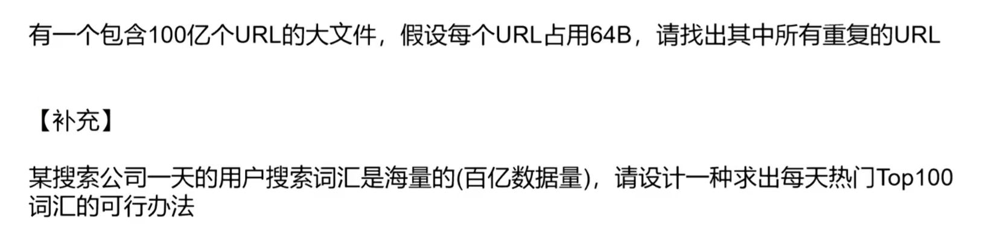

**可以使用布隆过滤器（失误率在可承受范围内）**

### 问题一：找出 100 亿个 URL 中的所有重复项

**1. 规模估算**
100 亿 * 64B = 6400 亿字节 = **640 GB**。这远远超过单机内存，无法一次性加载。

**2. 核心策略：哈希分流（Map 阶段）**

- 遍历这个大文件，对每一个 URL 计算哈希值（如 `hash(URL)`）。
- 进行取模运算：`index = hash(URL) % N`（`N` 根据内存设定，比如取 `N=10000`）。
- 将当前 URL **写入**对应的编号为 `index` 的小文件中。
- **原理**：相同的 URL 经过哈希计算，得到的 `index` 一定相同。因此，**所有重复的 URL 一定被分到了同一个小文件中**。

**3. 精准查重（Reduce 阶段）**

- 经过分流，大文件变成了 10000 个小文件。每个文件大小约为 `640GB / 10000 ≈ 65 MB`，完全可以在内存中处理。
- 对每个小文件，读入内存构建 **HashSet** 或 **HashMap**（统计出现次数）。
- 遍历过程中，若发现 URL 已存在于 HashSet 中，则记录该 URL 为重复项。
- 此过程天然支持分布式并行（多台机器同时处理不同的小文件）。

------

### 问题二：百亿搜索词中求每日 Top 100 热门词

**1. 核心难点**
仅靠单机的内存无法容纳百亿数据（约几十 TB），且 unique 词条可能多达数亿甚至数十亿，直接全局排序不现实。

**2. 解题路径：分流计数 + 多路归并（或堆筛选）**

**第一步：哈希分流与局部精确计数**

- 同问题一，对搜索词计算 `hash(word) % M`，将百亿数据分散到 `M` 个桶（或机器）中，保证同一单词进入同一个桶。
- 在每个桶内部，**精确统计每个词出现的次数**（利用 HashMap 或外部排序）。此时，每个桶的输出结果为 `(word, count)` 键值对。

**第二步：全局 Top K 精准合并（关键）**
我们需要从所有桶的 `(word, count)` 中找出全局频次最高的 100 个。这里有两条严谨的实现路径：

- **路径 A（多路归并 + 提前终止）**：
  - 将所有桶输出的词频文件，按 **频次（count）从高到低** 进行外部排序（可使用多路归并排序，即败者树）。
  - 归并时，从最高频开始读取，维护一个计数器。读到第 100 个不同的词时，记录其频次 `freq_100`。
  - 继续归并读取，只要当前词频 `>= freq_100`，就继续收集（处理并列情况）。一旦发现当前词频 `< freq_100`，由于数据是降序的，后续所有词频都更小，**立即停止归并**。此时已收集的词即为 Top 100。
  - *优势：无需加载全量数据，内存仅需维护归并缓冲区。*
- **路径 B（分布式最小堆）**：
  - 在每个桶的内部，先利用大小为 100 的**最小堆**，筛选出该桶的**局部 Top 100**。
  - 将所有桶的局部 Top 100 汇总（总计 `M * 100` 条数据，量级可控）。
  - 对汇总数据进行全局排序（或再次建立大小为 100 的最小堆），即可得到全局 Top 100。
  - *注意*：这种方法在数学上存在极微小的理论漏洞（若某词在单个桶内排第 101，但其他桶没有，它可能仍是全局 Top 100）。为了绝对准确，推荐使用 **路径 A（归并排序）**，如果为了工程简便，可适当将局部堆的大小放大至 1000 以降低风险。


## MapReduce2

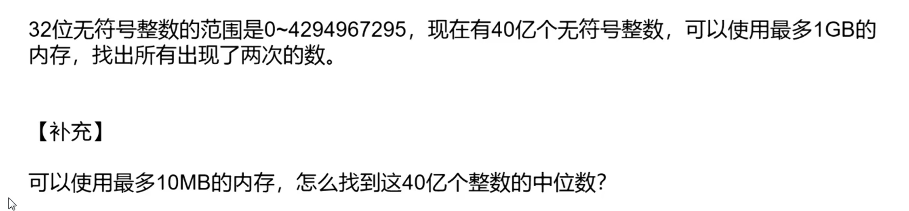

### 问题一：1GB 内存，找出所有出现两次的数

**1. 解题思路**
由于无符号整数范围是 `0 ~ 2^32-1`（约 42.9 亿个），且内存限制为 1GB（约 80 亿 bit）。
为了记录“出现次数”，仅用 1 个 bit（0/1）只能表示有无，不足以区分“出现 2 次”和“出现 3 次及以上”。

因此我们需要**双比特位图（2-bitmap）**：

- 每个数字分配 **2 个 bit** 来记录其出现状态。
- 状态定义：`00`（0次）、`01`（1次）、`10`（2次）、`11`（3次及以上）。
- **内存计算**：总共有 `2^32` 个数字，每个占 2 bit。总内存 = `2^32 * 2 bit = 2^33 bit = 1 GB`（严格来说是 819.2 MB）。**完全满足 1GB 限制**。

**2. 操作步骤**

1. 初始化一个大小为 `2^33` bit（即 1GB）的数组，全部置 `00`。
2. 遍历包含 40 亿个数的文件，对每个数 `num`：
   - 读取其对应的 2 bit 状态。
   - 若为 `00`，改为 `01`（首次出现）。
   - 若为 `01`，改为 `10`（第二次出现）。
   - 若为 `10`，改为 `11`（第三次及以上，不再关心）。
3. 遍历整个 0 ~ 2^32-1 的范围，找出所有状态为 `10` 的数字并输出。

------

### 问题二：10MB 内存，找出 40 亿个数的中位数

**1. 解题思路**
10MB 仅约 8000 万 bit，无法标记所有数字。中位数的定义：将 40 亿个数排序后，**第 20 亿个数**（假设升序，即第 20 亿小的数）。

利用**区间分桶（Bucket）** + **两次遍历排除法**。

- **第一次遍历（确定目标区间）**：
  - 取数字的**高 16 位**作为桶编号（`bucket_id = num >> 16`）。因为 2^32 个数被划分为 `2^16 = 65536` 个桶，每个桶覆盖 `2^16 = 65536` 个连续整数。
  - 申请一个长度为 65536 的 `int` 数组（每个 int 占 4B），内存 = `65536 * 4B ≈ 256 KB`，远小于 10MB。
  - 遍历 40 亿个数，执行 `count[bucket_id]++`，统计每个桶内的数字个数。
  - 累加每个桶的计数。目标中位数是第 20 亿个数。找到累加和第一次 `>= 20亿` 的那个桶，记为 `target_bucket`。同时记录该桶之前的累加总数 `prev_total`。
  - 此时可知，答案就在这个桶覆盖的 `65536` 个数字范围内。
- **第二次遍历（在桶内精确定位）**：
  - 我们只关心 `num >> 16 == target_bucket` 的数字。取它们的**低 16 位**（`offset = num & 0xFFFF`）作为桶内偏移。
  - 申请一个长度为 65536 的 `int` 或 `short` 计数数组（`65536 * 4B ≈ 256 KB`），对落在该桶内的数进行精确计数。
  - 计算在该桶内的目标排名：`rank_in_bucket = 20亿 - prev_total`（即在该桶内从小到大数，第几个数）。
  - 遍历桶内的计数数组，累加直到累加和 `>= rank_in_bucket`，此时的偏移量 `offset` 就是答案的低 16 位。
  - 最终答案：`(target_bucket << 16) | offset`。


## 位运算2 getMax

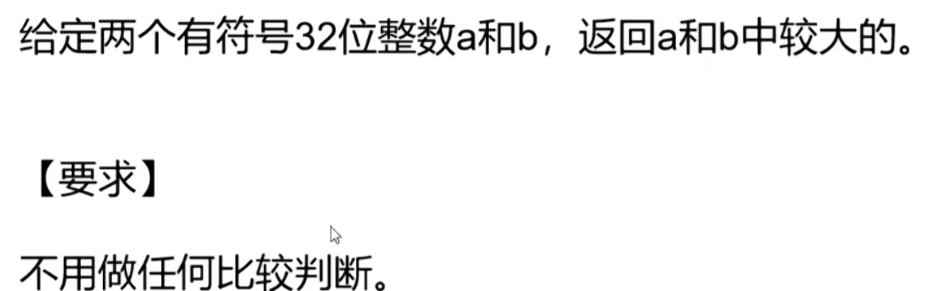

### 1. 解题思路

**核心逻辑**：我们需要构造一个标志位 `flag`（值为 1 或 0）。如果 `a >= b`，则 `flag = 1`，最终返回 `a`；如果 `a < b`，则 `flag = 0`，最终返回 `b`。
即：`result = a * flag + b * (1 - flag)`。

**技术难点与破解方案**：
直接计算 `c = a - b` 并提取符号位是有风险的，因为 **`a` 和 `b` 异号时，`a - b` 可能会溢出**（例如 `a = INT_MIN, b = INT_MAX`）。

因此，必须**分情况处理**：

1. **符号相同（`sa == sb`）**：`a - b` 绝对安全，不会溢出。此时判断差值 `c` 的符号位即可。
2. **符号不同（`sa != sb`）**：无需做减法。因为**非负数一定大于负数**。此时可以直接根据 `a` 的符号决定大小。

**具体位运算技巧**：

- 取符号位：`sign(x) = (x >> 31) & 1`（结果为 `0` 表示非负，`1` 表示负数）。
- 如果 `a` 为非负数（`sa = 0`）且 `b` 为负数（`sb = 1`），则 `a` 较大。
- 如果 `a` 为负数（`sa = 1`）且 `b` 为非负数（`sb = 0`），则 `b` 较大。

### 2. 伪代码

```C
int getMax(int a, int b) {
    // 1. 提取符号位（0表示非负，1表示负数）
    int sa = (a >> 31) & 1;
    int sb = (b >> 31) & 1;
    
    // 2. 判断符号是否相同
    int diffSign = sa ^ sb;       // 符号不同则为1，相同则为0
    int sameSign = 1 - diffSign;  // 符号相同则为1，不同则为0

    // 3. 计算差值（仅在符号相同时安全）
    int c = a - b;
    int sc = (c >> 31) & 1;       // 差值的符号位：0表示c>=0，1表示c<0

    // 4. 构造选择标志 flag（1 选 a，0 选 b）
    // 情况一：符号相同，取差值的符号。如果 c >= 0 (sc=0)，则选a，即 flag = 1 - sc
    int flagSame = sameSign & (1 - sc);
    
    // 情况二：符号不同。如果 a 非负 (sa=0)，则 a > b，选a，即 flag = 1 - sa
    int flagDiff = diffSign & (1 - sa);
    
    // 合并标志
    int flag = flagSame | flagDiff;

    // 5. 返回结果（规避了所有比较运算符）
    return a * flag + b * (1 - flag);
}
```


## 位运算3


### 1. 核心解题思路

#### 判断 2 的幂

一个数如果是 2 的幂，其二进制表示中**有且仅有 1 个位是 1**。

- 例如：`4` -> `100`，`8` -> `1000`。
- **经典技巧**：`x & (x - 1) == 0`。
  - `x - 1` 会将原数最低位的 `1` 变为 `0`，并将其右边的所有 `0` 变为 `1`。
  - 如果 `x` 只有一位是 `1`，那么 `x & (x - 1)` 必定为 `0`。
- **前提**：该数必须是正数（`x > 0`）。

#### 判断 4 的幂

一个数是 4 的幂，**首先必须是 2 的幂**，其次它唯一的那个 `1` 必须出现在**二进制的偶数位**（从第 0 位开始数）。

- 4 的幂序列：`1`(1), `4`(100), `16`(10000), `64`(1000000)... 对应的 `1` 都在第 0, 2, 4, 6... 位（偶数位）。
- **方法一（位掩码）**：用掩码 `0x55555555`（即 `0101...0101`）去按位与。该掩码在偶数位上全是 1。如果 `(x & 0x55555555) != 0`，说明那个唯一的 `1` 落在了偶数位。
- **方法二（数学取模）**：因为 `4 ≡ 1 (mod 3)`，所以 `4^k ≡ 1 (mod 3)`。而 2 的幂中，如果是 2 的奇数次幂（即不是 4 的幂），如 `2, 8, 32...`，对 3 取模等于 `2`。所以判断 `x % 3 == 1` 即可。

### 2. 伪代码

```tex
函数 isPowerOfTwo(n):
    如果 n <= 0: 返回 假
    返回 (n & (n - 1)) == 0

函数 isPowerOfFour(n):
    如果 n <= 0: 返回 假
    // 先判断是2的幂，再判断偶数位
    返回 (n & (n - 1)) == 0 AND (n & 0x55555555) != 0
    // 或者使用数学方法：返回 (n & (n-1)) == 0 AND (n % 3 == 1)
```


## 位运算4

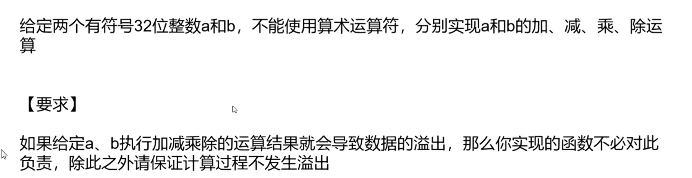

这是一道极其经典且硬核的**位运算**面试题。核心思路是**用逻辑门（与、或、异或、移位）在二进制层面模拟数字电路**，同时利用 **64位长整型（long）** 作为中间载体，彻底规避计算过程中的溢出风险。

以下是完整的解题方案与代码实现（以 Java 风格伪代码为例）。

------

### 1. 核心解题思路

#### 基石：加法（Add）

计算机底层加法器原理：

- 无进位相加：`a ^ b`（异或）
- 进位：`(a & b) << 1`（与运算后左移一位）
- 循环上述两步，直到进位为 0。

#### 减法（Subtract）

减去一个数等于加上这个数的相反数。

- 取反加一：`~b + 1`。利用已实现的 `add` 函数。

#### 乘法（Multiply）

模拟竖式乘法（位移累加法）：

- 遍历乘数 `b` 的每一个二进制位。
- 如果当前位是 `1`，则将 `a` 左移对应位数后累加到结果中。
- **防溢出处理**：全程使用 64 位 `long` 进行运算，避免 32 位中间结果溢出。

#### 除法（Divide）

模拟二进制长除法（恢复余数法）：

- 先确定符号，将 `a` 和 `b` 均转为正数（用绝对值）。
- 从高位向低位试探：判断 `余数` 能否减去 `(除数 << i)`。
- 如果能减，则结果的第 `i` 位设为 `1`，并更新余数。
- **防溢出处理**：移位操作在 64 位空间下进行，完全安全。

### 2. 伪代码实现（Java 风格）

```java
public class BitwiseCalculator {
    
    // ---------- 基础加法（核心基石） ----------
    private long add(long a, long b) {
        long carry;
        while (b != 0) {
            carry = (a & b) << 1; // 计算进位
            a = a ^ b;           // 无进位相加
            b = carry;           // 重复直到进位为0
        }
        return a;
    }

    // ---------- 取相反数 ----------
    private long neg(long a) {
        return add(~a, 1L);
    }

    // ---------- 减法：a - b = a + (-b) ----------
    private long sub(long a, long b) {
        return add(a, neg(b));
    }

    // ---------- 乘法 ----------
    private long multiply(long a, long b) {
        long res = 0;
        // 这里直接处理long，如果b是负数，无符号右移 >>> 最终会变成0
        while (b != 0) {
            if ((b & 1L) != 0) {
                res = add(res, a);
            }
            a = a << 1;   // 相当于乘以2
            b = b >>> 1;  // 无符号右移，确保负数也能正确遍历每一位
        }
        return res;
    }

    // ---------- 除法 ----------
    private long divide(long a, long b) {
        if (b == 0) {
            throw new ArithmeticException("除数不能为0");
        }

        // 记录符号
        boolean neg = (a < 0) ^ (b < 0);
        
        // 取绝对值（利用已经实现的 neg 函数）
        long x = a < 0 ? neg(a) : a;
        long y = b < 0 ? neg(b) : b;
        
        long res = 0;
        // 从最高位（63位）开始尝试，确保覆盖所有long范围
        for (int i = 63; i >= 0; i--) {
            // 检查 x 能否减去 (y << i)
            // 注意：x 和 y 都是正数，使用无符号右移比较更安全
            if ((x >>> i) >= y) {
                res |= (1L << i);        // 结果的这一位设为1
                x = sub(x, y << i);      // 更新余数
            }
        }
        
        // 返回结果（32位有符号截断，如果溢出由调用者承担）
        return (int) (neg ? neg(res) : res);
    }

    // ---------- 对外暴露的32位接口（结果自动转为int，溢出不予负责） ----------
    public int add(int a, int b) { return (int) add((long)a, (long)b); }
    public int sub(int a, int b) { return (int) sub((long)a, (long)b); }
    public int multiply(int a, int b) { return (int) multiply((long)a, (long)b); }
    public int divide(int a, int b) { return (int) divide((long)a, (long)b); }
}
```

---


# 递归到动态规划

## 概念

在算法与数据结构领域，**动态规划（Dynamic Programming，简称DP）** 的核心思想非常朴实：**通过把一个大问题分解成一系列相互重叠的子问题，并记住每个子问题的答案，从而避免重复计算，以空间换时间。**

为了让你真正理解它，我们可以从“三个关键词”、“两种实现方式”和“一个经典例题”来拆解：

**1. 动态规划的三个关键词（核心特征）**

一个能用动态规划解决的问题，必须同时具备以下三个性质：

- **最优子结构**：大问题的最优解，可以由其子问题的最优解组合而成。也就是说，你可以通过“砍掉最后一步”来把问题缩小，且子问题的决策互不影响（独立性）。
- **重叠子问题**：在递归求解过程中，子问题会**反复出现**很多次。这是DP与“分治算法”（如归并排序）的根本区别——分治的子问题是独立的（不重叠），而DP的子问题是重复的。
- **无后效性**：一旦某个子问题的最优解确定了，它就不会受之后更大问题的决策影响。我们只关心状态的值，不关心它怎么来的。

**2. 两种实现方式（怎么去记）**

- **自顶向下（记忆化搜索）**：从大问题开始，用递归的方式向下分解。每次算出一个子问题的答案，就存进一个“备忘录”（数组或哈希表）里。下次再遇到时，直接取出来用，不用再算。
- **自底向上（表格递推）**：这是最常用的迭代写法。从最小的子问题开始，按顺序推导出更大的问题，通常用循环填充一个DP表格（数组）。这种方式没有递归开销，效率通常更高。

**3. 经典案例：斐波那契数列（帮你秒懂）**

计算第 `n` 项（F(n) = F(n-1) + F(n-2)）：

- **暴力递归**：计算 F(5) 要算 F(3) 两次，F(2) 三次，指数级复杂度 O(2^n)。
- **动态规划（自底向上）**：定义一个 `dp` 数组，`dp[0]=0, dp[1]=1`，然后循环 `dp[i] = dp[i-1] + dp[i-2]`。这样每个数只算一次，复杂度降为 **O(n)**。

**4. 与常见算法的区分（面试避坑）**

- **贪心算法**：贪心每一步都选局部最优，不回头；**DP**会穷举所有可能，通过比较选全局最优（贪心是DP的特例）。
- **分治算法**：子问题不重叠（如快排、归并）；**DP**的子问题重叠，所以才需要“存起来”。

**5. 动态规划的“标准解题五步曲”**
在面试或刷题时，按这个思路来拆解：

1. **定义状态**：明确 `dp[i]` 或 `dp[i][j]` 代表什么含义（这是最难也最关键的一步）。
2. **寻找状态转移方程**：找到 `dp[i]` 如何由之前的 `dp[j]` 推导出来的数学关系（即递推公式）。
3. **初始化**：确定边界条件（最小子问题的解）。
4. **确定遍历顺序**：正推还是倒推？一维还是二维？
5. **举例验证**：手动推演一个小例子，检查方程是否正确。


## Question1

阿里面试题，机器人走路

给定一个一维数组，从S位置开始，必须走K步，最终走到E位置，有几种方式？

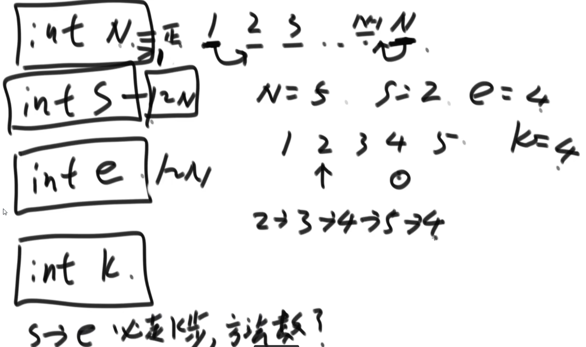

### 暴力递归

```java
    public static int count1(int K, int S, int E, int N){
        return process1(K, S, E, N);
    }

    public static int process1(int rest, int cur, int des, int N){
        if(rest == 0)
            return cur == des ? 1 : 0;
        if(cur == 1)
            return process1(rest - 1, cur + 1, des, N);
        if(cur == N)
            return process1(rest - 1, cur - 1, des, N);
        return process1(rest - 1, cur + 1, des, N) + process1(rest - 1, cur - 1, des, N);
    }
```


### 动态规划

#### 计划搜索

```java
    public static int count2(int K, int S, int E, int N) {
        int[][] dp = new int[K + 1][N + 1];
        for (int i = 0; i < dp.length; i++) {
            for (int j = 0; j < dp[0].length; j++) {
                dp[i][j] = -1;
            }
        }
        process2(K, S, E, N, dp);
        return dp[K][S];
    }

    public static int process2(int rest, int cur, int des, int N, int[][] dp) {
        if (dp[rest][cur] != -1)
            return dp[rest][cur];
        if (rest == 0)
            dp[rest][cur] = cur == des ? 1 : 0;
        else if (cur == 1)
            dp[rest][cur] = process2(rest - 1, cur + 1, des, N, dp);
        else if (cur == N)
            dp[rest][cur] = process2(rest - 1, cur - 1, des, N, dp);
        else
            dp[rest][cur] = process2(rest - 1, cur + 1, des, N, dp) + process2(rest - 1, cur - 1, des, N, dp);
        return dp[rest][cur];
    }
```


#### 严格表结构的动态规划结果：（非计划搜索 即 纯缓存）

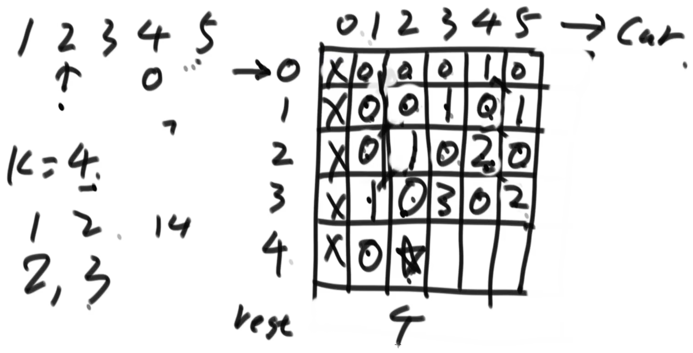


## Question2

给定一维数组arr，元素代表硬币面值，给定目标值aim，用最少的硬币数量组成该目标值。

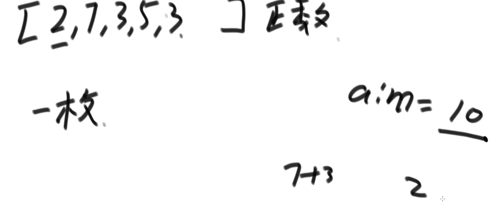


## 总结

1. 先写出递归方案
2. 修改成计划搜索（缓存）样式
3. 严格表搜索
   1. 分析可变参数个数以及变化范围
   2. 标出要计算的终止位置
   3. 标出不用计算直接出答案的位置，即basecase位置
   4. 找出普通位置的依赖关系（即如何得到该位置的结果）
   5. 确定普通位置的计算顺序（从哪个位置开始遍历到结束位置）


尝试的时候

- 单可变参数的维度：尽量int类型（0维单数），不要数组，否则要么重新考虑、要么就是超高难度题目。
- 可变参数的个数：尽量少

---


## Question3

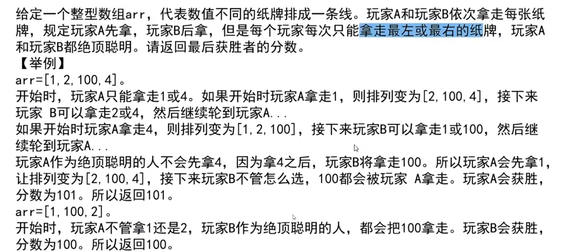

### **方法思路**

1. **问题分析**：两个玩家轮流从数组的左端或右端取纸牌，每次只能取一端，且双方都采取最优策略。我们需要计算先手（玩家A）和后手（玩家B）在每一步的最优得分。
2. **动态规划定义**：
   - `first[i][j]`：表示当剩余纸牌为数组中从索引`i`到`j`的子数组时，当前先手玩家能获得的最大分数。
   - `second[i][j]`：表示当剩余纸牌为数组中从索引`i`到`j`的子数组时，当前后手玩家能获得的最大分数。
3. **状态转移**：
   - 对于先手玩家，选择左端或右端的纸牌后，后手玩家会在剩下的子数组中成为新的先手，因此先手的得分是当前选择的纸牌值加上剩下子数组中后手玩家的得分。
   - 对于后手玩家，其得分等于剩下子数组中先手玩家的得分（因为后手的选择会导致先手进入下一个状态）。
4. **初始化**：当子数组只有一个元素时，先手玩家直接取该元素，后手玩家得分为0。
5. **结果计算**：整个数组的先手和后手得分分别为`first[0][n-1]`和`second[0][n-1]`，返回两者的最大值。

```java
    public static int winner2(int[] arr) {

        int[][] first = new int[arr.length][arr.length];
        int[][] second = new int[arr.length][arr.length];
        for (int i = 0; i < first.length; i++) {
            for (int j = 0; j < i; j++) {
                first[i][j] = -1;
                second[i][j] = -1;
            }
            first[i][i] = arr[i];
            second[i][i] = 0;
        }
        for (int i = first.length - 1; i >= 0; i--) {
            for (int j = i + 1; j < first[0].length; j++) {
                first[i][j] = Math.max(arr[i] + second[i + 1][j], arr[j] + second[i][j - 1]);
                second[i][j] = Math.min(first[i + 1][j], first[i][j - 1]);
            }
        }

        System.out.println("first矩阵如下所示：");
        for (int i = 0; i < arr.length; i++) {
            for (int i1 = 0; i1 < arr.length; i1++) {
                System.out.printf("%4d ", first[i][i1]);
            }
            System.out.println();
        }

        return Math.max(first[0][first.length - 1], second[0][first.length - 1]);
    }
```


## Question4

中国象棋棋盘（10 * 9），a和b分别表示“马”的横坐标和列坐标，必须走K步，来到（0，0）的位置，有几种可能的走法？

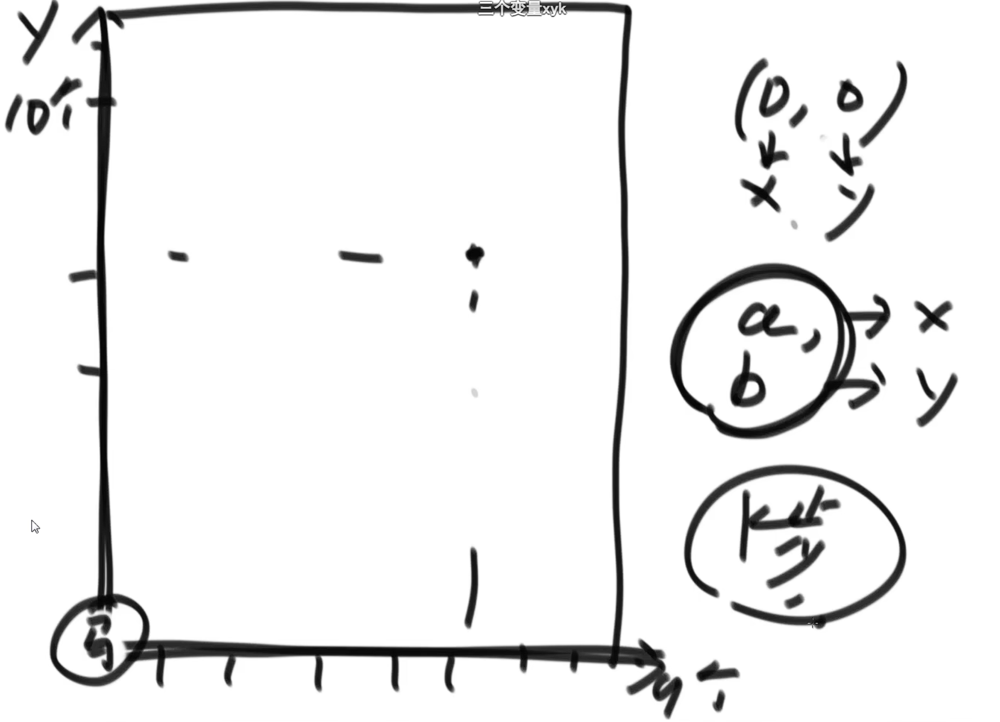

```java
    public static int recurChess(int X, int Y, int step, int M, int N) {
        return process1(X, Y, step, M, N);
    }

    public static int process1(int X, int Y, int step, int M, int N) {
        if (X < 0 || Y < 0 || X >= M || Y >= N)
            return 0;
        if (step == 0)
            return X == 0 && Y == 0 ? 1 : 0;
        return process1(X - 1, Y - 2, step - 1, M, N)
                + process1(X - 1, Y + 2, step - 1, M, N)
                + process1(X + 1, Y - 2, step - 1, M, N)
                + process1(X + 1, Y + 2, step - 1, M, N)
                + process1(X - 2, Y - 1, step - 1, M, N)
                + process1(X - 2, Y + 1, step - 1, M, N)
                + process1(X + 2, Y - 1, step - 1, M, N)
                + process1(X + 2, Y + 1, step - 1, M, N);
    }

    public static int dpChess(int X, int Y, int step, int M, int N) {
        int[][][] dp = new int[step + 1][M][N];
        // 初始化 状态；当step=0时，只有X=0,Y=0时为1，其他为0，由于java创建数组是默认初始化为0，所以其他位置不需要处理
        dp[0][0][0] = 1;
        for (int h = 1; h <= step; h++)
            for (int i = 0; i < M; i++)
                for (int j = 0; j < N; j++) {
                    dp[h][i][j] = getValue(dp, h - 1, i - 1, j - 2)
                            + getValue(dp, h - 1, i - 1, j + 2)
                            + getValue(dp, h - 1, i + 1, j - 2)
                            + getValue(dp, h - 1, i + 1, j + 2)
                            + getValue(dp, h - 1, i - 2, j - 1)
                            + getValue(dp, h - 1, i - 2, j + 1)
                            + getValue(dp, h - 1, i + 2, j - 1)
                            + getValue(dp, h - 1, i + 2, j + 1);
                }
        return dp[step][X][Y];
    }

    public static int getValue(int[][][] dp, int step, int x, int y) {
        if (x < 0 || y < 0 || x >= dp[0].length || y >= dp[0][0].length)
            return 0;
        return dp[step][x][y];
    }


    static void main() {
        int X = 7;
        int Y = 7;
        int step = 10;
        long startime = System.currentTimeMillis();
        System.out.print("动态规划: " + dpChess(X, Y, step, 10, 9));
        System.out.println(" -- 耗时：" + (System.currentTimeMillis() - startime));
        System.out.print("递归: " + recurChess(X, Y, step, 10, 9));
        System.out.println(" -- 耗时：" + (System.currentTimeMillis() - startime));
    }
```


## Question5

给定矩阵的一个区域`(M, N)` ，给定Bob的位置`(a, b)`， Bob在任意位置都等概率的随机往上下左右四个方向走，一共走`K `步，若Bob越界，则Bob“死掉”，问Bob能活下来的概率是多少？

```java
    public static int gcd(int a, int b) {
        int temp = 0;
        while (b != 0) {
            temp = b;
            b = a % b;
            a = temp;
        }
        return a;
    }

    public static String probability(int M, int N, int i, int j, int step) {
        int lives = process(M, N, i, j, step);
        int all = (int) Math.pow(4, step);
        int g = gcd(all, lives);
        return (lives / g) + "/" + (all / g);

    }

    public static int process(int M, int N, int row, int col, int step) {
        if (row < 0 || col < 0 || row >= M || col >= N)
            return 0;
        if (step == 0)
            return 1;
        return process(M, N, row - 1, col, step - 1) + process(M, N, row + 1, col, step - 1)
                + process(M, N, row, col - 1, step - 1) + process(M, N, row, col + 1, step - 1);
    }

    public static String probability2(int M, int N, int row, int col, int step) {
        int[][][] dp = new int[step + 1][M][N];
        // 初始化
        for (int i = 0; i < M; i++) {
            for (int j = 0; j < N; j++) {
                dp[0][i][j] = 1;
            }
        }
        for (int s = 1; s <= step; s++) {
            for (int i = 0; i < M; i++) {
                for (int j = 0; j < N; j++) {
                    dp[s][i][j] = getValue(dp, s - 1, i - 1, j, M, N)
                            + getValue(dp, s - 1, i + 1, j, M, N)
                            + getValue(dp, s - 1, i , j - 1, M, N)
                            + getValue(dp, s - 1, i, j + 1, M, N);
                }
            }
        }
        int lives = dp[step][row][col];
        int all = (int) Math.pow(4, step);
        int g = gcd(all, lives);
        return (lives / g) + "/" + (all / g);
    }

    public static int getValue(int[][][] dp, int h, int i, int j, int M, int N){
        if (i < 0 || j < 0 || i >= M || j >= N)
            return 0;
        return dp[h][i][j];
    }


    static void main() {
        int M = 5;
        int N = 5;
        int i = 2;
        int j = 3;
        int step = 3;
        System.out.println(probability2(M, N, i, j, step));
    }
```


## Question6

给定一个数组arr，元素均为正整数，且无重复值，每个元素代表该面值的货币，可以有无限张，用这些面值的货币组成指定目标值aim，有几种可能？

```JAVA
    public static int ways1(int[] arr, int aim) {
        return process1(arr, 0, aim);
    }

    public static int process1(int[] arr, int index, int rest) {
        if (rest < 0)
            return 0;
        if (rest == 0)
            return 1;
        if (index == arr.length)
            return 0;

        int res = 0;
        for (int i = 0; i * arr[index] <= rest; i++) {
            res += process1(arr, index + 1, rest - i * arr[index]);
        }
        return res;
    }

    public static int ways2(int[] arr, int aim) {
        int[][] dp = new int[arr.length + 1][aim + 1];
        for (int i = 0; i <= arr.length; i++) {
            dp[i][0] = 1;
        }

        for (int index = arr.length - 1; index >= 0; index--) {
            for (int rest = 1; rest <= aim; rest++) {

                for (int i = 0; i * arr[index] <= rest; i++) {
                    dp[index][rest] += dp[index + 1][rest - i * arr[index]];
                }
            }

        }
        return dp[0][aim];
    }

    // 优化
    public static int ways3(int[] arr, int aim) {
        int[][] dp = new int[arr.length + 1][aim + 1];
        for (int i = 0; i <= arr.length; i++) {
            dp[i][0] = 1;
        }

        for (int index = arr.length - 1; index >= 0; index--) {
            for (int rest = 1; rest <= aim; rest++) {
                dp[index][rest] = dp[index + 1][rest];
                if(rest - arr[index] >= 0)
                    dp[index][rest] += dp[index][rest - arr[index]];
            }

        }
        return dp[0][aim];
    }

    static void main() {
        int[] arr = {5, 10, 25, 1, 15};
        System.out.println(ways3(arr, 10));
    }
```


---

# 有序表

- 红黑树
- AVL
- SBT
- 跳表


## BST

### 基本概念

二叉搜索树（Binary Search Tree，简称 BST），也称为**二叉查找树**或**二叉排序树**。它是一种特殊的二叉树数据结构，要么是一棵空树，要么满足以下性质：

1. **左子树性质**：若任意结点的左子树不空，则左子树上**所有**结点的值均**小于**它的根结点的值。
2. **右子树性质**：若任意结点的右子树不空，则右子树上**所有**结点的值均**大于**它的根结点的值。
3. **递归性质**：任意结点的左、右子树本身也分别为二叉搜索树。

> **注意**：不同的定义对相等值的处理略有差异。有的定义允许左子树小于等于根结点（或右子树大于等于根结点），有的则要求严格小于/大于。

二叉搜索树的核心思想源于**二分查找**（分治法）——树根居中，左子树存放较小值，右子树存放较大值，然后递归分割下去。这种结构使得查找、插入和删除等操作都非常高效。

在存储结构上，二叉搜索树的每个结点通常包含**键值（key）**、**左孩子指针（lchild）**、**右孩子指针（rchild）** 和**父结点指针（parent）**。

**一个重要性质**：对二叉搜索树进行**中序遍历**（左子树 → 根结点 → 右子树），可以得到一个**从小到大排列**

### 基本操作

#### 一、查找操作（Search）

**核心思想**：利用“左小右大”的性质，像走迷宫一样从根节点开始，每次比较目标值与当前节点值，决定向左走还是向右走。

**详细步骤**：

1. 从根节点 `root` 开始。
2. 若 `root` 为空，说明没找到，返回 `null`。
3. 若 `target == root.val`，找到目标，返回该节点。
4. 若 `target < root.val`，进入左子树继续查找。
5. 若 `target > root.val`，进入右子树继续查找。
6. 重复上述过程，直到找到或遇到空节点。

#### 二、插入操作（Insert）

**核心思想**：新节点**永远作为叶子节点插入**。先进行一次“查找失败”的遍历，当遇到空位置时，就在此位置挂上新节点。

**详细步骤**：

1. 若树为空，直接创建新节点作为根返回。
2. 从根开始，用 `cur` 指针遍历。
3. 若 `new_val < cur.val`：
   - 若 `cur.left` 为空，则将新节点挂在此处，插入结束。
   - 否则 `cur = cur.left`，继续向下。
4. 若 `new_val > cur.val`：
   - 若 `cur.right` 为空，则将新节点挂在此处，插入结束。
   - 否则 `cur = cur.right`，继续向下。
5. 若相等，通常**忽略插入**（或根据业务需求更新该节点的附加信息）。

#### 三、删除操作（Delete）—— 重中之重

**核心思想**：删除节点后，必须用另一个合适的节点来**填补空缺**，并且要保证整棵树依然满足 BST 的性质。

删除一个节点，根据其子树的状况，分为 **三种情况**：

##### 情况 1：待删除节点是叶子节点（无子节点）

**操作**：直接将其删除，并将父节点指向它的指针置为 `null`。
（在递归写法中，直接返回 `null` 给父节点即可）。

##### 情况 2：待删除节点只有一个子节点（仅有左孩子 或 仅有右孩子）

**操作**：用它的**唯一子节点**顶替它的位置。
（若只有左孩子，左孩子上位；若只有右孩子，右孩子上位）。

##### 情况 3：待删除节点有两个子节点（最复杂）

**核心原则**：不能随便用左或右孩子直接顶替，否则会破坏左小右大的结构。
**正确解法**：找到该节点的 **中序后继**（右子树中最小的节点）或 **中序前驱**（左子树中最大的节点），用它的值覆盖待删除节点的值，然后把那个“后继/前驱”节点删掉。

> **为什么可以这样做？**
>
> - 中序后继是右子树里最小的节点，它一定 **大于** 左子树所有节点，且 **小于** 右子树其余节点，完美适合当新的“根”。
> - 更重要的是，这个后继节点**一定没有左孩子**（因为它在右子树中是最小的，最左边），所以删除它时只会退化到 **情况 1 或情况 2**，非常简单。

**详细步骤（以找“中序后继”为例）**：

1. 找到待删节点 `target`。
2. 在 `target.right` 中一路向左，找到最左下的节点 `successor`（后继）。
3. 将 `target.val` 更新为 `successor.val`。
4. 现在问题转化为：删除 `target.right` 子树中的 `successor` 节点（因为值已经复制过去了，原来的后继节点多余了）。
5. 递归调用删除函数，在 `target.right` 中删除 `successor.val`（此时这个节点必定只有一个右孩子或没有孩子，很好删）。

```python
def deleteNode(root, key):
    if not root:
        return None
    
    # 1. 先找到要删除的节点
    if key < root.val:
        root.left = deleteNode(root.left, key)
    elif key > root.val:
        root.right = deleteNode(root.right, key)
    else:
        # 找到目标节点 root，开始处理删除
        
        # 情况 1 & 2 合并处理：如果左为空，返回右（涵盖了无孩子和仅有右孩子）
        if not root.left:
            return root.right
        if not root.right:
            return root.left
        
        # 情况 3：有两个孩子
        # 寻找右子树中的最小节点（中序后继）
        successor = root.right
        while successor.left:
            successor = successor.left
        
        # 用后继的值覆盖当前节点
        root.val = successor.val
        
        # 删除右子树中的那个后继节点（注意：此时后继一定没有左孩子）
        root.right = deleteNode(root.right, successor.val)
    
    return root
```


## AVL

### 一、基本概念

**平衡二叉树（Balanced Binary Tree）**，又称 **AVL 树**，是最早被发明的自平衡二叉查找树。它以两位前苏联学者 **G.M. Adelson-Velsky** 和 **E.M. Landis** 的姓氏命名，他们在 1962 年的论文中首次提出了这一数据结构。

**定义**：平衡二叉树或者是一棵空树，或者是具有下列性质的二叉树：

1. 它的左子树和右子树都是平衡二叉树；
2. 左子树和右子树的高度之差的绝对值不超过 1。

**平衡因子（Balance Factor，BF）**：定义为某结点**左子树的高度减去右子树的高度**（反之亦可，但定义需统一）。在平衡二叉树中，所有结点的平衡因子只可能是 **-1、0 或 1**。一旦某个结点的平衡因子绝对值大于 1，这棵二叉树就失去了平衡。

> **本质**：平衡二叉树本质上仍是一棵**二叉搜索树（BST）**，但它对每个结点的左右子树高度作出了限制，从而避免了二叉搜索树退化为链表的问题。

------

### 二、基本操作

#### 1. 查找（Search）

平衡二叉树的查找过程与普通二叉搜索树**完全相同**。从根结点开始，比较目标值与当前结点值：若相等则找到；若小于则进入左子树；若大于则进入右子树，直到找到或遇到空结点。

**时间复杂度**：平衡二叉树的高度保持在 O(log n) 级别，因此查找的时间复杂度为 **O(log n)**。

#### 2. 插入（Insert）

插入操作分为两个阶段：

- **第一阶段**：按照普通二叉搜索树的方式，将新结点插入为叶子结点。
- **第二阶段**：从插入位置**自底向上**回溯到根结点，检查路径上各结点的平衡因子是否因插入而被破坏。若发现不平衡，则进行旋转调整。

**注意**：对于插入导致的不平衡，只需要找到最低不平衡节点并调整即可。由于回溯到根结点的路径上最多有 O(log n) 个结点，插入操作的时间复杂度为 **O(log n)**。

#### 3. 删除（Delete）

删除操作同样分为两个阶段：

- **第一阶段**：按照 BST 的删除算法删除目标结点。
- **第二阶段**：从被删除结点的父结点开始，沿路径向上检查平衡因子，对失去平衡的结点进行旋转调整。

**注意**：对于删除导致的不平衡，一次旋转调整结束后并不意味着整棵树已经平衡，因为旋转可能导致其祖先结点发生新的不平衡，因此调整需要**持续向上进行**，直到根结点为止。删除操作的时间复杂度同样为 **O(log n)**。


这里插入和删除之后都是从高度受影响节点开始向上回溯检查平衡因子。一般需要为删除和插入分别写修复函数，因为二者的修复措施不同


| 操作 | 平均时间复杂度 | 最坏时间复杂度 |
| :--- | :------------- | :------------- |
| 查找 | O(log n)       | O(log n)       |
| 插入 | O(log n)       | O(log n)       |
| 删除 | O(log n)       | O(log n)       |

平衡二叉树将查找、插入、删除的时间复杂度**最好情况和最坏情况都稳定维持在 O(log n)**，解决了普通二叉查找树退化为链表的问题。

------

### 三、导致不平衡的情况

在平衡二叉树中插入或删除结点后，若某个结点的平衡因子绝对值变为 2，则该树失去平衡。根据**新插入结点（或导致失衡的结点）** 与**最低不平衡结点**的相对位置，不平衡情况可分为以下 **4 种类型**：

> **最低不平衡结点**：从插入点向根回溯过程中，第一个平衡因子绝对值大于 1 的结点，记为 **A**。

#### 1. LL 型（左-左型）

在结点 **A** 的**左孩子（L）的左子树（L）** 上插入新结点，导致 A 的平衡因子由 1 增至 2。

```
        A
       /
      B
     /
    X   ← 新插入结点
```


#### 2. RR 型（右-右型）

在结点 **A** 的**右孩子（R）的右子树（R）** 上插入新结点，导致 A 的平衡因子由 -1 减至 -2。

```
        A
         \
          B
           \
            X   ← 新插入结点
```


#### 3. LR 型（左-右型）

在结点 **A** 的**左孩子（L）的右子树（R）** 上插入新结点，导致 A 的平衡因子由 1 增至 2。

```
        A
       /
      B
       \
        C   ← 新插入结点（或在 C 的子树中）
```


#### 4. RL 型（右-左型）

在结点 **A** 的**右孩子（R）的左子树（L）** 上插入新结点，导致 A 的平衡因子由 -1 减至 -2。

```
        A
         \
          B
         /
        C   ← 新插入结点（或在 C 的子树中）
```


**命名规律**：LL、RR、LR、RL 的命名均根据**失衡结点（A）** 与**麻烦结点（造成失衡的新插入结点）** 的相对位置来命名。其中 LL 和 RR 对称，LR 和 RL 对称。

------

### 四、保持平衡的方法——旋转

当树失去平衡时，需要通过**旋转操作**来调整结构，使之重新平衡。旋转的核心原则是：**在保持二叉搜索树中序遍历顺序不变的前提下**，改变结点的链接关系。

旋转操作只针对**最小不平衡子树**（即从插入点向上第一个失去平衡的子树）进行。调整后，整棵树即恢复平衡。

#### 1. LL 型 → 右单旋转（顺时针旋转）

**适用场景**：LL 型失衡。

**操作方法**：以 A 的左孩子 B 为轴心，将 A 结点**向右（顺时针）旋转**，使 B 上升为新的根结点，A 成为 B 的右孩子，B 的原右子树成为 A 的左子树。

```
        A                B
       /                / \
      B      →         X   A
     /
    X
```


#### 2. RR 型 → 左单旋转（逆时针旋转）

**适用场景**：RR 型失衡。

**操作方法**：以 A 的右孩子 B 为轴心，将 A 结点**向左（逆时针）旋转**，使 B 上升为新的根结点，A 成为 B 的左孩子，B 的原左子树成为 A 的右子树。

```
        A                B
         \              / \
          B    →       A   X
           \
            X
```


#### 3. LR 型 → 先左后右双旋转

**适用场景**：LR 型失衡。

**操作方法**：分两步完成：

- **第一步**：对 A 的左孩子 B 进行**左旋转**（将 B 的右孩子 C 上浮）；
- **第二步**：对 A 进行**右旋转**（将 C 上浮为新的根结点）。

```
        A              A              C
       /              /              / \
      B      →       C      →       B   A
       \            /
        C          B
```


#### 4. RL 型 → 先右后左双旋转

**适用场景**：RL 型失衡。

**操作方法**：分两步完成：

- **第一步**：对 A 的右孩子 B 进行**右旋转**；
- **第二步**：对 A 进行**左旋转**。

```
        A              A              C
         \              \            / \
          B      →       C    →     A   B
         /                \
        C                  B
```


#### 旋转方式总结

| 失衡类型 | 旋转方式     | 操作次数 |
| :------- | :----------- | :------- |
| LL 型    | 右单旋转     | 1 次     |
| RR 型    | 左单旋转     | 1 次     |
| LR 型    | 先左旋后右旋 | 2 次     |
| RL 型    | 先右旋后左旋 | 2 次     |


> **判断技巧**：当失衡路径上的三个结点（A → 孩子 → 孙子）呈**直线**时，进行**单旋转**；呈**折线**时，进行**双旋转**。


## SBT

### 一、基本概念

#### 1. 定义与历史

SBT 是由中国信息学竞赛选手**陈启峰**于 2006 年提出，并在 2007 年的全国青少年信息学奥林匹克竞赛冬令营中发表的一种数据结构。它通过为每个节点维护一个子树大小（`size`）字段，并利用一套独特的规则来保持树的平衡。

#### 2. 核心性质

SBT 的平衡性质定义如下：对于树中的**每个节点 `N`**，其左子树和右子树的大小，必须分别**大于等于**其兄弟节点的所有子树的大小。

用公式表达即：

- `size(N.left) >= size(N.right.left)` 且 `size(N.left) >= size(N.right.right)`
- `size(N.right) >= size(N.left.left)` 且 `size(N.right) >= size(N.left.right)`

简单来说，就是**“每个节点的 `size` 不小于其所有侄子的 `size`”**。

> **为什么这能保持平衡？**
> 这个性质确保了对于任意节点，其左子树和右子树的大小不会相差过于悬殊（最坏情况也不会超过2倍），从而保证了树的高度始终保持在 `O(log n)` 级别。

------

### 二、基本操作

SBT 的基本操作与普通二叉搜索树类似，但核心在于插入和删除后，需要通过**旋转**和**维护（Maintain）** 操作来恢复其独特的平衡性质。

#### 1. 旋转（Rotate）

SBT 的旋转操作与其他平衡树（如 AVL 树）基本相同，分为**左旋**和**右旋**。其目的是在改变树结构的同时，保持中序遍历结果不变。旋转完成后，需要更新受影响节点的 `size` 值。

#### 2. 平衡维护（Maintain）

`Maintain` 是 SBT 最核心的操作，它在插入节点后被调用，用于修复可能被破坏的平衡性质。`Maintain` 操作会检查四种可能导致不平衡的情况，并根据情况执行相应的旋转来修复：

- **Case 1**: `size(N.left.left) > size(N.right)` -> 对 `N` 执行**右旋**。
- **Case 2**: `size(N.left.right) > size(N.right)` -> 先对 `N.left` 执行**左旋**，再对 `N` 执行**右旋**。
- **Case 3**: `size(N.right.right) > size(N.left)` -> 对 `N` 执行**左旋**（Case 1 的镜像）。
- **Case 4**: `size(N.right.left) > size(N.left)` -> 先对 `N.right` 执行**右旋**，再对 `N` 执行**左旋**（Case 2 的镜像）。

完成旋转后，`Maintain` 函数通常还会递归调用自身，以确保调整后整棵树都满足 SBT 的性质。

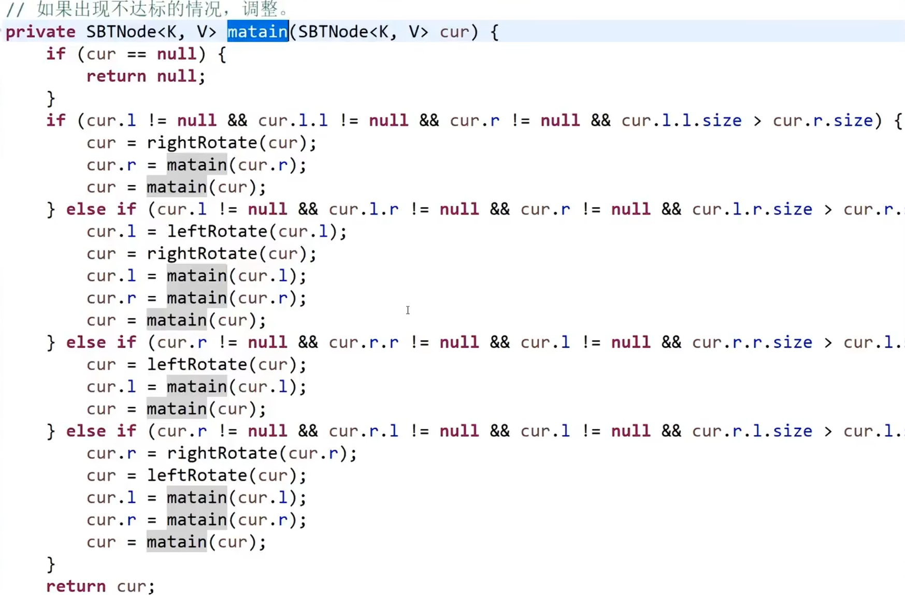


#### 3. 插入（Insert）

SBT 的插入操作分为两步：

1. **标准BST插入**：像普通二叉查找树一样，根据键值大小递归找到插入位置，并创建新节点。
2. **更新与维护**：在递归回溯的过程中，更新路径上所有节点的 `size` 值，并在每个节点上调用 `Maintain` 函数来恢复平衡。

#### 4. 删除（Delete）

关于 SBT 的删除，存在不同的实现方式：

- **方式一（论文标准）**：按照普通 BST 的方式删除节点，**不进行** `Maintain` 平衡维护。发明人陈启峰在其论文中指出，这种删除虽然可能破坏 SBT 的性质，但**不会增加树的高度**，因此不会影响后续操作的效率。
- **方式二（实际应用）**：为了应对大量删除操作后可能出现的性能问题，许多实现会在删除后**主动进行平衡维护**。删除逻辑与普通 BST 类似：
  1. 若待删除节点无左子树或右子树，直接用其存在的子节点替代它。
  2. 若有两个子树，则用其中序**后继**（或前驱）节点的值覆盖当前节点，然后递归删除该后继节点。
  3. 在回溯过程中更新路径上节点的 `size`，并调用 `Maintain` 恢复平衡。

#### 5. 查询排名（Rank & Select）

这是 SBT 相比于其他平衡树的一个显著优势。由于每个节点都存储了子树的大小 `size`，SBT 可以在 `O(log n)` 时间内高效地支持**按值查询排名（Rank）** 和**按排名查询值（Select）** 等动态顺序统计操作


## 红黑树

**红黑树是一种“近似平衡”的二叉搜索树**。它不追求 AVL 那种“绝对高度差 ≤ 1”，而是通过**颜色约束**来保证**任意节点到其叶子节点的路径长度，最多相差 2 倍**。这种“舍去一点查询效率、换取大幅降低插入/删除维护成本”的策略，使其成为工程应用中（如 Java TreeMap、C++ STL map、Linux 内核调度）最广泛使用的平衡树。

------

### 1. 基本概念

- **定义**：红黑树是一棵二叉搜索树，每个节点增加一个存储位表示颜色（Red 或 Black）。通过对任何一条从根到叶子的路径上各个节点着色方式的限制，确保**没有一条路径会比其他路径长出 2 倍**，因而是近似平衡的。
- **发明历史**：由 **Rudolf Bayer** 于 1972 年发明，最初称为“对称二叉 B 树”。1978 年，**Leonidas J. Guibas** 和 **Robert Sedgewick** 为其引入了红/黑颜色标记，并正式命名为红黑树。
- **哲学对比**：
  - **AVL**：严格（高度差 ≤1），查询最快，但插入删除旋转频繁。
  - **红黑树**：宽松（最长≤2倍最短），查询略慢于 AVL，但插入删除旋转次数显著减少。

------

### 2. 树结构（节点与 NIL 哨兵）

红黑树的节点结构通常包含：

- `key`（键值）
- `left` / `right` / `parent`（左右孩子及父指针）
- `color`（颜色，通常用 0/1 或布尔值表示）

**极其重要的特殊点——NIL 哨兵（叶节点）**：
在红黑树中，所有原本为空的指针（叶子节点）都指向一个统一的、特殊的节点，称为 **NIL（或 T.nil）**。

- NIL 节点是**黑色**的。
- NIL 节点没有子节点（或者说它的左右孩子指向自身）。
- **关键规则**：我们在计算路径长度和进行旋转时，**NIL 节点被视为普通的外部叶子节点参与计数**。引入 NIL 后，红黑树不再是“二叉树”，而是一棵“满二叉树”（每个内部节点都有两个子节点，要么是实际节点，要么是 NIL）。

------

### 3. 基本操作

红黑树的基本操作（查找、插入、删除）在第一步都遵循**普通二叉搜索树（BST）** 的逻辑。

- **查找（Search）**：与 BST 完全一致，时间复杂度 **O(log n)**。虽然比 AVL 略高一些（因为树更高），但常数因子较小，实际效率很高。
- **插入（Insert）**：
  1. 按照 BST 规则插入新节点。
  2. **新节点默认着色为红色**（为什么要染红？因为若染黑，会直接破坏“黑色高度一致”这一最难维护的性质，而染红只可能破坏“红节点不相邻”的性质，相对容易修正）。
  3. 调用 **插入修复（Adjust Insert）**。
- **删除（Delete）**：
  1. 按照 BST 规则删除节点（若有两个孩子，用后继覆盖）。
  2. 若被移除的节点是黑色，则必然破坏黑高平衡，调用 **删除修复（Adjust Delete）**。
  3. 删除修复是所有平衡树算法中最复杂的逻辑之一（涉及“双黑”概念）。

------

### 4. 调整策略（红黑树最核心的灵魂）

所有调整的依据是红黑树的**五大性质**：

| 性质       | 内容                                                         |
| :--------- | :----------------------------------------------------------- |
| **性质 1** | 节点是红色或黑色。                                           |
| **性质 2** | 根节点是黑色。                                               |
| **性质 3** | 所有 NIL（叶子）节点是黑色。                                 |
| **性质 4** | **红色节点的两个子节点必须是黑色**（即不能有连续的红节点）。 |
| **性质 5** | 从任一节点到其每个叶子（NIL）的所有路径，包含**相同数量**的黑色节点（即**黑色高度一致**）。 |

#### A. 插入调整（看“叔叔”）

插入的新节点 X 总是**红色**。若父节点 P 是黑色，万事大吉；若 P 是红色（违反性质 4），则需要根据**叔叔节点 U（父节点的兄弟）** 的颜色分三类处理：

1. **情况 1（U 为红色）**：将 P 和 U 变黑，祖父 G 变红，然后将当前节点指向 G，继续向上检查（递归）。
2. **情况 2（U 为黑色，且 X 是“折线”位置，即 LR/RL）**：先绕 P 旋转（左旋或右旋），使其变成“直线”形态，转入情况 3。
3. **情况 3（U 为黑色，且 X 是“直线”位置，即 LL/RR）**：绕祖父 G 旋转（右旋或左旋），然后将 G 变红，P 变黑，调整结束。

> **与 AVL 的区别**：AVL 插入只调一次就停，红黑树插入可能需要**不断向上变色**（情况 1 的循环），但发生旋转（情况 2/3）后即停止，整体旋转次数远少于 AVL。

#### B. 删除调整（看“兄弟”）

删除修复是最复杂的部分。当删除一个黑色节点后，为弥补失去的那一“份”黑色，我们引入**“双黑（Double Black）”**概念，即该节点被视为“欠着黑色”。

假设双黑节点为 X，其兄弟为 S。根据 S 的颜色及其子节点的颜色，分为四大类（核心思想：想办法把多余的黑色往上推，或者通过旋转重新分配黑色）：

- **情况 1（S 为红色）**：将 S 变黑，P 变红，对 P 左旋（或右旋），转化为兄弟为黑色的情况。
- **情况 2（S 为黑色，且 S 的两个孩子都是黑色）**：将 S 变红，双黑 X 上移到父节点 P（让 P 继承“双黑”属性）。
- **情况 3（S 为黑色，S 的靠近 X 的孩子是红色，远离 X 的孩子是黑色）**：在 S 上旋转并交换颜色，转化为情况 4。
- **情况 4（S 为黑色，S 的远离 X 的孩子是红色）**：绕 P 旋转，交换 P 和 S 的颜色，并将 S 的远红孩子变黑，**结束调整**。


## 总结

### 终局对比：AVL vs SBT vs 红黑树

| 维度              | AVL 树                 | SBT           | 红黑树                            |
| :---------------- | :--------------------- | :------------ | :-------------------------------- |
| **平衡标准**      | 高度差 ≤ 1             | Size 侄子约束 | 黑高一致，最长≤2倍最短            |
| **高度上限**      | ~1.44 log n            | ~1.44 log n   | ~2 log n                          |
| **查找效率**      | **最高**               | 高            | 中等（树略高）                    |
| **插入/删除效率** | 低（旋转多）           | 中等          | **最高**（旋转少，变色多）        |
| **调整核心**      | 看“高度”               | 看“Size”      | 看“颜色（叔叔/兄弟）”             |
| **工程应用**      | 数据库索引（读多写少） | 算法竞赛      | **Java HashMap, C++ STL, OS内核** |

**一句话总结**：红黑树用“颜色”的简单标记，换来了在维护平衡时以**变色为主、旋转为辅**的高效操作，是将“绝对平衡”让渡给“近似平衡”的经典工程智慧。如果你的场景是海量数据且插入删除极其频繁，红黑树是优于 AVL 的不二之选。 😊


## 跳表SkipListMap


