# chapter01 Introduce

官网地址：https://www.langchain.com/langchain 

官网文档：https://python.langchain.com/docs/introduction/ 

API文档：[LangChain overview - Docs by LangChain](https://docs.langchain.com/oss/python/langchain/overview)

github地址：https://github.com/langchain-ai/langchain

中文教程：[快速入门 | LangChain 中文文档](https://langchain-doc.cn/v1/python/langchain/quickstart.html#创建并运行代理)

中文API文档：[模型 | LangChain 参考](https://reference.langchain.org.cn/python/langchain/models/)

## LangChain介绍

LangChain是 2022年10月 ，由哈佛大学的 Harrison Chase （哈里森·蔡斯）发起研发的一个开源框架， 用于开发由大语言模型（LLMs）驱动的应用程序。

比如，搭建“智能体”（Agent）、问答系统（QA）、对话机器人、文档搜索系统、企业私有知识库 等。

**简单概括：**
LangChain ≠ LLMs 

LangChain 之于 LLMs，类似 Spring 之于 Java 

LangChain 之于 LLMs，类似 Django、Flask 之于 Python

> 顾名思义，LangChain中的“Lang”是指language，即⼤语⾔模型，“Chain”即“链”，也就 是将⼤模型与外部数据&各种组件连接成链，以此构建AI应⽤程序。


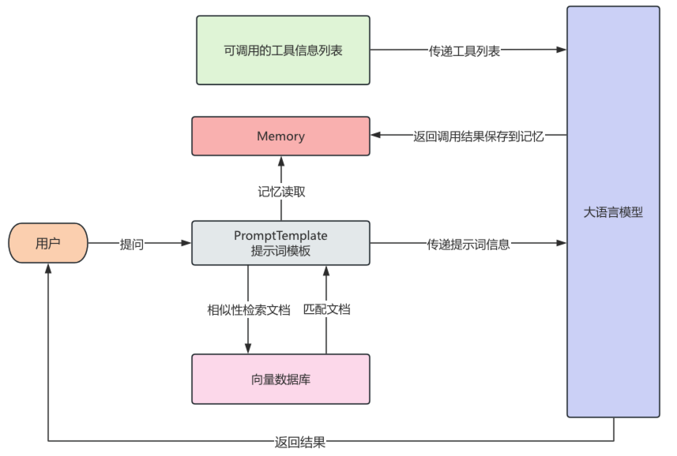

## 开发准备

安装Anaconda（miniconda）

创建虚拟环境

安装langchain：

```bash
pip install langchain
或指定版本 pip install langchain==0.3.7
pip install langchain-community 社区开发包
pip install chromadb 后续需要用的
pip install faiss-cpu 后续要用
```

如果需要使用特定厂商的模型，必须安装该厂商的集成包

```python
pip install langchain-deepseek
pip install langchain-openai
pip install -qU  dashscope  # 通义千问
```

具体需要操作参照：[Chat model integrations - Docs by LangChain](https://docs.langchain.com/oss/python/integrations/chat)


## QuickStart

```python
# 1 系统提示词
SYSTEM_PROMPT = """你是一个通用生活助手"""
# 2 工具
import urllib.error
import urllib.request

from langchain.tools import tool


@tool
def fetch_text_from_url(url: str) -> str:
    """Fetch the document from a URL.
    """
    req = urllib.request.Request(
        url,
        headers={"User-Agent": "Mozilla/5.0 (compatible; quickstart-research/1.0)"},
    )
    try:
        with urllib.request.urlopen(req, timeout=120) as resp:
            raw = resp.read()
    except urllib.error.URLError as e:
        return f"Fetch failed: {e}"
    text = raw.decode("utf-8", errors="replace")
    return text


# 3 模型
import os
import dotenv

dotenv.load_dotenv()

os.environ["OPENAI_API_KEY"] = os.getenv("OPENAI_API_KEY")
os.environ["OPENAI_BASE_URL"] = os.getenv("OPENAI_BASE_URL")
from langchain.chat_models import init_chat_model

model = init_chat_model(
    model="gpt-4o-mini",
    temperature=0.5,
)
 4 添加记忆
from langgraph.checkpoint.memory import InMemorySaver

checkpointer = InMemorySaver()

#%%
# 5 创建智能体
from langchain.agents import create_agent

agent = create_agent(
    model=model,
    tools=[fetch_text_from_url],
    system_prompt=SYSTEM_PROMPT,
    checkpointer=checkpointer,
)
#%%
# 6 调用大模型
question = "什么是Langchain？"

agent_result = agent.invoke(
    input={
        "messages": [
            ("user", question)
        ]
    },
    config={"configurable": {"thread_id": "01"}}
)
#%%
print(agent_result)
print(agent_result["messages"][-1].content)
```


# chapter02 Model I/O

## 1 Model I/O介绍

Model I/O 模块是与语言模型（LLMs）进行交互的 核心组件，在整个框架中有着很重要的地位。

所谓的Model I/O，包括输入提示(Format)、调用模型(Predict)、输出解析(Parse)。分别对应着 Prompt Template ，  Model 和 Output Parser 。

**简单来说，就是输⼊、模型处理、输出这三个步骤。**

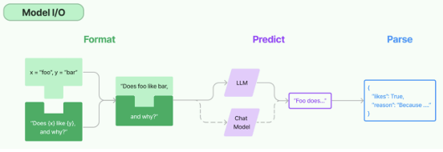

针对每个环节，LangChain都提供了模板和工具，可以快捷的调用各种语言模型的接口

## 2 模型分类与使用

LangChain作为一个“工具”，不提供任何 LLMs，而是依赖于第三方集成各种大模型。比如，将 OpenAI、Anthropic、Hugging Face 、LlaMA、阿里Qwen、ChatGLM等平台的模型无缝接入到你的 应用


### 2.1 模型的不同分类方式

简单来说，就是⽤谁家的API以什么⽅式调⽤哪种类型的⼤模型

**角度1：按照模型功能的不同**

- 非对话模型（LLMs、Text Model）
-  对话模型（Chat Models）（ 推荐）
-  嵌入模型（Embedding Models）( 暂不考虑

**角度2：模型调用时，几个重要参数的书写位置的不同：**

- 硬编码：写在代码文件中
-  使用环境变量 
- 使用配置文件（推荐）


### 2.2 举例

#### 类型1：LLMs(非对话模型)

LLMs，也叫Text Model、非对话模型，是许多语言模型应用程序的支柱。主要特点如下：

- **输入**：接受`文本字符串`或 `PromptValue` 对象
-  **输出**：总是返回 `文本字符`

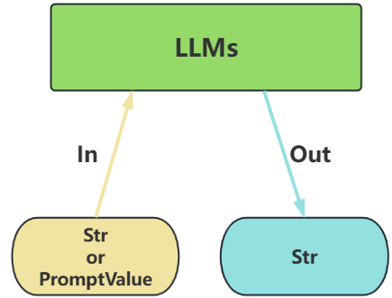

- **不支持多轮对话上下文**。每次调用独立处理输入，无法自动关联历史对话（需手动拼接历史文 本）。
-  **局限性**：无法处理角色分工或复杂对话逻辑。


#### 类型2：Chat Models(对话模型)

ChatModels，也叫聊天模型、对话模型，底层使用LLMs。

**大语言模型调用，以 ChatModel 为主**

主要特点如下：

- **输入**：接收消息列表 List[BaseMessage] 或 PromptValue ，每条消息需指定角色（如 SystemMessage、HumanMessage、AIMessage） 
- **输出**：总是返回带角色的 消息对象（ BaseMessage 子类），通常是 AIMessage

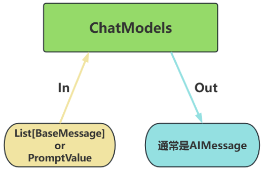

- **原生支持多轮对话**。通过消息列表维护上下文（例如：[SystemMessage, HumanMessage,  AIMessage, ...]），模型可基于完整对话历史生成回复。 
- **适用场景**：对话系统（如客服机器人、长期交互的AI助手）


**区分对话/非对话模型：看输出**


#### 类型3：Embedding Model(嵌入模型)

Embedding Model：也叫文本嵌入模型，这些模型将 文本作为输入并返回 浮点数列表，也就是 Embedding。（后面章节《07-LangChain使用之Retrieval》重点讲）

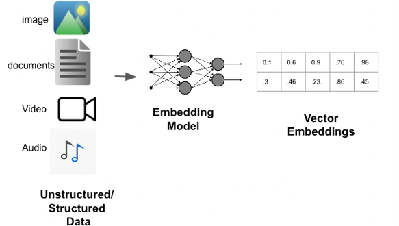

### 2.3 使用

- `OpenAI(...) / ChatOpenAI(...) `：创建一个模型对象（非对话类/对话类）
- ` model.invoke(xxx) `：执行调用，将用户输入发送给模型 
- `.content `：提取模型返回的实际文本内容

模型调用函数使用时需初始化模型，并设置必要的参数。

**1）必须设置的参数：**

- `base_url `：大模型 API 服务的根地址 
- `api_key `：用于身份验证的密钥，由大模型服务商（如 OpenAI、百度千帆）提供 
- `model/model_name` ：指定要调用的具体大模型名称（（如 gpt-4-turbo 、 ERNIE-3.5-8K 等）

**2）其它参数：**

- `temperature` ：温度，控制生成文本的“随机性”，取值范围为0～1。

  - 值越低→ 输出越确定、保守（适合事实回答）

  -  值越高→ 输出越多样、有创意（适合创意写作）

- `max_tokens `：限制生成文本的最大长度，防止输出过长。

#### 2.3.2 模型调用推荐平台：closeai

https://www.closeai-asia.com

需充值

#### 2.3.3 方式1：硬编码

直接将 API Key 和模型参数写入代码，仅适用于临时测试，存在密钥泄露风险，在生产环境**不推荐**。

```python
import dotenv
from langchain_openai import ChatOpenAI

# 调用对话模型：
chat_model = ChatOpenAI(
    #必须要设置的3个参数
    model_name="qwen3.5-flash",  #默认使用的是gpt-3.5-turbo模型
    base_url='https://api.openai-proxy.org/v1',  # 从closeAI复制
    api_key='sk-xaankrkHw6HBWxQiGOXoz15U9cC8PLaD4Dz2utyT6sRj26En'  # 从closeAI复制
)
# 调用模型
response = chat_model.invoke("什么是langchain?")

# 查看响应的文本
print(response.content)
```

#### 2.3.4 方式2：配置环境变量

通过系统环境变量存储密钥，避免代码明文暴露。

pytcharm从Edit Configuration设置Environment variables

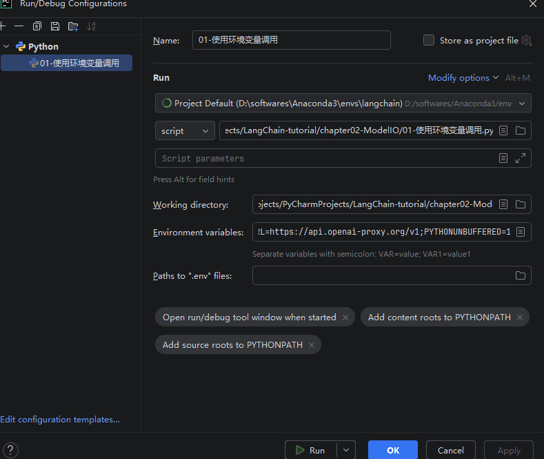

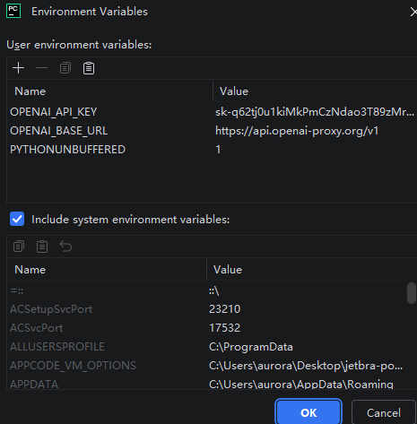

```python
import os
from langchain_openai import ChatOpenAI

# 调用对话模型：
chat_model = ChatOpenAI(
    #必须要设置的3个参数
    model_name="qwen3.5-flash",  #默认使用的是gpt-3.5-turbo模型
    base_url=os.environ["OPENAI_BASE_URL"],  # 从closeAI复制
    api_key=os.environ["OPENAI_API_KEY"] # 从closeAI复制
)
# 调用模型
response = chat_model.invoke("什么是langchain?")
# 查看响应的文本
print(response.content)
```

#### 2.3.5 方式3：使用.env配置文件

使用 ` python-dotenv `加载本地配置文件，支持多环境管理（开发/生产）。

1）安装依赖

`pip install python-dotenv`

2）创建 .env 文件（项目根目录）：

```python
OPENAI_API_KEY="sk-xxxxxxxxx"
OPENAI_BASE_URL="https://api.openai-proxy.org/v1"
```

3）举例

方式1

```python
import os
import dotenv
from langchain_openai import ChatOpenAI

dotenv.load_dotenv()
# 调用对话模型：
chat_model = ChatOpenAI(
    #必须要设置的3个参数
    model_name="qwen3.5-flash",  #默认使用的是gpt-3.5-turbo模型
    base_url=os.getenv("OPENAI_BASE_URL"),  # 从closeAI复制
    api_key=os.getenv("OPENAI_API_KEY") # 从closeAI复制
)
# 调用模型
response = chat_model.invoke("什么是langchain?")

# 查看响应的文本
print(response.content)
```

方式2 给os内部的环境变量赋值(**推荐**)

```python
import os
import dotenv
from langchain_openai import ChatOpenAI

dotenv.load_dotenv()

os.environ["OPENAI_API_KEY"] = os.getenv("OPENAI_API_KEY")
os.environ["OPENAI_BASE_URL"] = os.getenv("OPENAI_BASE_URL")

# 调用对话模型：
chat_model = ChatOpenAI(
    #必须要设置的3个参数
    model_name="qwen3.5-flash",  #默认使用的是gpt-3.5-turbo模型
    # 默认会读取环境变量 OPENAI_API_KEY 和 OPENAI_BASE_URL
)

# 调用模型
response = chat_model.invoke("什么是langchain?")

# 查看响应的文本
print(response.content)
```


#### 2.3.6 通用方式

```python
import os
import dotenv
dotenv.load_dotenv()

os.environ["OPENAI_API_KEY"] = os.getenv("OPENAI_API_KEY")
os.environ["OPENAI_BASE_URL"] = os.getenv("OPENAI_BASE_URL")

from langchain.chat_models import init_chat_model

model = init_chat_model(
    model="openai:gpt-4o-mini",
    temperature=0.5,
    timeout=300,
    max_tokens=25000,
)
```

**安装要求**：

需要安装所选模型提供商的集成包。例如，`pip install langchain-openai`。

**注意：**

model：`"openai:gpt-4o-mini"` 这种格式的字符串被称为**模型标识符（Model Identifier）**。它并不是在某个单一的官方列表里查到的，而是 LangChain 官方约定的一种**统一命名规范**。标准格式是：`"厂商前缀:模型名称"`。

| 厂商前缀             | 对应厂商          | 常见模型示例                   |
| -------------------- | ----------------- | ------------------------------ |
| `openai`             | OpenAI            | gpt-4o, gpt-5, o1, gpt-4o-mini |
| `anthropic`          | Anthropic         | claude-3-opus, claude-sonnet   |
| `google`             | Google (Gemini)   | gemini-2.0-flash, gemini-pro   |
| `deepseek`           | DeepSeek          | deepseek-v3, deepseek-r1       |
| `ollama`             | Ollama (本地模型) | llama3.2, qwen2.5              |
| `qwen` / `dashscope` | 阿里通义千问      | qwen-max, qwen-plus            |

这种 `"厂商:模型"` 的简写方式是 LangChain 为了极大简化代码而提供的“快捷方式”。当你传入这个字符串时，LangChain 会在底层自动帮你实例化对应的模型类（如 `ChatOpenAI`, `ChatAnthropic` 等），并自动读取你环境变量中配置好的对应 API Key。


## 3 模型消息与调用方式

### 3.1 对话模型的Message(消息)

**LangChain有一些内置的消息类型：**

`SystemMessage` ：设定AI行为规则或背景信息。比如设定AI的初始状态、行为模式或对话的总 体目标。比如“作为一个代码专家”，或者“返回json格式”。通常作为输入消息序列中的第一个 传递。

`HumanMessage `：表示来自用户输入。比如“实现 一个快速排序方法”

`AIMessage `：存储AI回复的内容。这可以是文本，也可以是调用工具的请求

`ChatMessage` ：可以自定义角色的通用消息类型

`FunctionMessage/ToolMessage` ：函数调用/工具消息，用于函数调用结果的消息类型

> **注意**：FunctionMessage和ToolMessage分别是在函数调⽤和⼯具调⽤场景下才会使⽤的特殊消息类 型，HumanMessage、AIMessage和SystemMessage才是最常⽤的消息类型。

> **注意：**开发常用的就是`SystemMessage`和`HumanMessage` 。`AI Message`是模型回复的内容。`ChatMessage`几乎不用

**举例1**

```python
from langchain_core.messages import SystemMessage, HumanMessage

system_message = SystemMessage(content="你是一个翻译小助手")
human_message = HumanMessage(content="请将这句话翻译成英文：你好，世界！")

message = [system_message, human_message]

print( message)
```

```python
[SystemMessage(content='你是一个翻译小助手', additional_kwargs={}, response_metadata={}), HumanMessage(content='请将这句话翻译成英文：你好，世界！', additional_kwargs={}, response_metadata={})]
```

```python
response = chat_model.invoke(message)
print(type(response))
print(response.content)
```

> invoke()的输入可以是多种类型：1.字符串类型  2.消息列表
>
> invoke()的输出类型：BaseMessage的子类：AIMessage

**举例2**

```python
from langchain_core.messages import SystemMessage, HumanMessage

system_message = SystemMessage(
    content="你是一个翻译小助手",
    additional_kwargs={
        'tool':"invoke_func1"
    }
)
human_message = HumanMessage(content="请将这句话翻译成英文：你好，世界！")
AIMessage(content='Hello, World!')
message = [system_message, human_message]


print( message)

```

**举例3**

```python
from langchain_core.messages import (
    AIMessage,
    HumanMessage,
    SystemMessage,
    ChatMessage
)
system_message = SystemMessage(content="你是一个专业的数据科学家")
human_message = HumanMessage(content="解释一下随机森林算法")
ai_message = AIMessage(content="随机森林是一种集成学习方法...")
custom_message = ChatMessage(role="analyst", content="补充一点关于超参数调优的信息")
print(system_message.content)
print(human_message.content)
print(ai_message.content)
print(custom_message.content)
```

```python
你是⼀个专业的数据科学家
解释⼀下随机森林算法
随机森林是⼀种集成学习⽅法...
补充⼀点关于超参数调优的信息
```

**举例4 结合大模型使用**（完整使用）

```python
from langchain_openai import ChatOpenAI
from langchain_core.messages import HumanMessage
import os
import dotenv

dotenv.load_dotenv()

os.environ["OPENAI_API_KEY"] = os.getenv("OPENAI_API_KEY")
os.environ["OPENAI_BASE_URL"] = os.getenv("OPENAI_BASE_URL")

# 1.获取对话模型
chat_model = ChatOpenAI(
    model_name="qwen3.5-flash",  #默认使用的是gpt-3.5-turbo模型
)
# 2.组成消息列表
messages = [
    SystemMessage(content="你是一个翻译小助手"),
    HumanMessage(content="请将这句话翻译成英文：你好，世界！")
]
# 3.调用对话模型
response = chat_model.invoke(messages)

# 3.处理响应数据
print(type( response)) #<class 'langchain_core.messages.ai.AIMessage'>
print(response.content)
```

### 3.2 多轮对话与上下文记忆

对于消息列表：

```python
messages = [
    SystemMessage(content="你是一个翻译小助手"),
    HumanMessage(content="请将这句话翻译成英文：你好，世界！"),
    HumanMessage(content="请将这句话翻译成英文：愿所有的美好都被祝福！")
]
```

- 前n-1个消息，不论类型都是作为过程存在的，让ai理解过往的对话内容，**只有最后一个消息才会得到回复**。
- 一条消息列表是一个对话，多个消息列表无记忆继承

### 3.3 模型调用的方法

为了尽可能简化自定义链的创建，我们实现了一个"Runnable"协议。许多LangChain组件实现了  Runnable 协议，包括聊天模型、提示词模板、输出解析器、检索器、代理(智能体)等。

**Runnable 定义的公共的调用方法如下：**

- `invoke`: 处理单条输入，等待LLM完全推理完成后再返回调用结果 
- `stream:` 流式响应，逐字输出LLM的响应结果 
- `batch`: 处理批量输入

这些也有相应的异步方法，应该与 asyncio 的await语法一起使用以实现并发：

- `astream`: 异步流式响应 
- `ainvoke`: 异步处理单条输入 
- `abatch`: 异步处理批量输入 
- `astream_log`: 异步流式返回中间步骤，以及最终响应 
- `astream_events`: （测试版）异步流式返回链中发生的事件（在 langchain-core 0.1.14 中引入）

#### 3.3.1 流式输出与非流式输出

在Langchain中，语言模型的输出分为了两种主要的模式：**流式输出**与**非流式输出**。

- 非流式输出（阻塞式）：这是Langchain与LLM交互时的**默认行为**，是最简单、最稳定的语言模型调用方式。 当用户发出请求后，系统在后台等待模型生成完整响应，然后**一次性将全部结果返回**。
- 流式输出：一种**更具交互感**的模型输出方式，用户不再需要等待完整答案，而是能看到模型**逐个  token**地实时返回内容。
  Langchain 中通过设置 `streaming=True `并配合 回调机制 来启用流式输出。

**举例1：流式stream调用**

```python
import os
import dotenv
from langchain_core.messages import HumanMessage
from langchain_openai import ChatOpenAI

dotenv.load_dotenv()

os.environ["OPENAI_API_KEY"] = os.getenv("OPENAI_API_KEY")
os.environ["OPENAI_BASE_URL"] = os.getenv("OPENAI_BASE_URL")

# 1.获取对话模型
chat_model = ChatOpenAI(
    model_name="gpt-4o-mini",  #默认使用的是gpt-3.5-turbo模型
    streaming=True  # 启用流式输出
)
# 2.组成消息列表
messages = [
    SystemMessage(content="你是一个旅游小助手"),
    HumanMessage(content="给我制定去法国旅游的计划。"),
]
# 3.流式调用对话模型
print("正在生成...")
for chunk in chat_model.stream(messages):
    print(chunk.content, end="", flush=True)# 刷新缓冲区 (无换行符，缓冲区未刷新，内容可能不会立即显示)
print("\n生成完成！")
```

**举例2：Batch调用**

很少用，一般用invoke和stream

```python
import os
import dotenv
from langchain_core.messages import HumanMessage
from langchain_openai import ChatOpenAI

dotenv.load_dotenv()

os.environ["OPENAI_API_KEY"] = os.getenv("OPENAI_API_KEY")
os.environ["OPENAI_BASE_URL"] = os.getenv("OPENAI_BASE_URL")

# 1.获取对话模型
chat_model = ChatOpenAI(
    model_name="gpt-4o-mini",  #默认使用的是gpt-3.5-turbo模型
    streaming=True  # 启用流式输出
)
# 2.组成消息列表
messages1 = [
    SystemMessage(content="你是一个旅游小助手"),
    HumanMessage(content="给我制定去法国旅游的计划。"),
]
messages2 = [
    SystemMessage(content="你是一个翻译小助手"),
    HumanMessage(content="请将这句话翻译成英文：愿所有的美好都被祝福！")
]

# 3.流式调用对话模型
response = chat_model.batch([messages1, messages2])
for res in response:
    print(res.content)
    
```

#### 3.3.3 同步调用与异步调用(了解)

**异步调用**

异步调用，允许程序在等待某些操作完成时继续执行其他任务，而不是阻塞等待。这在处理I/O操作（如 网络请求、文件读写等）时特别有用，可以显著提高程序的效率和响应性。

举例：


### 总结

模型分为三类

- 非对话模型（LLMs、Text Model）
- 对话模型（Chat Models）（ 推荐）
- 嵌入模型（Embedding Models）( 暂不考虑

开发中使用`.env`配置文件设置base_url和api_key

消息列表：`from langchain_core.messages import HumanMessage, SystemMessage`

阻断式调用`invoke`和流式调用`steam`

代码：

```python
import os
import dotenv
from langchain_core.messages import HumanMessage, SystemMessage
from langchain_openai import ChatOpenAI

dotenv.load_dotenv()

os.environ["OPENAI_API_KEY"] = os.getenv("OPENAI_API_KEY")
os.environ["OPENAI_BASE_URL"] = os.getenv("OPENAI_BASE_URL")

# 1.获取对话模型
chat_model = ChatOpenAI(
    model_name="gpt-4o-mini",  #默认使用的是gpt-3.5-turbo模型
    streaming=True  # 启用流式输出
)
# 2.组成消息列表
messages = [
    SystemMessage(content="你是一个旅游小助手"),
    HumanMessage(content="给我制定去法国旅游的计划。"),
]
# 3.流式调用对话模型stream
print("正在生成...")
for chunk in chat_model.stream(messages):
    print(chunk.content, end="", flush=True)# 刷新缓冲区 (无换行符，缓冲区未刷新，内容可能不会立即显示)
print("\n生成完成！")


# 阻断式调用invoke
response = chat_model.invoke(messages)
print(type( response)) #<class 'langchain_core.messages.ai.AIMessage'>
print(response.content)
```


## 4 提示词模版

Prompt Template，通过模板管理大模型的输入。

Prompt Template 是LangChain中的一个概念，接收用户输入，返回一个传递给LLM的信息（即提示 词prompt）。

在应用开发中，固定的提示词限制了模型的灵活性和适用范围。所以，prompt template 是一个 **模板化的字符串**，你可以将**变量插入到模板**中，从而创建出不同的提示。调用时：

- 以**字典**作为输入，其中每个键代表要填充的提示模板中的变量。
- 输出一个 `PromptValue` 。这个 PromptValue 可以传递给 LLM 或 ChatModel，并且还可以转换 为字符串或消息列表。

有几种不同类型的提示模板：

- **PromptTemplate** (主要) ：LLM提示模板，用于生成字符串提示。它使用 Python 的字符串来模板提示。
- **ChatPromptTemplate** (主要) ：聊天提示模板，用于组合各种角色的消息模板，传入聊天模型。 
- **XxxMessagePromptTemplate** ：消息模板词模板，包括：SystemMessagePromptTemplate、 HumanMessagePromptTemplate、AIMessagePromptTemplate、 ChatMessagePromptTemplate等 
- **FewShotPromptTemplate** (主要) ：样本提示词模板，通过示例来教模型如何回答 
- **PipelinePrompt** ：管道提示词模板，用于把几个提示词组合在一起使用。 
- **自定义模板**：允许基于其它模板类来定制自己的提示词模板。

###  4.1 具体使用：PromptTemplate

#### 两种实例化方式

**方式1 ：使用构造方法的方式** 

```python
from langchain_core.prompts import PromptTemplate
# 1. 创建一个PromptTemplate对象
# input_variables和template参数必须填写
prompt_template = PromptTemplate(
    input_variables=["role", "name"],
    template="你是一个{role}, 你的名字是{name}",
)

# 2.填充实例中的变量
prompt = prompt_template.format(role="人工智能专家", name="小张")
print( prompt)
```

**方式2 调用form_template方法 (推荐)**

```py
from langchain_core.prompts import PromptTemplate
# 1. 创建一个PromptTemplate对象
text = "你是一个{role}, 你的名字是{name}"
prompt_template = PromptTemplate.from_template(
    # template="你是一个{role}, 你的名字是{name}"
    template= text
)

# 2.填充实例中的变量
prompt = prompt_template.format(role="人工智能专家", name="小张")
print( prompt)

```

#### partial

方式1 `PromptTemplate`对象的`partial_variables`参数

```python
from langchain_core.prompts import PromptTemplate
# 1. 创建一个PromptTemplate对象
text = "你是一个{role}, 你的名字是{name}"
prompt_template = PromptTemplate.from_template(
    # template="你是一个{role}, 你的名字是{name}"
    template= text,
    partial_variables={"name": "小张"}
)

# 2.填充实例中的变量
prompt = prompt_template.format(role="人工智能专家")
print( prompt)

```

方式2 使用` PromptTemplate.partial() `方法创建部分提示模板

```python
from langchain_core.prompts import PromptTemplate
# 1. 创建一个PromptTemplate对象
text = "你是一个{role}, 你的名字是{name}"
prompt_template = PromptTemplate.from_template(
    # template="你是一个{role}, 你的名字是{name}"
    template= text,
)

# 2.填充实例中的变量
prompt = prompt_template.partial(role="人工智能专家")
prompt = prompt.format(name="小智")
print( prompt)

```

注：

- **`format`** 是**终结性**操作，它生成最终的字符串，流程结束。
- **`partial`** 是**中间性**操作，它生成一个新的、待完善的模板，可以继续赋值。


####  format() 与 invoke()

format()示例见上，返回类型str


invoke()（推荐）：

- 参数：`input：dict`
- 返回值：`langchain_core.prompt_values.StringPromptValue`

```python
from langchain_core.prompts import PromptTemplate
# 1. 创建一个PromptTemplate对象
text = "你是一个{role}, 你的名字是{name}"
prompt_template = PromptTemplate.from_template(
    # template="你是一个{role}, 你的名字是{name}"
    template= text,
)

# 2.填充实例中的变量
prompt = prompt_template.invoke(input={"role": "人工智能专家", "name": "小张"})
print( prompt)
```

以上两种方式均可


#### 结合LLM调用

```python
import os
import dotenv
from langchain_core.prompts import PromptTemplate
from langchain_openai import ChatOpenAI

dotenv.load_dotenv()

os.environ["OPENAI_API_KEY"] = os.getenv("OPENAI_API_KEY")
os.environ["OPENAI_BASE_URL"] = os.getenv("OPENAI_BASE_URL")

# 1.获取对话模型
chat_model = ChatOpenAI(
    model_name="gpt-4o-mini",  #默认使用的是gpt-3.5-turbo模型
    streaming=True,  # 启用流式输出
    temperature=0.7,
    max_tokens = 128
)
# 2.使用提示词模版
text = "请评价{product}的优缺点, 包括{aspect1}和{aspect2}"
prompt_template = PromptTemplate.from_template(
    # template="你是一个{role}, 你的名字是{name}"
    template= text,
)
prompt = prompt_template.invoke(input={"product": "人工智能", "aspect1": "社会层面", "aspect2": "工业层面"})

# 3.流式调用对话模型
print("正在生成...")
for chunk in chat_model.stream(prompt):
    print(chunk.content, end="", flush=True)# 刷新缓冲区 (无换行符，缓冲区未刷新，内容可能不会立即显示)
print("\n生成完成！")

```

#### 总结

1. PromptTemplate如何获取实例
2. 两种特殊结构的使用：partial方法和partial_variables参数
3. 给变量赋值format方法和invoke方法
4. 结合大模型使用


---


### 4.2 ChatPromptTemplate

ChatPromptTemplate是**创建聊天消息列表**的提示模板。它比普通 PromptTemplate 更适合处理多角 色、多轮次的对话场景。

**特点：**

- 支持 **System/Human/AI** 等不同角色的消息模板 
- 对话历史维护

**参数类型：**列表参数格式是tuple类型（role:str content :str 组合最常用）

####  1.两种实例化方式

不论哪种方式创建的ChatPromptTemplate实例，本质上传入的都是消息构成的列表

从调用上讲，不论哪种方式，参数可以是：

字符串类型、字典类型、消息类型、元组构成的列表（最基础，最简单，最常用）、ChatPromptTemplate、消息提示词模版

**构造方法：**

```python
from langchain_core.prompts import ChatPromptTemplate

chat_prompt_template = ChatPromptTemplate(
    messages=[
        ("system", "你是一个AI助手，你的名字是{name}"),
        ("human", "我的问题是：{question}")
    ]
)
prompt = chat_prompt_template.invoke({"name": "小智", "question": "如何使用LangChain?"})
print(prompt)
print(type( prompt))#<class 'langchain_core.prompt_values.ChatPromptValue'>
```

**from_message方法**

```python
from langchain_core.prompts import ChatPromptTemplate

chat_prompt_template = ChatPromptTemplate.from_messages(
    messages=[
        ("system", "你是一个AI助手，你的名字是{name}"),
        ("human", "我的问题是：{question}")
    ]
)
prompt = chat_prompt_template.invoke({"name": "小智", "question": "如何使用LangChain?"})
print(prompt)
print(type( prompt))#<class 'langchain_core.prompt_values.ChatPromptValue'>
```

#### 2. 调用提示词模版的方法：

**invoke()** 返回PromptValue  （推荐）

```python
from langchain_core.prompts import ChatPromptTemplate

chat_prompt_template = ChatPromptTemplate.from_messages(
    messages=[
        ("system", "你是一个AI助手，你的名字是{name}"),
        ("human", "我的问题是：{question}")
    ]
)
prompt = chat_prompt_template.invoke({"name": "小智", "question": "如何使用LangChain?"})
print(prompt)
print(type( prompt))#<class 'langchain_core.prompt_values.ChatPromptValue'>
```

**format** 返回str

```python
prompt = chat_prompt_template.format(name="小智", question="如何使用LangChain?")
```

**format_messages()** 返回 Message的列表

```python
prompt = chat_prompt_template.from_messages({"name": "小智", "question": "如何使用LangChain?"})
```

**from_prompt()** 返回PromptValue，同invoke

```python
prompt = chat_prompt_template.format_prompt(name="小智", question="如何使用LangChain?")
```

PromptValue转换为 **消息列表**或者**字符串**

```python
prompt = chat_prompt_template.format_prompt(name="小智", question="如何使用LangChain?")
# prompt = prompt.to_string()
prompt = prompt.to_messages()
```


#### 3.更丰富的实例化参数类型

两种实例化方式不论哪种方式创建的ChatPromptTemplate实例，本质上传入的都是消息构成的列表

从调用上讲，不论哪种方式，参数可以是：

字符串类型、字典类型、消息类型、元组构成的列表（最基础，最简单，最常用）、ChatPromptTemplate、消息提示词模版

**字符串类型**

```python
chat_prompt_template = ChatPromptTemplate.from_messages(
    messages=[
        "你是什么？"
    ]
)
```

默认是`HumanMessage`

**字典类型**

```python
chat_prompt_template = ChatPromptTemplate.from_messages(
    messages=[
        {"role": "system", "content": "你是一个AI助手，你的名字是{name}"},
        {"role": "human", "content": "我的问题是：{question}"}
    ]
)
```

BaseMessage列表

**消息类型**

必须使用消息提示词模板才可以使用变量，否则仅能使用纯字符串

```python
chat_prompt_template = ChatPromptTemplate.from_messages(
    messages=[
        SystemMessage(content="你是一个AI助手，你的名字是{name}"),
        HumanMessage(content="我的问题是：{question}")
    ]
)
```

BaseMessage列表


#### 4.结合LLM

```python
import os
import dotenv
from langchain_core.prompts import ChatPromptTemplate
from langchain_openai import ChatOpenAI

dotenv.load_dotenv()

os.environ["OPENAI_API_KEY"] = os.getenv("OPENAI_API_KEY")
os.environ["OPENAI_BASE_URL"] = os.getenv("OPENAI_BASE_URL")

# 1.获取对话模型
chat_model = ChatOpenAI(
    model_name="gpt-4o-mini",  #默认使用的是gpt-3.5-turbo模型
    streaming=True,  # 启用流式输出
    temperature=0.7,
    max_tokens = 128
)
# 2.使用提示词模版
chat_prompt_template = ChatPromptTemplate.from_messages(
    messages=[
        ("system", "你是一个AI助手，你的名字是{name}"),
        ("human", "我的问题是：{question}")
    ]
)
prompt = chat_prompt_template.invoke(input={"name": "小智", "question": "如何使用LangChain?"})

# 3.流式调用对话模型
print("正在生成...")
for chunk in chat_model.stream(prompt):
    print(chunk.content, end="", flush=True)# 刷新缓冲区 (无换行符，缓冲区未刷新，内容可能不会立即显示)
print("\n生成完成！")

```

#### 5.插入消息列表：MessagePlaceholder

当你不确定消息提示模板使用什么角色，或者希望在格式化过程中**插入消息列表**时，该怎么办？ 这就需 要使用 MessagesPlaceholder，负责在特定位置添加消息列表。**相当于占位符**

**使用场景：**多轮对话系统存储历史消息以及Agent的中间步骤处理此功能非常有用。

```python
from langchain_core.prompts import ChatPromptTemplate, MessagesPlaceholder

chat_prompt_template = ChatPromptTemplate.from_messages(
    messages=[
        ("system", "你是一个AI助手，你的名字是{name}"),
        MessagesPlaceholder(variable_name="question")
    ]
)
prompt = chat_prompt_template.invoke({
    "name": "小智",
    "question": [
        HumanMessage(content="我的问题是：2的9次方是多少？")
    ]
})
print( prompt)
# res = chat_model.invoke( prompt)
# print(res.content)
```

#### 总结

1. 实例化方式：构造方法和from_messages()
2. 调用提示词模版的方法：invoke()/format/format_messages()/from_prompt()
3. 更丰富的实例化参数类型
4. 结合LLM
5. 插入消息列表：MessagePlaceholder


### 4.3 少量样本示例的提示词模板

在构建prompt时，可以通过构建一个 少量示例列表去进一步格式化prompt，这是一种简单但强大的指 导生成的方式，在某些情况下可以 **显著提高模型性能**。

少量示例提示模板可以由 一组示例或一个负责从定义的集合中选择**一部分示例**的示例选择器构建。

- 前者：使用` FewShotPromptTemplate` 或` FewShotChatMessagePromptTemplate`
- 后者：使用 `Example selectors`(示例选择器)

每个示例的结构都是一个 **字典**，其中**键**是输入变量，**值**是输入变量的值。

---

#### FewShotPromptTemplate

`FewShotPromptTemplate` 用于：

- 构建一个 Prompt，其中包含多个 示例（examples）；
- 自动将这些示例格式化并插入到主 Prompt 中；
- 实现 Few-Shot Prompting 方式，以增强大模型在特定任务（如分类、问答、翻译等）上的表现。

它通常由以下几部分构成：

1. `examples`：少量的人工示例（dict 列表）；
2. `example_prompt`：如何格式化每个示例（使用 `PromptTemplate`）；
3. `prefix`：示例之前的文字说明（可选）；
4. `suffix`：用户真正的问题模板；
5. `input_variables`：最终 suffix 中需要传入的变量。

假设开发一个提取语句城市名称的AI：

```python
from langchain_core.prompts import FewShotPromptTemplate, PromptTemplate

# 几个示例，说明模型该如何输出
examples = [
    {"input": "北京下雨吗", "output": "北京"},
    {"input": "上海热吗", "output": "上海"},
]

# 定义如何格式化每个示例
example_prompt = PromptTemplate.from_template(
    template="现在的输入：{input}\n待会儿的输出：{output}"
)

# 构建 FewShotPromptTemplate
few_shot_prompt = FewShotPromptTemplate(
    examples=examples,
    example_prompt=example_prompt,
    prefix="按示例的格式，输出内容",  # 要放在示例前面的提示词。
    suffix="现在的输入：{input}\n待会儿的输出：",  # 要放在示例后面的提示词。
    input_variables=["input"]  # prefix和suffix中声明的变量，可以在调用时进行注入
)

# 生成最终的 prompt
few_shot_prompt = few_shot_prompt.invoke(input="上海今天雨吗")

res = chat_model.invoke(few_shot_prompt)
print(res.content)
```

#### FewShotChatMessagePromptTemplate

除了FewShotPromptTemplate之外，FewShotChatMessagePromptTemplate是专门为 聊天对话场景设计的少样本（few-shot）提示模板，它继承自 FewShotPromptTemplate ，但针对聊天消息的格式进行了优化。

特点：

- 自动将示例格式化为聊天消息（ HumanMessage / AIMessage 等）
- 输出结构化聊天消息（ List[BaseMessage] ）
- 保留对话轮次结构

```python
from langchain_core.prompts import ChatPromptTemplate, FewShotChatMessagePromptTemplate

# 定义示例数据，用于少样本学习
# 包含输入输出对，展示乘法运算的格式和结果
examples = [
    {"input": "1✖️2", "output": "2"},
    {"input": "2✖️2", "output": "4"},
    {"input": "2✖️4", "output": "8"},
    {"input": "2✖️6", "output": "12"},
]

# 创建示例提示模板，定义了人类提问和AI回答的交互格式
# human消息使用"{input}是多少"的模板
# ai消息使用"{output}"的模板
example_prompt = ChatPromptTemplate.from_messages([
    ("human", "{input}是多少"),
    ("ai", "{output}"),
])

# 创建少样本聊天消息提示模板
# 使用预定义的示例数据和示例提示模板
# 该模板将用于在最终提示中提供上下文示例
few_shot_prompt = FewShotChatMessagePromptTemplate(
    examples=examples,
    example_prompt=example_prompt,
)

# 构建最终的提示模板
# 组合系统角色设定、少样本示例和用户问题
# 系统设定AI为数学奇才，然后添加示例，最后是用户的具体问题
final_prompt = ChatPromptTemplate.from_messages(
    [
        ("system", "你是一名百年一遇的数学奇才"),
        few_shot_prompt,
        ("human", "{input}")
    ])
# 格式化并打印最终提示模板，传入具体问题"3✖️2"
final_prompt = final_prompt.invoke({"input": "3✖️2"})
res = chat_model.invoke(final_prompt)
print(res.content)
```


####  Example selectors(示例选择器)

首先需要安装扩展包：`pip install chromadb`以及`pip install faiss-cpu`

前面FewShotPromptTemplate的特点是，无论输入什么问题，都会包含全部示例。在实际开发中，我们可以根据当前输入，使用示例选择器，从大量候选示例中选取最相关的示例子集。

使用的好处：避免盲目传递所有示例，减少 token 消耗的同时，还可以提升输出效果。

示例选择策略：语义相似选择、长度选择、最大边际相关示例选择等

- 语义相似选择：通过余弦相似度等度量方式评估语义相关性，选择与输入问题最相似的 k 个示例。
- 长度选择：根据输入文本的长度，从候选示例中筛选出长度最匹配的示例。增强模型对文本结构的理解。比语义相似度计算更轻量，适合对响应速度要求高的场景。
- 最大边际相关示例选择：优先选择与输入问题语义相似的示例；同时，通过惩罚机制避免返回同质化的内容。


## 5 输出解析器

语言模型返回的内容通常都是字符串的格式（文本格式），但在实际AI应用开发过程中，往往希望

model可以返回更直观、更格式化的内容，以确保应用能够顺利进行后续的逻辑处理。此时，LangChain提供的输出解析器就派上用场了。

输出解析器（Output Parser）负责获取 model 的输出并将其转换为更合适的格式。这在应用开发中极其重要。

LangChain 输出解析器可参考文档：https://reference.langchain.com/python/langchain_core/output_parsers/

输出解析器是LangChain框架中的重要组件，它的作用是将大语言模型的原始输出内容解析为如JSON、XML、YAML等结构化数据。在LangChain中，输出解析器位于模型和最终数据输出之间，作为数据处理的中间层。通过输出解析器，可以实现如下目的：

- 指定格式输出：将模型的文本输出转换指定格式
- 数据校验：确保输出内容符合预期的格式和类型
- 错误处理：当解析失败时，进行错误修复和重试
- 输出格式提示词：生成对应格式要求的提示词，如要生成JSON的具体描述，可以通过提示词传递给大模型，达到返回特定格式数据的目的

**输出解析器分类**

| 解析器类型           | 适用场景       | 输出格式         |
| -------------------- | -------------- | ---------------- |
| StrOutputParser      | 简单文本输出   | 字符串           |
| JsonOutputParser     | JSON格式数据   | 字典/列表        |
| PydanticOutputParser | 复杂结构化数据 | Pydantic模型对象 |
| ListOutputParser     | 列表数据       | Python列表       |
| DatetimeOutputParser | 时间日期数据   | datetime对象     |
| BooleanOutputParser  | 布尔值输出     | True/False       |

**输出解析器方法**

parse：将大模型输出的内容，格式化成指定的格式返回。

format_instructions：它会返回一段清晰的格式说明字符串，告诉 model 希望输出成什么格式（比如 JSON，或者特定格式）。

 **输出解析器类继承关系**

分析LangChain源码可知，在 LangChain 的类结构中，顶层基类是 `BaseLLMOutputParser`，用于定义所有 LLM 输出解析器的抽象父类。而`BaseTransformOutputParser`是一个泛型类，用于“对模型输出进行转换”，我们常用的 `StrOutputParser`、`ListOutputParser`等均继承自 `BaseTransformOutputParser`。

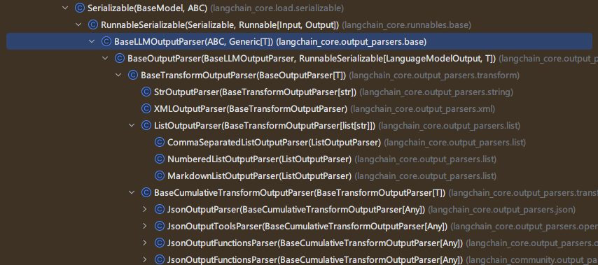

### 字符串解析器

StrOutputParser是LangChain中最简单的输出解析器，它可以简单地将任何输入转换为字符串。从结果中提取content字段转换为字符串输出。

```python
import os
import dotenv
from langchain_openai import ChatOpenAI
dotenv.load_dotenv()

os.environ["OPENAI_API_KEY"] = os.getenv("OPENAI_API_KEY")
os.environ["OPENAI_BASE_URL"] = os.getenv("OPENAI_BASE_URL")

chat_model = ChatOpenAI(
    model="gpt-4o-mini",
    max_tokens=128,

)


from langchain_core.messages import HumanMessage, SystemMessage
from langchain_core.output_parsers import StrOutputParser

# 调用大模型
response = chat_model.invoke("什么是大语言模型？")
print(type( response)) #AIMessage

# 如何获取一个字符串的结果
# 方式1：调用输出结果的content
print(response.content)
# 方式2：使用StrOutputParser
parser = StrOutputParser()
str_response = parser.invoke(response)
print(str_response)
```


### Json 解析器

JsonOutputParser，即JSON输出解析器，是一种用于将大模型的自由文本输出转换为结构化JSON数据的工具。

适合场景：特别适用于需要严格结构化输出的场景，比如 API 调用、数据存储或下游任务处理。

实现方式：

- 用户自己通过提示词指明返回Json格式
- 借助JsonOutputParser的get_format_instructions() ，生成格式说明，指导模型输出JSON 结构

指定提示词指明返回 json 格式

#### 方式1

```python
from langchain_core.output_parsers import JsonOutputParser
from langchain_core.prompts import ChatPromptTemplate

chat_prompt_template = ChatPromptTemplate.from_messages([
    ("system", "你是一个靠谱的{role}"),
    ("human", "{question}")
])

# 正确的：
prompt = chat_prompt_template.invoke(
    input={"role": "人工智能专家", "question": "人工智能用英文怎么说？问题用q表示，答案用a表示，返回一个JSON格式的数据"})

# 错误的：
# prompt = chat_prompt_template.invoke(input={"role":"人工智能专家","question":"人工智能用英文怎么说？"})

response = chat_model.invoke(prompt)
print(response.content)

# 获取一个JsonOutputParser的实例
parser = JsonOutputParser()
json_result = parser.invoke(response)
print(json_result)
```

#### 方式2

```python
# 引入依赖包
from langchain_core.output_parsers import JsonOutputParser
from langchain_core.prompts import PromptTemplate

# 初始化语言模型
chat_model = ChatOpenAI(model="gpt-4o-mini")

joke_query = "告诉我一个笑话。"

# 定义Json解析器
parser = JsonOutputParser()

#以PromptTemplate为例
prompt_template = PromptTemplate.from_template(
    template="回答用户的查询\n 满足的格式为{format_instructions}\n 问题为{question}\n",
    partial_variables={"format_instructions": parser.get_format_instructions()},
)

prompt = prompt_template.invoke(input={"question": joke_query})
response = chat_model.invoke(prompt)
# print(response)

json_result = parser.invoke(response)
print(json_result)
```


### XML 解析器

XMLOutputParser，将模型的自由文本输出转换为可编程处理的 XML 数据。

注意：XMLOutputParser 不会直接将模型的输出保持为原始XML字符串，而是会解析XML并转换成Python字典（或类似结构化的数据）。目的是为了方便程序后续处理数据，而不是单纯保留XML格式。

#### 方式1

```python
chat_model = ChatOpenAI(model="gpt-4o-mini")

actor_query = "周星驰的简短电影记录"
response = chat_model.invoke(f"请生成{actor_query}，将影片附在<movie></movie>标签中")

print(type(response))
print(response.content)
```


#### 方式2

```python
# 1.导入相关包
from langchain_core.output_parsers import XMLOutputParser
from langchain_core.prompts import PromptTemplate
from langchain_openai import ChatOpenAI

# 2. 初始化语言模型
chat_model = ChatOpenAI(model="gpt-4o-mini")

# 3.测试模型的xml解析效果
actor_query = "生成汤姆·汉克斯的简短电影记录,使用中文回复"

# 4.定义XMLOutputParser对象
parser = XMLOutputParser()

# 5. 生成提示词模板
prompt_template1 = PromptTemplate.from_template(
    template="用户的问题：{query}\n使用的格式：{format_instructions}",
    partial_variables={"format_instructions": parser.get_format_instructions()},
)

response = chat_model.invoke(prompt_template1.invoke(input={"query": actor_query}))
print(response.content)

```

### 列表解析器

不常用

利用CommaSeparatedListOutputParser解析器，可以将模型的文本响应转换为一个用逗号分隔的列表（List[str]）

### Pydantic解析器

`PydanticOutputParser` 是 LangChain 输出解析器体系中最常用、最强大的结构化解析器之一。
它与 `JsonOutputParser` 类似，但功能更强 —— 能直接基于 Pydantic 模型 定义输出结构，并利用其类型校验与自动文档能力。 对于结构更复杂、具有强类型约束的需求，`PydanticOutputParser` 则是最佳选择。它结合了Pydantic模型的强大功能，提供了类型验证、数据转换等高级功能，使用示例如下：

```python
from langchain_core.output_parsers import PydanticOutputParser
from langchain_core.prompts import ChatPromptTemplate
from langchain_ollama import ChatOllama
from pydantic import BaseModel, Field, field_validator

class Product(BaseModel):
    """
    产品信息模型类，用于定义产品的结构化数据格式
    属性:
        name (str): 产品名称
        category (str): 产品类别
        description (str): 产品简介，长度必须大于等于10个字符
    """
    name: str = Field(description="产品名称")
    category: str = Field(description="产品类别")
    description: str = Field(description="产品简介")

    @field_validator("description")
    def validate_description(cls, value):
        """
        验证产品简介字段的长度
        参数:
            value (str): 待验证的产品简介文本
        返回:
            str: 验证通过的产品简介文本
        异常:
            ValueError: 当产品简介长度小于10个字符时抛出
        """
        if len(value) < 10:
            raise ValueError('产品简介长度必须大于等于10')
        return value

# 创建Pydantic输出解析器实例，用于解析模型输出为Product对象
parser = PydanticOutputParser(pydantic_object=Product)
# 获取格式化指令，用于指导模型输出符合Product模型的JSON格式
format_instructions = parser.get_format_instructions()

# 创建ChatOllama模型实例，使用qwen3.5:9b模型
model = ChatOllama(model="qwen3.5:9b", reasoning=False, num_predict=128)

# 创建聊天提示模板，包含系统消息和人类消息
prompt_template = ChatPromptTemplate.from_messages([
    ("system", "你是一个AI助手，你只能输出结构化的json数据\n{format_instructions}"),
    ("human", "请你输出标题为：{topic}的新闻内容")
]).partial(format_instructions=format_instructions)

# 将模块链接起来
chain = prompt_template | model | parser

# 调用chain获取结果
result = chain.invoke(input={"topic":"樱桃"})
print(result)
```


## 6 LangChain调用本地模型

Ollama官方地址：https://ollama.com

安装Ollama

- 默认安装在C盘
- 下载地址默认：C:\Users\aurora\.ollama\models

**模型下载：**访问 https://ollama.com/search 可以查看 Ollama 支持的模型。使用命令行可以下载并运行模型

**下载运行**：`ollama run deepseek-r1:7b`

**pycharm中使用**

```python
from langchain_core.messages import HumanMessage
from langchain_ollama import ChatOllama

#此时调用的是本地的大模型。省略base_url、api-key
llm = ChatOllama(
	model="qwen3.5:9b", 
    reasoning=False, 
    num_predict=128, 
    temperature=0.7
)

# response = llm.invoke("你好，请介绍一下你自己！")
# print(response.content)

messages = [
    HumanMessage(content="你好，请介绍一下你自己！")
]

response = llm.invoke(messages)
print(response.content)
```


# chapter03 Chains

## 链式调用

### 什么是链式调用

顾名思义，`LangChain`其核心概念就是`Chain`。 `Chain`翻译成中文就是“链”。用于将多个组件（提示模板、model模型、记忆、工具等）连接起来，形成可复用的工作流，完成复杂的任务。比如我们刚刚实现的问答流程： 用户输入一个问题 --> 发送给大模型 --> 大模型进行推理 --> 将推理结果返回给用户。这个流程就是一个链。

Chain 的核心思想是通过组合不同的模块化单元，实现比单一组件更强大的功能。比如：

- 将model 与Prompt Template （提示模板）结合
- 将model 与输出解析器结合
- 将model 与外部数据结合，例如用于问答
- 将model 与长期记忆结合，例如用于聊天历史记录
- 通过将第一个model 的输出作为第二个model 的输入，…，将多个model按顺序结合在一起

LangChain 链式调用可参考文档：https://reference.langchain.com/python/langchain_core/runnables/

### 基本结构

在LangChain中，一个基本的`Chain`结构主要由三部分构成，分别是提示词模板、大模型和结果解析器（结构化解析器），其数据流向正如下图所示：

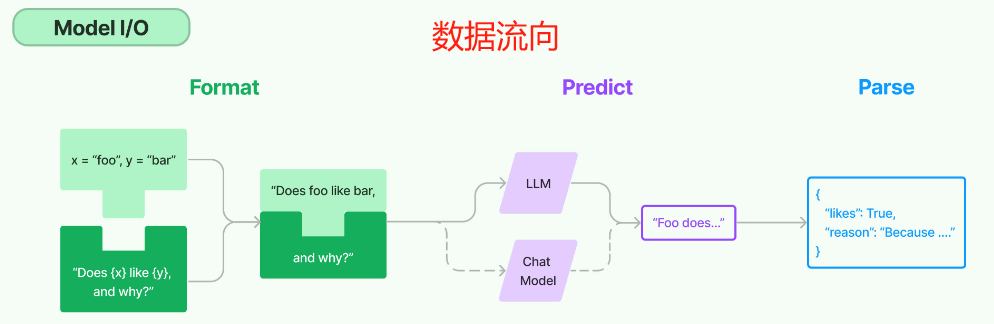

- Prompt：Prompt 是一个 BasePromptTemplate，这意味着它接受一个模板变量的字典并生成一个PromptValue 。PromptValue 可以传递给 model（它以字符串作为输入）或 ChatModel（它以消息序列作为输入）。
- Model：将 PromptValue 传递给 model。如果我们的 model 是一个 ChatModel，这意味着它将输出一个 BaseMessage 。
- OutputParser：将 model 的输出传递给 output_parser，它是一个 BaseOutputParser，意味着它可以接受字符串或 BaseMessage 作为输入。
- chain：我们可以使用 | 运算符轻松创建这个Chain。 | 运算符在 LangChain 中用于将两个元素组合在一起。

## LCEL介绍

### 什么是 LCEL

在现代大语言模型（model）应用的构建中，LangChain 提供了一种全新的表达范式，被称为LCEL（LangChain Expression Language）。它不仅简化了模型交互的编排过程，还增强了组合的灵活性和可维护性。

LCEL，全称为 LangChain Expression Language，是一种专为 LangChain 框架设计的表达语言。它通过一种链式组合的方式，允许开发者使用清晰、声明式的语法来构建语言模型驱动的应用流程。

简单来说，LCEL 是一种“函数式管道风格”的组件组合机制，用于连接各种可执行单元（Runnable）。这些单元包括提示模板、语言模型、输出解析器、工具函数等。

### 设计目的

LCEL 的设计初衷在于：

1. **模块化构建**：将模型调用流程拆解为独立、可重用的组件。
2. **逻辑可视化**：通过语法符号（如管道符 `|`）呈现出明确的数据流路径。
3. **统一运行接口**：所有 LCEL 组件都实现了 `.invoke()`、`.stream()`、`.batch()` 等标准方法，便于在同步、异步或批处理环境下调用。
4. **脱离框架限制**：相比传统的 `Chain` 类和 `Agent` 架构，LCEL 更轻量、更具表达力，减少依赖的“黑盒”逻辑。

### 典型优势

| 特性                       | 描述                                      |
| -------------------------- | ----------------------------------------- |
| 简洁语法                   | 使用                                      |
| 灵活组合                   | 可任意组合 Prompt、模型、工具、函数等组件 |
| 明确边界                   | 每个步骤职责分明，方便调试与重用          |
| 可嵌套扩展                 | 支持函数包装、自定义中间组件和流式拓展    |
| 与 Gradio/FastAPI 集成良好 | 可用于构建 API、UI 聊天等多种场景         |

### Runnable 接口

`Runnable` 是 LangChain 中所有链的通用接口，用于描述“可以执行的数据流节点”。用于构建所有链（Chain）组件。它代表“一个可以调用（运行）的流程单元”，无论是：

- 单个组件（如 prompt、model）
- 一个序列流程（如 prompt → model → parser）
- 并行、多路、多输入多输出的复合结构

只要实现了 `Runnable` 接口，它就可以像函数一样 `.invoke()`，或用管道符 `|` 组合。

在Runnable接口中定义了以下核心方法：

`invoke(input)`：同步执行，处理单个输入，最常用的方法

`batch(inputs)`：批量执行，处理多个输入，提升处理效率

`stream(input)`：流式执行，逐步返回结果，经典的使用场景是大模型是一点点输出的，不是一下返回整个结果，可以通过 `stream()` 方法，进行流式输出

`ainvoke(input)`：异步执行，用于高并发场景。

### 管道运算符

这是 LCEL 最具特色的语法符号。多个 `Runnable` 对象可以通过 `|` 串联起来，形成清晰的数据处理链。例如：

```
prompt | model | parser
```


表示数据将依次传入提示模板、模型和输出解析器，最终输出结构化结果。

### PromptTemplate 与 OutputParser

LCEL 强调组件之间的职责明确，Prompt 只负责模板化输入，Parser 只负责格式化输出，Model 只负责推理。

### Runnable 类继承关系

分析LangChain源码可知，在 LangChain 的类结构中，顶层基类是 `Runnable`，用于定义所有可执行对象的统一接口，实现了把“执行一个逻辑单元”抽象为一个统一的运行单元。包括：

- `invoke(input)`：同步执行
- `ainvoke(input)`：异步执行
- `batch(inputs)`：批量执行
- `stream(input)`：流式输出

而 `RunnableSerializable` 在 `Runnable` 基础上增加 **序列化/反序列化** 能力，作为 LangChain 内部链路的父类基类。

我们常用的Prompt、Parser、LLM 都继承自这个类，因而它们都可以被组合进 Chain / Graph 中。


## Chain的分类和使用

LangChain 的链式调用（Chain）是其核心设计理念，它允许你将多个组件（如提示词、模型、工具、解析器等）像搭积木一样串联起来，形成一个可复用的处理流水线。前一个组件的输出会自动成为下一个组件的输入。

在现代 LangChain 中，推荐使用 **LCEL (LangChain Expression Language)** 来构建链，它通过管道符 `|` 提供了极其简洁的语法，已经完全取代了旧版的 `LLMChain`、`SequentialChain` 等类。

### 基础链

**核心语法**：LCEL 的核心就是使用管道符 `|` 将各个组件连接起来，形成一个 `chain` 对象。

一条最基础的链通常由 **提示词模板 (Prompt)**、**模型 (Model)** 和 **输出解析器 (Output Parser)** 三部分组成。

1. **定义组件**：创建提示词模板、初始化大模型和输出解析器。
2. **构建链**：使用 `|` 将它们串联起来。
3. **调用执行**：使用 `.invoke()` 方法传入参数并获取结果。

```python
from langchain_openai import ChatOpenAI
from langchain_core.prompts import ChatPromptTemplate
from langchain_core.output_parsers import StrOutputParser

# 1. 定义组件
# 提示词模板
prompt = ChatPromptTemplate.from_template("用{style}的风格介绍一下{topic}")
# 大模型
model = ChatOpenAI(model="qwen-plus")
# 输出解析器，将模型输出解析为普通字符串
output_parser = StrOutputParser()

# 2. 构建链
chain = prompt | model | output_parser

# 3. 调用执行
result = chain.invoke({"style": "幽默", "topic": "量子力学"})
print(result)
```

### 分支链

在LangChain中提供了类`RunnableBranch`来完成LCEL中的条件分支判断，它可以根据输入的不同采用不同的处理逻辑，具体示例如下，在下方示例中程序会根据用户输入中是否包含英语、韩语等关键词，来选择对应的提示词进行处理。根据判断结果，再执行不同的逻辑分支。

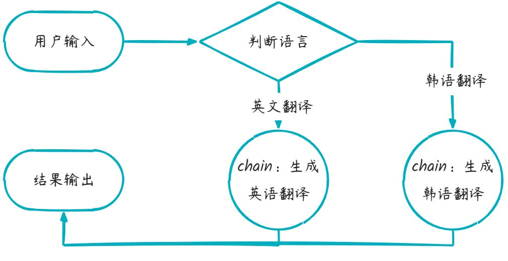

```python
from langchain_core.output_parsers import StrOutputParser
from langchain_core.prompts import ChatPromptTemplate
from langchain_core.runnables import RunnableBranch
from langchain_ollama import ChatOllama
from loguru import logger


def determine_language(inputs):
    """判断语言种类"""
    query = inputs["query"]
    if "日语" in query:
        return "japanese"
    elif "韩语" in query:
        return "korean"
    else:
        return "english"


# 1.初始化Ollama聊天模型，指定使用qwen3.5:9b模型，关闭推理模式
model = ChatOllama(model="qwen3.5:9b", reasoning=False, num_predict=64)
# 2.构建提示词
translate_prompt = ChatPromptTemplate.from_messages([
    ("system", "你是一个{lang}翻译专家，你叫小英"),
    ("human", "{query}")
])
# 3.创建字符串输出解析器，用于处理模型输出
parser = StrOutputParser()

# 创建一个可运行的分支链，根据输入文本的语言类型选择相应的处理流程
# 返回值：
#   RunnableBranch对象，可根据输入动态选择执行路径的可运行链
chain = RunnableBranch(
    (lambda x: determine_language(x) == "japanese", translate_prompt | model | parser),
    (lambda x: determine_language(x) == "korean", translate_prompt | model | parser),
    (translate_prompt | model | parser)
)

# 测试查询
test_queries = [
    {'query': '接下来需要进行翻译并且只需要提供1种翻译结果即可，请你用韩语翻译这句话:"见到你很高兴。"', "lang": "韩语"},
    {'query': '接下来需要进行翻译并且只需要提供1种翻译结果即可，请你用日语翻译这句话:"见到你很高兴。"', "lang": "日语"},
    {'query': '接下来需要进行翻译并且只需要提供1种翻译结果即可，请你用英语翻译这句话:"见到你很高兴。"', "lang": "英语"}
]

for query_input in test_queries:
    # 判断使用哪个提示词
    lang = determine_language(query_input)
    logger.info(f"检测到语言类型: {lang}")
    # 执行链
    result = chain.invoke(query_input)
    logger.info(f"输出结果: {result}\n")

```

结果如下：

```txt
2026-05-09 11:56:38.242 | INFO     | __main__:<module>:48 - 检测到语言类型: korean
2026-05-09 11:56:39.302 | INFO     | __main__:<module>:51 - 输出结果: 안녕히 계세요.

2026-05-09 11:56:39.303 | INFO     | __main__:<module>:48 - 检测到语言类型: japanese
2026-05-09 11:56:40.080 | INFO     | __main__:<module>:51 - 输出结果: お会いできて光栄です。

2026-05-09 11:56:40.081 | INFO     | __main__:<module>:48 - 检测到语言类型: english
2026-05-09 11:56:40.761 | INFO     | __main__:<module>:51 - 输出结果: Nice to meet you.
```

### 串行链

例如我们需要多次调用大模型，将多个步骤串联起来实现功能，**也就是将基础链串起来**,流程如下：

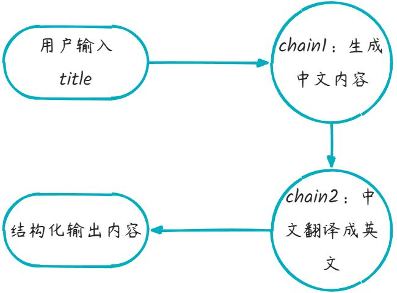

```python
from langchain_core.output_parsers import StrOutputParser
from langchain_core.prompts import ChatPromptTemplate
from langchain_ollama import ChatOllama
from loguru import logger

# 初始化Ollama聊天模型，指定使用qwen3.5:9b模型，关闭推理模式
model = ChatOllama(model="qwen3.5:9b", reasoning=False, num_predict=64)

# 子链1提示词
prompt1 = ChatPromptTemplate.from_messages([
    ("system", "你是一个知识渊博的计算机专家，请用中文简短回答"),
    ("human", "请简短介绍什么是{topic}")
])
# 子链1解析器
parser1 = StrOutputParser()
# 子链1：生成内容
chain1 = prompt1 | model | parser1

# 子链2提示词
prompt2 = ChatPromptTemplate.from_messages([
    ("system", "你是一个翻译助手，将用户输入内容翻译成英文"),
    ("human", "{input}")
])
# 子链2解析器
parser2 = StrOutputParser()
# 子链2：翻译内容
chain2 = prompt2 | model | parser2

# 组合成一个复合 Chain，使用 lambda 函数将chain1执行结果content内容添加input键作为参数传递给chain2
full_chain = chain1 | (lambda content: {"input": content}) | chain2

# 调用复合链
result = full_chain.invoke({"topic": "langchain"})
logger.info(result)
```

结果如下：

```txt
2026-05-09 12:00:39.862 | INFO     | __main__:<module>:34 - LangChain is an open-source framework designed for building applications that connect **large language models (LLMs)** with external data sources (such as documents, databases, and APIs).

Its core functionality enables users to rapidly develop complex LLM-powered applications (e.g., intelligent Q&A bots, agent systems), primarily addressing the
```

### 并行链

在 **Langchain** 中，创建**并行链（Parallel Chains）**，是指**同时运行多个子链（Chain）**，并在它们都完成后汇总结果。这在以下场景中非常有用：

- 同时问多个问题并聚合结果
- 多个 model 同时工作取最优答案
- 多路径推理、多模态处理（如图片+文字）

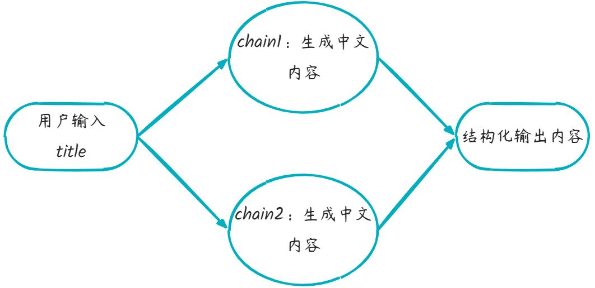

```python
from langchain_core.output_parsers import StrOutputParser
from langchain_core.prompts import ChatPromptTemplate
from langchain_ollama import ChatOllama
from langchain_core.runnables import RunnableParallel
from loguru import logger

# 初始化Ollama聊天模型，指定使用qwen3.5:9b模型，关闭推理模式
model = ChatOllama(model="qwen3.5:9b", reasoning=False, num_predict=64)

# 并行链1提示词
prompt1 = ChatPromptTemplate.from_messages([
    ("system", "你是一个知识渊博的计算机专家，请用中文简短回答"),
    ("human", "请简短介绍什么是{topic}")
])
# 并行链1解析器
parser1 = StrOutputParser()
# 并行链1：生成中文结果
chain1 = prompt1 | model | parser1

# 并行链2提示词
prompt2 = ChatPromptTemplate.from_messages([
    ("system", "你是一个知识渊博的计算机专家，请用英文简短回答"),
    ("human", "请简短介绍什么是{topic}")
])
# 并行链2解析器
parser2 = StrOutputParser()

# 并行链2：生成英文结果
chain2 = prompt2 | model | parser2

# 创建并行链,用于同时执行多个语言处理链
parallel_chain = RunnableParallel({
    "chinese": chain1,
    "english": chain2
})

# 调用复合链
result = parallel_chain.invoke({"topic": "langchain"})
logger.info(result)

```

结果如下：

```txt
2026-05-09 12:03:32.187 | INFO     | __main__:<module>:39 - {'chinese': 'LangChain 是一个开源框架，旨在简化大型语言模型（LLM）应用的开发。它通过提供模块化的组件，帮助开发者轻松构建连接数据源（如文档、API）、管理上下文、执行逻辑推理和创建智能代理的复杂应用，是连接人工智能模型与实际业务场景的关键桥梁。', 'english': 'LangChain is a popular framework for developing applications powered by Large Language Models (LLMs). It simplifies the process of chaining LLM calls, managing context, and connecting to various data sources (like PDFs or databases) to build complex AI workflows such as chatbots and agents.'}
```

## 链式调用进阶用法

### 函数转可执行链

`RunnableLambda` 是 LangChain 的一个包装器，它可以把一个普通的 Python 函数（lambda 或 def） 转换为一个 可执行的链（Runnable）。然后我们就可以像对待模型、Prompt、Parser 一样，把它与其他组件用 `|` 运算符连接。

使用场景：由于每次 AI 生成结果的不确定性，在开发过程中可能需要添加一些自定义节点实现功能，比如 格式化、过滤、映射等操作。例如执行打印函数查看第一阶段生成结果，代码如下：

```python
def clean_text(text):
    return text.strip().lower()

# 在发送给模型前先清理文本
chain = RunnableLambda(clean_text) | prompt | model
result = chain.invoke({"text": "  Hello World  ", "style": "友好"})
```

### 数据透传

`RunnablePassthrough`是一个相对特殊的组件，它的作用是将输入数据原样传递到下一个可执行组件，同时还能对传递的数据进行数据重组。虽然功能简单，但在复杂的 Chain 构建中非常常用，尤其用于 保持输入数据流不中断 或 与并行分支结合。

`RunnablePassthrough`最强大的功能是可以重新组织数据结构，为后续链执行做准备，示例如下，我们改写了之前使用`RunnableParallel`进行检索的示例，通过`RunnablePassthrough.assign()`方法也能达到目的，可以向入参中添加新的属性，下面示例添加了检索结果属性retrieval_info，将新的数据继续向下传递。

```python
from langchain_core.output_parsers import StrOutputParser
from langchain_core.prompts import ChatPromptTemplate
from langchain_core.runnables import RunnablePassthrough
from langchain_ollama import ChatOllama
from loguru import logger


def retrieval_doc(question):
    """模拟知识库检索"""
    logger.info(f"检索器接收到用户提出问题：{question}")
    return "你是一个说话风趣幽默的AI助手，你叫亮仔"


# 设置本地模型，不使用深度思考
model = ChatOllama(model="qwen3:8b", reasoning=False)

# 构建提示词
prompt = ChatPromptTemplate.from_messages([
    ("system", "{retrieval_info}"),
    ("human", "请简短回答{question}")
])
# 创建字符串输出解析器
parser = StrOutputParser()
# 构建链
# 1. 使用 RunnablePassthrough.assign 注入 retrieval_info 字段，
#    实际上是让 `retrieval_doc` 函数在链开始时执行，并将其结果加到 inputs 字典中。
#    即：输入 {"question": "xxx"} -> 输出 {"question": "xxx", "retrieval_info": "你是一个愤怒的语文老师..."}
# 2. 该完整字典被传入 prompt 中生成对话消息
# 3. 然后传入 model 获取回答
# 4. 最后使用 parser 提取字符串输出
chain = RunnablePassthrough.assign(retrieval_info=retrieval_doc) | prompt | model | parser

# 执行链
result = chain.invoke({'question': '你是谁，什么是LangChain'})
logger.info(result)
```


### **多输入：并行获取，汇聚输入**

当后续步骤需要依赖前面多个步骤的输出，或者需要结合原始输入和中间结果时，可以使用字典构建并行分支。

**场景：** 先翻译评论，再结合“原始评论”和“翻译后的评论”生成最终报告。

```python
from langchain_core.runnables import RunnablePassthrough

# 假设 chain1 是翻译链，输入是 review，输出是 translation
# chain1 = prompt_translate | model

# 构建并行结构
# 这里的逻辑是：同时传递原始 review 和经过 chain1 处理后的结果
parallel_chain = {
    "original": RunnablePassthrough(),  # 1. 保留原始输入 (review)
    "translated": chain1                # 2. 并行执行 chain1 (生成 translation)
} | prompt_final | model                # 3. 将 {"original": ..., "translated": ...} 传给下一个提示词

# 调用
result = parallel_chain.invoke("这个产品太棒了！")
```

### **多输出：保留中间结果**

旧版 `SequentialChain` 允许你定义 `output_variables` 以返回中间步骤的结果。在 LCEL 中，你只需要在最后一步将需要的数据组装成一个字典即可。

**场景：** 你希望链式调用结束后，同时返回“翻译结果”和“最终摘要”

```python
# 1. 翻译链
translate_chain = prompt_translate | model | (lambda x: x.content)

# 2. 摘要链 (依赖翻译结果)
summarize_chain = prompt_summary | model | (lambda x: x.content)

# 3. 组合并保留多输出
# 使用 assign (或者字典语法) 来添加新的输出字段，而不是覆盖
full_chain = (
    translate_chain
    | (lambda translation: {"translation": translation}) # 先包装成字典
    | (lambda data: {**data, "summary": summarize_chain.invoke(data["translation"])}) # 计算摘要并合并
)

# 或者更优雅的 LCEL 写法 (使用 RunnablePassthrough.assign)
from langchain_core.runnables import RunnablePassthrough

final_chain = (
    translate_chain 
    | RunnablePassthrough.assign(summary=summarize_chain) # 自动将 summarize_chain 的结果赋值给 summary 键
)

# 输出结果将是一个字典: {'translation': '...', 'summary': '...'}
result = final_chain.invoke("原文...")
```

### **复杂依赖：扇出与扇入**

LCEL 最强大的地方在于可以轻松处理“扇出”（一个输入给多个链）和“扇入”（多个链结果合并给下一个链）。

**场景：** 根据产品名，分别生成“正面评价”和“负面评价”，最后汇总成一封营销邮件。

```python
# 链 A：生成正面评价
chain_positive = prompt_positive | model | (lambda x: x.content)

# 链 B：生成负面评价
chain_negative = prompt_negative | model | (lambda x: x.content)

# 组合链：扇出 -> 扇入
# 1. 扇出：输入 product 同时传给 positive 和 negative 链
# 2. 扇入：将两个结果打包传给 final_prompt
email_chain = {
    "pros": chain_positive,
    "cons": chain_negative
} | prompt_email | model

# 调用
response = email_chain.invoke("超级跑鞋")
```


# Memory记忆存储

## Memory记忆存储

大语言模型本质上是经过大量数据训练出来的自然语言模型，用户给出输入信息，大语言模型会根据训练的数据进行预测给出指定的结果，大语言模型本身是“无状态的”，模型本身是不会记忆任何上下文的，只能依靠用户本身的输入去产生输出。

### 实现原理

实现这个记忆功能，就需要额外的模块去保存我们和模型对话的上下文信息，然后在下一次请求时，把

所有的历史信息都输入给模型，让模型输出最终结果。一个记忆组件要实现的三个最基本功能：

- **读取**记忆组件保存的历史对话信息
- **写入**历史对话信息到记忆组件
- **存储**历史对话消息

在LangChain中，提供这个功能的模块就称为 Memory(记忆) ，用于存储用户和模型交互的历史信息。给大语言模型添加记忆功能的方法如下：

- 在链执行前，将历史消息从记忆组件读取出来，和用户输入一起添加到提示词中，传递给大语言模型。
- 在链执行完毕后，将用户的输入和大语言模型输出，一起写入到记忆组件中
- 下一次调用大语言模型时，重复这个过程。

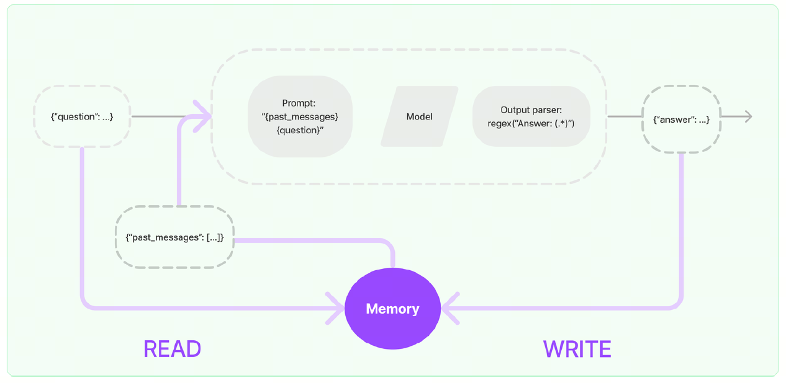

### 实现类介绍

`ConversationChain` 是 LangChain 早期用于简化对话管理的类，内部集成了内存（如 `ConversationBufferMemory`）和提示模板，适合快速构建简单对话应用。然而，它存在以下问题：

1. 灵活性不足：提示模板和内存管理逻辑较为固定，难以支持复杂对话流程。
2. 与新 API 不兼容：未针对现代聊天模型（如支持工具调用的模型）优化。
3. 架构过时：LangChain 0.3.x 开始推崇基于 LangChain Expression Language（LCEL）和 `Runnable` 的模块化设计，`ConversationChain` 不符合这一理念。

`RunnableWithMessageHistory` 是 LangChain 推荐的替代方案，优势包括：

1. 模块化：允许自由组合提示模板、模型和内存管理逻辑。
2. 灵活性：支持自定义对话历史存储（如内存、数据库）和复杂对话流程。
3. 兼容性：与 LCEL 和现代聊天模型无缝集成。
4. 长期支持：在 LangChain 0.3.x 中稳定，且不会在 1.0 中移除。

官方建议：

- 简单聊天：用 `<font style="color:rgba(0, 0, 0, 0.9);background-color:rgba(0, 0, 0, 0.03);">BaseChatMessageHistory</font>` + `<font style="color:rgba(0, 0, 0, 0.9);background-color:rgba(0, 0, 0, 0.03);">RunnableWithMessageHistory</font>`
- 复杂场景：用 LangGraph persistence（Checkpointer + Content Blocks + 记忆中间件）
- **旧版 Memory 类已不推荐**：v0.3.1 起全面进入维护期，未来会移除。

  **短期记忆用 LCEL + RunnableWithMessageHistory**：最简洁、官方标准。

  **长期记忆 / Agent 必须用 LangGraph**：Checkpointer 做会话，Store 做跨会话记忆GitHub。

**新版本**

最新的框架将记忆拆解成了更透明、更贴合 LCEL 管道的三个核心部件：

- `MessagesPlaceholder` (占位符)：在 Prompt 中留个空位。
- `BaseChatMessageHistory` (历史记录库)：专门负责存取聊天记录的“数据库”。
- `RunnableWithMessageHistory` (历史拦截器)：一个极其优雅的包装器，自动帮你把记录塞进 Prompt，并把新回复存进数据库。


## BaseChatMessageHistory简介

`BaseChatMessageHistory`是用来保存聊天消息历史的抽象基类，下面对`BaseChatMessageHistory`的核心属性与方法进行分析：

### 属性

`messages: List[BaseMessage]`：用来接收和读取历史消息的只读属性

### 方法

`add_messages`：批量添加消息，默认实现是每个消息都去调用一次add_message

`add_message`：单独添加消息，实现类必须重写这个方法，否则会抛出异常

`clear()`：清空所有消息，实现类必须重写这个方法

### 常见实现类

分析LangChain源码可知，在 LangChain 的类结构中，顶层基类是 `BaseChatMemory`，用于 控制“什么时候加载记忆、什么时候写入”等核心功能， 是所有“聊天记忆类”的抽象基类，定义了统一接口。其职责不是存储数据，而是 协调数据读写。

而 `InMemoryChatMessageHistory` 是具体实现，定义了 “记忆存在哪、怎么存”

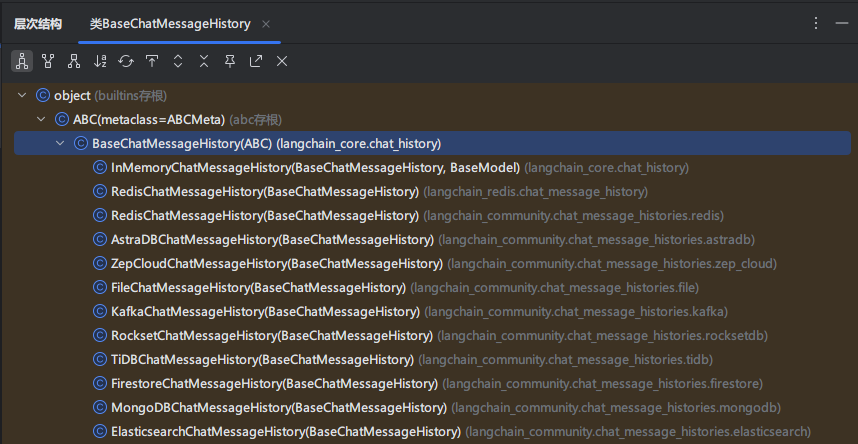

下面是LangChain中常用的消息历史组件以及它们的特性，其中`InMemoryChatMessageHistory`是`BaseChatMemory`默认使用的聊天消息历史组件。

| 组件名称                        | 特性                            |
| ------------------------------- | ------------------------------- |
| InMemoryChatMessageHistory      | 基于内存存储的聊天消息历史组件  |
| FileChatMessageHistory          | 基于文件存储的聊天消息历史组件  |
| RedisChatMessageHistory         | 基于Redis存储的聊天消息历史组件 |
| ElasticsearchChatMessageHistory | 基于ES存储的聊天消息历史组件    |

## 实践使用

### 快速体验

`InMemoryChatMessageHistory` 是 LangChain 中的一个内存型消息历史记录器，用于在对话过程中临时存储 AI 和用户之间的消息记录。接下来通过一个简单的示例演示如果使用：

```python
from langchain_core.chat_history import InMemoryChatMessageHistory
from langchain_ollama import ChatOllama
from loguru import logger

# 初始化Ollama语言模型实例，配置基础URL、模型名称和推理模式
llm = ChatOllama(model="qwen3.5:9b", reasoning=False)

# 创建内存聊天历史记录实例，用于存储对话消息
history = InMemoryChatMessageHistory()

# 添加用户消息到聊天历史记录
history.add_user_message("我叫崔亮，我的爱好是学习")

# 调用语言模型处理聊天历史中的消息
ai_message = llm.invoke(history.messages)

# 记录并输出AI回复的内容
logger.info(f"第一次回答\n{ai_message.content}")

# 将AI回复添加到聊天历史记录中
history.add_message(ai_message)

# 添加新的用户消息到聊天历史记录
history.add_user_message("我叫什么？我的爱好是什么？")

# 再次调用语言模型处理更新后的聊天历史
ai_message2 = llm.invoke(history.messages)

# 记录并输出第二次AI回复的内容
logger.info(f"第二次回答\n{ai_message2.content}")

# 将第二次AI回复添加到聊天历史记录中
history.add_message(ai_message2)

# 遍历并输出所有聊天历史记录中的消息内容
for message in history.messages:
    logger.info(message.content)
```


### LCEL调用

通过 `RunnableWithMessageHistory` 我们可以把任意 `Runnable`包装起来，并结合 `InMemoryChatMessageHistory` 来实现多轮对话。

```python
from langchain_core.chat_history import InMemoryChatMessageHistory
from langchain_core.output_parsers import StrOutputParser
from langchain_core.prompts import ChatPromptTemplate, MessagesPlaceholder
from langchain_core.runnables import RunnableWithMessageHistory, RunnableConfig
from langchain_ollama import ChatOllama
from loguru import logger

# 定义 Prompt
prompt = ChatPromptTemplate.from_messages([
    MessagesPlaceholder(variable_name="history"),  # 用于插入历史消息
    ("human", "{input}")
])
# 初始化Ollama语言模型实例，配置基础URL、模型名称和推理模式
llm = ChatOllama(model="qwen3.5:9b", reasoning=False)
parser = StrOutputParser()
# 构建处理链：将提示词模板、语言模型和输出解析器组合
chain = prompt | llm | parser
# 创建内存聊天历史记录实例，用于存储对话历史
history = InMemoryChatMessageHistory()
# 创建带消息历史的可运行对象，用于处理带历史记录的对话
runnable = RunnableWithMessageHistory(
    chain,
    get_session_history=lambda session_id: history, # 指定会话历史，参数是一个函数
    input_messages_key="input",  # 指定输入键
    history_messages_key="history"  # 指定历史消息键
)
# 清空历史记录
history.clear()
# 配置运行时参数，设置会话ID （固定格式）
config = RunnableConfig(configurable={"session_id": "default"})
# 或者使用字典形式
config = {"configurable":{"session_id": "default"}}
logger.info(runnable.invoke({"input": "我叫崔亮，我爱好学习。"}, config))
logger.info(runnable.invoke({"input": "我叫什么？我的爱好是什么？"}, config))

```

### **记忆窗口裁剪**

记忆裁剪是指在长时间对话中，**有选择地保留、压缩或丢弃部分历史消息**，以保证模型的推理性能和成本可控。`trim_messages` 是 LangChain 中提供的一个**工具函数**，用于从消息列表中**裁剪出“最近 N 条”消息**。它常用于控制记忆窗口（window memory），比如在你使用 `InMemoryChatMessageHistory` 时，想要只保留最近几条历史记录，示例代码如下：

`trim_messages` 函数（通常在 `langchain_core.messages` 中）允许你通过以下几个关键参数来控制截断逻辑：

1. **`max_tokens`**: 保留的消息总 Token 数上限。对于每个消息
2. **`strategy`**: 截断策略。
   - `"first"`: 保留**最早**的消息（丢弃最近的）。
   - `"last"`: 保留**最新**的消息（丢弃最早的，这是聊天机器人最常用的模式）。
3. **`token_counter`**: 用于计算 Token 数量的函数（通常使用模型自带的计数器）。
4. **`include_system`**: 是否强制保留系统提示词（System Message），即使它超过了限制或位于被丢弃的区域。
5. **`allow_partial`**: 是否允许截断单条消息的内容（例如只保留最后半句话）。

示例1：截断消息

```python
from langchain_core.messages import (
    AIMessage,
    HumanMessage,
    BaseMessage,
    SystemMessage,
    trim_messages,
)
import os
import dotenv
from langchain_openai import ChatOpenAI

dotenv.load_dotenv()

os.environ["OPENAI_API_KEY"] = os.getenv("OPENAI_API_KEY")
os.environ["OPENAI_BASE_URL"] = os.getenv("OPENAI_BASE_URL")
model = ChatOpenAI(model="gpt-4o-mini", temperature=0.7)

messages = [
    SystemMessage("you're a good assistant, you always respond with a joke."),
    HumanMessage("i wonder why it's called langchain"),
    AIMessage(
        'Well, I guess they thought "WordRope" and "SentenceString" just '
        "didn't have the same ring to it!"
    ),
    HumanMessage("and who is harrison chasing anyways"),
    AIMessage(
        "Hmmm let me think.\n\nWhy, he's probably chasing after the last "
        "cup of coffee in the office!"
    ),
    HumanMessage("what do you call a speechless parrot"),
]

trimer = trim_messages(
    messages=messages,
    max_tokens=64,
    strategy="last",
    token_counter=model,
    # Most chat models expect that chat history starts with either:
    # (1) a HumanMessage or
    # (2) a SystemMessage followed by a HumanMessage
    start_on="human",
    # Usually, we want to keep the SystemMessage
    # if it's present in the original history.
    # The SystemMessage has special instructions for the model.
    include_system=True,
    allow_partial=False,
)
for message in trimer:
    print(message)
```

示例2：结合LCEL链

```python
from langchain_core.chat_history import InMemoryChatMessageHistory
from langchain_core.runnables.history import RunnableWithMessageHistory
from langchain_core.prompts import ChatPromptTemplate, MessagesPlaceholder
from langchain_core.runnables import RunnableConfig
from langchain_ollama import ChatOllama
from langchain_core.runnables import RunnableLambda
from langchain_core.messages import trim_messages

import os
import dotenv
from langchain_openai import ChatOpenAI

dotenv.load_dotenv()

os.environ["OPENAI_API_KEY"] = os.getenv("OPENAI_API_KEY")
os.environ["OPENAI_BASE_URL"] = os.getenv("OPENAI_BASE_URL")
llm = ChatOpenAI(model="gpt-4o-mini", temperature=0.7)

# 创建提示模板
prompt = ChatPromptTemplate.from_messages([
    MessagesPlaceholder("history"),
    ("human", "{question}")
])

# 存储会话历史
store = {}


def get_session_history(session_id: str) -> InMemoryChatMessageHistory:
    """获取或创建会话历史"""
    if session_id not in store:
        store[session_id] = InMemoryChatMessageHistory()
    return store[session_id]


def trimmer(messages):
    return trim_messages(
        messages=messages,
        max_tokens=64,
        strategy="last",
        token_counter=llm,
        # Most chat models expect that chat history starts with either:
        # (1) a HumanMessage or
        # (2) a SystemMessage followed by a HumanMessage
        start_on="human",
        # Usually, we want to keep the SystemMessage
        # if it's present in the original history.
        # The SystemMessage has special instructions for the model.
        include_system=True,
        allow_partial=False,
    )


# 创建带历史的链
chain = RunnableWithMessageHistory(
    runnable=prompt | RunnableLambda(trimmer) | llm,
    get_session_history=get_session_history,
    input_messages_key="question",
    history_messages_key="history"
)

# 配置
config = RunnableConfig(configurable={"session_id": "demo"})

# 主循环
print("开始对话（输入 'quit' 退出）")
while True:
    question = input("\n输入问题：")
    if question.lower() in ['quit', 'exit', 'q']:
        break

    response = chain.invoke({"question": question}, config)
    print("我的问题：", question)
    print("AI回答:", response.content)

    # 可选：显示当前历史消息数
    history = get_session_history("demo")
    print(f"[当前历史消息数: {len(history.messages)}]")
    print(f"修剪后的消息数：{trimmer(history.messages)}")
```

### Redis存储

使用内存管理消息记录的方式只是临时使用，在实际生产环境都需要持久化的存储数据库。langchain 提供了很多基于其他存储系统的扩展依赖，例如 redis、kafka、MongoDB 等，具体参考官网：https://python.langchain.ac.cn/docs/integrations/memory/。接下来以 redis 为例演示如何持久化存储历史消息。

部署 redis、安装 pip 包

```bash
docker run -d --name redis-stack -p 6379:6379 -p 8001:8001 redis/redis-stack:latest

pip install langchain-redis redis
```


## 项目实践

### 项目描述

基于 LangChain 1.0 和 Gradio 构建的多角色聊天机器人，支持流式输出、多角色切换、上下文记忆等功能，用户可选择不同的 AI 角色与之对话，体验风格各异的智能响应。

我们主要理解 LangChain 相关代码即可，在实际工作中 Gradio 代码通常都是 AI 生成，我们无需花费太多精力研究。

### 实现功能

- 多角色支持（如通用助手、英语老师、段子手等）
- 每个角色拥有独立对话上下文（Memory 隔离）
- 支持流式输出回答，提高响应体验
- 用户界面美观简洁（Gradio 实现）
- 支持提示词模板自定义（PromptTemplate）
- 会话历史记忆与追溯（使用 Memory 模块）

```python
from langchain_core.runnables import RunnableConfig
from langchain_core.prompts import ChatPromptTemplate, MessagesPlaceholder
from langchain_core.runnables.history import RunnableWithMessageHistory
from langchain_core.chat_history import InMemoryChatMessageHistory
import gradio as gr

import os
import dotenv
from langchain_openai import ChatOpenAI

dotenv.load_dotenv()

os.environ["OPENAI_API_KEY"] = os.getenv("OPENAI_API_KEY")
os.environ["OPENAI_BASE_URL"] = os.getenv("OPENAI_BASE_URL")
llm = ChatOpenAI(model="gpt-4o-mini", temperature=0.7)

# 定义不同角色的系统提示语
ROLES = {
    "通用助手": "你是无所不知的 AI 助手。",
    "段子手": "你是脱口秀演员，回答必须带 1 个梗。",
    "英语老师": "你是耐心英语老师，先用英文回答，再给中文翻译。",
    "代码审查员": "你是严格的代码审查员，指出代码问题并给出改进建议。",
}

# 存储会话历史
store = {}
def get_session_history(session_id: str) -> InMemoryChatMessageHistory:
    if session_id not in store:
        store[session_id] = InMemoryChatMessageHistory()
    return store[session_id]


def build_chain(role: str):
    system = ROLES[role]
    prompt = ChatPromptTemplate.from_messages([
        ("system", system),
        MessagesPlaceholder(variable_name="history"),
        ("human", "{question}")
    ])

    return prompt | llm


def chat_fn(message, history, role):
    """
    处理用户的聊天消息，并流式返回响应结果。

    参数:
        message (str): 用户发送的消息内容。
        history (list): 当前对话的历史记录。
        role (str): 当前使用的角色名称。

    生成:
        tuple: 更新后的聊天记录和清空输入框的内容。
    """
    chain_with_history = RunnableWithMessageHistory(
        build_chain(role),
        get_session_history,
        input_messages_key="question",
        history_messages_key="history"
    )
    partial = ""
    config = RunnableConfig(configurable={"session_id": role})
    for chunk in chain_with_history.stream({"question": message}, config):
        partial += chunk.content
        yield history + [
            {"role": "user", "content": message},
            {"role": "assistant", "content": partial}
        ], ""


def switch_role(new_role):
    """
    切换当前角色，并更新显示信息及清空聊天记录。

    参数:
        new_role (str): 新的角色名称。

    返回:
        tuple: 更新后的角色显示文本、清空聊天记录和新的角色状态。
    """
    return f"**当前角色：{new_role}**", [], new_role


# 使用 Gradio 构建 Web 界面
with gr.Blocks(title="多角色聊天") as demo:
    # 初始化当前角色状态为“通用助手”
    current_role_state = gr.State("通用助手")

    # 页面布局：左侧角色选择区，右侧聊天区域
    with gr.Row():
        # 创建角色选择界面列
        # 该代码块负责构建角色选择的UI界面，包括角色标题显示、当前角色状态显示和角色选择按钮
        with gr.Column(scale=1):
            gr.Markdown("### 选择角色")
            current_role_display = gr.Markdown("**当前角色：通用助手**")
            role_buttons = [gr.Button(role, variant="secondary") for role in ROLES.keys()]

        # 创建聊天界面的主区域布局
        # 该区域包含聊天显示区、消息输入框和发送按钮
        with gr.Column(scale=4, elem_classes=["chat-area"]):
            # 聊天机器人组件，用于显示对话历史
            chatbot = gr.Chatbot(label="聊天区", height='70vh')
            # 文本输入框组件，用于用户输入消息
            msg = gr.Textbox(label="输入你的消息", placeholder="请输入...", scale=10)

            # 发送按钮组件，用于提交用户输入的消息
            send_btn = gr.Button("发送", variant="primary")

    # 绑定发送按钮点击事件
    send_btn.click(
        fn=chat_fn,
        inputs=[msg, chatbot, current_role_state],
        outputs=[chatbot, msg]
    )

    # 绑定每个角色按钮的点击事件
    for btn in role_buttons:
        btn.click(
            fn=lambda r=btn.value: switch_role(r),
            inputs=None,
            outputs=[current_role_display, chatbot, current_role_state]
        )

# 启动 Gradio 应用
if __name__ == "__main__":
    demo.launch()

```


# Tool工具调用

## 介绍

### 为什么需要 Tool

虽然大模型具备强大的语言理解和生成能力，但它本质上是静态的、不可交互的。比如：

- 不具备访问数据库、调用 API 的能力
- 不能执行代码或文件操作
- 无法实时访问互联网或动态数据等

通过 Tool（工具）机制，可以让模型具备“调用外部函数”的能力，使其能够与外部系统、API 或自定义函数交互，从而完成仅靠文本生成无法实现的任务。例如：

- 实时访问外部世界（如天气、股票、网页等）
- 调用计算函数（数学、单位换算）
- 查询数据库或搜索文档
- 实现“多轮决策”流程（如规划任务、搜索后总结）

### Function calling 介绍

Function Calling 最早是 OpenAI 在其 API 中引入的一项功能，允许开发者将大语言模型（如 GPT-4）与外部函数或工具集成。通过 Function Calling，模型可以理解用户请求并生成调用外部函数所需的参数，从而实现更复杂、更动态的任务处理。

简单来说，Function calling让大语言模型拥有了调用外部接口的能力，使用这种能力，大模型能做一些比如实时获取天气信息、发送邮件等和现实世界交互的事情。

### Function calling 原理

在发送信息给大模型的时候，携带着“工具”列表，这些工具列表代表着大模型能使用的工具。当大模型遇到用户提出的问题时，会先思考是否应该调用工具解决问题，如果需要调用工具，和普通消息不同，这种情况下会返回“function_call”类型的消息，请求方根据返回结果调用对应的工具得到工具输出，然后将之前的信息加上工具输出的信息一起发送给大模型，让大模型整合起来综合判断给出结果。

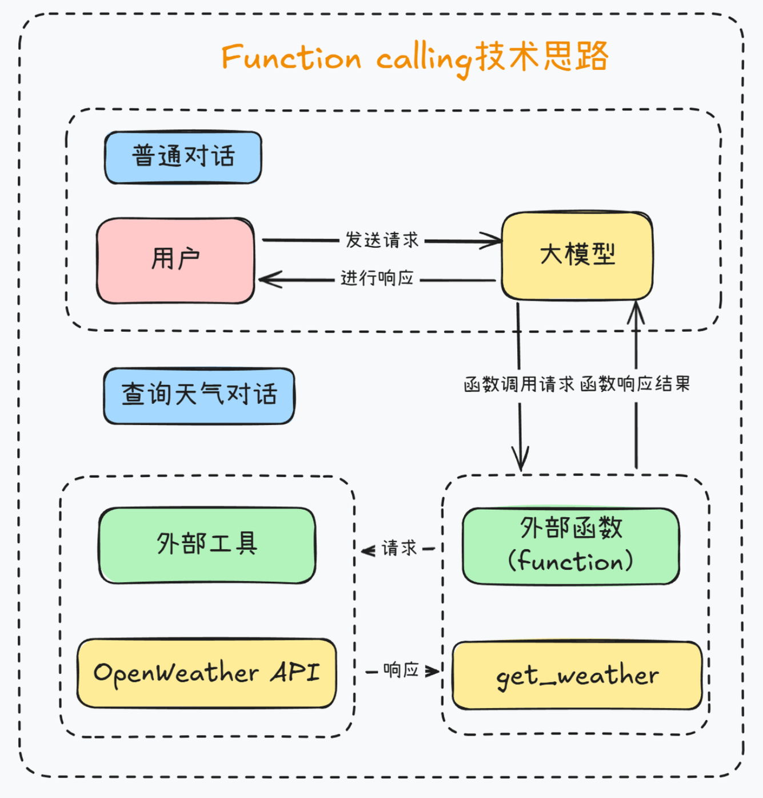

### Tool 工作原理

工具的工作流程如下：

1. 定义工具：指定工具的名称、描述和执行逻辑（函数或类）。
2. 注册工具：将工具提供给代理或链，代理根据任务描述选择工具。
3. 调用工具：代理生成工具调用的指令（包括输入参数），工具执行并返回结果。
4. 处理结果：代理或链将工具输出整合到工作流中，生成最终响应。

工具的核心依赖：

- 工具描述：帮助代理理解工具的功能和适用场景。
- 输入解析：确保工具能正确处理代理提供的输入。
- 输出格式：工具返回的结果应与代理或链的期望兼容。

### Tool 类继承关系

分析LangChain源码可知，在 LangChain 的类结构中，tool 的顶层基类是 `Runnable`，定义可执行的对象，实现了通用的执行接口。然后又通过 `Serializable` 提供 LangChain内部的可序列化能力，从而实现了允许工具、链、模型被保存或导出，供后续加载。最后通过 `BaseTool` 定义工具的统一规范 ，实现了同步 / 异步支持，参数校验等功能。

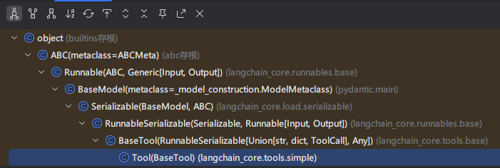

## 使用内置 Tool

在MCP爆火之前，LangChian生态中就已经内置集成了非常多的实用工具，开发者可以快速调用这些工具完成更加复杂工作流的开发。

LangChain内置工具列表：https://docs.langchain.com/oss/python/integrations/tools

LangChain提供了多种内置工具，大致可分为以下几类：

1. 搜索工具：如Google搜索、维基百科搜索等
2. 数据库工具：SQL查询、向量数据库操作等
3. API工具：与外部API交互的工具
4. 文件工具：读写文件、处理文档等
5. 数学工具：执行数学计算的工具
6. 编程工具：执行代码、Shell命令等

每种工具都专注于解决特定类型的问题，让模型能够根据需要选择最合适的工具。

下面用 LangChain官方内置 `PythonREPLTool` 实现基于大语言模型的代码生成和执行系统，主要功能是让模型生成Python代码并自动执行。参考文档：https://docs.langchain.com/oss/python/integrations/tools/python

代码实现如下：

```python
from langchain_core.output_parsers import StrOutputParser
from langchain_experimental.utilities import PythonREPL
from langchain_core.prompts import ChatPromptTemplate
from langchain_core.runnables import RunnableLambda
from langchain_ollama import ChatOllama
from loguru import logger


def debug_print(x):
    """
    调试打印函数，用于在链式调用中输出中间结果

    参数:
        x: 任意类型的输入值，将被打印并原样返回

    返回值:
        与输入值x相同的值
    """
    logger.info(f"中间结果:{x}")
    return x


# 创建Python REPL工具实例，用于执行生成的Python代码
tool = PythonREPL()

# 初始化Ollama语言模型，使用qwen3:8b模型
llm = ChatOllama(model="qwen3:8b", reasoning=False)

# 定义聊天提示模板，包含系统指令和用户问题占位符
prompt = ChatPromptTemplate.from_messages(
    [
        ("system", "你只返回纯净的 Python 代码，不要解释。代码必须是单行或多行 print。"),
        ("human", "{question}")
    ]
)

# 创建调试节点，用于在链式调用中插入调试信息输出
debug_node = RunnableLambda(debug_print)

# 创建字符串输出解析器，用于解析模型输出
parser = StrOutputParser()

# 构建处理链：提示模板 -> 语言模型 -> 调试输出 -> 输出解析 -> 代码执行
chain = prompt | llm | debug_node | parser | RunnableLambda(lambda code: tool.run(code))

# 执行链式调用，计算1到100的整数总和
result = chain.invoke({"question": "计算1到100的整数总和"})
logger.info(result)
```

## 自定义Tool

Tool 工具机制的思想比较简单，他允许用户以AP接口的形式给大模型提供额外的帮助。当本地应用跟大模型聊天时，除了告诉大模型问题，同时也告诉他，本地应用能够提供哪些工具(比如查询今天的日期。这样大模型会对问题进行综合判断，当单行觉得需要使用某些工具帮助解决问题时，就会向本地应用返回一个需要调用工具的请求。然后本地应用就可以执行工具，并将工具的执行结果返回给大模型。大摸型再结合工具的执行结果，给出一个完整的答案。这样就可以让八大模型强大的知识推理能力和本地应用的私有业务能力形成良好的互动。

### 自定义 Tool 方式

- 第1种：使用`@tool`装饰器（自定义工具的最简单方式）

> 装饰器默认使用函数名称作为工具名称，但可以通过参数name_or_callable 来覆盖此设置。
>
> 同时，装饰器将使用函数的文档字符串作为工具的描述，因此函数必须提供文档字符串。

- 第2种：使用`StructuredTool.from_function`类方法

> 这类似于@tool 装饰器，但允许更多配置和同步/异步实现的规范。

### Tool 常用属性

| 属性             | 类型               | 描述                                                         |
| ---------------- | ------------------ | ------------------------------------------------------------ |
| name             | str                | 必选，在提供给LLM或Agent的工具集中必须是唯一的。             |
| name_or_callable | str                | 可选，自定义函数名称                                         |
| description      | str                | 可选但建议，描述工具的功能。LLM或Agent将使用此描述作为上下文，使用它确定工具的使用 |
| args_schema      | Pydantic BaseModel | 可选但建议，可用于提供更多信息（例如，few-shot示例）或验证预期参数。 |
| return_direct    | boolean            | 仅对Agent相关。当为True时，在调用给定工具后，Agent将停止并将结果直接返回给用户。 |

### @tool装饰器实现

定义了一个名为add_number的工具函数，用于执行两个整数相加操作。主要功能包括：

- 使用Pydantic定义参数模型FieldInfo，指定两个整数参数a和b
- 通过@tool装饰器将函数注册为LangChain工具，绑定参数schema
- 打印工具的元信息（名称、参数、描述等）
- 调用工具执行加法运算并输出结果

```python
from langchain_core.tools import tool
from loguru import logger
from pydantic import BaseModel, Field


class FieldInfo(BaseModel):
    """
    定义加法运算所需的参数信息
    """
    a: int = Field(description="第1个参数")
    b: int = Field(description="第2个参数")

# 通过args_schema定义参数信息，也可以定义name、description、return_direct参数
@tool(name_or_callable="add", args_schema=FieldInfo)
def add_number(a: int, b: int) -> int:
    """
    两个整数相加
    """
    return a + b


# 打印工具的基本信息
logger.info(f"name = {add_number.name}")
logger.info(f"args = {add_number.args}")
logger.info(f"description = {add_number.description}")
logger.info(f"return_direct = {add_number.return_direct}")

# 调用工具执行加法运算
res = add_number.invoke({"a": 1, "b": 2})
logger.info(res)
```


### StructuredTool实现

`StructuredTool.from_function` 类方法提供了比@tool 装饰器更多的可配置性，而无需太多额外的代码。

```python
from langchain_core.tools import StructuredTool
from loguru import logger
from pydantic import BaseModel, Field


class FieldInfo(BaseModel):
    """
    定义加法运算所需的参数信息
    """
    a: int = Field(description="第1个参数")
    b: int = Field(description="第2个参数")


def add_number(a: int, b: int) -> int:
    """
    两个整数相加
    """
    return a + b


func = StructuredTool.from_function(
    func=add_number,
    name="Add",
    description="两个整数相加",
    args_schema=FieldInfo
)
logger.info(f"name = {func.name}")
logger.info(f"description = {func.description}")
logger.info(f"args = {func.args}")

res = func.invoke({"a": 1, "b": 2})
logger.info(res)

```

### 调用工具过程使用与分析

大模型会自动分析用户需求，判断是否需要调用指定工具。

如果模型认为需要调用工具（如 MoveFileTool ），返回的 message 会包含

- content : 通常为空（因为模型选择调用工具，而非生成自然语言回复）。
- additional_kwargs : 包含工具调用的详细信息：

如果模型认为无需调用工具（例如用户输入与工具无关），返回的 message 会是普通文本回复

**举例1**：大模型分析出来需要调用tool，但是没有执行

```python
# 1.定义大模型
import os
import dotenv
from langchain_openai import ChatOpenAI

dotenv.load_dotenv()

os.environ["OPENAI_API_KEY"] = os.getenv("OPENAI_API_KEY")
os.environ["OPENAI_BASE_URL"] = os.getenv("OPENAI_BASE_URL")
llm = ChatOpenAI(model="gpt-4o-mini", temperature=0.7)
# 2.获取工具列表
from langchain_community.tools import MoveFileTool
from langchain_core.messages import HumanMessage
from langchain_core.utils.function_calling import convert_to_openai_function

# 3.定义工具
tools = [MoveFileTool()]

# 4.这里需要将工具转换为openai函数，后续再将函数传入模型调用
functions = [convert_to_openai_function(tool) for tool in tools]

# 5.提供大模型调用的消息列表
messages = [HumanMessage(content="请将文件test.txt从当前文件夹移动到桌面")]

# 6.调用大模型
res = llm.invoke(input=messages, functions=functions)
print(res)
```

**举例2：**真正的执行tool

说明：

- 大模型与Agent的核心区别：是否涉及到工具的调用
- 针对于大模型，仅能分析出要调用的工具，但是此工具不能真正的执行。
  针对于Agent：除了能分析出调用工具外，还可以执行具体的工具。

```python
# 1.定义大模型
import os
import dotenv
from langchain_openai import ChatOpenAI

dotenv.load_dotenv()

os.environ["OPENAI_API_KEY"] = os.getenv("OPENAI_API_KEY")
os.environ["OPENAI_BASE_URL"] = os.getenv("OPENAI_BASE_URL")
llm = ChatOpenAI(model="gpt-4o-mini", temperature=0.7)
# 2.获取工具列表
from langchain_community.tools import MoveFileTool
from langchain_core.messages import HumanMessage
from langchain_core.utils.function_calling import convert_to_openai_function

# 3.定义工具
tools = [MoveFileTool()]

# 4.这里需要将工具转换为openai函数，后续再将函数传入模型调用
functions = [convert_to_openai_function(tool) for tool in tools]

# 5.提供大模型调用的消息列表
messages = [HumanMessage(content="请将文件test.txt从当前文件夹移动到桌面C:\\Users\\aurora\Desktop")]

# 6.调用大模型
res = llm.invoke(input=messages, functions=functions)
print(res)

import json

if "function_call" in res.additional_kwargs:
    tool_name = res.additional_kwargs["function_call"]["name"]
    tool_args = json.loads(res.additional_kwargs["function_call"]["arguments"])
    print(f"调用工具{tool_name}，参数为{tool_args}")
else :
    print(f"模型回复：{res.content}")
    
    
if "move_file" in res.additional_kwargs["function_call"]["name"]:
    tool = MoveFileTool()
    res = tool.run(tool_args)
```


# Agent智能体

## Agent 介绍

Langchain 中的 Tool 和 Agent 是两个不同层次的概念，各自承担不同的职责

### Tool：工具 = 能力的封装

Tool 是一个可调用的函数，它封装了一个具体的能力，比如：

- 调用搜索引擎
- 查询数据库
- 运行 Python 代码
- 调用 API

Tool 本身没有决策能力，它只是被动地等待被调用。

### Agent：决策者 = 如何使用这些能力

Agent 是一个决策引擎，它的作用是：

- 决定什么时候调用哪个 Tool
- 根据上下文决定下一步做什么
- 处理 Tool 返回的结果并决定是否需要继续调用其他 Tool

Agent 的核心是 推理 + 行动（Reason + Act），也就是 ReAct 模式。

### 为什么有了 Tool 还需要 Agent

| 场景                                                         | Tool 能否解决？                          | Agent 的作用                                 |
| ------------------------------------------------------------ | ---------------------------------------- | -------------------------------------------- |
| 用户问：“北京现在的天气怎么样？”                             | ✅ 直接调用天气 Tool 就行                 | ❌ 不需要 Agent                               |
| 用户问：“帮我订一张明天从北京到上海的机票，并且查一下上海的天气” | ❌ Tool 无法决定先订票还是先查天气        | ✅ Agent 会推理：先订票 → 再查天气 → 组合结果 |
| 用户问：“我有一份 PDF，帮我总结一下，然后把总结发到我的邮箱” | ❌ 需要多个 Tool（PDF读取、总结、发邮件） | ✅ Agent 会按顺序调用多个 Tool                |

### Tool 与 Agent 关系

| 对象  | 角色        | 示例                            |
| ----- | ----------- | ------------------------------- |
| Tool  | 能力组件    | 数据查询、Python计算、API调用等 |
| Agent | 大脑/决策者 | 判断使用哪个 tool、如何组合使用 |

- Tool 就像“工具箱里的螺丝刀、锤子”
- Agent 就像“一个有判断力的工匠”，他知道什么时候用螺丝刀，什么时候用锤子，甚至知道先用螺丝刀再用锤子。

### Agent 工作原理

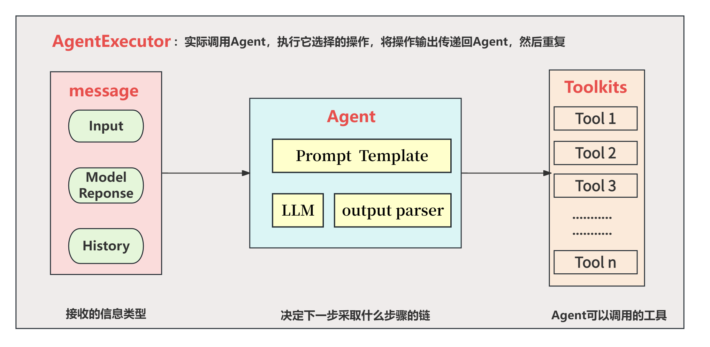

代理的工作流程可以分为以下步骤：

1. 输入解析：语言模型分析用户输入，理解任务目标。

2. 推理规划：

   - 使用推理框架（如 ReAct）生成操作计划。

   - 决定是否调用工具、调用哪些工具以及调用顺序。

3. 工具调用：

   - 根据推理计划调用工具，传递输入并获取结果。

   - 工具结果反馈给语言模型。

4. 迭代推理：

   - 语言模型根据工具结果更新推理，可能触发更多工具调用。

   - 循环直到任务完成或达到终止条件。

5. 输出生成：

   - 语言模型综合所有信息，生成最终答案。

代理通常基于以下推理框架：

- ReAct（Reasoning + Acting）：结合推理和行动，模型在每次迭代中思考（生成推理）并执行（调用工具）。
- OpenAI Functions：利用 OpenAI 的函数调用能力，结构化工具调用。
- Plan-and-Execute：先规划完整步骤，再逐一执行。

在LangChain的Agents实际架构中，Agent的角色是接收输入并决定采取的操作，但它本身并不直接执行这些操作。这一任务是由AgentExecutor来完成的。将Agent（决策大脑）与AgentExecutor（执行操作的Runtime）结合使用，才构成了完整的Agents（智能体），其中AgentExecutor负责调用代理并执行指定的工具，以此来实现整个智能体的功能。这也就是为什么create_tool_calling_agent需要通过AgentExecutor才能够实际运行的原因。当然，在这种模式下，AgentExecutor的内部已经自动处理好了关于我们工具调用的所有逻辑，其中包含串行和并行工具调用的两种常用模式。

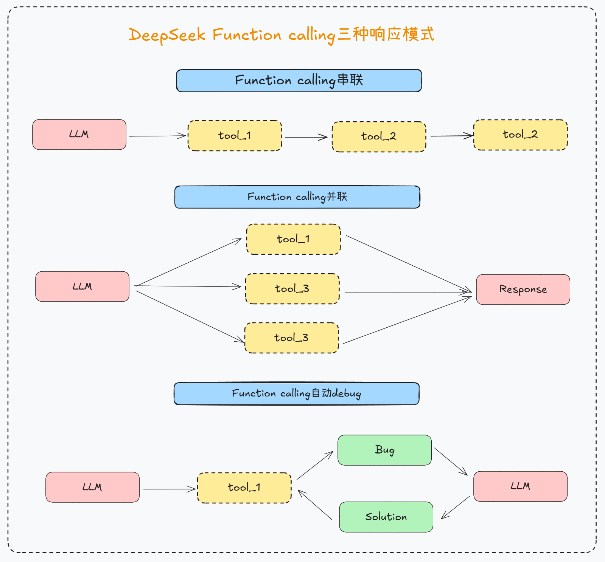

## Agent实现

教程：[代理 - LangChain 文档 - LangChain 教程](https://docs.langchain.org.cn/oss/python/langchain/agents)

### 创建Agent

方法1


方法2
