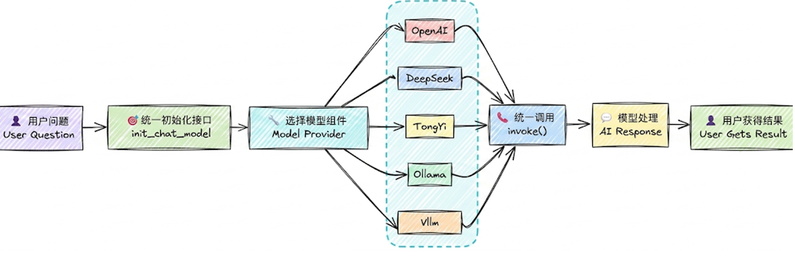

# Langchain家族

LangChain 家族已经从一个单一的框架发展为一个围绕智能体（Agent）全生命周期的完整生态系统。以下是这四大支柱的基本概念、主要作用以及它们之间的关系：

### **1. 基本概念与主要作用**

- **LangChain（基础开发框架）**
  - **基本概念**：LangChain 是整个生态的起点和基石，可以理解为“智能体的操作系统内核”或“标准装修”。
  - **主要作用**：提供大模型应用开发的基础能力，包括统一的模型接口（屏蔽不同模型的差异）、工具调用、数据加载、中间件等模块化组件。它主打链式（Chain）结构，帮助开发者快速搭建基础的 LLM 应用。
- **LangGraph（流程编排引擎）**
  - **基本概念**：LangGraph 是 LangChain 生态中的运行时编排层，可以类比为“神经网络的连接方式”或“毛坯房”。
  - **主要作用**：专为复杂工作流设计，通过有向图（Graph）结构（节点、边、状态）来管理智能体的任务流与状态。它擅长处理非线性、有状态的复杂场景，支持多智能体协作、人机回环（Human-in-the-loop）以及持久执行等高级特性。
- **Deep Agents（高级智能体框架）**
  - **基本概念**：Deep Agents 是 LangChain 的新成员，定位为“智能体外骨骼（Agent Harness）”或“精装房”。
  - **主要作用**：构建于 LangGraph 之上，旨在快速打造对标工业级的复杂自主智能体。它内置了四大核心能力：任务自动规划（To-do List）、虚拟文件系统（防止上下文溢出）、子智能体派遣（隔离上下文）以及跨会话的长期记忆。
- **LangSmith（可观测性与评估平台）**
  - **基本概念**：LangSmith 是 LangChain 官方推出的 DevOps 平台，相当于整个生态的“运营后台”或“质量监控中心”。
  - **主要作用**：它不参与应用的具体开发，而是覆盖应用的全生命周期。提供全链路追踪（可视化查看每一步的执行）、性能监控、自动化评估（测试提示词和模型表现）、以及部署管理。它让 AI 应用从“黑盒”变为“透明玻璃盒”。

### **2. 四者的关系**

这四者并非互斥，而是层层递进、分工明确的“黄金组合”，共同构成了 LLM 应用开发的闭环体系：

- **底层构建与上层抽象的关系**：
  LangChain 提供基础构建块；LangGraph 是 LangChain 的超集，在其之上增加了图结构和状态管理，用于处理复杂的流程编排；而 Deep Agents 则是运行在 LangGraph 与 LangChain 之上的高级封装，进一步降低了构建复杂自主智能体的门槛。可以简单理解为：**LangChain 是基础框架，LangGraph 是高级编排工具，Deep Agents 是实现复杂任务处理的开箱即用方案**。
- **开发与监控的协同关系**：
  LangSmith 可以与上述三者无缝集成。在开发阶段，LangSmith 帮助调试和优化提示词；在生产阶段，LangGraph 负责执行复杂工作流，LangSmith 则负责监控整个系统的运行状况、捕获执行轨迹并进行质量评估。
- **全生命周期闭环**：
  这四者串联起了从研发到生产的完整链路：**开发（LangChain） -> 编排（LangGraph） -> 自治（Deep Agents） -> 监控与评估（LangSmith）**，让 AI 应用的开发与运维更加高效、可控。


# API调用

## 1.模型提供商专用API（DeepSeek为例）

**步骤1： 安装依赖**

```bash
#切换python环境
conda activate langchain1.2
#安装ChatOpenAI依赖包
pip install langchain-openai
#安装ChatDeepSeek 依赖包
pip install langchain-deepseek
# 用于环境管理的包
pip install python-dotenv
```

**说明**：langchain-deepseek 是使用deepseek 大模型必要依赖。

**注意**：langchain-deepseek依赖于langchain-openai，安装前者，pip会自动从pypi拉取元数据解析 依赖，后者也会被安装。所以我们把langchain-openai也放在此处。

**步骤2：配置.env文件**

```python
DEEPSEEK_API_KEY=<Your API Key>
DEEPSEEK_BASE_URL=https://api.deepseek.com
```

**步骤3：读取配置并初始化模型**

```python
import os
from langchain_deepseek import ChatDeepSeek
from dotenv import load_dotenv

load_dotenv(override=True)

# DEEPSEEK_API_KEY = os.environ.get("DEEPSEEK_API_KEY")
# DEEPSEEK_BASE_URL = os.environ.get("DEEPSEEK_BASE_URL")

llm = ChatDeepSeek(
    # api_key=DEEPSEEK_API_KEY,
    # api_base=DEEPSEEK_BASE_URL,
    model="deepseek-v4-flash",
    temperature=0.7,
)

response = llm.invoke(
    "什么是language？"
)
print(response)
```


其他模型提供商如：智普、千问等用法类似，注意**必须要安装对应的依赖包**

## 2.兼容或中转平台

### 2.1兼容

- 一些模型没有专用的Langchain接口
- 专用的接口参数五花八门，配置差异大

所以大多数API平台都兼容OpenAI接口

```python
from langchain_openai import ChatOpenAI
load_dotenv(override=True)
# 通过ChatOpenAI 连接deepseek模型
DEEPSEEK_API_KEY = os.getenv("DEEPSEEK_API_KEY")
DEEPSEEK_BASE_URL = os.getenv("DEEPSEEK_BASE_URL")
deepseek_llm2 = ChatOpenAI(
    api_key=DEEPSEEK_API_KEY,
    base_url=DEEPSEEK_BASE_URL,
    model="deepseek-v4-flash",
)
response = deepseek_llm2.invoke("1 + 1 = ？")
print(response
```

### 2.2中转平台

- **Openrouter**
- **CloseAI**

**相关依赖**

```python
# OpenRouter 模型集成
pip install langchain-openrouter
```

**环境变量**

```python
OPENROUTER_API_KEY=<YOUR_API_KEY>
OPENROUTER_API_BASE=https://openrouter.ai/api/v1
```

**使用**

LangChain 当前版本为 OpenRouter 提供了专用集成：`ChatOpenRouter`。

```python
from langchain_openrouter import ChatOpenRouter
from dotenv import load_dotenv
import os
load_dotenv(override=True)
OPENROUTER_API_KEY = os.getenv("OPENROUTER_API_KEY")
# OPENROUTER_API_BASE = os.getenv("OPENROUTER_API_BASE")
model = ChatOpenRouter(
    model="deepseek/deepseek-v4-flash",
    api_key=OPENROUTER_API_KEY,
    # base_url=OPENROUTER_API_BASE,
)
print(model.invoke("一句话介绍下你自己"))
```


或者可以使用OpenAI兼容接口，CloseAI没有专用的Langchain接口


## 3.Langchain统一方法(推荐)

### 调用

`init_chat_model `是 LangChain 1.x 中推出的用于初始化聊天模型的统一接口。只要是LangChain支持 的模型都可以处理，它会根据模型名称自动选择对应的模型类初始化实例

```python
from langchain.chat_models import init_chat_model
model = init_chat_model(
    "provider:model_name",  # 提供商:模型名称
    api_key="your-api-key",  # API 密钥（可选，可从环境变量读取）
    temperature=0.7,         # 温度参数（可选）
    max_tokens=1000,         # 最大 token 数（可选）
    **kwargs                 # 其他模型特定参数
)
```

`init_chat_model` 是 LangChain 1.0 的统一接口，优势包括：

-  统一接口：无需记住每个提供商的不同初始化方式（以一致的方式初始化）
-  易于切换：简化了智能体系统中模型切换策略（只需修改模型字符串）
-  简洁明了：更简洁的语法，减少样板代码
-  自动适配：内部根据模型标识自动选择对应的驱动类(ChatOpenAI、ChatDeepSeek)



```python
import os
from langchain.chat_models import init_chat_model
from dotenv import load_dotenv
# 从.env文件中加载环境变量
load_dotenv(override=True)
# 从环境变量读取配置
DEEPSEEK_API_KEY = os.getenv("DEEPSEEK_API_KEY")
DEEPSEEK_BASE_URL = os.getenv("DEEPSEEK_BASE_URL")
model = init_chat_model(model="deepseek:deepseek-v4-flash",
                        #model_provider="deepseek",
                        api_key=DEEPSEEK_API_KEY,
                        base_url=DEEPSEEK_BASE_URL)
# 向模型发送单条数据
response = model.invoke("你好，用一句话回答")
# 打印响应
print(response)
```


**问题1：model_provider支持哪些provider？**

model_provider表示模型的提供者，支持的providers在官网对应的参数文档里有，例如：openai、deepseek、anthropic等。

- 如果 `model_provider="openai"`，会自动加载`langchain-openai`的依赖包，底层调用的是 ` ChatOpenAI `类。 
- 如果` model_provider="deepseek"`，会自动加载`langchain-deepseek`的依赖包，底层调用的 是`ChatDeepSeek`类。 
- 像阿里的`dashscope`尚未被LangChain官方纳入模型的统一注册体系，暂时不知 道"dashscope"的提供者是谁。此时可以将model_provider设置为`openai`，底层将会用openai的 规范处理请求，这就要求我们调用的模型服务是OpenAI Compatible的。

**问题2：如果在model参数中没有指明模型提供者，必须在model_provider中指明**

可以在model参数中通过前缀指定模型供应商，和模型名称之间用`冒号分割`(`deepseek:deepseek-v4-flash`)，等价于通过 model_provider参数指定供应商。如果两个位置都没有指明供应商，LangChain底层会按照内置规则**自动推断**。

 但是，并非所有的模型都支持自动推断，如model名称qwen-plus不支持自动推断，没有指明供应商会 报错。

**建议显式指明provider参数 或者 使用冒号分割**


### 小结

- DeepSeek官网的DeepSeek模型：`ChatDeepSeek()`、`ChatOpenAI`、i`nit_chat_model`
- 阿里云上的DeepSeek模型：`ChatTongyi()、ChatOpenAI、init_chat_model`
- Openrouter平台上的DeepSeek模型：`ChatOpenRouter()、ChatOpenAI、init_chat_model`
- CloseAi平台的DeepSeek模型：`ChatOpenAI()、init_chat_model`


### 常用参数

在LangChain中，Model Class 和init_chat_model初始化模型共同的参数及解释。 API文档：

| 参数           | 类型  | 说明                                                         | 默认 |
| -------------- | ----- | ------------------------------------------------------------ | ---- |
| model          | str   | 使用的特定提供商的模型名称(必需)。                           | 无   |
| model_provider | str   | 模型提供商名称                                               | 无   |
| api_key        | str   | API 密钥。如果不提供，会从环境变量中读取（如 DEEPSEEK_API_KEY） | None |
| base_url       | str   | 大模型供应商API请求地址。                                    | None |
| temperature    | float | 控制输出随机性，范围 0.0-2.0，温度越高输出越随 机。- 0.0：最确定性，输出几乎不变- 1.0：平衡创造性和一致性- 2.0：最随机，最有创造性 | 0.7  |
| max_tokens     | int   | 限制模型输出的最大 token 数量                                | None |
| timeout        | float | 超时时间（秒），超时未响应，请求会被取消                     | None |
| max_retries    | int   | 请求失败（如网络问题、速率限制）时的最大重试次 数            | 6    |

**关于kwargs 参数**：

- `*args`：接收**多余的位置参数**，打包成 **元组 (Tuple)**。
  - 例如：`func(1, 2, 3)` -> `args = (1, 2, 3)`
- `**kwargs`：接收**多余的关键字参数**，打包成 **字典 (Dict)**。
  - 例如：`func(a=1, b=2)` -> `kwargs = {'a': 1, 'b': 2}`

**1、temperature 参数根据使用场景选择**：

-  0.0-0.3：需要一致性、准确性的任务（数学计算、数据提取、分类、代码生成） 
- 0.5-0.7：平衡创造性和一致性（聊天、问答）
-  0.8-1.5：创造性任务（写作、头脑风暴）
-  1.5-2.0：高度创造性（诗歌、故事创作）

**2、Token是什么？**

**基本单位:** 大模型通过分词器（Tokenizer）将文本拆分后的最小语义单元是token（相当于自然语言中 的词或字）。不同的模型采用不同的分词算法（如BPE、WordPiece），因此同一段文本在不同模型中 的Token数量可能不同。

**收费依据**：大语言模型通常也是以token的数量作为其计量（或收费）的依据。

- 1个中文Token≈1-1.8个汉字，1个英文Token≈3-4个字符
- Token与字符转化的可视化工具：
  - OpenAI提供：https://platform.openai.com/tokenizer
  - 百度智能云提供：https://console.bce.baidu.com/support/#/tokenizer


# 本地模型

LangChain也支持使用 Ollama 、 vLLM 等框架启动的本地大模型。

Ollama是在Github上的一个开源项目，其项目定位是：一个本地运行大模型的集成框架，可以实现如  Qwen、Deepseek 等主流大模型的下载、启动和本地运行的自动化部署及推理流程。

Ollama官方地址： https://ollama.com


# 模型调用

- `invoke() `：阻塞式，一次性返回完整结果问答、批处理任务、无需实时反馈的场景。
- `ainvoke()` ：非阻塞式，提高系统吞吐量高并发Web应用、IO密集型任务。 
- `stream()` ：流式输出，实时返回每个token聊天机器人、长文本生成、需要提升用户体验的交互 应用。
-  `asteam() `：非阻塞式，提高系统吞吐量高并发Web应用、IO密集型任务。 
- `batch() `：批量处理多个输入高并发场景，需要同时处理大量请求。 
- `abatch()` ：非阻塞式，提高系统吞吐量高并发Web应用、IO密集型任务

## Invoke

阻塞式调用

**1.文本输入**

```python
response = model.invoke("为什么鹦鹉有五颜六色的羽毛？")
print(response)
```

**2.字典列表（推荐）**

```python
from langchain.messages import HumanMessage, AIMessage, SystemMessage

conversation = [
    {"role": "system", "content": "你是一个将英语翻译成法语的有用助手。"},
    {"role": "user", "content": "翻译：我喜欢编程。"},
    {"role": "assistant", "content": "J'adore la programmation."},
    {"role": "user", "content": "翻译：我喜欢构建应用程序。"}
]

response = model.invoke(conversation)
print(response)  # AIMessage("J'adore créer des applications.")
```

**3.消息列表**

```python
from langchain_core.messages import HumanMessage, AIMessage, SystemMessage

conversation = [
    SystemMessage("你是一个将英语翻译成法语的有用助手。"),
    HumanMessage("翻译：我喜欢编程。"),
    AIMessage("J'adore la programmation。"),
    HumanMessage("翻译：我喜欢构建应用程序。")
]

response = model.invoke(conversation)
print(response)  # AIMessage("J'adore créer des applications。")
```

### 返回值详解

invoke 返回一个`AIMessage`对象，源码如下：

```python
def invoke(
    self,
    input: LanguageModelInput,
    config: RunnableConfig | None = None,
    *,
    stop: list[str] | None = None,
    **kwargs: Any,
) -> AIMessage:
```

AIMessage中包含丰富的信息，以上面案例的输出为例，整体说明如下：

```python
AIMessage(
    # --- 核心内容 --
    content='2 + 3 * 2 = **8**',  # 模型生成的最终文本答案
    
    additional_kwargs={
        'refusal': None# 模型拒绝回答的情况（如触碰安全策略），None 表示正常回答
    },
    
    # --- 响应元数据（API 返回的详细原始数据） --
    response_metadata={
        'token_usage': {
            'completion_tokens': 15,    # 生成回答消耗的 Token 数（输出）
            'prompt_tokens': 16,        # 用户输入消耗的 Token 数（输入）
            'total_tokens': 31,         # 本次交互总共消耗的 Token
            
            'completion_tokens_details': {
                'accepted_prediction_tokens': 0, # 预测性生成的 Token 数
                'audio_tokens': 0,               # 音频生成消耗（如有）
                'reasoning_tokens': 0,# 推理模型（如 o1）思考过程消耗的 Token
                'rejected_prediction_tokens': 0  # 被拒绝的预测 Token
            },
            
            'prompt_tokens_details': {
                'audio_tokens': 0,   # 输入中的音频 Token 数
                'cached_tokens': 0   # 命中的缓存 Token 数（能省钱/提速）
            },
            
            # --- 延迟性能监控（单位：毫秒 ms） --
            'latency_checkpoint': {
                'engine_tbt_ms': 4,        # 引擎 Token 间平均间隔时间
                'engine_ttft_ms': 36,      # 引擎生成首个 Token 的时间
                'engine_ttlt_ms': 100,     # 引擎生成最后一个 Token 的时间
                'pre_inference_ms': 86, # 推理前的预处理耗时(安全审核、Token 化等预处理)
                'service_tbt_ms': 4, # 服务端token与token之间生成的间隔时间，决定了打字机效果是否丝滑。
                'service_ttft_ms': 280,  # 服务端接收到请求到输出首字的总时间
                'service_ttlt_ms': 338,    # 服务端完成全部输出的总时间
                'total_duration_ms': 259,  # 本次请求在系统中记录的总持续时长
                'user_visible_ttft_ms': 194   # 用户看到第一个字跳出来等待的时间
            }
        },
        'model_provider': 'openai',               # 模型供应商
        'model_name': 'gpt-5.4-mini-2026-03-17',  # 使用的具体模型版本
        'system_fingerprint': None,          # 系统指纹，用于追踪模型后端的配置变更
        'id': 'chatcmpl-DgWobsxhDOqzjqVFwbZYKRnovpEiV', #API层面的响应 ID
        'service_tier': 'default',    # 服务层级（如按量付费或订阅）
        'finish_reason': 'stop',     # 停止原因：stop（自然结束）、length（长度受限）
        'logprobs': None            # 对数概率（通常用于分析词汇选择的可能性）
    },
    
    # --- LangChain 内部标识 --
    id='lc_run--019e3659-5ee2-7b62-bc8a-741e27374b43-0', 
    # LangChain 追踪此条运行的唯一 ID
    
    # --- 工具调用信息 --
    tool_calls=[],             # 正常触发的外部工具调用列表
    invalid_tool_calls=[],     # 触发失败或格式错误的工具调用
    # --- 统一消耗元数据（LangChain 标准化后的消耗格式） --
    usage_metadata={
        'input_tokens': 16,    # 输入 Token 数
        'output_tokens': 15,   # 输出 Token 数
        'total_tokens': 31,    # 总 Token 数
        'input_token_details': {
            'audio': 0, 
            'cache_read': 0    # 从缓存中读取的输入数量
        },
        'output_token_details': {
            'audio': 0, 
            'reasoning': 0     # 包含在输出中的推理 Token
            }
        }
)
```


## Stream

流式调用

大多数模型可以在生成时流式传输其输出内容。通过逐步显示输出，流式传输显著改善了用户体验，尤其是对于较长的响应。

调用 [`stream()`](https://reference.langchain.com/python/langchain_core/language_models/#langchain_core.language_models.chat_models.BaseChatModel.stream) 返回一个**迭代器**，它在生成时逐块产生输出。您可以使用循环实时处理每个块：

```python
for chunk in model.stream("为什么鹦鹉有五颜六色的羽毛？"):
    print(chunk.text, end="", flush=True)
```

与返回单个 [`AIMessage`](https://reference.langchain.com/python/langchain/messages/#langchain.messages.AIMessage) 的 [`invoke()`](https://langchain-doc.cn/v1/python/langchain/models.html#invoke) 不同，`stream()` 返回多个 [`AIMessageChunk`](https://reference.langchain.com/python/langchain/messages/#langchain.messages.AIMessageChunk) 对象，每个对象包含一部分输出文本。重要的是，流中的每个块都设计为通过求和聚合成完整消息：

```python
full = None  # None | AIMessageChunk
for chunk in model.stream("天空是什么颜色？"):
    full = chunk if full is None else full + chunk
    print(full.text)
# 天空
# 天空是
# 天空通常
# 天空通常是蓝色
```

## Batch

batch() 方法允许你一次性**发送一组请求**（含多条独立请求），模型会在后台**并行处理**，然后返回**所 有结果的列表。**

与逐个顺序调用（invoke）相比，能大幅减少网络往返开销和等待时间，显著提升性能、降低成本。 

**适用场景**：文档摘要、批量问答、数据预处理、多样本分类等。


将一组独立请求批量处理给模型可以显著提高性能并降低成本，因为处理可以并行进行：

```python
responses = model.batch([
    "为什么鹦鹉有五颜六色的羽毛？",
    "飞机是如何飞行的？",
    "什么是量子计算？"
])
for response in responses:
    print(response)
```

默认情况下，[`batch()`](https://reference.langchain.com/python/langchain_core/language_models/#langchain_core.language_models.chat_models.BaseChatModel.batch) 仅返回整个批次的最终输出（即使并行计算，但是必须等待所有回答完成才返回）。如果您希望在每个单独输入完成生成时接收输出（哪个回答先完成就先返回），可以使用 [`batch_as_completed()`](https://reference.langchain.com/python/langchain_core/language_models/#langchain_core.language_models.chat_models.BaseChatModel.batch_as_completed) 流式传输结果：

```python
for response in model.batch_as_completed([
    "为什么鹦鹉有五颜六色的羽毛？",
    "飞机是如何飞行的？",
    "什么是量子计算？"
]):
    print(response)
```


## 异步调用


# 拓展


## 美化输出

### pretty_print

```python
import os
from langchain_deepseek import ChatDeepSeek
from dotenv import load_dotenv
from sympy import pretty_print

load_dotenv(override=True)

# DEEPSEEK_API_KEY = os.environ.get("DEEPSEEK_API_KEY")
# DEEPSEEK_BASE_URL = os.environ.get("DEEPSEEK_BASE_URL")

model = ChatDeepSeek(
    # api_key=DEEPSEEK_API_KEY,
    # api_base=DEEPSEEK_BASE_URL,
    model="deepseek-v4-flash",
    temperature=0.7,
    max_tokens=64,
)

response = model.invoke(
    "什么是language？"
)

response.pretty_print()
```

```tex
================================== Ai Message ==================================

这是一个很好的问题。量子计算是一个既前沿又有些反直觉的领域，我尽量用通俗易懂的方式为你解释。

简单来说，**量子计算是一种利用量子力学原理（如叠加和纠缠）来进行信息处理的全
```


### rich.print

```python
from rich import print as rprint

rprint(response)
```

```tex
AIMessage(
    content='',
    additional_kwargs={
        'refusal': None,
        'reasoning_content': 
'嗯，用户问的是“什么是language？”，这是一个关于“语言”定义的开放式问题。问题本身是英文的“language”，但用户用中文提问
，可能期望我用中文回答，或者希望获得一个跨语言的通用解释。\n\n这个问题看似基础，但“语言”的定义其实很复杂，涉及多个
学科。用户可能想要一个清晰、全面的解释，而不是简单的字典定义。深层需求可能是理解语言的本质、核心特征，以及它为什么
是人类社会的基石。\n\n我需要从几个关键维度来构建回答：首先给出一个核心定义，说明语言是用于交流的符号系统。然后解释
其基本属性，比如任意性、结构性（语法规则）和生成性（能创造无限句子）。接着可以区分自然语言（如中文、英语）和人工语
言（如编程语言）。最后要强调语言的独特社会和文化功能，以及它与思维的关系（比如萨丕尔-沃尔夫假说）。这样既回答了“是
什么”，也触及了“为什么重要”。\n\n回答时应该结构清晰，先给出概括性定义，再展开核心特征，最后总结其意义。避免过于学术
化，用平实的语言把关键概念讲清楚。同时，考虑到用户可能对语言学概念不熟悉，需要举一些通俗的例子，比如'
    },
    response_metadata={
        'token_usage': {
            'completion_tokens': 255,
            'prompt_tokens': 7,
            'total_tokens': 262,
            'completion_tokens_details': {
                'accepted_prediction_tokens': None,
                'audio_tokens': None,
                'reasoning_tokens': 255,
                'rejected_prediction_tokens': None
            },
            'prompt_tokens_details': {'audio_tokens': None, 'cached_tokens': 0},
            'prompt_cache_hit_tokens': 0,
            'prompt_cache_miss_tokens': 7
        },
        'model_provider': 'deepseek',
        'model_name': 'deepseek-v4-flash',
        'system_fingerprint': 'fp_8b330d02d0_prod0820_fp8_kvcache_20260402',
        'id': '45b30c3a-8304-45e5-90ef-641990b7fb10',
        'finish_reason': 'length',
        'logprobs': None
    },
    id='lc_run--019f845c-23a3-7ae2-86ef-b5e06c04b324-0',
    tool_calls=[],
    invalid_tool_calls=[],
    usage_metadata={
        'input_tokens': 7,
        'output_tokens': 255,
        'total_tokens': 262,
        'input_token_details': {'cache_read': 0},
        'output_token_details': {'reasoning': 255}
    }
)
```


## profile

**LangChain1.1及更高版本**可以通过`profile`属性查看模型的配置信息。 

这是LangChain针对模型的能力画像，但是否存在，取决于LangChain在集成模型厂商的服务时是否声 明了能力画像。

**举例：OpenRouter平台gpt模型能力画像**

```python
from langchain_openrouter import ChatOpenRouter
from dotenv import load_dotenv
from rich import print as rprint
# 从.env文件中加载环境变量
load_dotenv(override=True)
model = ChatOpenRouter(
    model="openai/gpt-4o-mini",
    # model="deepseek/deepseek-v3.2",
    temperature=0.7,
    timeout=30,
    max_tokens=1000,
    max_retries=6
)
rprint(model.profile)
```

```tex
{
 'max_input_tokens': 128000,
 'max_output_tokens': 16384,
 'text_inputs': True,
 'image_inputs': True,
 'audio_inputs': False,
 'video_inputs': False,
 'text_outputs': True,
 'image_outputs': False,
 'audio_outputs': False,
 'video_outputs': False,
 'reasoning_output': False,
 'tool_calling': True,
 'structured_output': True
}
```


## 参数

以ChatDeepSeek类为例，其参数可以由自身定义或从父类BaseChatModel继承。直接查看源码也 很难拼凑完整列表。这里通过查看ChatDeepSeek的类属性model_fields来获得完整参数列表。

```python
from langchain_deepseek import ChatDeepSeek
print(ChatDeepSeek.model_fields.keys())
```


### 高级与扩展参数

透传参数: ` model_kwargs` ,  `extra_body ` （如果你想传递 DeepSeek API 支持但 LangChain 还没 定义的参数，可以写在这里）。

#### **1.** `model_kwargs` **(模型参数字典)**

- **含义**：这是一个字典，用于传递 OpenAI API 支持但 `ChatOpenAI` 类没有直接暴露（即没有作为独立参数写在 `__init__` 中）的其他模型参数。
- **底层处理**：LangChain 在发送请求前，会尝试对 `model_kwargs` 中的键值对进行一定的解析和转换。
- **适用场景**：传递一些标准的、或者 API 支持的高级采样参数。例如，通过它传递 `logit_bias` 来调整特定词汇的出现概率。
- **注意**：该参数只适用于OpenAI的模型，其他第三方厂商的特殊参数用`extra_body`传递

#### **2.** `extra_body` **(额外请求体)**

- **含义**：这是一个字典，专门用于向底层的 OpenAI API 客户端传递**额外的、自定义的 Body 参数**。
- **底层处理**：它相当于一个“后门”。LangChain 不会对其中的参数名进行任何转换或校验，而是将其**原封不动地（Raw）直接注入**到最终发送给 API 的 HTTP 请求体（JSON Payload）中。
- **适用场景**：
  - 传递第三方模型（如 DeepSeek、Qwen）特有的非标准参数（如开启思维链的 `enable_thinking`）。
  - 绕过 LangChain 的参数映射逻辑，解决某些网关（如 OpenRouter）静默丢弃参数的问题。


### 模型调用中config参数

在调用模型时（如使用 invoke(), ainvoke(), stream(),batch()等方法时），我们可以传入config参数。

```python
def invoke(
    self,
    input: LanguageModelInput,
    config: RunnableConfig | None = None,
    *,
    stop: list[str] | None = None,
    **kwargs: Any,
) -> AIMessage
```

config参数：**允许在调用模型时，动态地配置和控制模型的行为**，而无需在初始化时就固定所有参数， 这为应用带来了极大的灵活性和可维护性。

```python
deepseek_llm.invoke(
    "你好",
    config={
        "run_name": "...",                 # 在LangSmith中这次运行会显示为指定名
称
        "tags": ["test", "development"],   # 打上标签便于分类查找
        "metadata": {"user_id": "123"},    # 记录用户ID
        "callbacks": [custom_handler],     # 启用自定义回调函数
        "configurable":{
            "model": "deepseek-reasoner",  # 配置模型参数
            "temperature": 0.7,            # 配置温度参数
            "max_tokens": 100              # 配置最大令牌数
        }
    }
)
```

config中支持配置的参数如下：

| 配置项          | 类型                       | 描述                                                         |
| --------------- | -------------------------- | ------------------------------------------------------------ |
| run_name        | str                        | 为当前运行设置一个可读的名称。如在 LangSmith追踪系统中快速定位和识别不同的 运行任务。 |
| tags            | List[str]                  | 为运行设置标签，用于分类和过滤。如在 LangSmith追踪系统中快速定位和识别不同的 运行任务。 |
| callbacks       | List [BaseCallbackHandler] | 设置回调处理器，在运行的不同阶段（开始、 流输出、结束等）触发。与一些监控平台（如 LangSmith）集成进行深度追踪和调试。 |
| metadata        | Dict[str,Any]              | 附加任意的键值对元数据。记录本次调用的业 务上下文，如{"user_id": "123", "session_id": "abc"} |
| max_concurrency | int                        | 限制当前可运行对象的最大并发运行数。防止 对API接口或本地资源造成过大压力，实现简单 的速率限制 |
| recursion_limit | int                        | 限制运行时递归调用的最大深度。主要在复杂 的工作流（如Agent执行多步工具调用）中， 防止出现无限递归循环。 |
| configurable    | Dict[Str,Any]              | 一个万能字典，用于传递其他可配置参数。实 现更高级的动态行为，如配置可替代的模型或 组件。 |

说明如下： 

- config中参数run_name、tags、callbacks主要用在LangSmith中，用于追踪、筛选和调试。
-  metadata可以配置用户指定的一些信息，在工作流开发中，当整个流程被包装为Runnable链 时，可以将这些参数传递给后续的链节点使用。
-  configurable中可配置的参数与init_chat_model初始化模型参数一样，与在初始化模型时设置 的参数（如 temperature=0.7）的关键区别在于：
  -  init_chat_model初始化参数：模型的默认设置，适用于该模型实例的大部分场景。 
  - 运行时 config：单次调用的特定设置，优先级更高，针对本次调用进行的特殊调整。

**说明**：配置configurable覆盖默认参数时需要在“init_chat_model”初始化模型中指定 “configurable_fields”参数来指定模型运行时可替换的参数有哪些。