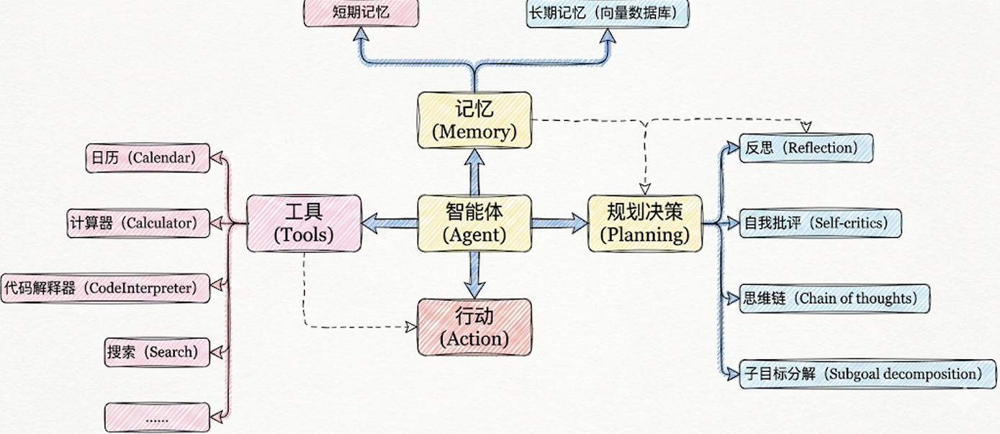
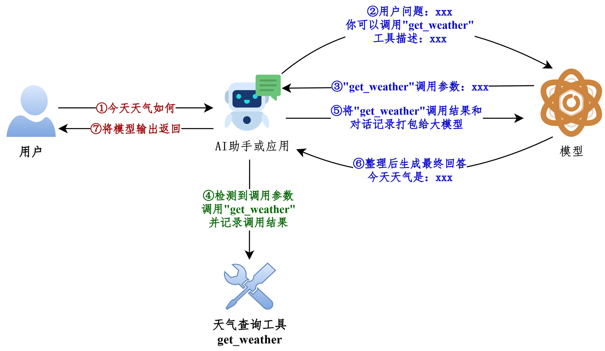

# 概述

**工具** 是 **[代理（agents）](https://langchain-doc.cn/v1/python/langchain/agents)** 调用来执行操作的组件。它们通过允许模型通过定义明确的输入和输出与世界交互来扩展模型的功能。工具封装了一个可调用的函数及其输入架构（schema）。这些可以传递给兼容的 **[聊天模型（chat models）](https://langchain-doc.cn/v1/python/langchain/models)**，让模型决定是否以及使用什么参数来调用工具。在这些场景中，**工具调用** 使模型能够生成符合指定输入架构的请求。



## 工具调用方式

在LangChain中，**工具（Tools）**实际上是指明确定义了输入和输出的 可调用函数。因此， 工具调用 **(Tool Calling)** 也被称为 函数调用**(Function Calling)** 。

**方式1：直接调用**

这种方式，适合测试时使用。

```python
from langchain_core.tools import tool
@tool
def get_weather(city: str) -> str:
    """
    获取指定城市的天气信息
    参数:
    city: 城市名称，如"北京"、"上海"
    返回:
    天气信息字符串
    """
    # 你的实现
    return city + "晴天，温度 15°C"

#使用 .invoke() 方法
result = get_weather.invoke({"city": "北京"})
print(result) 
```

**方式2：绑定到模型（主流）**

```python
from langchain.chat_models import init_chat_model
from dotenv import load_dotenv
import os


# 从.env文件中加载环境变量
load_dotenv(override=True)

CLOSEAI_API_KEY = os.getenv("CLOSEAI_API_KEY")
CLOSEAI_BASE_URL = os.getenv("CLOSEAI_BASE_URL")

model = init_chat_model(
    model="gpt-5.4-mini",
    model_provider="openai",
    api_key=CLOSEAI_API_KEY,
    base_url=CLOSEAI_BASE_UR
)


from langchain_core.tools import tool
# 定义工具
@tool
def get_weather(city: str) -> str:
    """获取指定城市的天气"""
    # 你的实现
    return "晴天，温度 15°C"

# 绑定工具
model_with_tools = model.bind_tools([get_weather])
# AI 可以决定是否调用工具
response = model_with_tools.invoke("北京天气如何？")
# response = model_with_tools.invoke("2 + 3 = ？")
# 检查 AI 是否要调用工具
if response.tool_calls:
    print("AI 想调用工具：", response.tool_calls)
else:
    print("AI 直接回答：", response.content)
```


## 工具调用流程



说明：被 @tool 修饰的函数可以调用 invoke 接收模型返回的入参信息执行函数，并返回 ToolMessage 实例，我们不再需要手动拼接 ToolMessage 。

**工具调用流程总结**：

 所以如果真正要大模型根据工具调用结果进行回复，完整的调用流程包括如下四个步骤：

- **步骤1：模型绑定工具** ：通过model.bind_tools([...])绑定一个或者多个工具。 
- **步骤2：模型生成工具调用请求**：用户输入问题，调用模型（比如invoke()）。如果需要调用工具，模 型返回包含工具调用信息（如工具名称和参数）的AIMessage。 
- **步骤3：开发者手动执行工具**：用户从响应中提取工具调用信息并手动调用对应的工具（比如工 具.invoke()）。 
- **步骤4：将工具执行结果ToolMessage传递给模型生成最终结果** ：将之前用户提问内容和手动执行工具 结果ToolMessage返回模型，模型最终生成回复。


# 工具定义方式1

## 工具描述的各部分详解

### convert_to_openai_tool

不使用@tool也可以定义工具，原因就在于底层源码的convert_to_openai_tool方法

执行`model.bind_tools([get_weather])`，底层最终会调用`convert_to_openai_tool`生成工具描述。所 以我们可以直接调用后者查看解析后的工具描述。

```python
from langchain_core.utils.function_calling import convert_to_openai_tool
from rich import print as rprint
def get_weather(city: str):
    return f"{city}天气晴朗"
rprint(convert_to_openai_tool(get_weather))
```

```python
{
'type': 'function',
'function': {
  'name': 'get_weather',
  'description': '',
  'parameters': {
      'properties': {
          'city': {
              'type': 'string'
          }
      },
      'required': ['city'],
      'type': 'object'
  }
}

```

- (1) type：定义当前数据节点必须是什么数据类型。常见类型有 string, number, integer, boolean,  object, array, null。object即是json对象。
-  (2) properties：用于定义JSON 对象（Object）中可以包含哪些属性（键），以及每个属性对应的 值类型和说明。
-  (3) required：当 type为 "object"时使用，是一个数组，列出了对象中必须存在的属性名


### description说明

`convert_to_openai_tool`会从**docstring(文档字符串)**加载工具的描述信息，上面的案例中， docstring为空，所以抽取的description为空。

> docstring，文档字符串，使用三个双引号表示开始和结束


### 参数说明

`convert_to_openai_tool`会从docstring加载参数说明，这里的docstring必须遵循**Google 风格**。

- Google风格docstring说明：https://google.github.io/styleguide/pyguide.html 
- Google风格docstring示例：https://www.sphinx-doc.org/en/master/usage/extensions/example_google.html 
- Python docstring 通用约定：https://peps.python.org/pep-0257/

```python
from langchain_core.utils.function_calling import convert_to_openai_tool
from rich import print as rprint
def get_weather(city: str):
    """
    天气查询工具
    Args:
        city: 城市名称
    """
    return f"{city}天气晴朗"
rprint(convert_to_openai_tool(get_weather))
```

- 删除了参数类型注解，则工具描述中不包含参数类型说明 
- 注意：如果docstring中包含参数说明，则对应的参数必须有类型注解，否则报错

- 如果参数没有默认值，则会包含在required对应的列表中。 反之，则参数的描述信息会包含default字段，并且不会出现在required列表中。


# 定义方式2 @tool

使用**@tool**装饰器修饰，可以自动将普通 Python 函数转化为智能体可调用的工具。 此方式**最直接**，代码量极少，非常适合快速验证想法或创建参数简单的工具

## 自定义工具描述：description

在bind_tools()调用时，先将函数封装为**BaseTool**类型的对象，再传递给`convert_to_openai_tool `函 数，生成工具的描述。

- @tool会从**docstring**生成描述信息，同样要求遵循Google docstring 规范。如果没有docstring 则报错
- @tool的参数**description**可以更改工具描述，**优先级高于docstring**的函数说明


当我们没有向@tool传递description参数时，默认情况下，tool会将docstring整体视为 description，如下

```python
{
 'type': 'function',
 'function': {
     'name': 'get_weather',
     'description': '获取当日天气，可选择是否同时查询未来五日天气预报
\n\nArgs:\n    city: 城市\n    units: 气温单位，可选：celsius-摄氏度，
fahrenheit-华氏度\n    include_forecast: 是否包含未来五日的天气预报',
     'parameters': {
         'properties': {
             'city': {
                 'type': 'string'
             },
             'units': {
                 'default': 'celsius',
                 'type': 'string'
             },
             'include_forecast': {
                 'default': False,
                 'type': 'boolean'
             }
         },
         'required': [
             'city'
         ],
         'type': 'object'
     }
 }
}
```

通过将`parse_docstring`设置为**True**，docstring会被解析，填充到相应的字段描述中。

```python
@tool(parse_docstring=True)
def get_weather(city: str, units: str = "celsius", include_forecast: bool = 
False) -> str:
    """
    获取当日天气，可选择是否同时查询未来五日天气预报
    Args:
        city: 城市
        units: 气温单位，可选：celsius-摄氏度，fahrenheit-华氏度
        include_forecast: 是否包含未来五日的天气预报
    """
    temp = 22 if units == "celsius" else 72
    result = f'{city}当天气温: {temp} {"摄氏度" if units == "celsius" else "华
氏度"}'
    if include_forecast:
        result += "\n未来五天都是晴天"
    return result
rprint(convert_to_openai_tool(get_weather))
```

输出：

```python
{
 'type': 'function',
 'function': {
     'name': 'get_weather',
     'description': '获取当日天气，可选择是否同时查询未来五日天气预报',
     'parameters': {
         'properties': {
             'city': {
                 'description': '城市',
                 'type': 'string'
             },
             'units': {
                 'default': 'celsius',
                 'description': '气温单位，可选：celsius-摄氏度，
fahrenheit-华氏度',
                 'type': 'string'
             },
             'include_forecast': {
                 'default': 'False',
                 'description': '是否包含未来五日的天气预报',
                 'type': 'boolean'
             }
         },
         'required': [
             'city'
         ],
         'type': 'object'
     }
 }
}
```

**要注意：**不使用@tool装饰器时，docstring不合法会被视为普通文本，作为description，但如果使 用了@tool时docstring不合法，将会抛出异常

**工具对docstring写法要求非常严格，必须要严格按照Google风格书写**


## 更改工具名称：name_or_callable

默认情况，使用函数名作为工具名称，但可以向@tool 传参`name_or_callable`，以更改工具名称。否则用函数名作为工具名称

- 说明：@tool中参数name_or_callable名称可以省略
- 说明：不要使用config或runtime作为参数名，这些是LangChain内部保留的。
- 开发中，习惯使用函数名作为工具名称，不推荐自定义工具名称。


## 自定义args_schema

### 方式1：使用Pydantic模型定义

当工具的参数变得复杂，需要**枚举值、范围限制或更复杂的业务逻辑验证**时，**Pydantic** 模型是理想 的选择，提供强大的类型检查和数据验证。

使用Pydantic 的主要优势在于能够精确控制工具参数的格式和验证规则，让大模型更准确地理解如何调 用工具

####  pydantic类型的定义

**① BaseModel基类**

通过继承核心基类`BaseModel`定义数据模型，从而声明字段结构、类型约束、默认值以0及校验规则

```python
from pydantic import BaseModel
class WeatherInput(BaseModel):
    city: str
print(WeatherInput(city="北京"))
```

>注意：BaseModel子类初始化时，不接收位置参数，字段值必须以关键字参数的形式传入，否则 报错。

```python
print(WeatherInput("北京"))  # 报错
```

**② Field**

`Field()`：用来**“定制字段”**的函数，可用于设置默认值、描述等。

每个字段的 description 参数至关重要，它直接影响大模型理解参数含义的能力。

例如，设置默认值和参数描述信息

```python
from pydantic import BaseModel, Field
class WeatherInput(BaseModel):
    city: str = Field(
        default= "北京",
        description="城市"
    )
    include_forecast: bool = Field(
        default=False,
        description="是否包含未来五日天气预报"
    )
print(WeatherInput())
```

**③ Literal**

可以使用 Literal类型限定参数为固定选项。

 **Literal**：表示字段不能是任意某种类型的值，而只能是几个固定字面量之一。 

```python
from pydantic import BaseModel
from typing import Literal
class WeatherInput(BaseModel):
    city: str
    unit: Literal["celsius", "fahrenheit"]
print("===============> 合法 <===============")
print(WeatherInput(city="北京", unit="celsius"))
print("===============> 非法 <===============")
try:
    print(WeatherInput(city="北京", unit="kelvin"))
except Exception as e:
    print("报错类型：", type(e).__name__)
    print(e)
```

#### 使用Pydantic定义args_schema

通过 `@tool(args_schema=PydanticModelCls)`将这个 Pydantic 模型与工具函数关联。 

利用 **Pydantic 的类型系统进行参数验证**，当大模型需要调用工具前，Pydantic 会自动验证参数的类型 和有效性。

```python
from pydantic import BaseModel, Field
from langchain.tools import tool
from langchain_core.utils.function_calling import convert_to_openai_tool
class WeatherInput(BaseModel):
    city: str = Field(
        default= "北京",
        description="城市"
    )
    unit: Literal["celsius", "fahrenheit"] = Field(
        default="celsius",
        description="气温单位"
    )
    include_forecast: bool = Field(
        default=False,
        description="是否包含未来五日天气预报"
    )
@tool(args_schema=WeatherInput)
def get_weather(city: str, unit: str = "celsius", include_forecast: bool = 
False) -> str:
    """获取当日天气，可选未来五日天气预报"""
    temp = 22 if unit == "celsius" else 72
    result = f'{city}当天气温: {temp} {"摄氏度" if unit == "celsius" else "华氏
度"}'
    if include_forecast:
        result += "\n未来五天都是晴天"
    return result
convert_to_openai_tool(get_weather)
```

输出

```python
{
 'type': 'function',
 'function': {
     'name': 'get_weather',
     'description': '获取当日天气，可选未来五日天气预报',
     'parameters': {
         'properties': {
             'city': {
                 'default': '北京',
                 'description': '城市',
                 'type': 'string'
             },
             'unit': {
                 'default': 'celsius',
                 'description': '气温单位',
                 'enum': [
                     'celsius',
                     'fahrenheit'
                 ],
                 'type': 'string'
             },
             'include_forecast': {
                 'default': False,
                 'description': '是否包含未来五日天气预报',
                 'type': 'boolean'
             }
         },
         'type': 'object'
     }
 }
}
```


### 方式2：使用Json Schema定义

在 LangChain 中，还可以直接使用` JSON Schema 字典`来定义工具的参数模式。这种方式提供了极大 的灵活性

因为工具参数模式可以基于数据库配置或用户输入在**运行时动态生成**，所以这种方式特别适合参数结 构需要动态生成的场景。

通过 `@tool(args_schema=json_schema_dict)`将一个符合 JSON Schema 标准的字典与工具函数关联。

`json_schema_dict`是一个如同工具描述中`parameters`字段的json字符串。

```python
weather_schema = {
    "type": "object",
    "properties": {
        "location": {"type": "string"},
        "units": {"type": "string"},
        "include_forecast": {"type": "boolean"}
    },
    "required": ["location", "units", "include_forecast"]
} 
```

```python
@tool(args_schema=weather_schema)
def get_weather(city: str, unit: str = "celsius", include_forecast: bool = 
False) -> str:
    """获取当日天气，可选未来五日天气预报"""
    temp = 22 if unit == "celsius" else 72
    result = f'{city}当天气温: {temp} {"摄氏度" if unit == "celsius" else "华氏
度"}'
    if include_forecast:
        result += "\n未来五天都是晴天"
    return result
print(convert_to_openai_tool(get_weather))
```

输出

```python
{
 'type': 'function',
 'function': {
     'name': 'get_weather',
     'description': '获取当日天气，可选未来五日天气预报',
     'parameters': {
         'type': 'object',
         'properties': {
             'location': {
                 'type': 'string'
             },
             'units': {
                 'type': 'string'
             },
             'include_forecast': {
                 'type': 'boolean'
             }
         },
         'required': [
             'location',
             'units',
             'include_forecast'
         ]
     }
 }
}
```


# 拓展：

## 强制使用工具

`bind_tools `可以传递参数` tool_choice `，用于控制是否强制使用工具。

该字段最终会作为` payload `的 `tool_choice` 字段传递给模型，OpenAI和Deepseek的官方API服务对于 `tool_choice `的取值做了相同的规定。

- `none `：模型不会调用任何工具。 
- `auto `： **默认值**，模型可以自主决定不调用或调用任意数量的工具。
-  `required `：模型必须调用工具，数量不限。


举例：用户要求查询天气，并提供了天气查询工具，但模型不会调用。

```python
from langchain.tools import tool
from langchain.messages import HumanMessage
@tool(parse_docstring=True)
def get_weather(city: str) -> str:
    """
    获取当日天气
    Args:
        city: 城市名称
    """
    return f'{city}当天晴朗'
model_with_tools = model.bind_tools([get_weather], tool_choice="none")
messages = [
    HumanMessage("今天北京天气如何？别瞎编")
]
response = model_with_tools.invoke(messages)
response.pretty_print()
```


举例：强制调用指定工具

```python
@tool(parse_docstring=True)
def get_weather1(city: str) -> str:
    """
    获取当日天气
    Args:
        city: 城市名称
    """
    return f'{city}当天晴朗'
@tool(parse_docstring=True)
def get_weather2(city: str) -> str:
    """
    获取当日天气
    Args:
        city: 城市名称
    """
    return f'{city}当天晴朗'
model_with_tools = model.bind_tools([get_weather1, get_weather2], 
tool_choice="get_weather2")
```


## 调用重试

在大模型应用（如 LangChain）中，网络请求和外部工具调用是最容易掉链子的地方。`@retry `就像是 一个容错保险。

```python
from tenacity import retry, stop_after_attempt
# 1. 配置重试规则：如果失败，最多尝试 3 次（即第 1 次正常调用 + 2 次重试）
@retry(stop=stop_after_attempt(3))
def call_agent(question):
    # 2. 核心业务逻辑：调用 LangChain 的 Agent
    return agent.invoke({"messages": [{"role": "user", "content": 
question}]})
```

它的工作流程： 

- ① 你调用` call_agent("你好")`。 
- ② 程序进入函数，执行 `agent.invoke(...)`。
-  ③ 如果执行成功：正常返回结果，@retry 什么都不做。 
- ④ 如果执行失败（报错）：@retry 会拦截这个错误，不让程序直接崩溃。它会默默地帮你再次触发  `agent.invoke(...)`。 
- ⑤ 如果连续 3 次都报错：它终于放弃了，把第 3 次的报错真正抛出来，程序此时才会报错中止。


## 返回字符串

```python
# ✅ 好：返回字符串
@tool
def get_user_info(user_id: str) -> str:
    """获取用户信息"""
    user = {"id": user_id, "name": "张三"}
    return json.dumps(user, ensure_ascii=False)  # 转成 JSON 字符串
# ❌ 不好：返回字典（某些情况可能有问题）
@tool
def get_user_info(user_id: str) -> dict:
    """获取用户信息"""
    return {"id": user_id, "name": "张三"}
```

在编写传统的 Python 代码时，返回字典（dict）显然更方便后续代码处理。但在 LangChain 的工具 （Tools）生态中，**强烈建议工具返回字符串（str）**。因为：

-  1）大模型（LLM）的本质只吃“文本” 
- 2）避免大模型“胡思乱想”（乱码与格式问题）

如果你返回一个包含中文的字典 {"name": "张三"}，LangChain 在强制将其转换为字符串时，默认可 能会采用 Unicode 编码，变成 {"name": "\u5f20\u4e09"}。

大模型虽然能理解 Unicode，但极易受到干扰。