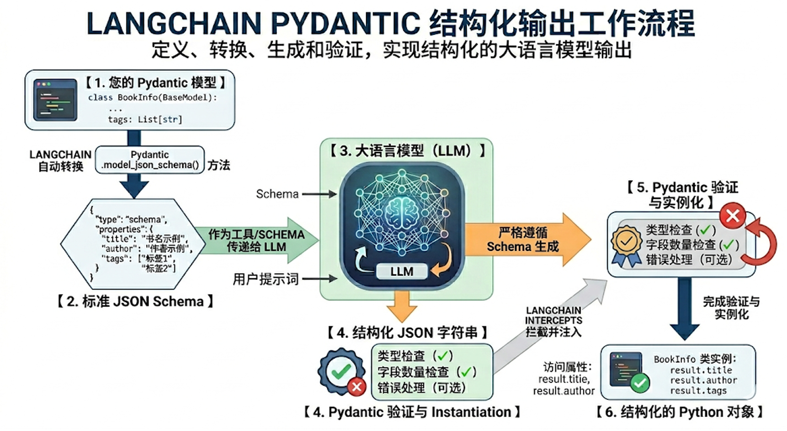

# 结构化输出

可以请求模型以匹配给定架构的格式提供其响应。这对于确保输出易于解析并用于后续处理非常有用。LangChain 支持多种架构类型和强制执行结构化输出的方法。

**它的核心目标是把“ 自然语言回答”变成“ 程序可以稳定消费的数据”。**

- **Pydantic**（字段校验、描述、嵌套结构，功能最丰富）
- **TypedDict（**轻量类型约束）
- **JSON Schema**（与前后端/跨语言接口最通用） 
- **dataclass**

**只有Pydantic返回的是Schema类实例，其余三种方式返回的都是`dict`**

并不是所有模型都支持结构化输出，如果不支持，LangChain 会回退到提示词 + JSON 解析。


## 四种结构化输出模式

### Pydantic （首推）

[Pydantic 模型](https://docs.pydantic.dev/latest/concepts/models/#basic-model-usage) 提供最丰富的功能集，包括字段验证、描述和嵌套结构。

```python
from pydantic import BaseModel, Field

class Movie(BaseModel):
    """一部带有详细信息的电影。"""
    title: str = Field(..., description="电影标题")
    year: int = Field(..., description="电影上映年份")
    director: str = Field(..., description="电影导演")
    rating: float = Field(..., description="电影评分，满分 10 分")

model_with_structure = model.with_structured_output(Movie)
response = model_with_structure.invoke("提供关于电影《盗梦空间》的详细信息")
print(response)  # Movie(title="Inception", year=2010, director="Christopher Nolan", rating=8.8)
```

输出：

```python
title='盗梦空间' year=2010 director='克里斯托弗·诺兰' rating=8.8
```

> 在这里，`...`（Ellipsis）代表的是：**“这是一个必填字段（Required）”**。
>
> 在 Pydantic 中，如果你定义了一个字段但没有给它默认值，它默认就是必填的。但当你使用了 `Field()` 函数来添加额外配置（如 `description`、`ge`、`max_length` 等）时，Pydantic 就无法直接判断这个字段是不是必填的了。
>
> 因此，Pydantic 规定：**在 `Field()` 的第一个参数位置传入 `...`，就明确告诉 Pydantic：“这个字段没有默认值，是必填的。”**


#### 高级特性

**情况1：可选字段**

使用`Optional`指定字段为可选的。

```python
from typing import Optional
from pydantic import BaseModel, Field
class Person(BaseModel):
    """人物信息"""
    name: str = Field(description="姓名")
    age: Optional[int] = Field(description="年龄")
    occupation: str = Field(description="职业")
structured_llm = model_with_closeai.with_structured_output(Person)
structured_llm.invoke("张三是一名医生")
```

可选意味着默认为None

**情况2：默认值**

`Field(default="默认值", description="描述")`

**注意**：不同模型提供商对default字段的支持是不同的。有的提供商对于default参数无效。（模型是一样的，但是不同的提供商对其支持是不一样的）


**情况3：枚举类型**

举例1

```python
from enum import Enum
class Priority(str, Enum):
    LOW = "低"
    MEDIUM = "中"
    HIGH = "高"
class Task(BaseModel):
    title: str
    priority: Priority  # 只能是 LOW/MEDIUM/HIGH
```

举例2

```python
from enum import Enum
class Status(str, Enum):
    ACTIVE = "激活"
    INACTIVE = "未激活"
class User(BaseModel):
    status: Status  # 只能是 ACTIVE 或 INACTIVE
```

如果嫌单独定义一个`  Enum `类太麻烦，也可以直接导入 ` typing` 中的 `Literal `直接在字段里把允许的值写死。

```python
from typing import Optional, Literal
from pydantic import BaseModel, Field

class CustomerInfo(BaseModel):
    """客户信息"""
    name: str = Field(description="客户姓名")
    phone: str = Field(description="电话号码")
    email: Optional[str] = Field("未提供", description="邮箱")
    issue: str = Field(description="问题描述")
    # 使用 Literal 直接限定字面量值
    urgency: Literal["低","中","高"] = Field(description="紧急程度")
```

**情况4：列表提取**

```python
from typing import List
class Person(BaseModel):
    """人物信息"""
    name: str
    age: int
class PersonList(BaseModel):
    """人物列表信息"""
    people: List[Person]  # 多个 Person 对象
structured_llm = model.with_structured_output(PersonList)
result = structured_llm.invoke("张三 30岁，李四 25岁")
print(result)
```

应用场景： 

- 批量处理用户评论 
- 自动生成分析报告 
- 发现产品改进点

**情况5：嵌套结构**

```python
from pydantic import BaseModel
class Address(BaseModel):
    """地点描述"""
    city: str
    district: str
class Company(BaseModel):
    """公司信息"""
    name: str
    address: Address  # 嵌套模型
structured_llm = model.with_structured_output(Company)
```

**情况6：限制条件**

在`Field`字段中添加参数

```python
from pydantic import ValidationError
class User(BaseModel):
    name: str = Field(min_length=2, max_length=20)
    age: int = Field(ge=0, le=150)
    email: str
    
   
print("\n有效数据:")
try:
    user = User(name="张三", age=30, email="zhang@example.com")
    print(f"[OK] {user.name}, {user.age}, {user.email}")
except ValidationError as e:
    print(f"[FAIL] {e}")
print("\n无效数据（年龄超出范围）:")
try:
    user = User(name="李四", age=200, email="li@example.com")
    print(f"[OK] {user}")
except ValidationError as e:
    print(f"[FAIL] 验证失败（符合预期）: {e.errors()[0]['msg']}")
```

输出

```python
有效数据:
[OK] 张三, 30, zhang@example.com
无效数据（年龄超出范围）:
[FAIL] 验证失败（符合预期）: Input should be less than or equal to 150
```


#### 工作流程




### TypeDict

`TypedDict` 提供使用 Python 内置类型的更简单替代方案，适用于不需要运行时验证的情况。

```python
from typing_extensions import TypedDict, Annotated

class MovieDict(TypedDict):
    """一部带有详细信息的电影。"""
    title: Annotated[str, ..., "电影标题"]
    year: Annotated[int, ..., "电影上映年份"]
    director: Annotated[str, ..., "电影导演"]
    rating: Annotated[float, ..., "电影评分，满分 10 分"]

model_with_structure = model.with_structured_output(MovieDict)
response = model_with_structure.invoke("提供关于电影《盗梦空间》的详细信息")
print(response)  # {'title': 'Inception', 'year': 2010, 'director': 'Christopher Nolan', 'rating': 8.8}
```

输出

```python
{'title': '盗梦空间', 'year': 2010, 'director': '克里斯托弗·诺兰', 'rating': 8.8}
```

>说明：上述代码的...是Python的字面量，等价于Ellipsis，可以理解为占位符。下游框架（如 LangChain）可以对...作定制化处理，如LangChain中Annotated的`...`表示当前字段是必须存在的， 不可省略，用来指示模型的输出。


### Json Schema(不推荐)

为了获得最大控制或互操作性，您可以提供原始 JSON 架构。

```python
import json

json_schema = {
    "title": "Movie",
    "description": "一部带有详细信息的电影",
    "type": "object",
    "properties": {
        "title": {
            "type": "string",
            "description": "电影标题"
        },
        "year": {
            "type": "integer",
            "description": "电影上映年份"
        },
        "director": {
            "type": "string",
            "description": "电影导演"
        },
        "rating": {
            "type": "number",
            "description": "电影评分，满分 10 分"
        }
    },
    "required": ["title", "year", "director", "rating"]
}

model_with_structure = model.with_structured_output(
    json_schema,
    method="json_schema",
)
response = model_with_structure.invoke("提供关于电影《盗梦空间》的详细信息")
print(response)  # {'title': 'Inception', 'year': 2010, ...}
```

> **注意**
> **结构化输出的关键考虑因素：**
>
> - **方法参数**：某些提供商支持不同的方法（`'json_schema'`、`'function_calling'`、`'json_mode'`）
>   - `'json_schema'` 通常指提供商提供的专用结构化输出功能
>   - `'function_calling'` 通过强制[工具调用](https://langchain-doc.cn/v1/python/langchain/models.html#工具调用)遵循给定架构来派生结构化输出
>   - `'json_mode'` 是某些提供商提供的 `'json_schema'` 的前身——它生成有效的 JSON，但架构必须在提示中描述
> - **包含原始**：使用 `include_raw=True` 以同时获取已解析的输出和原始 AI 消息
> - **验证**：只有Pydantic 模型提供自动验证，而 `TypedDict` 和 JSON Schema 需要手动验证


## 原数据与结构化输出同时存在

我们可以在`with_structured_output`方法中传入` include_raw=True `参数，表示返回解析前的 始AIMessage ，从而访问令牌用量等元数据。

```python
from pydantic import BaseModel, Field

class Movie(BaseModel):
    """一部带有详细信息的电影。"""
    title: str = Field(..., description="电影标题")
    year: int = Field(..., description="电影上映年份")
    director: str = Field(..., description="电影导演")
    rating: float = Field(..., description="电影评分，满分 10 分")

model_with_structure = model.with_structured_output(Movie, include_raw=True)  # [!code highlight]
response = model_with_structure.invoke("提供关于电影《盗梦空间》的详细信息")
response
# {
#     "raw": AIMessage(...),
#     "parsed": Movie(title=..., year=..., ...),
#     "parsing_error": None,
# }
```

