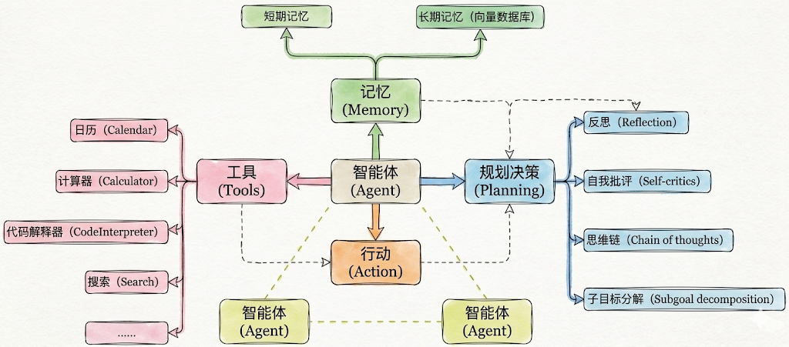

# 概述

智能体将语言模型与[工具](https://langchain-doc.cn/v1/python/langchain/tools)结合，创建能够对任务进行推理、决定使用哪些工具并迭代寻求解决方案的系统。

[`create_agent`](https://reference.langchain.com/python/langchain/agents/#langchain.agents.create_agent) 提供了一个生产就绪的智能体实现。

[LLM 智能体在循环中运行工具以实现目标](https://simonwillison.net/2025/Sep/18/agents/)。智能体会一直运行，直到满足停止条件——即模型输出最终结果或达到迭代次数限制。

> **信息**
> [`create_agent`](https://reference.langchain.com/python/langchain/agents/#langchain.agents.create_agent) 使用 [LangGraph](https://langchain-doc.cn/v1/python/langgraph/overview) 构建了一个**基于图**的智能体运行时。图由节点（步骤）和边（连接）组成，定义了智能体如何处理信息。智能体在图中移动，执行节点，如模型节点（调用模型）、工具节点（执行工具）或中间件。


在大模型应用开发中，智能体通常指一种以大语言模型为推理与决策核心，结合记忆、工具调用与环境交互能力，能够进行规划决策并执行复杂任务以达成目标的软件系统。

**Agent的关键能力**

- 理解用户问题

- 如何拆解任务

- 判断是否需要工具

- 需要调用哪些工具

- 如何利用好工具结果生成回答&推进任务

### Agent的核心组件

前面讲过现在AI Agent的架构：



实际开发中几个要素并不需要同时出现，一句话总结

- 必须的：行动（Action）

- 几乎总是存在的：工具（Tool）

- 有条件存在的：规划决策（Planning）

- 最容易被省略的：记忆（Memory）


# 2. 基本使用1

在 LangChain 1.2 中，create_agent 是构建智能体的核心方式，底层基于LangGraph 实现。

**create_agent 完整参数：**

```python
from langchain.agents import create_agent

agent = create_agent(
    model: str | BaseChatModel,            # 必需：聊天模型
    tools: List[BaseTool],                 # 必需：工具列表
    *,
    system_prompt: str = "",               # 系统提示词
    middleware: Seguence[AgentMiddleware[StateT_co, ContextT]] = () # 中间件
    interrupt_before: List[str] = None,    # 在某些工具前暂停（人机协作）
    interrupt_after: List[str] = None,     # 在某些工具后暂停
    debug: bool = False                    # 调试模式
    name: str 丨 None = None,              # 设置模型名称
)
```

Agent在创建时，涉及到模型（Agent使用的模型）、可调用工具、系统提示词等参数的设置。

更多参数参考：<https://reference.langchain.com/python/langchain/agents/factory/create_agent>

## **Agent中模型的传入方式：**

### 方式1 传入字符串

Agent根据传入的模型字符串，自主创建模型对象

```python
from langchain.agents import create_agent

from dotenv import load_dotenv

load_dotenv(override=True)

agent = create_agent("deepseek-v4-flash")
print(type(agent))

from IPython.display import Image, display
display(Image(agent.get_graph().draw_mermaid_png()))
```

输出

```text
<class 'langgraph.graph.state.CompiledStateGraph'>
```

### 方式2 传入模型对象

```python
from langchain.chat_models import init_chat_model
from langchain.agents import create_agent
from langchain_deepseek import ChatDeepSeek
from dotenv import load_dotenv
import os
load_dotenv(override=True)

# 以ChatDeepSeek为例
# model = ChatDeepSeek(model="deepseek-v4-flash")

# 以init_chat_model为例
model = init_chat_model(
    model="gpt-5.4-mini",
    model_provider="openai",
    api_key=os.getenv("CLOSEAI_API_KEY"),
    base_url=os.getenv("CLOSEAI_BASE_URL")
)


agent = create_agent(model)

print(type(agent))

from IPython.display import Image, display
display(Image(agent.get_graph().draw_mermaid_png()))
```

输出同上


# 3、Agent的基本用法2：如何调用Agent


