# 前置准备

阿里云百炼平台注册获取API-KEY

配置环境变量API-KEY

若使用本地模型：了解Ollama。Base_url="http://localhost:11434/v1"


## OpenAI库

模型的回答：

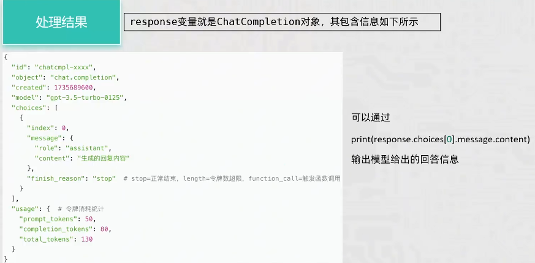

代码示例

```python
import os
from openai import OpenAI
import dotenv
dotenv.load_dotenv()
# 1. 获取client对象
client = OpenAI(
    base_url=os.getenv("BASE_URL")
)
# 2. 调用模型
completion = client.chat.completions.create(
    model="qwen3.6-plus",
    messages=[
        {"role": "system", "content": "你的回答简短且精炼。"},
        {"role": "user", "content": "什么是LangChain？"}
    ],
    stream=True, # 流式输出
    extra_body={"enable_thinking": False}
)
# 3. 流式输出
for chunk in completion:
    print(chunk.choices[0].delta.content, end="", flush=True)

```

# 提示词工程

zero-shot

few-shot

## Json格式

json由k-v键值对构成，其中key必须是字符串；Value可以是任意格式，包括嵌套

示例：

```python
{
    "id": 101,
    "name": "Jane Doe",
    "is_active": true,
    "roles": ["admin", "editor"],
    "contact": {
        "email": "jane.doe@example.com",
        "phone": "123-456-7890"
    },
    "preferences": {
        "notifications": {
            "email": true,
            "sms": false
        }
    }
}
```

`json.dumps()`：将python的字典和列表转为json字符串，参数`ensure_ascii=False`可以保证不会中文乱码

`json.loads()`：将json字符串转换为python的字典和列表


# RAG开发

环境部署：

- langchain
- langchain-community
- langchain-ollama
- dashscope
- chromadb

## RAG介绍

RAG 的全称是 **Retrieval-Augmented Generation**，中文叫**检索增强生成**。它是目前大语言模型（LLM）应用中最核心、最实用的技术之一。

简单来说，RAG 解决了一个大模型的“硬伤”：**大模型的知识停留在训练那一刻，而且会“不懂装懂”地瞎编（幻觉）**。RAG 的做法是：**在模型回答之前，先让它去外部知识库“查资料”，然后根据查到的真实资料来回答。**

### **RAG 的核心流程（三步走）**

**第一步：检索（Retrieval）**

- 用户输入问题后，系统先去**外部知识库**（比如公司文档、产品手册、数据库）里搜索
- 搜索方式：**向量检索**（语义相似度匹配）+ **关键词检索**（BM25 等）
- 找到最相关的 3-5 个文档片段

**第二步：增强（Augmentation）**

- 把检索到的文档片段和用户问题**拼接在一起**，形成一个增强后的提示词（Prompt）
- 提示词模板示例：

**第三步：生成（Generation）**

- 把增强后的提示词发给大模型
- 大模型基于**真实资料**生成回答，而不是凭训练数据瞎编
- 输出可以附带**来源引用**，方便用户验证

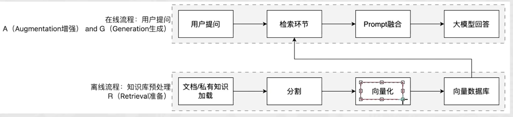


### **RAG 解决了什么问题？**

| 问题     | 纯 LLM                         | RAG                          |
| -------- | ------------------------------ | ---------------------------- |
| 知识过时 | 训练数据截止后，新知识一概不知 | 实时检索最新文档             |
| 幻觉     | 不懂装懂，自信地给出错误答案   | 基于真实资料回答，减少幻觉   |
| 领域适配 | 需要重新训练或微调，成本高     | 更换知识库即可，无需重新训练 |
| 可解释性 | 黑盒，不知道答案从哪来的       | 可追溯来源，用户可验证       |
| 成本     | 微调大模型需要大量 GPU         | 仅需构建检索系统，成本低 80% |

## Langchain使用

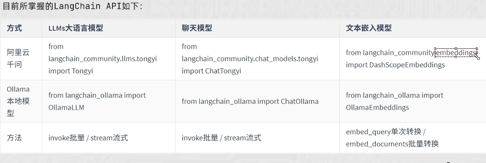

### 提示词模板

#### PromptTemplate


#### FewShotTemplate


#### invoke和format方法

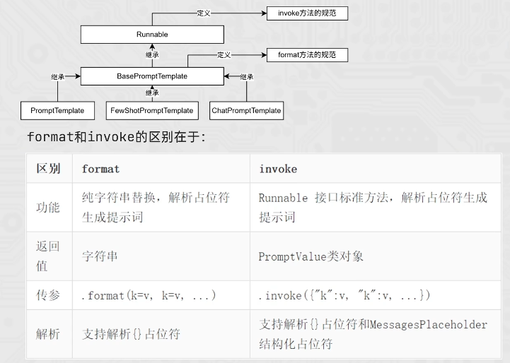

#### ChatPromptTemplate


#### MessagePlaceHolder


### Chain

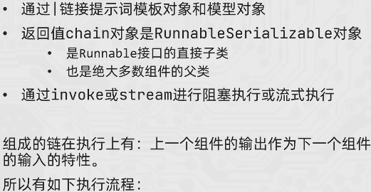

#### 运算符重写

重写了`|`符号的魔术方法：`__or__()`


#### Runnable接口


### 解析器

`langchain_core.output_parsers`

#### StrOutputParser


#### JsonOutputParser


#### 自定义函数加入链

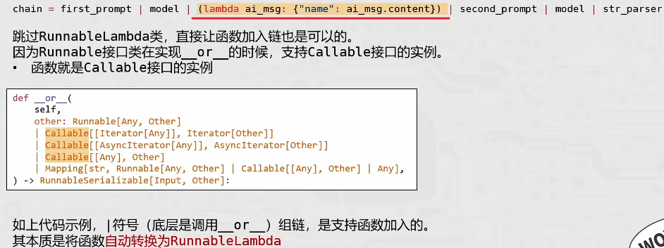


### 记忆

#### 临时会话记忆

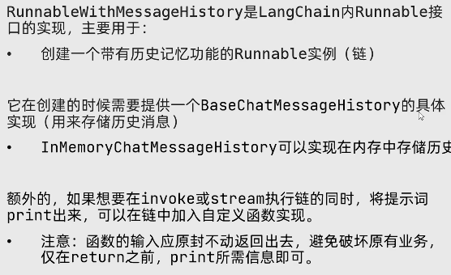


#### 长期会话记忆

本项目将文件持久化到Json文件中

```python
import os, json
from typing import Sequence

from langchain_core.chat_history import BaseChatMessageHistory
from langchain_core.messages import message_to_dict, messages_from_dict, BaseMessage
from langchain_core.runnables import RunnableLambda
from langchain_core.runnables.history import RunnableWithMessageHistory


class FileChatMessageHistory(BaseChatMessageHistory):

    def __init__(self, session_id: str, storage_path: str):
        self.session_id = session_id
        self.storage_path = storage_path
        self.file_path = os.path.join(self.storage_path, self.session_id)

        # 创建文件，如果文件不存在
        if not os.path.exists(self.file_path):
            os.makedirs(os.path.dirname(self.file_path), exist_ok=True)

    def add_messages(self, messages: Sequence[BaseMessage]) -> None:
        all_messages = list(self.messages)
        all_messages.extend(messages)
        with open(self.file_path, 'w') as f:
            json.dump([message_to_dict(m) for m in all_messages], f)

    @property  # 将方法变成属性
    def messages(self) -> list[BaseMessage]:
        try:
            with open(self.file_path, 'r') as f:
                messages = json.load(f)
                return messages_from_dict(messages)
        except FileNotFoundError:
            return []

    def clear(self) -> None:
        with open(self.file_path, 'w') as f:
            json.dump([], f)


from langchain_community.chat_models.tongyi import ChatTongyi
from langchain_core.output_parsers import StrOutputParser
from langchain_core.prompts import ChatPromptTemplate, MessagesPlaceholder
import dotenv

dotenv.load_dotenv()

model = ChatTongyi(
    model="qwen-max"
)

str_parser = StrOutputParser()

prompt = ChatPromptTemplate.from_messages([
    ("system", "你需要根据会话历史回应用户问题。对话历史如下所示："),
    MessagesPlaceholder(variable_name="chat_history"),
    ("human", "请根据历史对话，回答如下问题：{input}"),
])


def print_prompt(prompt):
    print("=" * 10)
    print(prompt.to_string())
    print("=" * 10)
    return prompt


chain = prompt | RunnableLambda(print_prompt) | model | str_parser


def get_history(session_id: str):
    history = FileChatMessageHistory(session_id, "./data/chat_history")
    return history


config = {
    "configurable": {
        "session_id": "default"
    }
}
conversation_chain = RunnableWithMessageHistory(
    runnable=chain,
    get_session_history=get_history,
    input_messages_key="input",
    history_messages_key="chat_history",
)

if __name__ == "__main__":
    while True:
        question = input("请输入问题：")
        print(conversation_chain.invoke({"input": question}, config))

```


### 加载外部文档

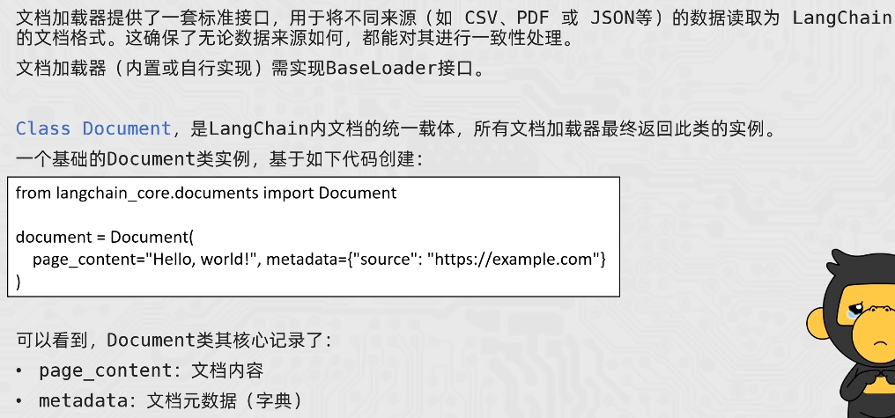

#### CSVLoader

```python
from langchain_community.document_loaders import CSVLoader

loader = CSVLoader(
    file_path="./data/stu.csv",
    encoding="utf-8",
    csv_args={
        "delimiter": ",", # 分隔符
        "quotechar": '"', # 指定带有分隔符文本引号包围是双引号
        "fieldnames": ["id", "name", "age", "sex"], # 指定列名，如果列名不存在，则使用该索引，否则不要设置该参数
    }
)

# 批量加载, 内存足够大时
# documents = loader.load()
# for document in documents:
#     print(type( document))
#     print(document)

# 懒加载，返回生成器
for document in loader.lazy_load():
    print(type( document))
    print(document)


```

#### JsonLader

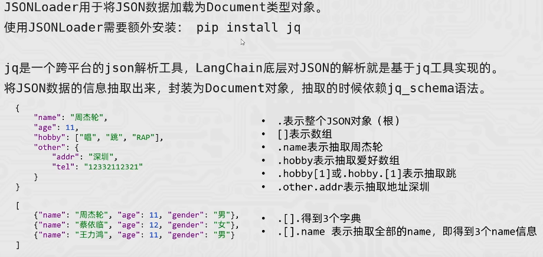

```python
from langchain_community.document_loaders import json_loader

loader = json_loader.JSONLoader(
    file_path="./data/person.json", # 必填 
    jq_schema='.', # 必填 
    text_content=False, # 告知JSONLoader， 抽取的内容不是字符串
    # json_lines=True # 告知JSONLoader， 文件格式为JSONLines
)
document = loader.load()
print(document)

```


#### TextLoader

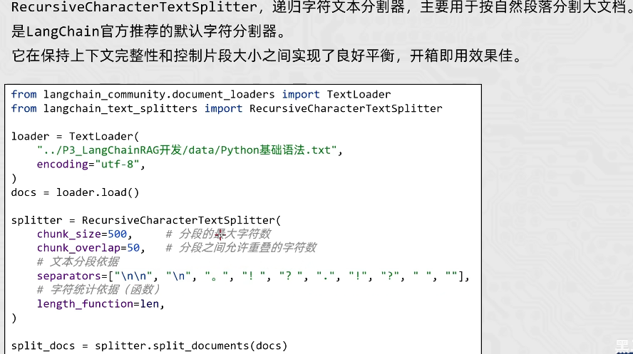


#### PyPDFLoader

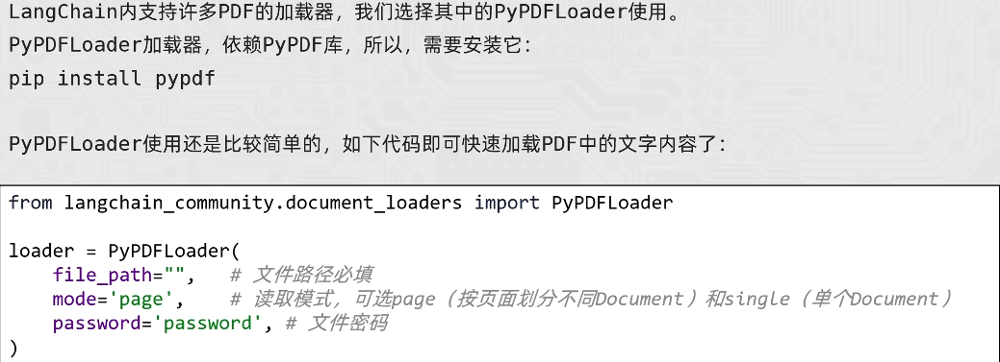


### VectorSotore向量存储

#### 内存储存

```python
from langchain_community.document_loaders import CSVLoader
from langchain_core.vectorstores import InMemoryVectorStore
from langchain_community.embeddings import DashScopeEmbeddings
import dotenv
dotenv.load_dotenv()
vector_store = InMemoryVectorStore(DashScopeEmbeddings())

loader = CSVLoader(
    file_path="./data/stu.csv",
    encoding="utf-8",
    csv_args={
        "delimiter": ",",  # 分隔符
        "quotechar": '"',  # 指定带有分隔符文本引号包围是双引号
    },
    source_column="name"
)

documents = loader.load()

vector_store.add_documents(
    documents=documents,  # 被添加的文档，类型要求“list[Documents]
    ids=["id"+str(i) for i in range(1, len(documents) + 1)]
)

vector_store.delete(ids=["id1", "id2"])

result = vector_store.similarity_search("王", k=2)

print( result)


```


#### 外部存储Chroma

需要`pip install langchain-chroma`

```python
from langchain_community.document_loaders import CSVLoader
from langchain_chroma import Chroma
from langchain_community.embeddings import DashScopeEmbeddings
import dotenv

dotenv.load_dotenv()

vector_store = Chroma(
    collection_name="stu",  # 类似于数据库名称，给当前向量存储起一个名称
    embedding_function=DashScopeEmbeddings(),
    persist_directory="./data/chroma_db"  # 指定存储的文件夹
)

# loader = CSVLoader(
#     file_path="./data/stu.csv",
#     encoding="utf-8",
#     csv_args={
#         "delimiter": ",",  # 分隔符
#         "quotechar": '"',  # 指定带有分隔符文本引号包围是双引号
#     },
#     source_column="name"
# )
#
# documents = loader.load()
#
# vector_store.add_documents(
#     documents=documents,  # 被添加的文档，类型要求“list[Documents]
#     ids=["id" + str(i) for i in range(1, len(documents) + 1)]
# )
#
# vector_store.delete(ids=["id1", "id2"])

result = vector_store.similarity_search(
    "王",
    k=2,
    filter={"name": "Sam"}
)

for i in result:
    print(i)

```

#### 结合模型示例

```python
from langchain_community.chat_models.tongyi import ChatTongyi
from langchain_community.embeddings import DashScopeEmbeddings
from langchain_core import vectorstores
from langchain_core.prompts import ChatPromptTemplate
from langchain_core.runnables import RunnableLambda
import dotenv
dotenv.load_dotenv()

model = ChatTongyi(
    model="qwen-max"
)
embeddings = DashScopeEmbeddings()
vector_store = vectorstores.InMemoryVectorStore(embeddings)

prompt = ChatPromptTemplate.from_messages(
    [
        ("system", "根据提供的参考资料，回答用户的问题，答案简介。参考资料：{reference}"),
        ("human", "问题：{question}")
    ]
)

vector_store.add_texts(["减肥就是要少吃多练。","在减肥期间吃定西很重要，清淡少油控制热量摄入并运动起来。","跑步是很好的减肥方式。"])

question = "怎么减肥？"

# 检索向量库
result = vector_store.similarity_search( question, k=2)
reference = "["
for doc in result:
    reference += doc.page_content
reference+="]"

def print_prompt(prompt):
    print("=" * 10)
    print(prompt.to_string())
    print("=" * 10)
    return prompt

chain = prompt | RunnableLambda(print_prompt) | model | RunnableLambda(lambda x: x.content)

answer = chain.invoke({"question": question, "reference": reference})
print( answer)
```


### RunnablePassThrough

输入截流：RunnablePassThrough（）相当于占位符，复制一份输入

```python
from langchain_community.chat_models.tongyi import ChatTongyi
from langchain_community.embeddings import DashScopeEmbeddings
from langchain_core import vectorstores
from langchain_core.prompts import ChatPromptTemplate
from langchain_core.runnables import RunnableLambda, RunnablePassthrough
import dotenv

dotenv.load_dotenv()

model = ChatTongyi(
    model="qwen-max"
)
embeddings = DashScopeEmbeddings()
vector_store = vectorstores.InMemoryVectorStore(embeddings)

prompt = ChatPromptTemplate.from_messages(
    [
        ("system", "根据提供的参考资料，回答用户的问题，答案简介。参考资料：{reference}"),
        ("human", "问题：{question}")
    ]
)

vector_store.add_texts(
    ["减肥就是要少吃多练。", "在减肥期间吃定西很重要，清淡少油控制热量摄入并运动起来。", "跑步是很好的减肥方式。"])
retriever = vector_store.as_retriever(search_kwargs={"k": 2})

def formated_reference(documents):
    if not documents:
        return "无参考资料。"
    reference = "["
    for doc in documents:
        reference += doc.page_content
    reference += "]"
    return reference


def print_prompt(prompt):
    print("=" * 10)
    print(prompt.to_string())
    print("=" * 10)
    return prompt


chain = {"question":RunnablePassthrough(), "reference": retriever| RunnableLambda(formated_reference) }| prompt | RunnableLambda(print_prompt) | model | RunnableLambda(lambda x: x.content)
question = "怎么减肥？"
answer = chain.invoke(question)
print(answer)

```


## 项目实践

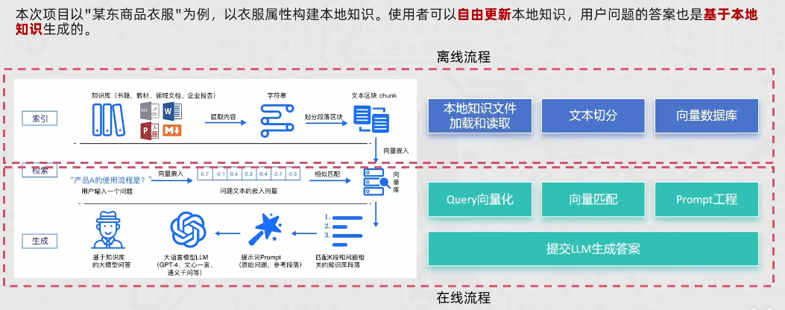


# Agent开发

ReAct工作范式：


## 中间件

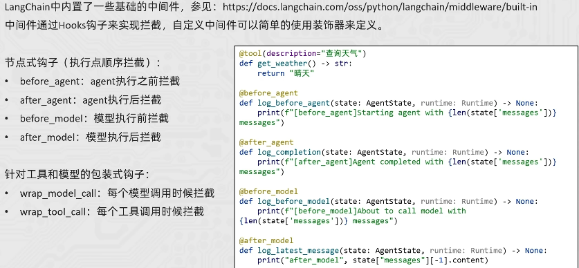


## 工具包

这是一个基于 Streamlit、LangChain、Chroma 和 DashScope 的中文智能客服项目，面向扫地机器人与扫拖一体机场景，支持知识库问答、故障排查、维护建议、天气辅助判断和用户使用报告生成。

