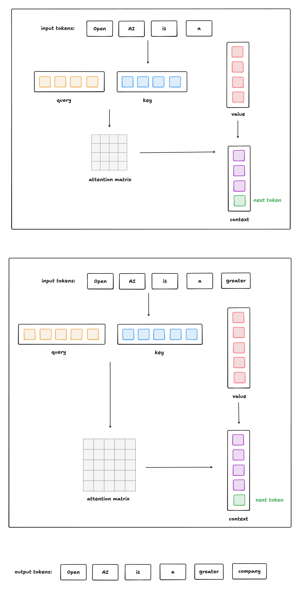
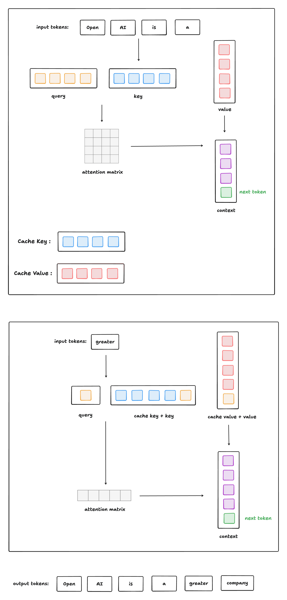

#  Transformer


# Embeddings from Language Models（ELMo）

## 论文要点

ELMo 的核心创新在于：**同一个词在不同上下文中应有不同的向量表示**。

- 1）采用双向LSTM架构，通过联合训练前向和后向语言模型，生成包含完整上下文信息的词表示；
- 2）引入多层特征融合机制，允许下游任务动态加权组合不同层级的LSTM输出，既保留低层语法信息，又整合高层语义特征；
- 3）通过字符级卷积网络生成子词信息，增强对未登录词和形态变化的处理能力。

例如，“bank”在 “river bank” 和 “bank account” 中含义完全不同，传统静态词向量（如 Word2Vec、GloVe）无法区分这种差异，而 ELMo 能根据上下文动态生成词的表示。

**使用方式**

与 BERT 等“微调式”（fine-tuning）模型不同，ELMo 采用 **feature-based** 方式：

1. 先在大规模语料（如 1B Word Benchmark）上预训练双向语言模型。
2. 在下游任务（如命名实体识别、情感分析、问答等）中，将 ELMo 向量作为**额外特征**，拼接到任务模型的词嵌入层（如与 Word2Vec 或 GloVe 拼接）。
3. 下游模型其余部分正常训练，ELMo 编码器通常**冻结或微调**。


## 半监督学习

**半监督学习** 是一种机器学习范式，它**同时利用少量标注数据和大量未标注数据**进行模型训练。其基本假设是：**未标注数据的分布结构可以帮助提升模型在标注任务上的泛化能力**。

 **📊 数据组成：**

- **标注数据（Labeled data）**：数量少，形如$(x1,y1),(x2,y2),...,(x_n,y_n)$ 
- **未标注数据（Unlabeled data）**：数量大，形如$x_{n+1},x_{n+2},...,x_{n+m} $ ，其中 m≫n*m*≫*n*

 **🔑 核心思想：**

> 利用未标注数据中蕴含的**数据分布、流形结构或聚类特性**，帮助模型更好地理解输入空间，从而在仅有少量标签的情况下取得更好性能。

 **🌟 常见方法：**

| 方法                                           | 思路                                                         |
| :--------------------------------------------- | :----------------------------------------------------------- |
| **自训练（Self-training）**                    | 用标注数据训练初始模型 → 对未标注数据打伪标签 → 加入高置信度样本重新训练 |
| **一致性正则化（Consistency Regularization）** | 对未标注数据加扰动（如噪声、裁剪），要求模型输出一致（如 Mean Teacher, VAT） |
| **图半监督学习**                               | 构建数据点之间的图，假设相邻节点标签相似                     |
| **预训练 + 微调（Pretraining + Finetuning）**  | 在大量未标注文本上预训练语言模型（如 ELMo、BERT）→ 在小规模标注数据上微调 |

> 💡 **ELMo 的训练方式就属于最后一种：典型的半监督学习范式**。

## 主要部分

### 3.1 模型以及预训练

**模型组层：**

- 词嵌入层
- 正向与反向的LSTM

**预训练：**

1.词嵌入
2.LSTM处理
3.LSTM在每个位置的输出用于预测下一个词

注：预处理需要在句子前后添加特殊token：<sos>和<eos>，这是为了预训练第一个词

- 正向和反向都需要同样的预训练过程，相互独立（反向训练可以通过反转输入词序列完成）
- 词嵌入层和softmax层的参数共享，但是正反LSTM训练的参数独立

```python
输入句子: ["The", "cat", "sat", "on", "the", "mat"]

        ↓
字符级编码（每个词独立）:
"The" → char CNN → h₀ ∈ ℝ⁵¹²
"cat" → char CNN → h₀ ∈ ℝ⁵¹²
...

        ↓
第1层 biLSTM:
前向: [h₀("The"), h₀("cat"), ...] → LSTM → proj → h₁_forward
后向: [..., h₀("mat")] → LSTM → proj → h₁_backward
→ 拼接 → h₁ ∈ ℝ¹⁰²⁴

        ↓
第2层 biLSTM（带残差）:
输入 = h₁_projection（512 per dir）
→ LSTM → proj → + 残差（来自 h₁） → h₂ ∈ ℝ¹⁰²⁴

        ↓
输出三层表示: {h₀, h₁, h₂}

        ↓
计算损失:
- 前向: 预测 "cat" 用 ["The"]
- 后向: 预测 "cat" 用 ["sat", "on", ...]
→ 总损失 = 前向 loss + 后向 loss

```

>**在 ELMo 的预训练中，前向和后向语言模型是分别计算损失的，且它们使用的是各自方向的 LSTM 隐藏状态（未拼接）来预测下一个词。拼接只用于生成最终的上下文表示（供下游任务使用），不用于预训练时的损失计算。**


### 3.2 ELMo模型结果呈现

输入的词序列中每一个词的token有三部分组成

1. 初始词嵌入层token layer
2. 前向LSTM相应位置的隐藏状态
3. 后向LSTM相应位置的隐藏状态

ELMo选择将L层的LSTM的对应位置隐藏状态全部进行加权求和（包括正反向以及词嵌入），简单做法是只去最后一层的隐藏状态

注：ELMo还添加了缩放因子和层归一化

### 3.3使用ELMo做下游任务

#### **使用步骤如下：**

1. **运行 biLM**：将输入句子送入预训练的 ELMo 模型
2. **记录所有层的表示**：对每个词 tk*t**k* ，保存其从初始层到顶层的所有隐藏状态（ hk,0LM,…,hk,LLM**h***k*,0*L**M*,…,**h***k*,*L**L**M* ）
3. **让下游任务模型学习这些表示的线性组合**

> 💡 这就是 ELMo 的核心思想：**把预训练的语言模型当作一个特征提取器，而不是直接微调整个网络**。

将ELMo向量送入下游的RNN任务中，对RNN的输出向量再次融合输入的ELMo向量


### 3.4 模型结构

ELMo 最终采用的预训练模型结构如下：

1. 字符级嵌入层（下文字符级输入）
2. LSTM层（双向分别单独训练，2层，输出所有层的每个位置的隐藏状态）
3. 线性加权层（由下游任务训练，决定嵌入层和LSTM层相应位置输出的线性权重组合）

| 组件                 | 参数                                 |
| :------------------- | :----------------------------------- |
| **LSTM 层数**        | L=2*L*=2 （两层）                    |
| **每层 LSTM 单元数** | 4096（即隐藏状态维度为 4096）        |
| **投影维度**         | 512（每个方向的输出先投影到 512 维） |
| **残差连接**         | 第一层 → 第二层（skip connection）   |

> ✅ 这意味着：
>
> - 输入经过字符 CNN 得到初始表示
> - 送入第一层 biLSTM（4096 维）
> - 输出投影到 512 维
> - 加上残差连接后送入第二层 biLSTM（4096 维）（残差连接发生在第一层LSTM和第二层LSTM之间）
> - 再次投影到 512 维

> 🧠 投影是为了减少维度，便于后续融合；残差连接帮助信息流动。
>
> 

#### 字符级输入表示

 **📌 解释：**

ELMo 使用**纯字符级输入**，不依赖词汇表，从而解决 OOV 问题。

 **具体流程：**

1. **字符 n-gram 卷积层**
   - 使用 2048 个卷积滤波器，捕捉局部字符模式（如 “ing”, “ed”, “ly”）
   - 输出一个高维特征向量
2. **Highway Layers（高速公路层）**
   - 类似于残差连接，但更灵活
   - 可以选择性地传递原始输入或变换后的特征
   - 提升信息流的效率
3. **线性投影到 512 维**
   - 将高维特征压缩到 512 维，作为最终的 token 表示 xk*x**k*

> ✅ 这种设计让 ELMo 能处理任何拼写正确的新词（如 “self-supervised”、“Transformer”）

---


# BERT


**核心创新：**双向语言建模，先前的语言模型都是单向语言建模（ELMo）

## 原文第3节

提出提出预训练+微调的范式

模型基本层几乎与Transformer的编码器一样，只不过层数L和隐藏状态大小H不同

### **模型的输入输出：**

输入被设计成通用格式，可以清晰地表示单个句子任务和句子对类型的任务：

第一个token是cls，这个token最终会融合所有的token信息，可以用到分类任务上。

句子对被设计成一个序列，如何区分这两个句子：

- 句子之间添加<seq>token
- 添加固定的segment Embedding（$E_A, E_B$）


最终输入有三部分组成：

- token Embeddings
- Segment Embeddings
- Position Embeddings

输出与Transformer规则相同

### 3.1 预训练

#### Masked LM**掩码语言模型**

单项语言模型虽然只能看到前文或者后文，但是天然的不会产生“信息泄露”，但是双向语言模型会同时融合上下文信息，在多层信息流动后，每个位置不可避免的会融合到自身的token信息，造成“信息回流”

所以需要使用掩码语言模型进行训练：将序列中的一部分替换为遮盖，然模型预测遮盖位置的词：

做法：选择序列中15%的token

- 80% 概率：替换为 `[MASK]`
- 10% 概率：替换为一个随机词（如把 "cat" 改成 "dog"）
- 10% 概率：保持原词不变（但仍然要求模型预测它）

| 替换方式 | 目的                                             |
| :------- | :----------------------------------------------- |
| `[MASK]` | 训练模型利用上下文预测缺失词                     |
| 随机词   | 训练模型识别错误并纠正（增强鲁棒性）             |
| 原词     | 训练模型区分“正常输入”和“异常输入”，提高泛化能力 |

这种混合策略让模型更适应真实场景，避免过度依赖 `[MASK]` 标记。

> **总结**：**BERT 通过“掩码语言模型”（MLM）实现了真正的双向上下文建模：它随机遮盖部分词，让模型根据周围上下文预测这些词，从而在不破坏因果关系的前提下训练出强大的双向表示。**

#### **下一句预测（Next Sentence Prediction, NSP）**

很多重要的下游任务（如问答、自然语言推理）依赖于模型理解两个句子之间的关系。但标准的语言模型（如 GPT、ELMo）只能建模单个句子内的词序，**无法直接捕捉句子间的关系**。因此，BERT 引入了一个新的预训练任务：**下一句预测（Next Sentence Prediction, NSP）**

这是一个二分类任务：给定两个句子 A 和 B，判断 B 是否是 A 的下一句。

✅ 目标：让模型学会识别句子间的逻辑关系（如因果、时间顺序、问答等）。

**训练样本构造方式**：

- 从语料库中随机选取一个句子 A
- 然后以 **50% 概率** 选择：
  - B = A 的实际下一句 → 标签为 `IsNext`
  - B = 语料库中任意其他句子 → 标签为 `NotNext`

所以，在 NSP 任务中：

- 输入是两个句子拼接成的序列：`[CLS] A [SEP] B [SEP]`
- 输出是：使用 C*C* （来自 `[CLS]` 的向量）进行分类
- 分类目标：`IsNext` 或 `NotNext`

✅ 这意味着模型必须通过 `[CLS]` 向量来整合两个句子的信息，并判断它们是否连贯。


- **NSP 任务与之前的工作有关**，比如：
  - Sentence-BERT（Logeswaran & Lee, 2018）
  - 句子表征学习（Jerite et al., 2017）
- 但区别在于：
  - 以往工作只把**句子嵌入**（sentence embedding）作为输出，用于下游任务
  - 而 BERT 则将**整个模型的所有参数**都迁移到下游任务中（即 fine-tuning）

📌 也就是说：

- 以前的方法是“特征提取”模式（feature-based）
- BERT 是“端到端微调”模式（fine-tuning）

✅ 所以，NSP 不仅帮助模型理解句子关系，还为后续任务提供了可微调的完整架构。


### 补充

#### **一、背景：什么是“句子表征学习”？**

在 BERT 之前，很多研究致力于学习一个**通用的句子向量**（sentence embedding），使得：

- 语义相近的句子在向量空间中距离近；
- 可以用于下游任务（如问答、文本匹配、聚类等）。

典型代表包括：

- **Skip-Thought Vectors**（Kiros et al., 2015）
- **Quick-Thought**（Logeswaran & Lee, 2018）
- **InferSent**（Conneau et al., 2017）

 **🔧 核心思想：**

> 给定一个句子 A，从一堆候选句子中找出它的真实下一句 B。

这听起来和 BERT 的 NSP 很像，对吧？但实现方式完全不同。

 **✅ 训练过程：**

1. 使用一个**编码器**（如 LSTM 或 CNN）将句子 A 编码为向量 vA*v**A*
2. 同样将候选句子 B 编码为 vB*v**B*
3. 计算相似度（如点积 vA⋅vB*v**A*⋅*v**B* ）
4. 优化目标：让真实下一句的相似度最高，随机句子的相似度最低（对比学习）

 **📦 输出：**

- 最终得到一个**句子编码器**，可以将任意句子映射为固定维度的向量（如 768 维）
- 这个向量就是“句子嵌入”

 **🔄 下游使用方式（**特征提取模式）：

- 冻结这个编码器的所有参数
- 对新任务（如 NLI），把两个句子分别用该编码器转成向量 v1,v2
- 然后拼接 [v1;v2; ，输入一个**小型分类器**（如 MLP）
- **只训练这个小型分类器，不更新句子编码器**

📌 这就是典型的 **feature-based approach**（基于特征的方法）——预训练模型只是一个“特征提取器”。

#### **BERT 的做法：端到端微调（Fine-tuning）**

**🔧 训练过程：**

- BERT 同时进行 MLM 和 NSP 预训练
- 在 NSP 中，它不是先编码 A 和 B 再比较，而是：
  - 把 A 和 B **拼接成一个序列**：`[CLS] A [SEP] B [SEP]`
  - 用**同一个 Transformer 模型**处理整个序列
  - 用 `[CLS]` 的输出 C*C* 直接做二分类（IsNext / NotNext）

 **🔄 下游使用方式（**微调模式）：

- 对于新任务（如 MNLI 推理），仍然输入 `[CLS] premise [SEP] hypothesis [SEP]`
- **整个 BERT 模型的所有参数都参与训练**
- 只在顶部加一个简单的分类层（比如一个线性层）
- 端到端反向传播，**同时更新 BERT 编码器 + 分类头**

📌 这就是 **fine-tuning approach** —— 预训练模型是“可塑的”，能根据下游任务调整内部表示。

### 3.2微调

BERT因为 Transformer 的 **自注意力机制（self-attention）** 具有强大的灵活性：

- 它可以处理单个句子（如情感分析）
- 也可以处理两个句子的组合（如问答、自然语言推理）

**不需要为每个任务设计复杂的结构**，只需调整输入输出即可。

 对于每一个下游任务：

- 我们只需：
  - 改变输入格式（比如加问题、加答案）
  - 添加一个简单的输出层（如 softmax 分类器或线性层）
- 然后**端到端地微调整个模型的所有参数**


在预训练阶段，BERT 使用 `[CLS] A [SEP] B [SEP]` 格式来表示两个句子。

📌 不需要冻结任何层，也不需要复杂的特征提取过程。

| 下游任务                       | 对应的 A 和 B                               |
| ------------------------------ | ------------------------------------------- |
| (1) 同义句检测（Paraphrasing） | A = 句子1，B = 句子2（判断是否意思相同）    |
| (2) 自然语言推理（Entailment） | A = 前提（premise），B = 假设（hypothesis） |
| (3) 问答（Question Answering） | A = 问题，B = 文本篇章（passage）           |
| (4) 文本分类 / 序列标注        | A = 输入句子，B = 空（即只用 A）            |

**Token-level 任务**（如命名实体识别、依存句法分析、问答中的起止位置预测）：

- 使用每个 token 的最终隐藏状态 Ti*T**i*
- 送入一个输出层（如 softmax 或线性层）预测每个位置的标签

📌 例如，在问答中：

- 模型预测答案的开始位置和结束位置 → 使用 Ti*T**i* 来做

**Sentence-level 任务**（如情感分析、文本分类、NLI）：

- 使用 `[CLS]` 对应的隐藏状态 C*C*
- 送入分类器（如全连接层 + softmax）进行分类

📌 为什么用 `[CLS]`？

- 因为它是整个序列的汇总表示（aggregate representation）
- 经过所有 Transformer 层后，融合了全局信息

✅ 这种设计使得 BERT 能够轻松适应各种任务，只需更改输出层即可。

> **BERT 的微调之所以高效且强大，是因为它利用 Transformer 的自注意力机制，将不同任务统一为“输入序列 → 输出表示”的模式，通过简单的输入输出调整和端到端微调，就能在各类 NLP 任务上取得卓越表现。**

---


## 数据处理和训练策略

#### **对短序列进行“填充”而非截断**

- **策略**：BERT 的输入通常由两个句子（句子对）组成。如果两个句子的总长度不足最大长度（例如 512），BERT 会使用 `[PAD]` 标记将序列**填充**到最大长度。
- **后果**：这意味着模型在处理短句子时，实际上在计算大量无意义的填充符号，浪费了计算资源。

#### **两阶段训练策略（缩减长度）**

- **第一阶段**：使用最大长度为 **128** 的序列进行训练，训练 **90%** 的步骤。
- **第二阶段**：使用最大长度为 **512** 的序列进行训练，训练剩余的 **10%** 的步骤。

- **原因**：因为自注意力机制的计算复杂度与序列长度的平方成正比。短序列（128）训练速度非常快，可以让模型快速收敛学习词汇和局部语法；最后再用长序列（512）微调，让模型适应长距离依赖。


# GPT-1

## Abstract部分

提出预训练+微调范式

**标注数据昂贵且稀缺**，这是传统机器学习的瓶颈。标签数据稀少，监督学习样本极少。所以需要进行无监督的预训练，之后在有标签的数据上进行监督训练，即微调

传统上，针对一种任务需要设计一种模型，GPT用同一个模型适用所有任务，只需要改变输入

比如：

 **1. 问答任务（Question Answering）**

- **传统做法**：
  输入 = (问题, 文档) → 模型输出 = (start_index, end_index)

- **GPT-1 做法**：
  构造输入字符串：

  ```
  问题：谁是美国总统？  
  上下文：拜登是美国总统。  
  答案：
  ```

  模型的任务：

  预测“答案：”后面的内容

   → 比如 “拜登”

👉 模型只需要做它最擅长的事：**根据前面的文本，预测下一个词**！

------

**2. 文本蕴含（Textual Entailment）**

- **传统做法**：
  输入 = (premise, hypothesis) → 分类器输出 = 蕴含 / 矛盾 / 中立

- **GPT-1 做法**：
  构造输入字符串：

  ```
  前提：狗在跑。  
  假设：动物在移动。  
  关系：
  ```

  模型预测“关系：”后面的内容 → 比如 “蕴含”

------

 **3.文本分类（如情感分析）**

- **传统做法**：
  输入 = 句子 → 全连接层 → 正面/负面

- **GPT-1 做法**：
  构造输入：

  ```
  评论：这部电影太棒了！  
  情感：
  ```

  模型预测“情感：”后面的内容 → 比如 “正面”

## Introduction部分

**论文的核心出发点**——**标注数据稀缺**是一个根本性瓶颈。

**做法**：“预训练”：用无标签数据做“知识积累”，代替昂贵的人工标注。

**依据**：即使在已有大量标注数据的情况下，通过**无监督方式学习良好表示**（即词向量/上下文表示），也能带来显著的性能提升。这一点已在实践中得到验证：**预训练词嵌入**（如 Word2Vec、GloVe）已被广泛用于提升各种 NLP 任务的性能

**更进一步**：然而，仅利用词级别的信息是不够的，希望捕捉**更高层次的语义结构**（比如句子含义、逻辑关系）。这正是本文的核心突破点：**从“词向量”升级为“上下文感知表示”**。

**挑战**：更深层次地利用未标注文本面临两个主要挑战：

1. **不清楚哪种优化目标最有效**？
2. **如何将学到的表示迁移到目标任务上**，也没有统一标准。

总结就是：**标注数据少 → 需要无监督学习 → 但如何设计预训练目标和迁移方式仍是难题**

**解决方法**：本文提出一种**半监督方法**：结合**无监督预训练 + 监督微调**。目标是学习一种**通用表示**（universal representation），能够以极小的调整迁移到多种任务上。这就是论文的核心理念：“**通用模型 + 通用表示 + 轻量级微调**”

采用两阶段训练流程：

1. **第一阶段（预训练）**：在未标注数据上使用**语言建模目标**（即预测下一个词）来学习通用的语言表示。
2. **第二阶段（微调）**：用对应任务的监督目标（如分类、问答）调整参数。

 这就是“生成式预训练 + 判别式微调”的完整定义！


**对于模型**：

选择 **Transformer 架构**，因为它在以下任务中表现优异：

- 机器翻译
- 文档生成
- 句法分析

相比循环神经网络（RNN），Transformer 具备更强的**长期依赖建模能力**，因此在跨任务迁移时表现更稳健。

**在迁移阶段**：

我们使用**任务特定的输入格式转换**（task-specific input adaptations），灵感来自“遍历式”方法（如 BERT 的 [CLS] 标记）。
例如：

- 问答：`[CLS] Question: Who is the president? Context: Joe Biden is...`
- 文本蕴含：`[CLS] Premise: The cat is on the mat. Hypothesis: An animal is sitting.`

这样所有任务都变成一个连续的 token 序列，只需微调，无需改架构。

📌 这就是“**统一输入格式**”的设计智慧！


## Framework部分


### 3.1预训练

无监督学习自回归语言建模

**模型**： **多层 Transformer Decoder**，它是原始 Transformer 的变体。

1. **多头自注意力机制**（Multi-head Self-Attention）：捕捉输入序列中任意两个词之间的关系
2. **位置前馈网络**（Position-wise Feed-Forward Network）：对每个位置独立处理
3. 输出是一个分布，表示下一个词的概率

$$
\begin{align*}
h_0 &= U W_e + W_p \\
h_t &= \text{transformer\_block}(h_{t-1}) \quad \forall t \in [1, n] \\
P(u) &= \text{softmax}(h_n W_p^T)
\end{align*}
$$

#### L₁：无监督预训练损失（语言建模）

- **输入**：一段连续文本，例如
  `The cat sat on the mat.`
- **目标**：对每个位置 i*i* ，预测下一个词：
  - 输入 `The` → 预测 `cat`
  - 输入 `The cat` → 预测 `sat`
  - ...
- **损失函数**：

$$
L_1(ℒ) = \sum_{i=1}^{n} \log P(u_i | u_{i-k}, ..., u_{i-1}; θ)
$$

- **输出空间**：整个词表（vocab size，比如 50,000 个词）

✅ **目的**：让模型学会语言的统计规律、语法、语义。

### 3.2 监督训练微调

完成预训练后，我们将模型参数迁移到有监督的目标任务上（如分类、问答等）。

输入序列经过预训练模型，得到最后一个 token 的隐藏状态  $ h^n $ ，然后连接一个**新的线性层**（全连接层），用于预测标签 y ：这个线性层是**新添加的**，不参与预训练，只在微调阶段学习。
$$
P(y | x^1, ..., x^n) = \text{softmax}(h^n W_y)
$$

#### L₂：监督微调损失（目标任务）

- **输入**：经过“任务感知转换”后的序列，例如（文本分类）：

  ```
  Start The movie was great! Extract
  ```

- **目标**：**只预测最后一个 token 对应的标签 y**，比如：

  - 如果这是情感分析，y 可能是 `"positive"` 或 `"negative"`
  - 模型只用**最后一个隐藏状态** hn*h**n* （对应 `Extract` 位置）去预测 y

- **损失函数**：

$$
L_2(C) = \sum_{(x,y)} \log P(y | x^1, ..., x^n)
$$

其中 $P(y | x^1, ..., x^n) = \text{softmax}(h^n W_y)$

- **输出空间**：任务标签集（比如 2 类、3 类，远小于词表）

✅ **目的**：让模型学会完成具体任务（分类、问答等）。


发现，在微调阶段加入语言建模作为**辅助目标**（auxiliary objective），有助于：

1. 提升监督模型的泛化能力（防止过拟合）
2. 加速收敛（训练更快）


#### 最终优化目标

- 主任务损失 $ L_2 $（分类/问答等）
- 加上一个权重 $ λ $ 控制的语言建模损失 $ L_1 $

$$
L_3(C) = L_2(C) + λ \cdot L_1(C)
$$

 这种“主任务 + 辅助任务”的联合训练方式，后来被广泛应用于各种大模型中。


### 3.3 任务特定输入转换

对于某些任务（如文本分类），我们可以直接将整个句子输入模型，然后用最后一层输出预测类别。有些任务有结构化输入，不是简单的连续文本，需要特殊处理。预训练模型是在**连续文本序列**上训练的，因此必须对结构化输入进行**格式转换**，使其变成一条连续的 token 序列。

| 任务                    | 输入格式                 | 转换方式                                                     |
| ----------------------- | ------------------------ | ------------------------------------------------------------ |
| **Text Classification** | 单句                     | `Start` + Text + `End` → 直接输入                            |
| **Entailment**          | 前提 + 假设              | `Start` + Premise + `$` + Hypothesis + `Extract` → 拼接成一串 |
| **Similarity**          | 句子A + 句子B            | `Start` + Text1 + `$` + Text2 + `Extract` 和 `Start` + Text2 + `$` + Text1 + `Extract` → 两种顺序都处理 |
| **Multiple Choice**     | 上下文 + 问题 + 多个答案 | `Start` + Context + `$` + Answer1 + `Extract` → 对每个答案分别处理 |

关键点：所有任务都通过**添加特殊标记**（如 `Start`, `$`, `Extract`）和**拼接序列**的方式，转化为统一的输入格式。

### 总结

| 技术要点                  | 说明                               |
| ------------------------- | ---------------------------------- |
| 🔹 **两阶段训练**          | 预训练（无监督）→ 微调（有监督）   |
| 🔹 **Transformer Decoder** | 支持长距离依赖，适合语言生成       |
| 🔹 **语言建模目标**        | 让模型学会语言规律（预测下一个词） |
| 🔹 **任务感知输入格式**    | 将不同任务统一为“token 序列”       |
| 🔹 **轻量级微调**          | 只加一个线性层，不改架构           |
| 🔹 **辅助目标**            | 微调时加入语言建模损失，提升性能   |

---

论文优点：

1. **通用性强**：一个模型 + 一套方法 → 适配多个任务
2. **效率高**：无需为每个任务设计专用模型
3. **可扩展性好**：后续可以轻松扩展到更多任务
4. **成为现代大模型的基石**：

## QA

#### Encoder通过双向语言建模可以理解深层的语义信息，而decoder-only只看到了前文，无法充分利用上下文，它的理解能力应该更差？

很多人误以为：

- **Encoder = 理解**
- **Decoder = 生成**

但实际上，在 Transformer 架构中：

> **Decoder 中的 Self-Attention 机制本身就能完成“理解”**！

**关键点**：Decoder-only 模型中的 Self-Attention 是双向的（在训练时）。虽然 GPT 的 Decoder 使用了 **causal mask**（只看左边），但在**训练阶段**，它看到的是**完整的上下文**（除了未来词）。例如：

输入句子：`The cat sat on the mat.`

当预测 `mat` 时，模型已经看到了所有的前文

通过多层 Self-Attention，模型可以：

- 将 `cat` 与 `sat` 关联（主谓一致）
- 将 `on` 与 `mat` 关联（介词搭配）
- 推断出 `mat` 是一种地面覆盖物（常识）

👉 这就是**语义理解**！不需要 Encoder。

> 💡 **Self-Attention 本身就是一种强大的语义建模工具**，无论放在 Encoder 还是 Decoder 中。


你可能会问：**“只是猜下一个词，怎么能学会逻辑、推理、知识？”**

✅答案是：**语言本身就编码了世界知识和逻辑结构**。

训练数据中可能有：

> “如果下雨，地面会湿。今天下雨了，所以地面______。”

为了准确预测 “湿”，模型必须：

1. 理解“如果...那么...”的逻辑结构
2. 记住“下雨 → 地面湿”的因果关系
3. 推理出结论

✅ **预测下一个词的过程，迫使模型内化这些语义规则**。

🌟**文献证明：**

- **《Language Models are Few-Shot Learners》**（GPT-3 论文）证明：大规模语言模型能完成数学推理、代码生成、常识问答等需要深层理解的任务。
- **《Emergent Abilities of Large Language Models》** 指出：当模型规模超过某个阈值，会“涌现”出推理、规划等高级能力。

🌟**对比：**

- **Encoder-only 模型**：擅长“静态理解”，但无法生成。
- **Decoder-only 模型**：通过“动态生成”过程，**倒逼自己深度理解上下文**，否则无法正确预测。

> 🎯 **生成是最难的理解**。
> 如果你能续写一篇逻辑严密的文章，说明你真的读懂了前文。


**🌟技术机制：**

GPT 的 Decoder 并非简单“猜词”，而是通过以下机制捕获深层语义：

1. **多层堆叠**（如 GPT-3 有 96 层）
   → 浅层学语法，深层学语义/逻辑
2. **位置编码 + 自注意力**
   → 建模长距离依赖（如主语和谓语相隔 50 个词）
3. **大规模预训练**
   → 从万亿 token 中统计出隐含知识（如“巴黎是法国首都”）
4. **上下文窗口扩展**（如 128K tokens）
   → 能处理整本书，进行跨段落推理


🌟**那 BERT 的双向注意力不是更强吗？**

BERT 的双向注意力确实在**单句理解**任务上初期表现更好（如 GLUE）。

但：

- **GPT 通过更大规模 + 更长上下文 + 更强架构**（如 RoPE、GQA）弥补了这一点
- **真实场景更需要生成能力**（对话、写作），而 BERT 无法做到
- **现代评估更看重综合能力**（如 MMLU、GPQA），GPT 系列全面领先


🌟**总结：**

**GPT 的纯 Decoder 架构不仅“可以”学习深层语义，而且是目前最成功的通用语义建模范式**。
它的成功证明了：**理解世界，不一定需要专门的“理解模块”；只要足够聪明地“模仿人类说话”，就能内化人类的知识与逻辑**。


---


# GPT-2


## 摘要

- 首先指出了当时（2019年）自然语言处理（NLP）的主流做法。要做问答、翻译、阅读理解或摘要等任务，通常都需要针对每一个特定任务收集专门的数据集，然后进行有监督学习（即给模型看大量的“输入-正确答案”对）。
- 作者提出，只要在一个名为 **WebText** 的新数据集（包含数百万个网页）上训练语言模型，模型就能在**没有任何显式监督**的情况下学会这些任务。这意味着不再需要针对每个任务单独标注数据。
- 强调了**“大力出奇迹”**。模型的能力（参数量/容量）对于“零样本任务迁移”的成功至关重要。而且，随着模型规模的增大，其在各项任务上的表现呈现出一种**对数线性**的提升。这为后来大家疯狂堆算力、做大模型提供了理论依据。

这段摘要其实就是在宣告：**我们不再需要为每个任务单独训练模型了。只要给模型看足够多、足够好的互联网文本，并把模型做得足够大，它自己就能学会做翻译、问答和摘要。** 这就是 GPT-2 在 AI 历史上的核心地位所在。

---


## 引言

**多任务学习的挑战与机遇**

多任务学习（Multitask Learning）被视为提升模型通用性的潜在途径，但其在自然语言处理（NLP）领域的进展仍处于早期阶段。现有研究通常仅联合训练少量任务（如10-17个任务），而机器学习系统通常需要数百至数千个任务示例才能实现良好的泛化。作者认为，单纯依赖人工标注和设计任务目标难以满足多任务学习的规模化需求，因此需要探索更高效的学习范式。

**预训练与迁移学习的趋势**

作者回顾了当时的主流技术路线（如 BERT、GPT-1、ELMo 等）。这些模型采用了“预训练+有监督微调”的模式。虽然这些模型效果很好，但它们**仍然依赖于有监督的微调**。也就是说，如果你想让模型学会写摘要，你还是得给它一堆“文章-摘要”的对齐数据去微调。如果数据很少或者没有，模型就玩不转了。

 作者提到了另一种思路：纯粹的大规模无监督语言模型。之前的研究表明，只要书读得够多，语言模型自己就能学会一些常识推理或情感分析，哪怕没有专门教它怎么做题。

**GPT-2 的核心贡献：零样本学习**：

- **这是全篇最重要的一句话：**
  - **结合：** GPT-2 结合了“大规模预训练”和“无监督学习”这两条路线。
  - **零样本学习：** GPT-2 证明了，语言模型可以在**零样本**设置下完成下游任务。
  - **无需修改：** 最惊人的是，这**不需要修改任何模型参数（即不需要微调）**，也不需要修改模型架构。模型训练好后就是个“只读”状态，直接拿来用就能干活。


**论文的核心假设与目标**

本文的核心假设是：**足够大的语言模型在多样化文本训练下，能够通过预测任务的自然语言描述（如问答、翻译的文本示例）间接学习任务，而无需参数调整或架构修改**。作者通过实验验证这一假设，证明GPT-2在零样本设置下能完成多种任务，部分任务性能接近或超越监督基线模型。这一发现为构建通用语言系统提供了新方向，同时揭示了模型容量与任务性能之间的紧密关联。


整个引言的逻辑链条非常清晰：

1. **现状：** 现在的 AI 都是只会做一道题的“偏科生”（窄领域专家）。
2. **问题：** 想让 AI 变成“全科生”（通才），靠人工标注海量数据搞“多任务学习”是不现实的，成本太高。
3. **方案：** 我们能不能训练一个模型，让它只通过阅读互联网上的海量文本，就能自己领悟各种任务怎么做？
4. **结论：** 可以！这就是 GPT-2。它通过**零样本学习**，证明了只要模型够大、数据够多，不需要微调，模型就能自动泛化到各种任务中。

---


## 方法

从数学原理和逻辑上解释了 **GPT-2 为什么能做到“零样本学习”**。简单来说，作者在这里把“做任务”这件事，重新定义成了“预测下一个字”这件事。

1. **核心基础：语言建模**
   - **定义：** 语言建模通常被定义为在无监督的情况下，根据一组示例（文本序列）来估计概率分布。
   - **原理：** 语言具有天然的顺序性（字连成词，词连成句）。因此，计算一个句子的联合概率，可以分解为计算每一个字出现的条件概率。
     - 通俗理解：要计算句子“我爱吃苹果”出现的概率，就等于计算“我”出现的概率 × “爱”在“我”后面出现的概率 × “吃”在“我爱”后面出现的概率……以此类推。
     
     这一框架允许模型不仅生成文本，还能计算任意条件概率，例如预测缺失的单词或句子。
   
2. **数学公式与任务转换**
   **核心观点：** 所有任务都可以转化为条件概率计算。
   - **公式 (1) 的含义：**
     $$p(x) = \prod_{i=1}^{n} p(s_i | s_1, ..., s_{i-1})$$
     这个公式就是 GPT-2 的灵魂。它表示一个序列 $x$ 的概率，等于序列中每个符号 $s_i$ 在它前面所有符号出现过的条件下出现的概率的乘积。这就是所谓的**自回归**模型。
   - **从“做任务”到“预测下一个字”的飞跃：**
     - 作者提出，任何单一任务都可以表达为估计条件分布 $p(\text{输出}|\text{输入})$。更进一步的，一个通用的系统应该能够执行许多不同的任务。为了做到这一点，它不仅应该以“输入”为条件，还应该以“要执行的任务”为条件。
     - **公式化表达：** 模型应该学习 $p(\text{输出}|\text{输入}, \text{任务})$。
   - **如何实现？**
     - 以前的做法：通过特定的架构（如编码器-解码器）或复杂的算法（如 MAML）来实现。
     - **GPT-2 的做法（关键创新）：** 语言本身提供了一种灵活的方式来指定任务、输入和输出，**全部作为符号序列**。
     - **举例：**
       - **翻译任务：** 不再是专门的数据结构，而是直接写成文本序列：`(translate to french, english text, french text)`。模型只要看到 "translate to french" 和 "english text"，就应该预测后面的 "french text"。
       - **阅读理解：** 写成 `(answer the question, document, question, answer)`。

**结论：** 既然翻译、阅读理解等任务都可以被写成这种统一的文本序列格式，那么这就证明了可以训练单一模型（如 MQAN，虽然这里只是引用前人工作作为铺垫，暗示 GPT-2 也是这样的模型），通过推断来执行这许多不同类型的任务。

3. **理论可行性：有监督与无监督的统一**
   - 通常我们认为，“无监督学习”（比如只看书，没人批改作业）和“有监督学习”（做有标准答案的练习题）是两码事。但作者指出，如果你把“有监督的任务”（比如翻译）看作是无监督任务（预测下一个字）的一个子集，那么理论上，**只要模型足够强，优化无监督目标（预测下一个字）最终也能达到优化有监督目标（做对题目）的效果。**
   - **通俗理解：** 只要书读得足够多，哪怕没人教你翻译规则，你在读大量的“英文-中文”对照文本时，自然也就学会了翻译，因为学会翻译能让你更准确地预测下一个字。

4. **核心假设：规模产生智能**
   - 作者承认，目前的实验结果显示，用这种“玩具式”的方法做任务，效果比专门的有监督学习要差（"learning is much slower"）。**但是**，作者推测：问题不在于方法本身，而在于**模型的容量（规模）不够大**。
   - **核心逻辑：** 如果一个语言模型的容量（参数量）足够大，为了更准确地预测下一个字，它会被迫去“推断”并“执行”文本中隐含的任务。
   - **结论：** 一个足够大的无监督语言模型，实际上就是在进行**无监督的多任务学习**。

5.  **数据来源：互联网即老师**
   - 作者反驳了另一种观点（Weston 2016），即认为 AI 必须通过像人一样的“互动对话”或“奖励信号”才能学会真正的理解。
   - **GPT-2 的立场：** 互联网上已经存在海量的、被动可用的信息（网页、文章、代码等）。这些信息本身就包含了各种任务的演示（比如维基百科的摘要、论坛的问答）。模型不需要去和人聊天，只需要阅读这些互联网数据，就能学会各种技能。
   - **多样性目标**：涵盖广泛的主题和写作风格，以增加模型接触不同任务（如翻译、摘要）自然演示的机会。

**总结：“别看不起‘预测下一个字’这个简单的任务。只要我们模型做得足够大，数据喂得足够多，这个简单的任务就会发生质变——模型为了做好预测，不得不学会翻译、问答、摘要等各种复杂技能。我们不需要专门教它，它自己会学会的。”**

、

---

### 2.1训练集

#### **1. 为什么要重新造轮子？（动机）**

 **核心观点：** 以前的数据集太单一或太脏。

- **单一领域的局限：** 以前的语言模型通常只在一个领域训练，比如只读新闻（如 Jozefowicz 等人的研究）或只读维基百科（如 Merity 等人的研究）。这就像一个人只读报纸或只读百科全书，知识面虽然深但很窄。
- **海量数据的陷阱：** 虽然像 Common Crawl 这样的网页爬虫数据量巨大，但质量太差。作者引用了 Trinh & Le (2018) 的研究，指出 Common Crawl 里充满了“几乎无法理解”的文档。
- **GPT-2 的目标：** 作者希望模型能接触尽可能多样的自然语言任务演示，因此需要一个**既大又多样，同时质量还高**的数据集。

#### **2. 独特的筛选机制：Reddit 的“点赞”**

**核心观点：** 用人类的喜好来筛选高质量文本。

- **人工筛选太贵：** 如果要人工去筛选网页，成本太高了。
- **Reddit 的 3 Krama（点赞）：** 作者想到了一个巧妙的办法——利用 Reddit（美国的贴吧/论坛）。他们爬取了 Reddit 上所有 outbound links（外链），但有一个硬性条件：**这些链接必须获得至少 3 个 Krama（点赞）**。
- **逻辑：** 这是一个非常聪明的启发式策略。如果一个链接能被 Reddit 用户点赞，说明这个链接的内容通常是有趣的、有教育意义的或搞笑的（即高质量的），而不是乱码或广告。

#### 3. WebText 数据集的构成与清洗

**核心观点：** 40GB 的高质量文本，且严格去重。

- **数据规模：** 最终得到的 **WebText** 数据集包含 4500 万个链接的文本子集。
- **提取工具：** 使用了 Dragnet 和 Newspaper 等工具从 HTML 中提取正文内容。
- **最终体量：** 经过清洗后，包含超过 800 万个文档，总容量为 **40 GB**。
- **严格的去重与防作弊：**
  - 作者特别强调，他们移除了所有维基百科的文档。
  - **原因：** 维基百科是很多其他数据集（测试集）的来源。如果训练数据里包含维基百科，模型在测试时可能只是“背答案”而不是“做题目”。为了避免这种**数据泄露**，确保测试结果的真实性，必须移除维基百科。

#### **4. 数据的多样性证据**

**核心观点：** 数据集中天然包含了多语言任务。

- 一些 WebText 中的真实文本片段。里面包含了很多**英法互译**的例子（例如：“I'm not a fool” -> “Je ne suis pas un imbécile”）。
- **意义：** 这证明了 WebText 的多样性。模型在训练时，不需要专门有人教它翻译，它自己在读网页的过程中就会遇到这种“原文-译文”对，从而自然而然地学会了翻译能力。

#### **总结**

这部分主要讲了 GPT-2 的“食谱”：

- **食材来源：** Reddit 上被点赞的高质量外链。
- **处理方式：** 清洗、去重、剔除维基百科（防止作弊）。
- **最终成品：** WebText（40GB 高质量、多样化文本）。

正是这种高质量且多样的数据，让 GPT-2 能够在没有专门训练的情况下，展现出惊人的多任务处理能力。


### 2.2 输入表示

作者在这里解决了 NLP 领域长期存在的一个矛盾：**“基于词的模型”太笨重，“基于字节的模型”太难学**。

GPT-2 的解决方案是 **字节对编码**。我们可以把这一页的内容拆解为以下三个逻辑层次：

#### **1. 面临的困境：词级与字节级的博弈**

**核心观点：** 现有的方法都有缺陷。

- **词级模型的缺陷：** 以前的模型通常先把文本转成小写，然后分词，最后建立一个“词汇表”。
  - *缺点：* 这限制了模型只能处理词汇表里的词。如果遇到生僻词或拼写错误，模型就傻眼了（即“未登录词”问题）。
- **字节级模型的缺陷：** 另一种思路是直接按字节处理文本。
  - *缺点：* 虽然能处理任何字符，但在大型数据集上，它的表现远不如词级模型。这就好比让一个人一个字母一个字母地背课文，效率极低，很难捕捉长距离的语义。
- **实验验证：** 作者提到，他们在 WebText 上尝试训练标准的字节级模型，发现效果确实很差。

#### **2. GPT-2 的解决方案：字节对编码**

**核心观点：** 取两者之长，折中方案。

- **什么是 BPE？**
  - 它是一种数据压缩算法。它会把经常一起出现的字符合并成一个“符号”。
  - *举例：* 英文中 `e` 和 `r` 经常一起出现，BPE 可能会把它们合并成一个符号 `er`。如果是常见的单词 `dog`，它可能会直接作为一个整体符号存在。
- **为什么选 BPE？**
  - 它介于“词级”和“字符级”之间。对于常见词，它像词级模型一样处理（效率高）；对于生僻词，它会自动拆解成字符或子词（灵活性强）。

#### **3. GPT-2 对 BPE 的改进：跨空格合并**

**核心观点：** 防止单词被切碎，保留完整语义。

- **传统 BPE 的问题：** 标准的 BPE 算法有时候会把单词切得很碎。比如 `dog` 这个词，可能会出现 `dog`、`dog!`、`dog.` 等多种变体，导致词汇表里充满了重复的变体，浪费了模型的容量。
- **GPT-2 的改进（关键点）：**
  - 作者修改了 BPE 算法，**允许 BPE 跨越空格进行合并**。
  - 这意味着模型不仅学习单词内部的组合，还学习单词与单词之间的组合。
  - **例外处理：** 作者特意保留了空格作为一个独立的符号，这样既能提高压缩效率，又能避免把单词切得太碎。

通过这种输入表示法，GPT-2 获得了两个巨大的优势：

- **通用性：** 它可以计算**任何** Unicode 字符串的概率。这意味着无论给它什么语言、什么符号、什么乱码，它都能处理，而不会报错。
- **公平评估：** 由于不依赖特定的预处理或固定的词汇表大小，这使得 GPT-2 可以在任何数据集上进行评估，而不需要为了适应模型去清洗数据。

**一句话概括：** GPT-2 使用了一种“聪明的分词法”，既保证了处理常见词的效率，又保证了处理生僻词和特殊符号的能力，这是它能成为一个“通用语言模型”的基础设施。


### 2.3 模型

#### 模型修改

沿用GPT-1的基本结构，但做出如下修改：

- **层归一化（Layer Normalization）的位置移动：**
    - *以前：* 放在子模块的输出端。
    - *现在：* 移到了每个子模块的**输入端**（类似于“预激活残差网络”）。
    - *作用：* 这就像是在水流进入水轮机之前就调节好水压，而不是等水流出来再调节。这能让模型训练得更稳定，尤其是当模型变得非常深（层数很多）的时候。
- **增加了一个额外的层归一化：** 加在最后的自注意力块（Self-Attention Block）之后。
- **改进的初始化（Modified Initialization）：**
    - 作者调整了权重初始化的方式，根据残差层的数量（$N$）按比例缩放（$1/\sqrt{N}$）。
    - *作用：* 这就像是盖高楼时，地基打得更深更稳，防止楼盖高了之后倒塌（梯度消失或爆炸）。


#### 规模升级：更大、更长

作者造了 4 个不同尺寸的模型，而且它们都“变大”了。

- **四个尺寸：** 作者训练了 4 个不同大小的 GPT-2 模型，参数量从 **1.17亿** 到 **15亿** 不等。
    - *117M (Small):* 12层，768维
    - *345M (Medium):* 24层，1024维
    - *762M (Large):* 36层，1280维
    - *1542M (XL):* 48层，1600维
    - *注：* 论文后续实验主要关注的是那个 **15亿参数** 的“巨无霸”版本。

- **词汇量扩大（Vocabulary Expansion）：**
    - 词汇表从原来的（通常是 3万-4万）扩大到了 **50,257**。
    - *原因：* 为了适应前面提到的 WebText 数据集的多样性，需要更大的词汇表来容纳各种生僻词和符号。

- **上下文窗口加倍（Context Size）：**
    - 输入长度从 512 个 token 增加到了 **1024 个 token**。
    - *意义：* 这意味着 GPT-2 的“短期记忆”是 GPT-1 的两倍。它能一次性“看”到更长的文章，从而理解更长距离的上下文逻辑。

- **更大的批次（Batch Size）：**
    - 训练时一次处理 512 个样本。

- 所有模型在 WebText 上仍表现欠拟合（held-out perplexity 持续下降），表明进一步扩大数据或模型可能提升性能。


---


## 实验

### 3.1 语言建模

前面讲了那么多理论、数据和架构，现在作者要开始展示成果了。这里的核心重点有两个：一是**“我们训练了多大的模型”**，二是**“在没有人工干预的情况下，这些模型表现如何”**。

#### 实验设置

- **四个量级：** 作者训练并测试了4个语言模型，它们的参数量大约是指数级增长的（参考之前的表格，从1.17亿到15亿）。
- **对标前辈：**
  - 最小的模型（1.17亿参数）大致相当于原始的 GPT。
  - 第二小的模型（3.45亿参数）大致相当于当时最强的 BERT 模型的最大版。
  - 最大的模型（15亿参数，即 GPT-2）比原始的 GPT 大了 **10倍以上**。
- **训练策略：** 学习率是手动调整的，目的是在 WebText 的保留样本上达到最低的困惑度。

#### 核心测试：零样本学习

**核心观点：** 以前的考题有“作弊”嫌疑，我们试图还原真实难度。

- **困惑度的陷阱：** 通常评估语言模型用“困惑度”这个指标（越低越好）。但是，不同数据集的预处理方式不同（有的转小写，有的去标点），导致分数没法公平比较。
- **GPT-2 的“水土不服”：** GPT-2 习惯了高质量的 WebText 数据。当它遇到那些被“破坏”过的数据集（比如句子被打乱、标点被去掉、缩写被强行拆分），它会感到非常困惑，导致分数很难看。
- **解决方案：逆向分词器：** 作者开发了一种“逆向分词器”，试图把那些被处理过的数据集还原成接近原始文本的样子，然后再让 GPT-2 去读。
- **结果：** 用了这个方法后，GPT-2 的困惑度分数降低了 2.5 到 5 个点，表现更好了。


实验的关键发现是：**模型容量与任务性能呈对数线性关系**，更大的模型在几乎所有任务上都显著优于小模型。作者特别指出，即使是最大的1.5B模型，在WebText验证集上仍未完全收敛（underfitting），表明进一步扩大模型和数据规模可能带来额外提升。


#### **实验结论**

1. **规模定律**：模型容量与零样本性能强相关，1.5B参数模型在多数任务上逼近或超越监督基线。
2. **任务通用性**：单一语言模型可处理翻译、问答、摘要等多样化任务，仅需自然语言提示。
3. **数据质量**：WebText的多样性和规模是关键，但数据重叠对结果影响有限。
4. **局限性**：摘要、翻译等任务表现仍远逊于专业系统，显示无监督学习的当前边界。

这些实验为后续研究（如GPT-3的少样本学习）提供了重要基准，证明无监督预训练在多任务迁移中的巨大潜力。


无监督任务学习作为预训练技术成功的关键因素。研究表明，**当语言模型在足够多样化的文本数据上训练时，能够通过预测任务的自然语言演示（如翻译对、问答示例）隐式学习任务逻辑，而无需显式监督**。这一发现为理解当前预训练模型的有效性提供了新视角，并表明在**极限情况下，语言模型可能直接学会执行任务**。


研究结果对构建通用语言系统具有重要意义：**首先，它验证了单一模型架构通过规模扩展即可实现多任务处理的可能性；其次，展示了自然语言本身作为任务描述符的有效性。尽管当前零样本性能仍有限，但这一方向为减少对人工标注数据的依赖提供了新思路。**


## 工作示例

GPT-2 的工作原理其实可以概括为一个核心任务：**“根据上文预测下一个字”**。

我们可以把 GPT-2 想象成一个**极度痴迷于阅读互联网的“文字接龙”大师**。它没有思想，没有情感，它唯一的目标就是根据你给它的上文，算出概率最高的下一个字是什么。

#### **例子1：**

**最简单的补全**

**用户输入：** `今天天气真`

**GPT-2 的内心活动（简化版）：**

1. 它看到“今天天气真”。
2. 它开始在脑海里搜索：我在训练时读过无数网页，看到“今天天气真”后面通常跟什么？
3. 它计算概率：
   - 接“好”的概率是 40%
   - 接“冷”的概率是 25%
   - 接“热”的概率是 20%
   - 接“的”的概率是 10%
   - 接“苹果”的概率是 0.001%
4. **它输出了：** `好`。
5. **现在的句子变成了：** `今天天气真好`。
6. 它继续预测下一个字：
   - 接“啊”的概率高？
   - 接“，”的概率高？
7. **它输出了：** `，`。

**最终结果：** `今天天气真好，`

------

#### **例子2：**

**风格模仿（零样本学习）**

这是 GPT-2 最神奇的地方。如果你给它一个特定的“提示”，它就能模仿风格。

**用户输入：** `翻译下面的中文到英文： 你好，我是中国人。 英文：`

**GPT-2 的内心活动：**

1. 它看到了“翻译下面的中文到英文”。它立刻意识到：接下来的模式应该是“中文 -> 英文”。
2. 它看到了“你好，我是中国人”。
3. 它看到了“英文：”。
4. 它开始预测：在“英文：”后面，最可能出现的字符序列是什么？
   - 根据它读过的语料，它知道这里应该出现 "Hello" 或者 "Hi"。
5. **它输出了：** `Hello`
6. 接着预测：`Hello` 后面通常是逗号还是感叹号？根据原文，逗号概率大。
7. **它输出了：** `,`
8. 接着预测：`I am Chinese`...

**最终结果：** `Hello, I am Chinese.`

**解读：** 它并没有真正“懂”翻译，它只是见过太多类似的“提问-回答”格式，所以它顺着这个格式把后面的字补全了。

------

#### **例子3：**

**逻辑与常识（基于概率的关联）**

**用户输入：** `太阳从`

**GPT-2 的内心活动：**

1. 输入：“太阳从”。
2. 预测下一个字：
   - “东” (概率极高)
   - “西” (概率极低)
   - “海” (概率中等，太阳从海里升起)
3. **它输出了：** `东`。
4. 现在的句子：“太阳从东”。
5. 预测下一个字：
   - “方” (概率极高)
   - “边” (概率中等)
6. **它输出了：** `方`。
7. 现在的句子：“太阳从东方”。
8. 预测下一个字：
   - “升” (概率极高)
   - “落” (概率极低，因为前面是东方)

**最终结果：** `太阳从东方升起`

------

#### **总结：**

**GPT-2 实际上在做什么？**

GPT-2 的工作流程可以概括为以下三步循环：

1. **接收输入：** 把你输入的文字转换成数字（Token IDs）。
2. **计算概率：** 利用 Transformer 架构（也就是那几十层神经网络），分析这些数字之间的关系，算出词汇表中每一个字出现在下一个位置的概率。
3. **生成输出：** 根据概率选择一个字（通常是概率最高的那个，或者随机选一个概率高的），把它加到句尾，然后重复第一步。

**它就像一个超级强大的“自动补全”功能。** 它之所以看起来像有智能，是因为它读过的书（数据）太多，记住了海量的语言模式、常识和逻辑关系。


#### 例子4

**文本相似度**

我们直接拿刚才提到的“天气”话题来举例，看看 GPT-2 是如何通过**计算“困惑度”**来判断两段话是否相似的。

为了演示方便，我们设定一个简单的场景：

- **文本A（上文）：** “今天天气真好”
- **文本B（候选文本1）：** “适合出去散步” （语义相似/连贯）
- **文本C（候选文本2）：** “香蕉是黄色的” （语义无关/不连贯）

GPT-2 的工作流程如下：

##### **第一组测试：文本A + 文本B**

**过程：**
我们将“今天天气真好”输入给 GPT-2，然后让它去预测接下来的字。

1. **预测第一个字：**
   - GPT-2 看到“今天天气真好”，它想：“后面接什么最顺口？”
   - 它觉得接“适合”、“适宜”、“我们”这些词的概率很高。
   - 当它看到真实文本是“适合”时，它会觉得**非常合理**。
   - **惊讶度（Loss）：** 很低。
2. **预测第二个字：**
   - GPT-2 看到“今天天气真好适合”，它想：“适合后面接什么？”
   - 它觉得接“去”、“在”等介词概率很高。
   - 真实文本是“合”，完全符合预期。
   - **惊讶度：** 很低。
3. **后续预测：**
   - 整句话预测下来，GPT-2 发现每一个字都在它的“意料之中”。

**结果：**
**总困惑度（Perplexity）非常低。**
**结论：** 文本B 和 文本A **高度相关/相似**。

------

##### **第二组测试：文本A + 文本C**

**过程：**
我们将“今天天气真好”输入给 GPT-2，然后让它去预测“香蕉是黄色的”。

1. **预测第一个字：**
   - GPT-2 看到“今天天气真好”，它正在期待后面出现“啊”、“，”、“适合”、“我想”之类的词。
   - 突然，真实文本给了它一个“香”字！
   - GPT-2 会很困惑：“啊？天气好跟香蕉有什么关系？”
   - **惊讶度（Loss）：** 极高（因为它原本给“香”字的概率可能只有万分之一）。
2. **预测第二个字：**
   - GPT-2 看到“今天天气真好香”，虽然勉强能解释通（比如“真香”），但接着看到“蕉”，它就更懵了。
   - **惊讶度：** 依然很高。

**结果：**
**总困惑度（Perplexity）非常高。**
**结论：** 文本C 和 文本A **不相关**。

##### **总结**

通过计算“困惑度”，GPT-2 其实是在回答这个问题：**“如果前面那段话是背景，后面这段话出现的概率有多大？”**

- 概率大（困惑度低） = 像是一家人（相似）。
- 概率小（困惑度高） = 风马牛不相及。


---


## 其他

### 长与短

GPT-2 作为“通用模型”的鼻祖，它的核心逻辑是**“万物皆可文本生成”**。它擅长的是那些可以通过“续写”来完成的任务，而不擅长那些需要“做选择题”或“精准判断”的任务。

#### **✅ 擅长：生成类与续写类任务**

GPT-2 的本质是**自回归模型**（预测下一个字），所以凡是能转化为“给上文，写下文”的任务，它都非常拿手。

- **创意写作与文本续写**
  - **表现：** 这是它的老本行。给它一个开头（比如“在遥远的未来...”），它能写出语法通顺、逻辑连贯的故事、新闻或诗歌。
  - **优势：** 能够模仿特定的文风（如莎士比亚风格、新闻联播风格），只要你在提示词里设定好语境。
- **零样本翻译**
  - **表现：** 虽然它没有专门训练过翻译，但因为它读过的互联网数据里包含大量“中文-英文”对照的网页，它学会了这个模式。
  - **用法：** 输入“Translate English to French: Hello”，它能自动接上“Bonjour”。
- **长文本阅读理解（完形填空）**
  - **表现：** 在 **LAMBADA** 数据集上表现优异。这种任务需要模型读一段很长的故事，然后猜出最后一个词是什么（例如：“他拿起雨伞，因为外面下雨了，他不想被___淋湿” -> 猜“雨”）。
  - **优势：** 得益于 1024 个 token 的上下文窗口，它能记住较长的前文信息。
- **简单的问答与对话**
  - **表现：** 在 CoQA 等数据集上，它能根据上下文回答问题。
  - **用法：** 输入“问：天空为什么是蓝的？答：”，它能续写出合理的解释。

------

#### **❌ 不擅长：判别类与精准类任务**

GPT-2 的架构（Decoder-only）决定了它只能“看前文，不见后文”，且输出是概率性的，这导致它在以下领域很吃力：

- **文本分类与情感分析（判别任务）**
  - **痛点：** 比如判断“这部电影真好看”是正面还是负面。BERT 等模型可以直接输出一个“正面”的标签（分类），但 GPT-2 只能硬着头皮续写。
  - **劣势：** 虽然可以通过提示词让它输出“正面”，但这不如专门的分类模型准确和高效。它缺乏双向上下文的理解能力（不能同时看到句子的前后部分来综合判断）。
- **序列标注（如命名实体识别）**
  - **痛点：** 比如给句子里的每个词打标（人名、地名）。这需要极其精准的一一对应关系。
  - **劣势：** GPT-2 生成的文本是流动的，很难严格对齐每一个输入字符进行打标，容易出现格式错乱。
- **复杂的逻辑推理与算术**
  - **痛点：** 比如“123 + 456 = ?”或者复杂的逻辑题。
  - **劣势：** 它学的是语言的**概率规律**，而不是数学逻辑。它可能见过很多“1+1=2”的例子，所以能模仿出来，但遇到没见过的复杂计算，它往往会一本正经地胡说八道（算出错误的数字，因为那个数字在文本中看起来“顺口”）。
- **事实准确性（容易产生幻觉）**
  - **痛点：** 问它“特朗普哪一年当选总统？”
  - **劣势：** 它可能会编造一个看起来很像真的年份。因为它追求的是**“听起来像人话”**，而不是**“符合客观事实”**。

#### 

| 任务类型        | GPT-2 表现 | 原因分析                                   |
| :-------------- | :--------- | :----------------------------------------- |
| **写故事/写诗** | 🌟 **极强** | 本质就是语言建模，最擅长模仿人类语流。     |
| **翻译**        | 🟢 **良好** | 依靠海量网页数据中的平行语料“无师自通”。   |
| **情感分类**    | 🔴 **较弱** | 单向注意力机制，不如 BERT 的双向理解精准。 |
| **数学计算**    | 🔴 **较弱** | 靠概率猜数字，而非真正理解数学逻辑。       |
| **长文摘要**    | 🟢 **良好** | 能处理长上下文，但有时会丢失细节或重复。   |

**一句话总结：**如果你想让 AI **写点什么**（文章、代码、翻译），GPT-2 是个天才；如果你想让 AI **判断什么**（是不是垃圾邮件、这句话对不对、算出这道题），GPT-2 就不如 BERT 这类模型靠谱。


---


## 创新点

GPT-2 之所以被视为人工智能历史上的一个里程碑，并不是因为它发明了全新的算法，而是因为它做了一次极其成功的**“系统性工程验证”**。它证明了当模型规模和数据质量达到一定程度时，量变会引起质变。

GPT-2 的核心优势和创新点可以归纳为以下四个维度：

#### **1. 核心理念创新：“语言模型即多任务学习器”**

这是 GPT-2 最本质的思想突破。

- **以前：** 我们通常认为，想让 AI 做翻译，就得专门训练一个翻译模型；想做摘要，就得训练一个摘要模型。
- **GPT-2 的创新：** 它提出**“预测下一个字”**这个看似简单的任务，其实包含了理解语法、逻辑、知识和推理的所有要素。只要模型足够强，它就能通过“预测下一个字”来模拟各种任务。
- **结果：** 它不再是一个只能做一件事的“专用工具”，而是一个可以应对万变的“通用平台”。

#### **2. 能力范式创新：零样本学习**

这是 GPT-2 展示给世界的最大惊喜，也是它“通用性”的直接体现。

- **以前（GPT-1/BERT时代）：** 模型训练好后，必须拿特定任务的数据进行**微调**才能使用。
- **GPT-2 的创新：** 它展示了**零样本学习**的能力。你不需要给它看任何翻译例子，只需要在输入时写上“翻译成法语：”，它就能直接干活。
- **意义：** 这极大地降低了 AI 的使用门槛，证明了大规模预训练模型本身就内隐了“执行任务”的能力，而不仅仅是“提取特征”的能力。

#### **3. 数据与规模的“暴力美学”：缩放法则的验证**

GPT-2 是“大力出奇迹”的典型代表，它系统性地验证了**缩放法则**。

- **数据质量（WebText）：** 它放弃了传统的书籍语料（如 GPT-1 用的 BooksCorpus），转而使用经过筛选的高质量互联网文本（WebText，来自 Reddit 高赞链接）。这让模型学到了更广泛、更贴近真实世界的知识（包括新闻、代码、论坛讨论等）。
- **规模扩展：** 它的参数量从 1.17 亿（GPT-1）一路扩展到 **15 亿**。事实证明，随着参数量的增加，模型的性能并不是线性增长，而是出现了“涌现”现象，能力大幅提升。

#### **4. 架构细节优化：让大模型“站得稳”**

虽然 GPT-2 沿用了 Transformer 的解码器架构，但它做了几个关键的工程改进，使得训练更深、更大的网络成为可能：

- **Pre-LayerNorm（层归一化前置）：** 将层归一化移到了注意力机制和残差连接**之前**。这就像给水流加了稳压器，使得深层网络的训练更加稳定，不容易梯度爆炸。
- **更大的上下文窗口：** 将输入长度从 512 扩展到 **1024** 个 token，让它拥有了更长的“短期记忆”，能处理更复杂的长文。
- **改进的初始化策略：** 调整了权重初始化的方式，适应了更深的网络层级。

#### **📌 总结**

GPT-2 的伟大之处在于它**“指了一条路”**。

它告诉我们：不要只盯着复杂的算法微调，**把数据洗干净、把模型做大、把架构调稳**，模型自己就能学会惊人的能力。正是 GPT-2 的成功，直接铺平了通往 GPT-3 和 ChatGPT 的道路。


---


# GPT-3

**《Language Models are Few-Shot Learners》**2020年 OpenAI

## 摘要

- 之前的 NLP 模型（如 BERT 或 GPT-2）虽然也是先预训练再微调，但要让模型学会一个新任务（比如情感分析），通常需要几千甚至几万个标注好的特定数据样本。这非常耗费人力。

- **人类的做法（少样本）：** 人类学习新任务通常只需要几个例子，或者听一句简单的指令就能上手。

OpenAI 提出了 GPT-3，这是一个拥有 **1750 亿参数** 的自回归语言模型。

- **零微调：** 这是 GPT-3 最大的不同点。对于所有任务，它都不再进行梯度更新或微调。
- **纯文本交互：** 你只需要通过写提示词（Prompt），把任务描述和几个例子发给它，它就能直接输出结果。这也就是现在大家熟悉的“提示词工程”的雏形。


## 引言

### **“微调”范式的三大痛点**

#### **痛点一：数据标注成本太高（Practical Perspective）**

**原文：** "First, from a practical perspective, the need for a large dataset of labeled examples for every new task limits the applicability..."
**解读：**

- 现实世界中，有用的语言任务非常多（改语法、写摘要、写评论等）。
- 为每一个任务都收集成千上万个标注数据是非常困难且昂贵的。
- **结论：** 这种依赖大量标注数据的方法，限制了语言模型在广泛任务上的应用。

#### **痛点二：模型泛化能力差，容易“死记硬背”（Spurious Correlations）**

**原文：** "Second, the potential to exploit spurious correlations in training data fundamentally grows with the expressiveness of the model..."
**解读：**

- 当模型变得非常强大（Expressiveness 高），但只在很小的特定任务数据集上微调时，它很容易“走捷径”。
- 它会记住训练数据中的虚假相关性（Spurious Correlations），而不是真正理解逻辑。
- **例子：** 模型可能不是学会了“情感分析”，而是记住了“出现某某词就是好评”。这导致模型在训练集之外的数据上表现不佳，泛化能力（Generalization）受限。

#### **痛点三：人类不需要大量数据（Human Comparison）**

**原文：** "Third, humans do not require large supervised datasets to learn most language tasks – a brief directive in natural language... or at most a tiny number of demonstrations..."
**解读：**

- 这是 GPT-3 最核心的灵感来源。人类学习新任务通常只需要一句指令（比如“请告诉我这个句子是开心还是难过”）或者两三个例子。
- 目前的 AI 却需要海量数据，这与人类的智能水平差距巨大。
- **目标：** 作者希望模型能像人类一样，通过少量的演示（Demonstrations）就能学会新任务。


### **figure1.2解析**：

- **横轴（X轴）：** 上下文中的示例数量。
  - 注意这里是指数级增长的（100,101100,101 ）。越往右，你给模型的例子越多。
  - 最左边的 100100 （也就是 1 个例子）对应的是 **One-shot**，再往左没有例子的情况对应 **Zero-shot**。
- **纵轴（Y轴）：** 准确率。越高代表模型表现越好。
- **三条线（不同颜色）：** 代表三种不同大小的模型。
  - **蓝色线（175B Params）：** GPT-3 本体（1750 亿参数）。
  - **橙色线（13B Params）：** 中等大小的模型（130 亿参数）。
  - **绿色线（1.3B Params）：** 较小的模型（13 亿参数）。

**解析**：

- 当例子增加时，所有体量的模型准确率都会提高，但最大规模的模型（蓝色）增加最快，

- 且在zero-shot和one-shot的情况下显著超过了其他规模的模型

- 说明小规模模型更多是在靠预训练时死记硬背的知识在猜。

- 只有大规模模型真正学会了“通过上下文学习”的能力

  

#### 结论

- 小模型缺乏“通过上下文学习”的能力，它更多是在靠预训练时死记硬背的知识在猜。。只有当模型大到一定程度（如 1750 亿参数），它才真正觉醒了**上下文学习**的能力。
- **“大模型 = 更好的学习者”**。
- 把“上下文学习”定义为一种**元学习**的形式。模型在训练时见过了海量的任务，所以在推理时，当你给它几个示例，它就立刻明白：“哦，这是一个翻译任务”或者“这是一个问答任务”，然后迅速调用内部相应的能力。
- 在 GPT-3 之前，类似的元学习方法（如 RWC+19）效果并不好，远不如传统的微调。这反衬出 GPT-3 的成功不仅仅是方法论的胜利，更是**规模（Scale）**的胜利。

作者指出，随着规模扩大，模型在文本合成和下游任务上都有平滑的提升。
**核心假设：** 既然扩大规模能提升基础能力，那么扩大规模很可能也会提升“上下文学习”的能力。这张图就是对该假设的完美验证。


### figure1.3解析

#### **坐标轴含义**

- **横轴 (X轴)：** 模型参数量。
  - 从左到右，参数量从 1 亿增加到 1750 亿。注意这也是一个**指数级**的增长（对数坐标）。
- **纵轴 (Y轴)：** 准确率。越高越好。
- **三条粗线 (平均趋势)：**
  - **橙色 (Few-Shot)：** 给模型几个例子。
  - **绿色 (One-Shot)：** 给模型一个例子。
  - **蓝色 (Zero-Shot)：** 不给例子，直接问。
- **细线：** 每一个细线代表一个具体的任务。你会发现有些任务（细线）随着模型变大，准确率飙升；而有些任务则提升缓慢。

#### **核心结论：少样本学习提升最快**

请注意看三条粗线的走势：

- **橙色线 (Few-Shot) 最陡：** 随着模型变大，**少样本学习**的能力提升最明显。
- **蓝色线 (Zero-Shot) 最缓：** 零样本学习虽然也在提升，但速度相对较慢。

**这意味着什么？**
这说明**“给例子让模型学习”这种能力，是随着模型规模扩大而“涌现”出来的**。模型越大，它越懂得如何利用你给的那几个例子来完成任务。这验证了论文的核心假设：**扩大规模是实现通用任务解决能力的关键。**


#### **实验设置 (三种学习模式)**

作者明确了他们测试 GPT-3 的三种方式：

- **少样本学习 (Few-shot)：** 给模型看 10 到 100 个例子（只要不超过上下文窗口限制）。这是 GPT-3 表现最好的模式。
- **单样本学习 (One-shot)：** 只给 1 个例子。
- **零样本学习 (Zero-shot)：** 不给例子，只给自然语言指令。

**强调：** 作者特别指出，这些学习过程**不涉及梯度更新或微调**。模型完全是靠“看”例子来学习的，参数在推理过程中是冻结的。

#### **具体成绩 (SOTA 级别)**

作者列举了一些亮眼的成绩来证明 GPT-3 的强大：

- **CoQA (对话问答)：** 在少样本设置下达到 81.5 分。
- **TriviaQA (知识库问答)：** 在少样本设置下达到 64.3% 的准确率，这甚至超过了当时经过微调的 SOTA 模型。

这表明，对于某些任务，GPT-3 仅仅通过“看例子”，就能达到甚至超过那些专门为了这个任务训练过的模型。

#### **能力与局限并存**

- **强项：** GPT-3 擅长即时推理、算术、甚至生造词并在句子中正确使用。它生成的新闻文章甚至能骗过人类，让人分不清是机器写的还是人写的。
- **弱项：** GPT-3 也有短板。比如在自然语言推理（如 ANLI 数据集）和某些阅读理解任务（如 QuAC）上，即使模型很大，表现依然挣扎。

**结论：只要模型足够大（如 175B），它就能通过“少样本学习”在绝大多数任务上取得惊人的效果，甚至无需微调就能达到 SOTA。 这彻底改变了人们认为“AI 必须针对每个任务进行专门训练”的旧观念。**


---


## 方法

 **传统的微调**

- **机制：** 就像传统的“应试教育”。拿一个预训练好的模型，然后针对特定任务（比如翻译），用成千上万条标注好的数据去“更新权重”。
- **缺点：** 每个任务都要重新训练一遍，需要大量数据，且模型容易“死记硬背”数据中的偏差。
- **GPT-3 的态度：** **不使用**。GPT-3 冻结权重，只靠推理。

 **GPT-3 的三种“上下文学习”模式**

这三种模式的共同点是：**都不更新模型权重**，而是通过输入文本（Prompt）来引导模型。

- **少样本学习**
  - **操作：** 给模型看几个例子（通常 10-100 个），然后让它做下一个。
  - **比喻：** 就像给考生看几道例题，然后让他做类似的题。
  - **优势：** 不需要重新训练，且能从少量数据中学习规律，而不是死记硬背。
- **单样本学习**
  - **操作：** 只给 1 个例子。
  - **场景：** 模拟人类在只有很少示范时的学习状态。
- **零样本学习**
  - **操作：** 不给例子，只给指令（例如：“把这句话翻译成法语”）。
  - **挑战：** 这是最难的，因为模型必须完全理解指令的含义，且不知道输出的具体格式。但这是最接近人类自然交流的方式。


### 2.1 模型与结构

GPT-3 的架构和 GPT-2 几乎一模一样。它使用的是标准的 **Transformer 架构**（Decoder-only 版本）。

- **关键技术细节：**
  - **Pre-normalization（预归一化）：** 这是一种训练技巧，把归一化层放在注意力层之前，能让极深的网络（比如 96 层）训练得更稳定。
  - **Reversible tokenization（可逆分词）：** 处理文本输入的方式也和 GPT-2 类似。

- **唯一的改动：稀疏注意力**
  - 标准的 Transformer 会让每个词都去关注上下文中的所有词（密集注意力），这在处理超长文本时计算量极大。GPT-3 在某些层使用了“稀疏”模式，即词只关注它附近的词，或者特定的词。
  - **目的：** 为了提高效率，让模型能处理更长的上下文（虽然 GPT-3 最终还是限制在 2048 个 token），同时减少计算资源的消耗。这借鉴了 **Sparse Transformer** 的思路。


### 2.2 数据来源

作者使用了大约 5000 亿个 token（单词片段）来训练 GPT-3。但这不仅仅是把互联网数据一股脑倒进去，而是经过精心筛选和配比的。

**数据清洗三部曲**

- **过滤（Filtering）：** Common Crawl 是抓取整个互联网的原始数据，里面有很多垃圾（乱码、脏话、无意义字符）。作者通过机器学习模型判断数据质量，只保留高质量的文本。
- **去重（Deduplication）：** 互联网上有很多重复内容（比如一个新闻被转载一万次）。作者进行了跨文档、跨数据集的去重，防止模型死记硬背重复信息。
- **增强（Augmentation）：** 为了防止模型只学会“网言网语”，作者特意加入了高质量的书本和维基百科数据，以此拉高整体数据的“智商”。

**数据配比解读**

- **Common Crawl (60%)：** 虽然数据量最大，但权重只占 60%。注意它的 **Epochs（训练轮数）** 只有 **0.44**。这意味着大部分网页数据，模型只看了一眼就过去了，没有反复学习。
- **高质量数据 (Books, Wikipedia)：** 虽然数据量小（比如 Wikipedia 只有 30 亿 token，占 3%），但 **Epochs 高达 3.4**。这意味着模型把维基百科的内容**反复读了 3 遍多**。
- **结论：** GPT-3 采用了一种**“混合训练”**策略。它用海量低质量数据（网页）来学习语言的广度和常识，用少量高质量数据（书、百科）来学习严谨的逻辑、事实和语法。

**训练及算力成本**

- 大模型使用较大的batch size和较小的学习率。训练依赖微软提供的高带宽GPU集群，采用模型层间和矩阵级别的并行方式进行。

- GPT-3遵循“计算最优”策略，在算力足够的情况下，扩大模型的规模，以及数据集的规模，但是减少训练的epoch
- 之前的模型参数量很大，但是在一个小数据集上反复训练，容易过拟合


### 2.4 评估

通常 AI 模型在训练后需要测试，但这篇论文特别强调了如何公平地测试这种“不更新权重”的模型。因为传统的微调模型和 GPT-3 这种“上下文学习”模型的测试方式完全不同。

#### **📝 如何给模型出题（少样本评估）**

##### **随机抽样**

为了测试模型的少样本学习能力，作者会从训练集中随机抽取 K*K* 个例子作为“提示”。

- **K的取值：** 通常 K 在 10 到 100 之间。
- **限制：** 最大的限制是模型的上下文窗口长度（ $n_{ctx}=2048$ ）。也就是提示词加上问题的总长度不能超过 2048 个 token。
- **发现：** 作者发现 K*K* 值并不是越大越好。有时候给太多例子反而会让模型困惑，或者受限于长度截断导致效果下降。

##### **特殊处理**

对于一些特定的数据集（如 LAMBADA），如果没有标准的训练集，作者会直接从开发集中抽取例子。

#### **⚖️ 如何判卷（评分标准）**

GPT-3 不直接输出一个“答案标签”（比如“A”或“B”），而是计算概率。评估方式根据任务类型有所不同：

##### **多项选择题**

- **任务类型：** 比如阅读理解（ARC, OpenBookQA, RACE），需要在几个选项中选一个对的。
- **评分方法：** 模型会计算每个选项在给定上下文中的**对数似然概率**。简单说，就是看模型觉得哪个选项接在问题后面最顺口（概率最高）。
- **技巧：** 为了更公平，作者会对长度进行归一化处理（因为长句子通常概率累积会更低）。有时候还会加上 "Answer:" 这样的前缀来引导模型。

##### **二分类任务**

- **任务类型：** 是/否，真/假。
- **评分方法：** 作者不直接让模型选 0 或 1，而是用更有语义的词，比如 "True" 或 "False"。然后把它当作多项选择题来处理，看哪个词的概率更高。

##### **自由文本生成**

- **任务类型：** 比如翻译、写文章，答案不是固定的选项。
- **评分方法：** 使用**束搜索**来生成文本。
- **评价指标：** 根据任务不同，使用 F1 分数、BLEU 分数（常用于翻译）或精确匹配来打分。

#### **📊 结果报告策略**

这里有一个很现实的工程问题：

- **测试集不可见：** 很多标准测试集（如 SuperGLUE）的正确答案是不公开的，你需要把模型结果提交给官方服务器去评分。
- **模型太大传不过去：** GPT-3 太大了（特别是 175B 版本），根本没法上传到那些评测服务器。
- **解决方案：**
  - 对于能提交的（如 SuperGLUE, TriviaQA），作者提交了 200B（可能是指参数量或者某种特定的配置，此处原文可能有误，通常指 175B）的少样本结果。
  - 对于不能提交的，作者直接在**开发集**上跑分并报告结果。
  - **强调：** 所有的最终结果都是在测试集上报告的（如果公开可用），并且针对每种模型尺寸和每种学习设置（零样本、单样本、少样本）都分别报告。


---

## 实验结果

1. **模型性能随规模扩展而持续提升**
   - 这表明大模型能够更好地吸收语言知识和上下文信息。
2. **GPT-3在语言建模和完形填空任务中的表现SOTA**
3. **在封闭式问答任务中接近甚至超越SOTA**
4. **多语言翻译能力显著提升**
5. **常识推理与Winograd类任务**
   - 在一些语义比较任务上仍存在明显短板。
6. **阅读理解与逻辑推理任务表现不一**
7. **SuperGLUE整体表现良好，但有短板**
8. **NLI和Adversarial推理任务仍具挑战性**
9. **在合成任务和灵活性测试中展现强大泛化能力**

## 局限性

**1. GPT-3 并非通用智能：能力分布不均**

尽管GPT-3在多个任务上取得了令人印象深刻的成绩，但作者明确指出，它并不是一个通用智能系统，其表现呈现出高度任务依赖性：**在某些任务中可与SOTA模型媲美，但在其他任务（如自然语言推理、逻辑比较）中则表现平庸甚至接近随机**。

**这种“选择性优势”意味着GPT-3更像是一个巨大的“模式匹配引擎”，而非真正理解语言和任务的系统**。


**2. 缺乏鲁棒的系统性泛化能力**

GPT-3的few-shot能力主要依赖于识别任务格式和输出模式，而不是进行真正意义上的概念抽象和泛化。作者指出，目前尚不清楚模型在推理任务中是否“学会”了新知识，还是只是记住了相似的训练样本。这种 **泛化机制的模糊性** 是目前元学习方法的一个重要限制。


**3. Prompt依赖性强，输入微小变动影响大**

GPT-3对提示（prompt）形式和内容高度敏感。不同的措辞、问题格式甚至换行方式都可能造成性能大幅波动。

这意味着few-shot效果难以稳定复现，**缺乏可控性与鲁棒性**，在实际部署中可能导致意外错误。


**4. 上下文窗口限制性能提升**

尽管GPT-3的上下文窗口扩大到2048 tokens，相比前代模型大幅提升，但这仍然限制了few-shot学习中可用的示例数量（尤其是在长文本任务中）。作者认为，**有限上下文容量成为当前few-shot学习的“瓶颈”**。


**5. 无法利用结构化监督信号**

GPT-3完全不依赖梯度更新，因此无法像微调方法那样从结构化监督中持续优化。在特定任务上（如NER、结构化问答、程序生成等），GPT-3的表现明显弱于专门微调过的模型。这表明它在需要长期优化和知识整合的任务中仍有较大局限。


**6. 推理与数学能力仍然有限**

GPT-3虽然能完成基础算术和简单逻辑题，但在 **多步推理、抽象代数、数理一致性等方面** 表现仍然较弱。这限制了其在金融、科研、工程等高精度领域的适用性。


**7. 模型不可解释性问题严重**

GPT-3的推理过程完全由大量参数和非线性变换组成，目前尚无有效方式解释它为何会给出某一答案。这种不可解释性限制了其在高风险领域的应用，如医疗、法律、金融决策等。


**总结**

虽然GPT-3在few-shot学习方面展现出极强的能力，但其本质仍是一个“超大规模、强记忆型的语言预测器”，而非具备深层理解与推理能力的系统。它面临的问题包括任务适应不均、prompt敏感性高、缺乏结构化监督利用能力、推理有限、以及缺乏透明性等。这些限制提示我们，在使用GPT-3及其衍生模型时，仍需谨慎评估其边界与适用性，并探索更强的系统性泛化能力和稳健性。


## 相关工作

**1. 从词向量到上下文表示的发展历程**

该部分首先回顾了自然语言处理（NLP）领域中语言表示学习的演进：

- **早期方法**（如 word2vec、GloVe）关注学习固定词向量；
- **后续方法**（如 ELMo、ULMFiT）引入上下文，支持基于上下文的词表示；
- **Transformer 时代**：BERT、GPT 系列、XLNet 等模型将预训练语言模型推向主流，支持更广泛的下游任务，通过微调在多个任务上实现了SOTA。

GPT-3继承了这一发展路线，并将参数规模推至前所未有的高度，强化了“无任务特定架构”的方法论。

------

**2. 微调范式与任务适应能力的关系**

在GPT-3之前，大多数SOTA模型依赖于“预训练 + 微调”范式，即先在大语料上预训练，再在具体任务数据上进行监督微调（如BERT、T5）。这种方法虽然效果强大，但依赖大量任务标注数据，不利于迁移与泛化。

GPT-3的核心创新之一，是系统性地探索 **无梯度更新的few-shot学习（in-context learning）**，挑战了传统对“适应任务必须微调”的假设。

------

**3. 元学习与few-shot学习的启发**

作者借鉴了 **元学习（meta-learning）** 的理念，即模型在“外循环”中获得广泛能力，在“内循环”中快速适应新任务。GPT-3通过扩展模型容量，在预训练阶段学习泛化模式，在推理阶段用文本输入指定任务，实质是一种“隐式元学习”机制。

这与Few-shot Learning领域中如MAML、Prototypical Networks、Matching Networks等方法异曲同工，但不同于它们使用结构明确的元任务，GPT-3完全通过文本学习并表达任务结构。

------

**4. 模型规模扩展趋势与“Scaling Laws”**

文中引用了Kaplan等人提出的“**神经语言模型的规模定律（Scaling Laws）**”，即验证集损失随着模型规模、数据量和计算量按幂律缩放。在这一理论指导下，GPT-3以175B参数扩展至前代模型的10倍以上。

GPT-3验证了一个关键假设：**few-shot能力会随着模型规模的增加而显著增强**，补足了先前few-shot模型（如 GPT-2、CTRL、T5）表现不稳定的问题。

------

**5. 多任务与多语言学习的基础**

GPT-3并未对每个任务建立单独的模型，而是通过单一语言建模目标，**实现任务统一与跨任务迁移**，呼应了T5等模型的“文本到文本”框架。同时，它在某种程度上也具备一定的多语言能力，尽管其非英语性能仍有限。

此外，文中提到了一些少量使用in-context设定的早期尝试（如 GPT-2 的zero-shot prompt），但GPT-3是首次系统性、大规模地在zero-, one-, few-shot条件下进行全面评估的工作。

------

**总结**

GPT-3站在了词向量、上下文建模、transformer架构、微调范式、元学习和模型扩展趋势等多个重要研究方向的交汇点上。它在技术上并非从零出发，而是有机融合并推升了这些已有成果，**将预训练语言模型从“参数调优”时代推向了“推理即编程”的新范式**。


## 总结

 **1. 核心范式的转变：从“微调”到“上下文学习”**

这是 GPT-3 最根本的创新。

- **GPT-2 的模式（Zero-shot 为主）：** GPT-2 主要通过“预训练 + 任务描述”来完成工作。虽然它也能做 Zero-shot（零样本），但效果有限，且不支持通过给示例来修正结果。
- **GPT-3 的模式（In-context Learning）：** GPT-3 引入了**少样本学习（Few-shot）**、**单样本学习（One-shot）**和**零样本学习（Zero-shot）**。
  - **创新点：** 在推理阶段，用户可以直接在输入中提供几个任务示例（例如：输入“苹果->Apple”，“香蕉->Banana”，然后问“葡萄->?”），模型就能瞬间理解任务模式并给出答案。
  - **关键差异：** GPT-3 **冻结了所有权重**，不再像 GPT-2 或 BERT 那样针对特定任务进行微调（Fine-tuning）。这意味着一个模型可以通吃所有任务，无需为每个任务单独训练。

---


 **2. 模型规模的指数级跃升**

GPT-3 将“大”做到了极致，验证了 Scaling Laws（缩放定律）。

| 特性           | GPT-2             | GPT-3                 | 变化             |
| :------------- | :---------------- | :-------------------- | :--------------- |
| **最大参数量** | 15 亿             | **1750 亿**           | 扩大约 **100倍** |
| **上下文窗口** | 1024 tokens       | **2048 tokens**       | 扩大 **2倍**     |
| **训练数据量** | 约 40GB (WebText) | **约 5000 亿 tokens** | 扩大数百倍       |

- **创新点：** GPT-3 证明了随着参数量的增加，模型不仅在传统 NLP 任务上变强，还涌现出了**小模型不具备的能力**（如简单的算术、代码生成、甚至模仿特定风格写作）。

---


**3. 数据策略的优化：高质量与去重**

GPT-3 并没有简单地堆砌数据，而是在数据质量上做了巨大改进。

- **GPT-2：** 主要使用 WebText 数据集（抓取 Reddit 高赞链接），数据相对单一且存在重复。
- **GPT-3：** 采用了混合数据策略。
  - **广度：** 使用了 Common Crawl（网页抓取），但进行了严格的过滤和**去重**。
  - **深度：** 引入了高质量的书籍（Books1, Books2）和维基百科。
  - **创新点：** GPT-3 对高质量数据（如维基百科、书籍）进行了**多次训练（Epochs > 1）**，而对低质量的网页数据只训练一遍。这保证了模型既懂“常识”又懂“事实”。

---


 **4. 架构上的微调（并非颠覆性改变）**

虽然 GPT-3 的核心架构依然是 Transformer（与 GPT-2 相似），但在细节上做了一些利于训练大模型的技术调整：

- **交替的稀疏注意力机制：** GPT-3 在层与层之间交替使用“密集注意力”和“局部带状稀疏注意力”。这让模型在处理长文本时效率更高，计算资源分配更合理。
- **沿用可逆 Token 化：** 优化了分词方式，减少了对子词信息的丢失。
- **沿用预归一化：** 沿用了 GPT-2 的预归一化技术，这对于训练 96 层深的超大网络至关重要，保证了训练的稳定性。


---


## 其他

### 元学习

“元学习”这个词听起来可能有点绕，但其实它的核心思想非常简单，即**在预训练阶段让模型隐式学习多种技能，并在推理时通过上下文（in-context learning）快速适应新任务**。此前的研究（如GPT-2）已初步验证了上下文学习的可行性，但性能远低于微调方法。论文假设，**模型规模的扩大可能显著提升上下文学习能力**，因为更大容量的模型能吸收更多任务相关的模式。

#### **1. 核心定义：关于学习的学习**

简单来说，普通的机器学习是教模型完成**某一个具体任务**（比如识别猫、翻译句子），而元学习是教模型**“如何快速学会一个新任务”**。

- **普通学习（机器学习）：** 就像是一个学生死记硬背，专门为了通过“数学考试”而刷题。如果突然改成“语文考试”，他就不会了。
- **元学习：** 就像是培养一个“学霸”。这个学霸掌握了通用的学习方法和逻辑，哪怕给他一本从未见过的书，或者让他去考一门新科目，他只需要看几个例题，就能迅速掌握规律并取得好成绩。

#### **2. 为什么要用元学习？（解决什么问题）**

在 AI 领域，元学习主要用来解决**“小样本学习”**的问题。

- **传统痛点：** 传统的深度学习模型（如 CNN）通常很“笨”，要识别一只猫，它可能需要看成千上万张猫的照片才能学会。
- **元学习的目标：** 模仿人类的学习能力。人类（尤其是小孩）往往只需要看一两张照片，就能认出这是什么动物。元学习就是为了让机器具备这种**利用极少数据快速适应新任务**的能力。

#### **3. 元学习是如何工作的？**

元学习的过程通常包含两个阶段：**元训练**和**元测试**。

1. **元训练阶段：** 我们不再只给模型一个任务，而是给它**一大堆不同的任务**（比如任务 A 是识别猫狗，任务 B 是识别车型，任务 C 是情感分析）。模型在这些任务中不断试错，学习到的不是某个具体任务的解法，而是**提取特征和快速调整参数的通用策略**。
2. **元测试阶段：** 当遇到一个全新的任务 D 时，模型就能利用之前学到的“学习策略”，仅凭少量的数据（Few-shot）就能快速上手。

#### **4. 结合 GPT-3 的理解**

回到你刚才看的 GPT-3 论文，GPT-3 之所以强大，正是因为它在某种程度上体现了元学习的思想，也就是论文标题所说的**“少样本学习”**。

- **图表中的含义：** GPT-3 通过海量的预训练（相当于进行了超大规模的“元训练”），学会了语言的底层规律。
- **实际应用：** 当你在对话框里给它几个例子（Few-shot prompting）时，它不需要重新训练（微调），就能立刻明白你的意图并完成任务。这种**“在上下文中学习”**的能力，本质上就是一种元学习能力的体现。

**总结一下：** 元学习就是让 AI 从“做题家”变成“方法论大师”，让它不再依赖海量数据，而是像人一样举一反三，快速适应新环境。


---


## GPT系列1到3的演变

**从 GPT-1 到 GPT-3，算法层面并没有发生“翻天覆地”的质变，真正的魔法在于对“规模”的极致追求。**

**🏛️ GPT-1：奠基者（验证了“无监督预训练+有监督微调”）**

- **创新点：** GPT-1 最大的贡献不是架构（它只是用了 Transformer Decoder），而是**训练范式**。它证明了先用海量无标签数据学习语言规律（预训练），再在特定任务上少量学习（微调），效果比纯监督学习好得多。
- **局限：** 模型太小（1.17亿参数），上下文窗口短（512），能力有限。

---


**🚀 GPT-2：扩音器（验证了“多任务泛化能力”）**

- **架构变化：** 几乎没有变化。主要是加大了 Layer Normalization 的位置（Pre-Normalization）和修改了初始化方法，让模型能训练得更深、更稳。
- **核心突破：** 它移除了 GPT-1 的“微调”步骤，直接通过“预测下一个词”来完成所有任务（Zero-shot）。
- **验证 Scaling Law：** 它证明了随着数据量（40GB）和模型规模（15亿参数）的增加，模型开始展现出**零样本迁移能力**，即没见过的任务也能做一点。

---


 **👑 GPT-3：巨无霸（验证了“上下文学习”与“幂律缩放”）**

- **架构变化：** 依然没有大改。主要是引入了**稀疏注意力机制**（Alternating Dense and Sparse Attention），但这只是为了省显存和算力，并非核心算法创新。
- **预训练**：与GPT-2一样，但是**GPT-2 试图教模型“理解指令”，而 GPT-3 只负责教模型“补全文本”。**
- **核心突破：** 彻底取消微调，依靠**少样本提示**（Few-shot Prompting）。
- **验证 Scaling Law：** 这是最关键的一步。GPT-3 将参数推到 1750 亿，数据推到 5000 亿 token。它发现性能的提升不是线性的，而是随着规模扩大呈现出一种平滑的、可预测的幂律增长。更重要的是，当规模大到一定程度（如 1000亿+），模型突然学会了**推理**、**写代码**等小模型完全不会的技能（这就是**涌现**）。


如果用一个公式来表达这三者的演进，大概是这样的：

$$ Performance \approx f(Architecture, Scale) $$

在 GPT-1 到 GPT-3 的过程中：

- **$Architecture$（架构）** 的变化非常小（一直是 Transformer Decoder）。
- **$Scale$（规模）** 的变化是指数级的（参数扩大1000倍，数据扩大数万倍）。
- **$Performance$（性能）** 发生了质变（从只会做阅读理解，到能写小说、写代码）。


**结论：**
你说得非常对。**GPT 系列的成功，本质上是 OpenAI 对“缩放定律”信仰的胜利。** 他们没有在复杂的算法修修补补上浪费太多时间，而是赌对了方向——只要算力够大、数据够多、模型够深，智能就会自然涌现。这也为后来的 ChatGPT（GPT-3.5/4）奠定了最坚实的底座。


# Scaling Laws

**《Scaling Laws for Neural Language Models》**2020年 OpenAI

针对Transformer模型的实验结论

简单来说，这篇论文的核心价值在于：它用数学公式证明了**“大模型只要够大、数据只要够多、算力只要够强，语言模型的表现就会无限变好”**，并且这种变好是**可预测**的。

### 1. 核心发现：

一切都是“幂律”关系 (Power-Laws) 

论文最重要的发现是，模型的表现（Loss，越低越好）与**模型规模、数据集大小、计算量之间**存在精确的数学关系——**幂律关系**。
这意味着，**没有捷径，没有上限**。只要你按比例增加算力、数据和参数，模型的性能就会像滑梯一样平滑地下降（变好），而且在当时的研究范围内，**没有看到性能提升的尽头**。

### 2. 三大关键公式

 (The Scaling Laws) 

论文总结了三个最核心的公式，分别对应三个维度的扩展：

| 扩展维度           | 公式含义                  | 关键结论 (通俗理解)                                          |
| :----------------- | :------------------------ | :----------------------------------------------------------- |
| **模型规模 (N)**   | $L \propto N^{-\alpha_N}$ | **参数越多越好**。模型参数 $N$ 增加一倍，错误率（Loss）会下降一个固定的百分比。 |
| **数据集大小 (D)** | $L \propto D^{-\alpha_D}$ | **数据越多越好**。数据量 $D$ 增加一倍，错误率也会下降。但注意：数据增长的需求是**次线性**的。 |
| **算力 (C)**       | $L \propto C^{-\alpha_C}$ | **算力决定上限**。给定固定的算力预算，存在一个最优的模型大小和训练步数。 |

*注：文中的实验数据显示，模型规模的指数 $\alpha_N$ 约为 0.076，数据集的指数 $\alpha_D$ 约为 0.095。*

### 3. “最优分配”策略 

这是论文对后来大模型（如GPT-3）影响最大的部分。它回答了一个关键问题：**如果我有固定的算力预算，我该怎么用？**

*   **结论：大模型+早停 (Big Models, Small Data, Early Stopping)**
    传统的机器学习习惯是：用小模型，把数据跑很多遍（Epochs），直到模型完全收敛。
    这篇论文证明：**这是低效的**。
    在算力固定的情况下，你应该训练**非常大**的模型，并且在它还没完全收敛（还没跑完所有数据）的时候就**提前停止**。
    *   **原因**：大模型具有更高的**“样本效率” (Sample Efficiency)**。大模型看一遍数据学到的东西，比小模型看十遍还要多。

### 4. 数据与模型的“黄金比例”（存疑）

论文发现了一个神奇的比例关系：为了避免过拟合（Overfitting），数据集的大小 $D$ 和模型参数 $N$ 需要同步增长，但**数据不需要跟模型一样快地增长**。

*   **公式推导**：$D \propto N^{0.74}$
*   **通俗解释**：如果你把模型参数扩大 10 倍，你不需要把数据也扩大 10 倍，只需要扩大大约 **5.5 倍**左右（$10^{0.74} \approx 5.5$）就足够了。这为后来大模型疯狂堆参数提供了理论依据。

### 5.  Size > Shape（存疑）

架构不重要，规模才重要
*   **发现**：只要总参数量固定，模型是“深”一点还是“宽”一点，或者注意力头（Attention Heads）有多少，对最终性能的影响**微乎其微**。
*   **意义**：这意味着工程师不需要为了追求极致性能而过度纠结于复杂的架构设计，**只要把模型做大，性能自然就来了**。

### 6. 总结

1.  **消除了恐惧**：它证明了只要砸钱（算力和数据），模型就会变好，且没有看到尽头（当时）。
2.  **指明了方向**：它告诉OpenAI等公司，与其研究花里胡哨的小模型，不如直接堆砌参数和算力。
3.  **提供了计算器**：现在任何大模型公司都可以用这些公式，估算出要达到某个性能目标，大概需要多少算力和数据。

**一句话总结：**
这篇论文是大模型时代的“圣经”，它用数学证明了**“大力出奇迹”**在语言模型领域不仅是可行的，而且是**最优解**。


---


## 后世改进

### **1. The Core is Still Valid**

直到今天，Scaling Laws 依然是大模型训练的**黄金法则**，主要体现在以下几点：

- **幂律关系依然存在**：目前的实验证据依然表明，增加算力、模型参数和数据量，模型的性能依然遵循平滑的下降趋势（Loss 依然在降低）。只要我们还在使用 Transformer 架构，这种趋势就没有停止的迹象。
- **指导意义巨大**：它依然是估算训练成本的最可靠工具。比如 DeepMind 的 Gopher 和 Chinchilla 论文，都是基于这套定律来规划模型大小的。
- **样本效率的验证**：论文提出的“大模型更聪明，看一遍顶小模型看十遍”（大模型样本效率更高）的结论，已经被后来的无数实验反复验证。

### **2. The Cracks**

虽然核心没变，但业界的认知已经比这篇论文更进一步，主要体现在以下三个修正点：

#### **A. 数据量需要更多（Chinchilla 的修正）**

这是最著名的“打脸”。原论文建议：模型参数 N*N* 扩大 10 倍，数据量 D*D* 只需要扩大约 5.5 倍（ N0.74*N*0.74 ）。

- **DeepMind (2022)**：DeepMind 在 *Training Compute-Optimal Large Language Models (Chinchilla)* 论文中指出，原论文的模型**太小了，数据用得太少了**。
- **新公式**：他们发现为了达到最优性能，数据量应该与模型参数**线性增长**（ D∝N*D*∝*N* ），而不是次线性增长。
- **后果**：这意味着 OpenAI 的 GPT-3 和论文中的许多模型其实都是“数据饥渴”的（Data-Compute Mismatch）。如果按照原论文的公式训练，模型其实还没吃饱（数据不够）就被迫停下了。

#### **B. 算力效率的极限 (The Wall of Efficiency)**

原论文假设算力可以无限转化为性能。

- **现实瓶颈**：现在的研究表明，当模型大到一定程度时，**并行计算的开销**（通信成本）会变得非常大。单纯堆算力的边际效应在下降，因为花在“沟通”（传输数据）上的时间变多了，花在“思考”（计算）上的时间相对变少了。
- **结论**：现在的 Scaling Laws 需要加入**硬件通信**的参数，而不仅仅是浮点运算量（FLOPs）。

#### **C. 架构确实有影响 (Architecture Matters)**

原论文认为：“只要参数量一样，模型是深是宽都无所谓（Shape doesn't matter）”。

- **现实发展**：后来的架构改进（如 Mixture-of-Experts, MoE）证明架构**非常**重要。例如 Mixtral 模型（MoE 架构）拥有 470亿参数，但每次推理只激活 120亿参数。这种模型打破了原论文关于“参数量决定算力消耗”的定律，实现了“大模型、小算力”的效果。

### **3. 总结**

你可以把这篇论文看作**第一代**的 Scaling Laws。

- **它依然适用吗？** 是的，它是基础。如果你现在要训练一个模型，你依然会从这篇论文（或其修正版）出发。
- **它完美吗？** 不，它被修正了。现在的行业标准更倾向于 **Chinchilla Scaling Laws**（数据需求更高， D∝N ）。


---


# RoBerta

**《RoBERTa: A Robustly Optimized BERT Pretraining Approach》** FaceBook AI


## 摘要

- **定位**：这不是一篇提出全新架构的论文，而是一篇**复现研究（Replication Study）**。
- **目标**：重新训练 BERT，并仔细测量**关键超参数**和**训练数据规模**对模型效果的具体影响。
- 作者发现原始的 BERT 模型**训练得远远不够**（Undertrained）。**结果**：只要训练得足够好（调整超参数、增加数据量等），BERT 的性能完全可以**匹配甚至超越**在它之后发布的所有模型（暗指当时 SOTA 的 XLNet 等模型）。
- **结果**：强调了那些之前被忽视的设计选择（如训练时长、Batch Size 等）的重要性。暗示最近很多模型的性能提升，可能并非源于架构创新，而是源于更大力度的训练或数据处理。


## 引言

作者在这里明确列出了 RoBERTa 相比 BERT 的**四个关键改进**：

1. **训练更久、Batch更大、数据更多**：这是最核心的策略，通过扩大规模来挖掘模型潜力。
2. **移除下一句预测（NSP）目标**：BERT 原本有两个任务（MLM + NSP），RoBERTa 发现去掉 NSP 反而效果更好。
3. **在更长的序列上训练**：让模型看到更长的上下文。
4. **动态改变掩码（Masking）模式**：不再像 BERT 那样预处理时固定 Mask，而是在训练过程中动态生成。

 **数据贡献**

作者收集了一个新的大型数据集 **CC-News**，用于更好地控制训练集大小的影响。

 **实验结果**

- 在控制训练数据大小的情况下，RoBERTa 在 GLUE 和 SQuAD 上均优于原始的 BERT。
- **SOTA 表现**：在公开 GLUE 排行榜上得分 **88.5**（当时超过了 XLNet 的 88.4）。在 9 项 GLUE 任务中的 4 项（MNLI, QNLI, RTE, STS-B）建立了新的 SOTA。在 SQuAD 和 RACE 上也达到了 SOTA。

 **结论重申**

证明了 BERT 的掩码语言模型（MLM）目标函数，只要设计得当，完全可以与 XLNet 等更复杂的模型（如扰动自回归语言模型）竞争。

作者将贡献总结为三点：

1. **设计选择与策略**：提出了一组重要的 BERT 设计选择和训练策略，并引入了能带来更好下游任务性能的替代方案（即 RoBERTa 的改进点）。
2. **数据验证**：使用了一个新数据集 **CC-News**，并证实了**使用更多数据进行预训练**能进一步提升下游任务的性能。
3. **理论验证**：证明了掩码语言模型（Masked Language Model）预训练，在正确的设计选择下，具有极强的竞争力。


作者通过**“大力出奇迹”**（大数据、大 Batch、长训练）加上**“做减法”**（去掉 NSP）和**“动态化”**（动态 Mask），成功让 BERT 这种架构重新回到了 SOTA 的位置，并且开源了 PyTorch 版本，极大地推动了 NLP 社区的发展。

---


## 背景

### 1. 输入设置与架构

#### 输入格式

- BERT 的输入由两个片段拼接而成，中间用 `[SEP]` 分隔，首尾分别加上 `[CLS]` 和 `[EOS]`。输入格式是 `[CLS] 句子A [SEP] 句子B [SEP]`。
- 总长度受限于最大序列长度 $T$。

#### 架构

- 沿用了标准的 Transformer 架构。

---


### 2. 训练目标

BERT 使用两个目标函数进行预训练：

#### 掩码语言模型
- **机制**：随机选择 15% 的 token 进行替换。
    - 80% 替换为 `[MASK]`。
    - 10% 替换为随机词。
    - 10% 保持不变。
- **原始实现的问题**：在原始 BERT 实现中，Masking 是在预处理阶段一次性完成的，并在整个训练过程中保持不变（静态 Masking）。
    - *注：RoBERTa 后来将改为动态 Masking。*

#### 下一句预测
- **机制**：这是一个二分类任务，预测两个片段是否在原文中相邻。
    - 正样本：连续的句子。
    - 负样本：来自不同文档的句子。
- **设计初衷**：旨在提升需要句子间推理的任务（如自然语言推理）。
    - *注：RoBERTa 的核心发现之一是移除了这个任务，证明它对下游任务帮助不大甚至有害。*

---


### 3. 优化器设置
作者列出了 BERT 使用的具体超参数，以便后续复现：

- **优化器**：Adam。
- **参数**：$\beta_1 = 0.9$, $\beta_2 = 0.999$, $\epsilon = 1e-6$。
- **权重衰减**：$L_2$ 权重衰减为 0.01。
- **学习率**：前 10,000 步预热到峰值 $1e-4$，然后线性衰减。
- **Dropout**：0.1。
- **激活函数**：GELU。
- **训练步数**：1,000,000 步。
- **Batch Size**：256 个序列。
- **序列长度**：$T=512$。

### 4. 训练数据

- **数据集**：BookCorpus + English Wikipedia。
- **总量**：约 16GB 的未压缩文本。
    - *注：RoBERTa 后续将数据量扩大到了 160GB+，这是性能提升的关键之一。*

---


## 实验设置

### 3.1实现

- 基于Pytorch复现
- 产参数的微调与发现
  - **学习率**和**预热步数**：针对不同的实验设置分别进行了调整。
    - **Adam 优化器的敏感度**：
      - 作者发现模型对 Adam 优化器的 *ϵ* 参数非常敏感。
      - **重要调整**：在使用大 Batch Size 训练时，将 β2*β*2 从原始的 0.999 调整为 **0.98**，这显著提高了训练的稳定性。

- 数据处理与训练策略

  - **序列长度**：预训练序列的最大长度 $T$ 设为 512 tokens。

  - **与原始 BERT 的不同点**：
    - **不随机截断**：作者不像原始 BERT 那样随机截断短序列。
    - **不缩减长度**：在最后 90% 的更新步骤中，没有像 BERT 那样减少序列长度。
    - **全长训练**：始终使用全长序列进行训练。

- 硬件环境

  - **机器**：DGX-1 机器。

  - **GPU**：每台机器配备 8 张 32GB 显存的 Nvidia V100 GPU。

  - **互联**：使用 InfiniBand 进行互联（用于加速多机通信）。

  - **精度**：使用混合精度浮点运算，这可以加快训练速度并节省显存。

#### 补充 数据处理

**矩阵运算要求输入必须是规整的张量（Tensor），所以同一个 Batch 内的序列长度必须一致。**

RoBERTa 采用了**“文档流”**的策略。它**不再以“句子”为单位，而是以“连续的文本流”为单位来填充 Batch**。以下是具体操作步骤：

1. **把数据看作“无尽的流”**
   RoBERTa 不再把每一个样本看作独立的“句子A + 句子B”。相反，它将整个训练数据集（例如维基百科的一篇文章）看作一个**连续的 Token 流**。它会不断地将文本填入序列中，直到达到最大长度（如 512 tokens）。
   - **如果当前文档结束了**：模型会插入一个特殊的结束符（通常是 `<eos>` 或 `[SEP]`），然后立即开始填充下一个文档的内容。
   - **如果当前文档没结束**：序列填满后直接截断，剩下的部分留到下一个序列的开头继续。

2. **按 Batch 大小切分（动态填充）**

   假设你设定的超参数是：

   - **Batch Size**：包含 10,000 个 Token。
   - **最大序列长度**：512。

   **RoBERTa 的操作流程是：**

   1.  **读取**：从数据流中连续读取 10,000 个 Token。
   2.  **reshaping**：将这 10,000 个 Token 重塑为一个矩阵。
       - 如果你设定的最大长度是 512，那么这一批数据就会被切分成大约 $10000 / 512 \approx 19$ 个序列。
       - 如果最后剩下一点尾巴（比如剩 200 个 Token），通常的做法是进行少量填充（Padding）补齐到 512，或者直接丢弃（取决于具体实现，但在大规模训练中，这点损耗微乎其微）。

- 跨样本的连续性
  这是最关键的一点。如果一句话在位置 512 结束了，RoBERTa **不会**在这里强行截断并开始新的一行。它会把这句话的剩余部分放到下一个序列的开头。

  - > **举例：**
    > 假设最大长度是 10，Batch 里有 2 个序列（共 20 个 Token）。
    > 文本是：“**我爱吃苹果。香蕉也很好吃。橙子是酸的。**”
    >
    > - **传统 BERT**（基于句子对）：可能会把“我爱吃苹果。”作为序列1，“香蕉也很好吃。”作为序列2。
    > - **RoBERTa**（基于流）：
    >   - **序列 1**：`[CLS] 我 爱 吃 苹 果 。 香 蕉` （注意：句子没结束，直接连上了）
    >   - **序列 2**：`也 很 好 吃 。 橙 子 是 酸 的 。`

     这种做法的好处

    1.  **消除了填充浪费**：除了极少数 Batch 结尾可能需要填充外，绝大多数 Token 都是有效的文本，计算效率极高。
    2.  **消除了随机截断的信息丢失**：因为它是连续读取的，虽然物理上切分了序列，但逻辑上文本是连贯的。模型有机会看到跨序列的上下文（虽然注意力机制受限于 512 长度，但至少不会因为“句子结束”而人为切断语义）。
    3.  **Batch 内长度一致**：通过上述的“重塑”操作，送入 GPU 的 Tensor 依然是规整的 $[Batch\_Size, 512]$，完全符合 Transformer 的计算要求。

RoBERTa 所谓的“不填充、不截断”，指的是**不在句子边界处做人为的填充或截断**，而是**忽略句子边界**，像切香肠一样，把文本流切成固定长度的段送入模型。


## 训练过程分析

### 4.1 静态与动态掩码

#### **静态掩码**

这是原始 BERT 的做法。

- **操作方式**：在数据预处理阶段，对训练数据进行 10 次不同的随机遮盖，生成 10 个版本的副本。
- **训练过程**：在 40 个 epoch 的训练中，模型会反复看到这 10 个版本的样本（每个版本看 4 次）。
- **缺点**：虽然有一定的随机性，但遮盖的模式是固定的。对于长周期训练或大数据集，这种固定的模式可能限制了模型的学习能力。

#### **动态掩码**

这是 RoBERTa 采用的改进策略。

- **操作方式**：每次将一个序列送入模型进行训练时，都在内存中实时生成一个新的、随机的遮盖模式。

- **优点**：

  - **多样性**：同一个句子在不同的训练步骤中，看到的遮盖位置是不同的。这极大地增加了训练数据的“有效”多样性。

  - **效率**：不需要预先存储 10 倍的数据副本，节省了存储空间和 I/O 开销。

  - **适应性**：对于长时间训练或超大数据集，这种策略能持续提供新的学习信号，避免模型“过拟合”于固定的遮盖模式。

    

**结论**：作者认为动态掩码的表现“相当或略好”于静态掩码。


### 4.2 输入格式与NSP

#### **SEGMENT-PAIR + NSP（原始 BERT 做法）**

- **格式**：输入由两段文本（Segment A 和 Segment B）拼接而成。每段文本可以包含多个句子，总长度不超过 512。
- **NSP**：保留 NSP 任务（预测 B 是否是 A 的下一句）。
- **目的**：作为基准对照。

#### **SENTENCE-PAIR + NSP（控制变量：只改输入长度）**

- **格式**：输入也是两段文本，但每段**仅限于一个单句**。这意味着输入通常很短（远小于 512）。
- **NSP**：保留 NSP 任务。
- **结果**：**性能下降**。
- **结论**：作者发现使用单个句子作为输入会损害下游任务的表现。他们推测这是因为模型无法学习到长距离的依赖关系。

#### **FULL-SENTENCES（RoBERTa 最终采用）**

- **格式**：输入不再人为分割成 A/B 两段。而是直接从文档流中连续打包文本，直到填满 512 个 Token。
  - **关键点**：如果一个文档结束了，还没填满 512，就直接把下一个文档的内容接在后面（中间加个分隔符）。这意味着一个输入序列可能包含来自多个文档的内容。
- **NSP**：**移除 NSP 任务**。
- **结果**：**性能持平或略微提升**。

#### **DOC-SENTENCES（严格控制文档边界）**

- **格式**：类似于 FULL-SENTENCES，但是**绝不跨越文档边界**。如果当前文档结束了，剩下的位置就留着（或者通过动态增加 Batch Size 来补偿）。
- **NSP**：**移除 NSP 任务**。
- **结果**：比 FULL-SENTENCES 略好一点点，但差别不大。
- **权衡**：虽然效果略好，但实现起来很麻烦（需要处理变长的 Batch），为了方便和公平比较，作者最终还是在后续实验中使用了 FULL-SENTENCES。

---


#### **NSP 任务不仅没用，甚至可能有害**

- 原始 BERT 论文（Devlin et al.）认为 NSP 很重要，去掉它会导致性能下降。
- 但 RoBERTa 的实验表明，**去掉 NSP 后，模型在下游任务上的表现反而持平甚至更好**。
- **原因分析**：作者认为原始 BERT 之所以觉得 NSP 有用，是因为原始 BERT 的输入是短句子对（Segment-Pair）。在这种短输入模式下，模型缺乏长距离上下文信息，NSP 强制模型去学习句子间的关系，起到了一定的补救作用。但一旦使用了长序列输入（FULL-SENTENCES），模型自然就能学到句子间的连贯性，NSP 就变得多余了。

#### **长距离依赖至关重要**

- 对比 `SENTENCE-PAIR`（短句）和 `FULL-SENTENCES`（长句流），结果证明**使用长序列输入能显著提升效果**。
- 这验证了 RoBERTa 之前提到的“始终全长训练”策略的正确性。

#### **跨文档打包是可接受的**

- 虽然 `DOC-SENTENCES`（不跨文档）效果略好，但 `FULL-SENTENCES`（允许跨文档）效果也非常接近。
- 这意味着，即使把文档 A 的尾巴和文档 B 的头拼在一起训练，也不会对模型造成明显的干扰（因为 MLM 任务本身只关注局部和全局的上下文预测，跨文档的拼接只是让模型在预测文档 B 的开头时少了一点上文信息，影响可控）。

基于上述实验，RoBERTa 确定了其预训练的标准配置：

1. **输入格式**：**FULL-SENTENCES**（连续打包长文本，允许跨文档）。
2. **训练任务**：**仅保留 MLM（掩码语言模型）**，彻底**移除 NSP**。
3. **序列长度**：始终使用 **512** 的全长序列。


### 4.3 4.4 Batchsize 与文本编码

在 BERT 时代，通常的设定是 Batch Size 为 256，训练 1M 步。RoBERTa 想要验证：**如果保持总计算量不变，大幅增加 Batch Size 并相应减少训练步数，效果会怎样？**

*注意：为了适应大 Batch，学习率（lr）也相应从 1e-4 提高到了 1e-3。*

**结论：训练时使用更大的 Batch Size 能显著提升模型性能。** 此外，大 Batch Size 更容易在多台机器上进行分布式并行训练，提高了训练效率。


**文本编码与GPT-2一致**：使用BPE

- **分词器**：使用**字节级 BPE**。
- **词表大小**：**50K**。
- **原理**：它直接以“字节”为单位进行统计合并，而不是以字符为单位。
- **优势**：
  - **通用性**：它可以编码**任何**输入文本，**完全消除了 `[UNK]` 标记**。即使遇到从未见过的生僻字或表情符号，也能用字节组合表示出来。
  - **鲁棒性**：不需要复杂的预处理规则。


## 核心改进总结

RoBERTa（**Robustly Optimized BERT Approach**）是对BERT预训练过程的系统性优化，通过调整训练策略、数据规模和模型设置，显著提升了性能。其主要改进包括：

#### 1. 训练策略优化

- **动态掩码（Dynamic Masking）**：
  - 原始BERT使用静态掩码（预处理阶段固定掩码模式），而RoBERTa改为**每次输入时动态生成掩码**，减少存储开销并提升泛化能力（见表1）。
  - **结果**：动态掩码在SQuAD 2.0和SST-2任务上表现略优（F1 78.7 vs. 78.3）。
- **移除NSP任务（Next Sentence Prediction）**：
  - BERT使用NSP任务（判断两个句子是否连续），但实验表明**去除NSP后性能反而提升**（见表2）。
  - RoBERTa改用**Full-sentences**（连续句子打包，不跨文档）或**Doc-sentences**（单文档内句子打包），后者效果略优但计算复杂，最终选择Full-sentences。
- **大批量训练（Large Batch Training）**：
  - BERT使用256的批次大小，RoBERTa增大至**8K**，并调整学习率（如1e-3）。
  - **结果**：大批量训练提升MLM困惑度（3.77 vs. 3.99）和下游任务准确率（MNLI-m 84.6 vs. 84.7）（见表3）。
- **字节级BPE（Byte-level BPE）**：
  - 改用50K词汇表的字节级BPE编码，减少未登录词（OOV）问题，虽对部分任务性能略有影响，但通用性更强。

------

#### 2. 数据规模与训练时长

- **更大规模数据**：
  - BERT训练数据：16GB（BookCorpus + Wikipedia）。
  - RoBERTa新增CC-News、OpenWebText等，总数据量达**160GB**。
  - **结果**：数据量增加后，SQuAD 2.0 F1从87.3提升至87.7（见表4）。
- **更长的训练时长**：
  - BERT训练1M步，RoBERTa延长至**300K~500K步**（计算成本相当，因批次更大）。
  - **结果**：500K步时，SQuAD 2.0 F1达89.4，超越XLNet（88.8）（见表4）。

---

#### 3.结论与启示

- **BERT原始设计未充分优化**：RoBERTa证明**更长训练、更大批次、更多数据**是关键。
- **NSP任务非必要**：去除后性能反而提升，与BERT结论相反。
- **动态掩码与大批量训练**：提升效率的同时改善泛化能力。
- **开源贡献**：发布模型、代码及新数据集CC-News。

RoBERTa的改进表明，**BERT的MLM目标本身足够强大**，只需优化训练策略即可达到SOTA，无需复杂结构调整。

---


# InstructGPT

**《Training language models to follow instructions with human feedback》**OpenAI 2022

它的核心贡献不在于模型架构的创新，而在于开创性地提出了一套**基于人类反馈的强化学习（RLHF）**训练方法，旨在让大型语言模型能够真正理解并遵循人类的指令，使模型的输出与人类的价值观和意图对齐。


## 摘要

在 InstructGPT 之前（比如 GPT-3 时代），大家普遍认为模型参数越大，效果就越好。但这篇摘要一针见血地指出：**仅仅把模型做大，并不能让它更懂你的意图。**大模型可能会一本正经地胡说八道（Untruthful）、生成有毒/有害内容（Toxic），或者干脆答非所问（Not helpful）。

- **核心概念**：这里正式提出了**“对齐”**的概念——即模型的输出必须符合用户的期望和价值观。

整篇论文最核心的技术路线，也就是著名的**三步走战略**：

1. **监督微调**：找一堆标注员（人类老师），让他们写“问题”和“标准答案”，先教 GPT-3 学会怎么好好回答问题。
2. **奖励模型训练**：让模型针对同一个问题生成好几个答案，让人类老师给这些答案排名（哪个最好，哪个最差）。
3. **强化学习**：利用人类的排名反馈，通过强化学习算法（PPO）来优化模型，让模型学会“讨好”人类，生成人类喜欢的高质量回答。

一个只有 **13亿** 参数的小模型（InstructGPT），竟然比 **1750亿** 参数的巨无霸（GPT-3）更受人类欢迎！

- **意义**：这证明了**“数据质量”和“训练方法”（对齐技术）的重要性，已经超过了单纯“模型规模”的重要性。** 这是一个巨大的范式转移。

---


## 引言

作者指出，大型语言模型（如GPT-3）虽然具备强大的自然语言处理能力，但它们常常偏离用户意图，表现出诸如捏造事实、生成有害或无关文本、不遵循指令等问题。这是因为**它们的训练目标是最大化互联网文本的下一个词预测概率，而非“安全且有用地遵循用户指令”，这造成了目标的不一致，即“对齐问题”（alignment problem）**。

-  **设立新目标**：OpenAI 为对齐问题设定的“黄金标准”，也是后来所有聊天机器人（包括 ChatGPT）的核心价值观：

  - **Helpful（有帮助）**：能解决用户的实际问题。

  - **Honest（诚实）**：不编造信息，不误导用户（即减少幻觉）。

  - **Harmless（无害）**：不输出种族歧视、暴力或危险建议。


- **解决方法：**对齐语言模型与用户意图的策略：**通过人类反馈进行强化学习（Reinforcement Learning from Human Feedback, RLHF）**
  1. **监督学习微调（SFT）**：收集人类示范数据，微调预训练的GPT-3模型；
  2. **奖励模型训练（RM）**：收集人类对模型多个输出的排序偏好，训练出一个能预测人类偏好的奖励模型；
  3. **强化学习微调（PPO）**：使用奖励模型的反馈，采用Proximal Policy Optimization算法进一步优化模型行为。

- **结论**：
  - **结论一：RLHF 效果显著**
    即使是同样大小的模型，经过 RLHF 训练后，人类明显更喜欢它的回答。
  - **结论二：小模型逆袭（参数量效率）**
    **对齐技术（RLHF）比单纯堆砌参数量更重要**。不需要无限制地烧钱做大模型，通过优化训练方法（对齐），小得多的模型也能达到甚至超越大模型的效果。


**图片解析：**

**第一步：监督微调——“老师教学生”**

- **图解**：左边部分。人类标注员亲自写出“问题”和“完美答案”。
- **动作**：用这些高质量的问答对，对 GPT-3 进行**监督学习（SFT）**。
- **目的**：让模型先学会“怎么像个好学生一样回答问题”，而不是瞎聊天。

**第二步：奖励模型训练——“老师打分”**

- **图解**：中间部分。模型针对同一个问题生成 4 个不同答案（A、B、C、D）。
- **动作**：人类标注员对这些答案进行**排序**（哪个最好，哪个最差）。
- **目的**：训练一个**奖励模型（RM）**。这个 RM 不需要生成文字，它只需要学会“像人一样审美”，给好的答案打高分，坏的答案打低分。

 **第三步：强化学习——“学生刷题”**

- **图解**：右边部分。这是一个闭环系统。
  - **PPO**：这是强化学习算法的核心，相当于“学生”。
  - **RM**：刚才训练好的奖励模型，相当于“自动阅卷老师”。
- **动作**：“学生”（PPO）尝试生成答案 -> “老师”（RM）打分 -> 分数反馈给“学生” -> “学生”调整参数以获取更高分数。
- **目的**：通过不断的自我迭代，让模型在没有人类实时干预的情况下，也能生成符合人类偏好的内容。


总之，本文引入了一种有效的对齐方法（ RLHF），为语言模型行为与用户意图之间架起了桥梁，为AI安全和实用性的发展提供了关键路径。

---


## 相关工作

**一、基于人类反馈的模型对齐（Alignment via Human Feedback）**

InstructGPT 的核心技术基础是 “**强化学习来自人类反馈（RLHF）**”，旨在将模型输出行为与人类意图对齐。这一方法起初应用于强化学习场景：

- **用人类偏好训练强化学习代理** : [Christiano et al., 2017](https://arxiv.org/abs/1706.03741) 提出了一种通过人类偏好比较训练代理的强化学习方法。
- **在模拟环境中用人类反馈改进行为策略** : [Ibarz et al., 2018](https://arxiv.org/abs/1811.06521)将人类偏好学习应用于模仿学习。

RLHF 后来被应用于语言任务，如摘要：

- **风格延续任务中的偏好学习** : [Ziegler et al., 2019](https://arxiv.org/abs/1909.08593)
- **文本摘要中的奖励建模与 PPO 微调** : [Stiennon et al., 2020](https://arxiv.org/abs/2009.01325)

此外，该方向在对话系统（[Jaques et al., 2019](https://arxiv.org/abs/1907.00456)）、机器翻译（[Bahdanau et al., 2016](https://arxiv.org/abs/1607.07086)）、语义解析（[Lawrence and Riezler, 2018](https://aclanthology.org/P18-1071.pdf)）、故事生成（[Zhou and Xu, 2020](https://arxiv.org/abs/2009.04887)）等任务中也得到了广泛实践。

InstructGPT 的工作属于对上述方法的泛化：将 RLHF 用于对齐语言模型在**广泛任务分布**下的行为。

------

**二、训练语言模型以遵循自然语言指令（Instruction Following）**

另一相关研究方向是使用自然语言指令训练模型以实现跨任务泛化：

- **FLAN**：使用数十个 NLP 数据集、配以自然语言任务说明进行微调。 （[Wei et al., 2021](https://arxiv.org/abs/2109.01652)）
- **T0 / T0++**：将 NLP 基准任务转换为指令格式，通过多任务微调训练语言模型。 （[Sanh et al., 2021](https://arxiv.org/abs/2110.08207)）
- **Natural Instructions**：探索指令格式变化对模型泛化能力的影响。 （[Mishra et al., 2021](https://arxiv.org/abs/2112.04139)）

InstructGPT 与上述方法的不同之处在于其训练数据源真实 API 用户提交的指令，更具 **任务多样性与实用性**。

图 1 支持这一点：即使参数量远小于 GPT-3（1.3B vs. 175B），InstructGPT 模型依然在用户指令任务中获得更高的偏好评分。

------

**三、评估语言模型的风险与危害**

InstructGPT 还借鉴了对语言模型潜在风险的研究，这些研究强调：

- **语言模型会生成有害或偏见内容**（[Bender et al., 2021](https://dl.acm.org/doi/10.1145/3442188.3445922)；[Gehman et al., 2020](https://arxiv.org/abs/2009.11462)）
- **TruthfulQA** 提供了一个用于测试模型生成信息真实性的基准数据集 （[Lin et al., 2021](https://arxiv.org/abs/2109.07958)）
- **偏见评估数据集**：包括 Winogender（性别偏见）和 CrowS-Pairs（社会偏见）（[Rudinger et al., 2018](https://arxiv.org/abs/1804.09301),[Nangia et al., 2020](https://arxiv.org/abs/2010.00133)）

InstructGPT 在实验部分也采用了这些基准（见论文第 4 节），并指出：在对毒性任务加入“请尊重”提示时，InstructGPT 比 GPT-3 更少生成有害内容（见 Figure 7）。

---


**四、模型行为干预与有害输出缓解策略**

文献中也探索了多种控制模型输出的策略，这些方法为 InstructGPT 所采用的 RLHF 方式提供了对照方案：

- **微调小型数据集以嵌入价值观** （[Solaiman and Dennison, 2021](https://arxiv.org/abs/2106.10328)）
- **通过触发短语过滤预训练语料**，以降低毒性输出倾向 （[Ngo et al., 2021](https://arxiv.org/abs/2108.07258)）
- **使用外部语言模型引导生成方向**（如 Plug-and-Play Language Models） （[Dathathri et al., 2019](https://arxiv.org/abs/1912.02164)）
- **用正则化或投影技术缓解嵌入空间中的偏见** （[Liang et al., 2021](https://arxiv.org/abs/2010.07096)）

尽管 InstructGPT 并未直接采用这些方法，但在强化学习微调中加入 KL 约束、预训练梯度（PPO-ptx）等机制，实际上也体现了对 **对齐损失(alignment tax)** 的控制。


---

## 方法

### 3.1方法论

InstructGPT 的方法主要基于 [Stiennon et al. (2020)](https://arxiv.org/abs/2009.01325) 和 [Ziegler et al. (2019)](https://arxiv.org/abs/1909.08593) 提出的 **三步训练框架**，用以实现语言模型对人类意图的对齐。该流程可参见论文图 2 的三步训练流程：

1. **监督微调（Supervised Fine-Tuning, SFT）**: 使用人类标注者示范的优质输出，微调预训练 GPT-3 模型，得到初始策略模型。
2. **奖励模型训练（Reward Model, RM）**: 收集一组模型输出对（针对同一输入），由人类标注者根据偏好进行排序。将这些排序用作训练奖励模型（RM）的监督信号，使其学会预测哪一输出更受偏好。
3. **使用 PPO 强化学习（Proximal Policy Optimization）微调模型**: 以奖励模型为环境反馈信号，对 SFT 模型进一步使用 PPO 算法进行强化学习优化，从而得到最终的 InstructGPT 模型。


### 3.2 数据集

InstructGPT 的训练数据主要来自以下两个来源：

1. **真实用户在 OpenAI API Playground 提交的 prompt**

   - 提取并去重后用于训练 SFT、RM 和 PPO 模型。为确保训练集与评估集分离，按用户 ID 进行划分。
   - 为防止泄露隐私，对训练数据进行了 PII 过滤。
   - 让模型能够接触到真实世界中人们想要解决的问题，而不是仅仅停留在标注员想象的场景中。

2. **标注者创作的 prompt**（主要用于冷启动训练）
   为了解决 GPT-3 早期不懂指令的问题，标注员自己编写了大量涵盖不同领域、不同难度的指令（如写故事、问答、摘要等）。

   分为三类：

   - Plain（开放任务）
   - Few-shot（带示例的任务）
   - User-based（模拟用户需求的任务）

三类子数据集：

- **SFT 数据集**（~13k prompts）用于监督微调
- **RM 数据集**（~33k prompts）用于训练奖励模型
- **PPO 数据集**（~31k prompts）为 PPO 模型提供输入

 API prompt 的任务分布：约 46% 为生成类任务，QA 和聊天合计约 23%，突出了真实用户需求的多样性。


### 3.3 任务来源

- **直接指令**：大部分任务是直接的，比如“写一个关于智慧青蛙的故事”。
- **少样本续写**：还有一部分任务比较隐晦，比如给出两个问答对，然后让模型续写第三个。模型需要自己“悟”出其中的规律。
- **意图推断**：对于模糊不清的输入，标注员被要求尽力去推测用户的真实意图。这教会了模型在面对含糊指令时不要“摆烂”，而是尝试去理解。

大部分任务通过自然语言指令表达意图。少量则通过 few-shot 示例或文本上下文隐式表达。标注者在判断指令时需考虑信息准确性、避免偏见与毒性，这为 InstructGPT 模型“helpful, honest, harmless”标准提供训练信号。

虽然数据集 96% 是英语，但模型也被训练去响应其他语言的指令，甚至完成编程任务。这证明了 RLHF 方法具有一定的跨语言和跨领域泛化能力。


### 3.4 人类数据采集

 **标注员团队**

- **规模**：大约 40 名合同工，通过 Upwork 和 ScaleAI 平台招聘。
- **筛选标准**：这不仅仅是找人来打字。OpenAI 专门筛选了那些**对人口统计学偏好敏感**（能识别偏见）且**擅长识别有害内容**（能识别仇恨言论、暴力等）的标注员。这意味着，教模型的老师本身就是经过“价值观培训”的。

**标注员的两类角色**

- **训练标注员**：参与日常的数据生产和排序。他们之间的一致性很高（72.6%），说明大家对“什么是好回答”有高度共识。
- **外部标注员**：这是一组**不参与训练数据生产**的标注员。他们被用来做“期末考试”的阅卷人，测试模型是否能泛化到其他人的偏好，而不仅仅是过拟合了训练标注员的口味。

**价值观的冲突与权衡**

- **核心矛盾**：文中提到了一个非常现实的伦理困境——**当用户请求有害内容时怎么办？**
  - 如果模型拒绝回答，它就不“有帮助”（Helpful）。
  - 如果模型回答了，它就不“无害”（Harmless）。
- **OpenAI 的选择**：在训练阶段，为了优先保证模型学会“听话”和“干活”，他们暂时**优先考虑对用户的帮助性**。
- **最终评估**：但在最终的评估阶段（即我们真正关心的模型表现），他们要求标注员**优先考虑真实性和无害性**。这解释了为什么 InstructGPT 在面对危险问题时通常会拒绝回答，但在日常问题上又非常乐于助人。

---


### 3.5 **模型结构与训练细节（Models）**

这里详细定义了 InstructGPT 训练过程中的三个关键模型阶段：**SFT（监督微调）**、**RM（奖励模型）**和**RL（强化学习）**，并列出了具体的数学公式和训练技巧。

#### SFT：监督微调

##### 基础模型

- 一切始于 GPT-3（Brown et al., 2020）。这些模型已经在海量互联网数据上预训练过，具备了基本的语言能力。

##### 微调细节

- **数据**：使用标注员编写的“指令-回复”对。
- **超参数**：训练 16 个 epoch（轮次），使用余弦学习率衰减和残差 dropout（0.2）。
- **过拟合问题**：文中提到一个有趣的现象——SFT 模型在验证集上训练 1 个 epoch 就会过拟合。
- **反直觉的结论**：尽管过拟合通常被认为是坏事，但作者发现**训练更多轮次（即使过拟合）反而能提高 RM 分数和人类偏好评级**。这意味着，在这个阶段，让模型“死记硬背”住人类的高质量回答模式，比泛化能力更重要。

#### RM：奖励模型——“训练裁判”

##### 架构

- 从 SFT 模型开始，去掉最后的输出层，换成一个输出标量（分数）的层。

##### 规模选择

- **6B vs 175B**：作者发现 175B 的 RM 训练不稳定，不如 6B 模型好用。这可能是因为 175B 参数太多，容易“钻空子”或者在比较任务中震荡。

**工作原理**

1. **输入**：它接收一对数据——**提示词 + GPT-3 的回答**。 RM 的训练数据：**((提示词 + 回答A, 提示词 + 回答B, 偏好标签)**。

   - **一个批次 = 64 组数据包**
     其中每一组数据包包含：

     1. **1 个提示词**
     2. **K 个回答**（$4 \le K \le 9$）
     3. **所有可能的两两组合**（即 $\binom{K}{2}$ 对）

     **模型的一次前向传播（Forward Pass）：**
     模型会同时接收这 64 个提示词及其对应的所有回答（例如 $64 \times 9 = 576$ 个文本片段），分别计算它们的分数，然后计算这 2304 个组合的损失函数，最后进行一次反向传播更新。

2. **处理**：它本质上是一个经过微调的 GPT-3 模型（去掉了最后的文字输出层，换成了一个打分层）。

3. **输出**：它输出一个**标量（Scalar）**，也就是一个具体的数字（分数）。

   - 分数越高，代表这个回答越符合人类的口味（有用、真实、无害）。
   - 分数越低，代表这个回答很烂。

##### 训练技巧：K=9 与 批量训练

- **比较数量（K）**：为了提高数据收集效率，标注员不是只在 2 个回复中选 1 个，而是在 **K=9** 个回复中进行排序。这极大地增加了比较数据的密度（从 $K \choose 2$ 个组合中获得信息）。一次标注就能产生很多个“成对比较”的数据（$9$ 个里选 $2$ 个的组合有 $36$ 种），大大节省了人工成本。
- **防止过拟合**：如果把所有 $36$ 对比较数据都拿来训练，模型容易“死记硬背”，RM 容易过拟合。
- **解决方案**：作者采用了一种特殊的批量训练方法，每次从同一个 Prompt 的 K 个回复中随机抽取一对进行比较。这种方法计算效率更高，且能有效防止过拟合，提高了验证准确率。

##### 损失函数

- 文中给出了 RM 的损失函数公式：
    $$ \text{loss}(\theta) = - \frac{1}{K \choose 2} E_{(x, y_w, y_l) \sim D} [\log (\sigma(r_\theta(x, y_w) - r_\theta(x, y_l)))] $$
- **人话翻译：**
    - $x$ 是提示词。
    - $y_w$ 是人类喜欢的回答。
    - $y_l$ 是人类不喜欢的回答。
    - $r_\theta$ 是 RM 模型给出的分数。
    - $\sigma$ 是 Sigmoid 函数（把差值压缩到 0-1 之间）。
- **解读**：这个公式的目标最大化“喜欢的回答”和“不喜欢的回答”之间的**分差**。让奖励模型给“好回复”（$y_w$）打的分数，显著高于给“坏回复”（$y_l$）打的分数。$\sigma$ 是 Sigmoid 函数，用于将差值映射到概率空间。
    - 如果 RM 给 $y_w$ 打了 10 分，给 $y_l$ 打了 2 分，差值是 8，Sigmoid 后接近 1，Loss 就很小（模型做对了）。
    - 如果 RM 给 $y_w$ 打了 2 分，给 $y_l$ 打了 10 分，差值是 -8，Sigmoid 后接近 0，Loss 就很大（模型做错了，要挨罚）。


#### RL：强化学习——“学生刷题”

##### 算法

- 使用 **PPO (Proximal Policy Optimization)**。这是强化学习中非常经典的算法，适合处理连续动作空间或高维状态空间。

##### 环境设定

- 这是一个“老虎机环境”（Bandit Environment）：
    1. 环境给出一个随机 Prompt。
    2. 模型（Agent）生成回复。
    3. 奖励模型（RM）打分。
    4. 回合结束。

##### 惩罚机制

- 为了防止模型“钻空子”（即生成人类看不懂但能骗过 RM 的高分文本），作者加了一个 **Per-token KL penalty**。
- **作用**：如果模型的输出偏离原始 SFT 模型太远（即变得不像人话了），就会受到惩罚。这相当于给模型套上了一个“紧箍咒”，强制它保持在人类语言的分布范围内。

##### PPO-ptx：防止“灾难性遗忘”

这是一个非常关键的技术细节！

- **问题**：如果只进行 RL 训练，模型可能会忘记它在预训练阶段学到的通用知识（比如百科知识、编程能力），这叫“灾难性遗忘”（**对其损失**）。
- **解决方案 (PPO-ptx)**：作者在 RL 的目标函数中，混合了一部分**预训练数据的梯度**。
- **目标函数**：
    $$ \text{objective}(\phi) = E [...] - \beta [...] + \gamma E_{x \sim D_{\text{pretrain}}} [\log(\pi_\phi^{RL}(x))] $$
- **解读**：这个公式意味着，模型在通过 RL 学习“如何听话”的同时，还在通过预训练数据（$D_{\text{pretrain}}$）复习“如何说话/如何拥有知识”。$\gamma$ 控制复习的强度。
- **结论**：文中最后提到，除非另有说明，本文所说的 InstructGPT 指的就是这种 **PPO-ptx** 模型。

#### 总结

这两页内容展示了 InstructGPT 成功的**工程秘密**：

- **SFT 阶段**：不惜过拟合，也要让模型记住高质量回答的样子。
- **RM 阶段**：通过复杂的采样策略（K=9）和损失函数，训练出一个稳定的“裁判”。
- **RL 阶段**：使用 PPO 算法，并引入 KL 散度惩罚防止模型“发疯”，同时引入预训练混合梯度（PPO-ptx）防止模型“变傻”。

这是一套非常精密、环环相扣的训练流水线。


### 3.6 评估

OpenAI 在这里并没有使用传统的 NLP 指标（比如 BLEU 分数或困惑度），而是建立了一套全新的、以**人类价值观**为核心的评估体系。

作者引用了 Askell et al. (2021) 的框架，将“对齐”具体化为三个 H，也就是著名的 **HHH 标准**：

1. **Helpful**：模型必须能听懂指令，并且在指令模糊时能推断出用户意图。
2. **Honest**：模型不能一本正经地胡说八道，也不能误导用户。
3. **Harmless**：模型不能输出有害、有毒或攻击性的内容。

 **怎么评估“有用”？**

- **核心指标**：**人类偏好评级**。这是最直接的标准——人觉得哪个好，哪个就是好。
- **测试集**：使用了一个保留的 API 提示测试集。
- **基线对比**：为了公平，他们用 175B 的 SFT 模型作为基线，因为这是 RLHF 训练前的“最强形态”。

**怎么评估“诚实”？**

- **难点**：大模型是个黑盒，很难判断它是真的“知道”真相，还是只是在“编造”一个听起来像真的答案（即“幻觉”）。
- **对策**：
  - 评估模型在封闭问答任务中**提供错误信息的倾向**。
  - 使用 **TruthfulQA** 数据集。这是一个专门设计的陷阱题库，专门用来诱导模型说出常见的误解或谣言。

**怎么评估“无害”？**

- **难点**：有些内容在聊天机器人里是有害的，但在训练毒性检测模型的数据集中却是必须的（比如“请写一段骂人的话”作为负样本）。这种语境依赖性让评估变得很复杂。
- **对策**：
  - 不再让标注员评估“潜在危害”，因为这太主观且依赖语境。
  - 改用**代理指标**：让标注员评估输出是否“不恰当”或“令人反感”。
  - 引入外部基准：使用 **RealToxicityPrompts** 和 **CrowS-Pairs** 等专业数据集来测试模型的毒性。


最后，作者总结了他们的评估策略分为两条腿走路：

1. **在 API 分布上评估**：也就是在真实用户的使用场景下评估，看模型在实际应用中表现如何（主要看人类偏好）。
2. **在公共 NLP 数据集上评估**：也就是在传统的学术测试集上评估，看模型在问答、阅读理解等标准任务上的性能是否下降。


## 结果

1. **在 API prompt 分布上的实验结果:**

   - **人类评估者显著偏好 InstructGPT 输出**

   - **PPO-ptx 与 PPO 模型均优于 SFT 和 GPT-3**

2. **在公开 NLP 数据集上的实验结果**
   - **在 TruthfulQA 上更真实、更少编造**
   - **InstructGPT 输出更少毒性内容，尤其在有“尊重”提示下**
   - **在偏见测试中未表现出优势**
   - **使用 PPO-ptx 缓解了对齐损失（对齐税）（alignment tax）**
     - 原始 PPO 模型在 SQuAD、DROP 等任务上表现退化。
     - 但通过在 RL 过程中混入预训练目标（PPO-ptx），可基本恢复甚至超越 GPT-3 性能（见附录图 29–34）。
3. **定性分析与模型行为观察**
   - **模型泛化能力强：能处理非训练分布指令**
     - InstructGPT 可：处理 **非英语指令**，如法语（尽管有时仍用英文回应）。总结并解释 **代码片段**
   - **模型仍存在简单错误与对“荒谬”指令的顺从**
     - InstructGPT 在面对带**错误前提**的指令时，可能不会质疑，而是“默认接受并执行”。
     - 它也倾向于**过度规避风险**，在回答简单问题时冗长解释或“过于中性”。


**总结：InstructGPT 的结果证明了 RLHF 的有效性**

- **提升**：输出更符合人类偏好，减少幻觉与毒性，对指令遵循度高。
- **挑战**：仍可生成有害内容，对荒谬命令未进行识别，任务复杂性上限未显现。
- **泛化性**：在代码、非英语指令等非监督数据上表现较好。
- **控制手段**：通过 PPO-ptx 控制 alignment tax，维持 NLP 性能


---


## 讨论

**RLHF 是一种低成本高回报的对齐方法**

- 与预训练相比，使用 RLHF 对齐语言模型所需的计算成本极低：
  - 训练 GPT-3（175B）需约 **3640 petaflop/s-days**；
  - 而 InstructGPT 的 SFT 阶段只需 **4.9 petaflop/s-days**；
  - PPO 微调也仅为 **60 petaflop/s-days**。
- 与其训练更大的模型，不如在现有模型上投资对齐方法：例如，1.3B InstructGPT 的输出比 175B GPT-3 更受欢迎（见 Figure 1）。

**RLHF 能够泛化“指令跟随能力”**

- 模型在未明确训练的任务上也表现良好，如非英语任务、代码任务（见 Figure 8）。
- 这意味着对齐方法不仅优化模型行为，还能提高其泛化能力，有助于构建更通用、适应性强的智能系统。

**可显著降低对齐带来的性能损失(alignment tax)**

- 原始 PPO 模型在一些公开 NLP 数据集上的性能下降（如 DROP、SQuAD）。
- 但通过引入预训练梯度混合（PPO-ptx），可以在保持对齐的同时维持甚至提升性能（详见附录 Figure 29–34）。

**将抽象对齐技术成功应用于现实世界模型部署**

- 与以往在合成任务或小型模型上的研究不同，InstructGPT 将 RLHF 应用于真实的 API 模型中，验证了该技术在生产环境下的可行性和价值。

------

**我们到底在“对齐”谁？(Who Are We Aligning To ?)**

作者清晰指出当前模型对齐行为的“参考群体”是有局限的，实际对齐的是训练流程中的多重人为偏好叠加：

1. **标注者的偏好**：训练数据和奖励信号均来自一组英语标注者（主要来自美国和东南亚），并非普遍“人类代表”。
2. **研究者的设计意图**：OpenAI 研究团队定义了标注规则、标准与示例，标注者受其引导。
3. **API 用户行为**：训练 prompt 来源于真实 API 用户提交，其任务形式和风格可能代表一类高频商业用途。
4. **用户 ≠ 社会**：OpenAI API 用户为申请加入测试队列的群体，不代表所有潜在用户，更不代表所有受语言模型影响的人群。

**结论**：当前对齐并非通用意义上的“人类价值对齐”，而是**特定群体与目标下的实用性对齐**。未来若需面向多元人群，可能需要模型具备多偏好条件控制能力。


**限制与盲点（Limitations）**

InstructGPT 在多个方面仍存在不足：

**模型行为问题：**

- **仍会生成有害、偏见或捏造内容**。
- **过度顺从错误指令**：如“吃袜子”、“南瓜吸引炮弹”等（Figure 9）。
- **复杂指令处理能力不足**：多条件限制（如“用两句话总结 1930 年代法国电影”）仍表现不佳。

**数据收集问题：**

- **标注者人数有限（约40人）**，且偏好有偏，可能影响输出的一致性与代表性。
- **多数比较数据仅有 1 位标注者进行判断**，可能遗漏歧义与分歧点。
- **语言多样性不足**：训练数据主要为英文，非英语泛化能力未系统评估。

**作者建议未来采用更多元标注、歧义加权、以及特定群体优先原则（如针对少数群体敏感任务）**。


## 其他

### PPO-ptx过程

你的理解非常精准！PPO-ptx 的核心思想确实是在模型学习“听话”（RLHF）的同时，让它不断“复习”旧知识（预训练数据），以防止它为了迎合奖励模型而变得“语无伦次”或“知识遗忘”。

你引用的公式已经揭示了其核心机制。下面，我们来具体拆解一下这个“混合梯度”到底是怎么做的。

### 🧠 目标函数拆解：一个任务，两个老师

PPO-ptx 的目标函数可以看作一个组合任务，由两个主要部分构成，我们用一个系数 `γ` 来平衡它们：

`总目标 = (PPO 目标) + γ * (预训练目标)`

1.  **PPO 目标 (学习“如何听话”)**
    *   这部分就是标准的 PPO 算法目标。它利用奖励模型（RM）的打分，指导 Actor 模型生成更符合人类偏好的回答。
    *   它包含了我们之前讨论过的奖励信号和 KL 散度惩罚，确保模型在“听话”的同时不偏离原始语言风格太远。

2.  **预训练目标 (复习“如何说话”)**
    *   这部分就是你公式中的 `γ * E[log(π(x))]`。
    *   它的本质就是标准的**语言建模任务**：给定一段来自原始预训练数据集（D_pretrain）的文本 `x`，让模型预测下一个词的概率。最大化这个对数概率 `log(π(x))`，就是让模型不断练习“说人话”的基本功，保持其语言流畅性和知识储备。
    *   系数 `γ` 控制着“复习”的强度。`γ` 越大，模型就越注重保持原有的语言能力；`γ` 越小，模型就越专注于学习人类偏好。

### ⚙️ 梯度混合的具体操作

“混合梯度”听起来很复杂，但在工程实现上非常直观。它发生在模型参数更新的最后一步。

假设在一个训练步骤（step）中，我们同时准备了两部分数据，进行两次前向传播一次反向传播：
*   一批次是用于 PPO 的提示词（prompts）。
*   另一批次是用于预训练的文本数据（来自 D_pretrain）。

训练流程如下：

1.  **计算 PPO 损失**
    *   使用 PPO 相关的数据，计算出 PPO 部分的损失值，记为 `L_ppo`。

2.  **计算预训练损失**
    *   使用预训练数据，计算出语言建模的损失值，记为 `L_ptx`。这个损失就是负的对数似然损失（Negative Log-Likelihood Loss）。

3.  **计算总损失**
    *   将两个损失按照目标函数的定义进行加权求和，得到最终的总损失：
        `L_total = L_ppo + γ * L_ptx`

4.  **反向传播与梯度混合**
    *   对这个 `L_total` 进行一次反向传播（Backpropagation）。
    *   根据链式法则，模型最终得到的梯度 `∇L_total` 自然就是两部分梯度的和：
        `∇L_total = ∇L_ppo + γ * ∇L_ptx`

5.  **更新参数**
    *   使用这个混合后的梯度 `∇L_total` 来更新 Actor 模型的参数。

所以，“混合梯度”并不是什么特殊的操作，而是通过**在损失函数层面进行加权求和**，让反向传播自动计算出一个兼顾两个任务的综合梯度。


# KV-Cache

这并不是论文，而是在大模型发展过程中衍生出的推理优化技术


KV-Cache（键-值缓存）是一种用于加速大型语言模型（LLM）推理过程的关键优化技术。它的核心思想是“以内存换算力”，通过缓存已计算过的中间结果来避免大量的重复计算，从而显著提升模型的响应速度。


## **问题背景**

要理解 KV-Cache 的价值，首先要了解大模型生成文本的方式。

大型语言模型（如 GPT 系列）采用“自回归”的方式生成内容，即一个字一个字（或一个 token 一个 token）地预测和生成。在生成每一个新 token 时，模型都需要通过其核心的“自注意力机制”来理解当前 token 与之前所有 token 的关系。

- **没有 KV-Cache 的情况**：假设模型正在生成第100个词。为了计算它，模型需要重新计算从第1个词到第99个词的所有中间信息（即 Key 和 Value 向量），然后再计算第100个词的信息。这个过程充满了大量的冗余计算，随着生成文本越来越长，计算量会呈平方级（O(N²)）增长，导致速度极慢。
- **使用 KV-Cache 的情况**：模型在生成第1个词后，就将其计算出的 Key 和 Value 向量缓存起来。当生成第2个词时，它只需要计算第2个词的新向量，然后直接读取缓存中第1个词的向量即可。以此类推，生成第100个词时，模型只需计算第100个词的新向量，并复用之前所有99个词的缓存结果。

通过这种方式，KV-Cache 将推理的计算复杂度从 O(N²) 降低到了 O(N)，带来了数十倍的推理加速。例如，在序列长度为2048时，推理加速比可达32.6倍。

**没有使用KV-Cache的情况下**：

```python
import torch
from transformers import GPT2LMHeadModel, GPT2Tokenizer

def main():
    # 加载模型和 tokenizer
    model = GPT2LMHeadModel.from_pretrained("gpt2").eval()
    tokenizer = GPT2Tokenizer.from_pretrained("gpt2")

    # 初始输入
    in_text = "Open AI is a"
    in_tokens = torch.tensor(tokenizer.encode(in_text)).unsqueeze(0)  # [1, seq_len]
    token_eos = torch.tensor([198])  # line break symbol
    out_token = None
    i = 0

    with torch.no_grad():
        while out_token != token_eos:
            outputs = model(in_tokens)
            logits = outputs.logits
            out_token = torch.argmax(logits[0, -1, :], dim=-1, keepdim=True).unsqueeze(0)  # [1, 1]
            in_tokens = torch.cat((in_tokens, out_token), dim=1)
            text = tokenizer.decode(in_tokens[0])
            print(f'step {i} input: {text}', flush=True)
            i += 1

    out_text = tokenizer.decode(in_tokens[0])
    print(f'\nInput: {in_text}')
    print(f'Output: {out_text}')

if __name__ == "__main__":
    main()
```

输出

```python
step 0 input: Open AI is a new
step 1 input: Open AI is a new way
step 2 input: Open AI is a new way to
step 3 input: Open AI is a new way to build
step 4 input: Open AI is a new way to build AI
step 5 input: Open AI is a new way to build AI that
step 6 input: Open AI is a new way to build AI that is
step 7 input: Open AI is a new way to build AI that is more
step 8 input: Open AI is a new way to build AI that is more efficient
step 9 input: Open AI is a new way to build AI that is more efficient and
step 10 input: Open AI is a new way to build AI that is more efficient and more
step 11 input: Open AI is a new way to build AI that is more efficient and more efficient
step 12 input: Open AI is a new way to build AI that is more efficient and more efficient than
step 13 input: Open AI is a new way to build AI that is more efficient and more efficient than traditional
step 14 input: Open AI is a new way to build AI that is more efficient and more efficient than traditional AI
step 15 input: Open AI is a new way to build AI that is more efficient and more efficient than traditional AI.
step 16 input: Open AI is a new way to build AI that is more efficient and more efficient than traditional AI.


Input: Open AI is a
Output: Open AI is a new way to build AI that is more efficient and more efficient than traditional AI.
```

在上面的推理过程中，每 step 内，输入一个 token序列，经过Embedding层将输入token序列变为一个三维张量 [b, s, h]，经过一通计算，最后经 logits 层将计算结果映射至词表空间，输出张量维度为 [b, s, vocab_size]。

当前轮输出token与输入tokens拼接，并作为下一轮的输入tokens，反复多次。可以看出第 i+1 轮输入数据只比第 i 轮输入数据新增了一个 token，其他全部相同！

因此第 i+1 轮推理时必然包含了第 i 轮的部分计算。KV Cache 的出发点就在这里，缓存当前轮可重复利用的计算结果，下一轮计算时直接读取缓存结果。

**以下是没有KV-Cache的推理流程图**



这种方式的问题是: **每生成一个 token，就要重新计算所有之前 token 的 Q/K/V + Attention + FFN** 。

## 使用KV-Cache




